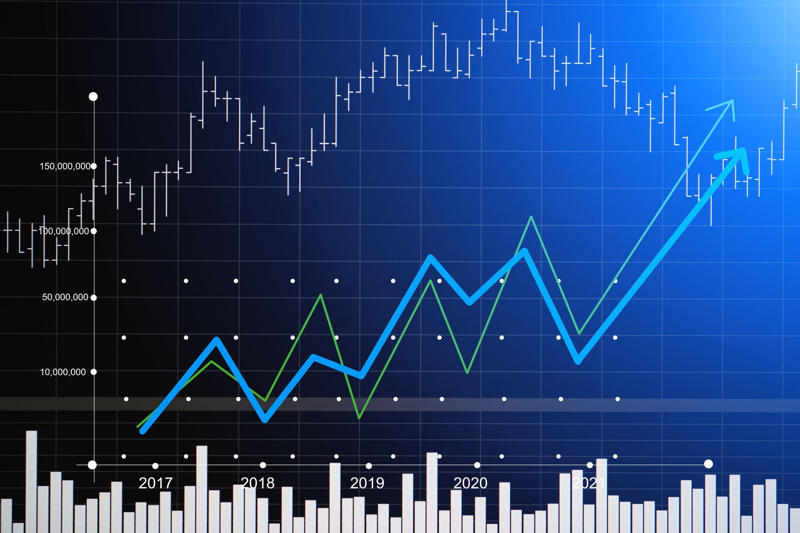

The world of investing offers a myriad of strategies and options, each tailored to different risk appetites and financial goals. Among these strategies, value investing and growth investing stand out as two prominent approaches that investors often consider. Value investing focuses on identifying stocks that are undervalued by the market, encompassing companies with strong fundamentals trading at prices lower than their intrinsic value. On the other hand, growth investing targets companies expected to grow at an above-average rate compared to the overall market, often characterized by innovative products and market expansion.

In recent years, algorithmic trading has emerged as a powerful tool for optimizing these investment strategies. Algorithmic trading utilizes advanced mathematical models and computational techniques to execute trades at speeds and frequencies that far exceed human capabilities. By leveraging data and algorithms, investors can enhance decision-making processes, reduce emotional biases, and improve the overall efficiency of their trading strategies.



This article explores the nuances of value stocks, growth stocks, and how algorithmic trading can enhance your investment portfolio. Understanding the characteristics of each type of stock is essential for making informed investment decisions. Incorporating technology, such as algorithmic trading, can further sharpen these strategies, allowing for a modern and data-driven approach to portfolio management. By examining the interplay between traditional investment strategies and modern technological advancements, investors can optimize their portfolios to achieve desired financial outcomes.

## Table of Contents

## Understanding Value Stocks

Value stocks are shares of companies that investors believe are priced below their intrinsic value, presenting potential opportunities for significant returns as the market corrects these discrepancies. These stocks typically have robust financial foundations but may not be in favor with the broader investment community due to various market or company-specific factors. As a result, they trade at lower valuations compared to their fundamentals.

Identifying value stocks involves analyzing several financial metrics that highlight their potential undervaluation. One crucial indicator is the price-to-earnings (P/E) ratio, which compares the current share price to the company's earnings per share (EPS). A lower P/E ratio suggests that the stock may be undervalued relative to its earnings potential. Furthermore, value stocks often exhibit high dividend yields, providing investors with immediate income through dividend payouts relative to the stock's price.

Another significant metric is the company's cash flow, which refers to the net amount of cash being transferred into and out of the business. A strong cash flow suggests that a company has adequate [liquidity](/wiki/liquidity-risk-premium) to fund its operations, invest in growth opportunities, and return capital to shareholders, making it an attractive attribute for value investors.

Value investing is predicated on purchasing stocks that may not be favored by the market but have the potential for long-term price appreciation as intrinsic value becomes realized. This approach requires patience and a keen understanding of financial statements, as investors seek to capitalize on discrepancies between market price and true value. However, this strategy is not without risks, as some undervalued stocks might remain so due to legitimate concerns about their business prospects.

The rewards of value investing can be significant, particularly if an investor identifies a stock whose actual value exceeds the current market price. However, these investments can also be volatile, and the realization of value may take time, requiring investors to adopt a longer-term horizon.

In summary, value investing involves identifying stocks that are trading below their apparent intrinsic value due to their strong fundamentals but are overlooked by the market. By focusing on critical metrics such as P/E ratios, dividend yields, and cash flow, investors can locate potential opportunities for long-term gains, albeit balancing inherent risks in their investment strategies.

## Exploring Growth Stocks

Growth stocks are companies anticipated to achieve above-average growth compared to other market participants. This growth often results from reinvesting earnings back into the business, focusing on activities such as enhancing products, expanding market reach, and innovating services. While this strategy can lead to substantial capital appreciation over time, it often involves forgoing short-term profitability.

Investors are drawn to [growth stocks](/wiki/growth-stocks) primarily because of their potential for significant returns. The expanded [earning](/wiki/earning-announcement) potential of these companies is frequently signaled through their continuous market share expansion and development of cutting-edge solutions. For example, companies in technology, biotechnology, and e-commerce sectors have historically been categorized as growth stocks due to their earnest focus on innovation and disruption.

### Key Characteristics of Growth Stocks

1. **High Earnings Growth Rate**: Companies classified as growth stocks generally exhibit rapid increases in earnings, often outpacing the broader market or industry averages. This growth is usually reflected in a higher price-to-earnings (P/E) ratio compared to value stocks.

2. **Innovation and Disruption**: Growth stocks are synonymous with innovation. They develop new products or services that can alter existing market dynamics or create entirely new markets.

3. **Market Share Expansion**: Growth companies target expanding their market share, even when it necessitates a trade-off with short-term earnings. Capturing a larger piece of the overall market is often key to sustaining long-term growth.

### Assessing Growth Stocks

Analyzing growth stocks involves evaluating both qualitative and quantitative factors. Investors scrutinize business models, leadership quality, and competitive advantages. Quantitatively, they may look at metrics such as revenue growth, net profit margin, and return on equity (ROE). Here is an example of a basic Python code snippet to calculate the Compound Annual Growth Rate (CAGR) of a company's revenue:

```python
def calculate_cagr(start_value, end_value, periods):
    return (end_value / start_value) ** (1/periods) - 1

start_revenue = 500000
end_revenue = 1000000
years = 3

cagr = calculate_cagr(start_revenue, end_revenue, years)
print(f"CAGR over {years} years: {cagr:.2%}")
```

In this snippet, `start_revenue` and `end_revenue` represent the company's revenue at the beginning and end of the period, respectively, and `years` indicates the duration over which growth is assessed.

### Investing Strategies and Volatility

Investment strategies for growth stocks often involve buying and holding, as these assets can experience significant appreciation over extended periods. However, this approach necessitates enduring periods of [volatility](/wiki/volatility-trading-strategies). Growth stocks are typically more volatile than value stocks due to the inherent uncertainty in achieving long-term earnings projections. This volatility can be exacerbated by higher valuations which are more susceptible to market sentiment fluctuations.

Another approach is active management, where investors tactically allocate resources based on market trends and economic indicators. This strategy incorporates frequent reassessments of growth stock positions and often demands a more hands-on approach to managing investments.

In summary, growth stocks offer a compelling opportunity for investors willing to navigate their inherent risks and volatility for the potential of extraordinary returns. The assessment and investment strategies involved require a combination of comprehensive market analysis and forward-looking insights into industry trends and company potential.

## Algorithmic Trading: The Game Changer

Algorithmic trading, often referred to as algo trading, relies on sophisticated algorithms to execute trades at speeds and frequencies unattainable by human traders. This approach leverages vast data sets, mathematical models, and computational power to make precise investment decisions, offering a contemporary edge to both value and growth stock strategies.

At the core of [algorithmic trading](/wiki/algorithmic-trading) is the ability to process large amounts of historical and real-time data to identify patterns and execute trades based on predefined criteria. This can involve statistical [arbitrage](/wiki/arbitrage), market sentiment analysis, or other quantitative methods that assess the optimal trading conditions. For instance, algorithms may analyze criteria such as stock price movements, trading volumes, or economic indicators to predict the best times to buy or sell.

One notable advantage of algorithmic trading is its efficiency and accuracy. Algorithms can be designed to execute trades without the emotional bias that can often cloud human judgment, thereby improving decision-making processes. Additionally, the capabilities to backtest allow traders to simulate their strategies using historical data, providing insights into potential performance and helping refine strategies before actual deployment.

Algorithmic trading can notably enhance value and growth investment strategies by precisely timing entry and [exit](/wiki/exit-strategy) points to maximize returns or minimize losses. For example, in value investing, an algorithm might identify undervalued stocks faster by continuously scanning for low price-to-earnings ratios, whereas in growth investing, it could monitor exponential price movement trends in companies with significant market share expansions.

However, it is essential to consider the challenges and risks associated with algorithmic trading. Technical issues, such as system failures or programming errors, can lead to unexpected trading losses. Furthermore, market anomalies, such as flash crashes or sudden events that disrupt normal trading patterns, can result in significant volatility and risk. It is crucial for algorithmic systems to have built-in safeguards, such as kill switches or circuit breakers, to mitigate these risks.

In summary, algorithmic trading represents a transformative approach to modern investing, utilizing technology to optimize the execution of value and growth stock strategies. While it offers significant advantages in speed, efficiency, and data-driven precision, the inherent risks and challenges necessitate a careful and well-considered implementation.

## Combining Strategies: A Balanced Approach

Investors aiming to harness the strengths of both value and growth stocks can benefit significantly from a diversified portfolio. Such a mixed strategy potentially mitigates risks and maximizes opportunities inherent in different market conditions. A critical tool to achieve this balance is algorithmic trading, which offers a systematic approach to optimizing portfolio performance by leveraging technology and data analysis.

Algorithmic trading systems excel in sifting through vast amounts of financial data to identify the best investment opportunities, accommodating both value and growth stock strategies. By processing historical data and employing predictive analytics, these systems can uncover correlations and market patterns that may not be immediately apparent to human analysts. This capability is particularly useful in volatile markets, where rapid shifts can affect stock performance unexpectedly.

### Leveraging Technology for a Balanced Portfolio

Algorithmic trading allows investors to create dynamic strategies that adjust to varying market conditions. For instance, algorithms can be programmed to increase investment in growth stocks when market indicators suggest positive economic trends, while shifting focus to value stocks during market downturns. This flexibility ensures that the portfolio remains aligned with market dynamics, optimizing returns and minimizing losses.

To implement such a balanced approach, investors can use algorithms to automate portfolio rebalancing. For example, consider a Python script that evaluates stock performance indicators, such as moving averages and financial ratios, to rebalance the portfolio periodically:

```python
import numpy as np

def evaluate_stock(stock_data):
    # Calculate moving average
    moving_avg = np.mean(stock_data['price'][-50:])
    # Calculate P/E ratio
    pe_ratio = stock_data['price'][-1] / stock_data['earnings'][-1]

    if moving_avg < stock_data['price'][-1] and pe_ratio < industry_avg_pe:
        return "buy"
    elif moving_avg > stock_data['price'][-1]:
        return "sell"
    else:
        return "hold"

portfolio = {"AAPL": {"price": [150, 153, 155, ...], "earnings": [10, 11, 12, ...]}}

for stock, data in portfolio.items():
    action = evaluate_stock(data)
    print(f"Action for {stock}: {action}")
```

### Case Studies and Successful Strategies

Historical case studies illustrate the successful implementation of combined value and growth strategies. For example, during the tech boom of the late 1990s, portfolios that integrated growth stocks such as Apple and Microsoft with traditional value stocks like Berkshire Hathaway showed resilience against market fluctuations. This balance provided steady returns while enabling participation in high-growth opportunities.

Further, quantitative funds have consistently used algorithms to switch between value and growth strategies based on market conditions. These funds often outperform their peers, highlighting the effectiveness of a balanced approach augmented by technology.

### Best Practices for Diversification and Technology Integration

Maintaining a diversified portfolio requires a disciplined approach to risk management and regular reassessment of asset allocations. Investors should:

1. Define clear investment objectives and risk tolerance levels.
2. Use algorithmic tools to routinely analyze market conditions, adjusting allocations accordingly.
3. Regularly update algorithms with fresh data to capture evolving market trends.
4. Incorporate risk management features in trading algorithms, such as stop-loss orders and maximum drawdown thresholds.

In conclusion, combining value and growth stocks into a single cohesive strategy offers a robust framework for investment success. By integrating algorithmic trading, investors can better navigate the complexities of market environments, achieving a balance that maximizes returns while managing associated risks.

## Conclusion

Investing in the stock market presents a diverse set of opportunities and challenges, with a well-structured strategy serving as a fundamental tool for success. Understanding the distinctions between value and growth stocks allows investors to tailor their decisions to align with individual financial goals. Value stocks, often characterized by lower price-to-earnings ratios and potential for long-term appreciation, contrast with growth stocks that highlight higher earnings growth prospects and market dominance.

Algorithmic trading introduces a dynamic edge to investment strategies, enhancing both value and growth stock approaches. By employing sophisticated algorithms and data-driven models, algorithmic trading can significantly increase the potential for optimizing returns while reducing emotional-driven decisions. This integration brings efficiency and precision, applying computational power to assess and execute trades swiftly.

As financial markets undergo rapid evolution influenced by technological advancements and global trends, maintaining adaptability becomes crucial for investors aiming for sustained success. Staying informed about emerging tools and strategies positions investors to effectively respond to shifts in market conditions.

The discussion on value and growth stocks alongside algorithmic trading provides a comprehensive understanding and foundation for investors seeking to build a robust investment strategy. By leveraging the strengths of both traditional and modern approaches, investors can navigate the complexities of the stock market with greater confidence and potential for achieving their financial objectives.

## References & Further Reading

[1]: Bergstra, J., Bardenet, R., Bengio, Y., & Kégl, B. (2011). ["Algorithms for Hyper-Parameter Optimization."](https://papers.nips.cc/paper/4443-algorithms-for-hyper-parameter-optimization) Advances in Neural Information Processing Systems 24.

[2]: ["Advances in Financial Machine Learning"](https://www.amazon.com/Advances-Financial-Machine-Learning-Marcos/dp/1119482089) by Marcos Lopez de Prado

[3]: ["Evidence-Based Technical Analysis: Applying the Scientific Method and Statistical Inference to Trading Signals"](https://www.amazon.com/Evidence-Based-Technical-Analysis-Scientific-Statistical/dp/0470008741) by David Aronson

[4]: ["Machine Learning for Algorithmic Trading"](https://github.com/stefan-jansen/machine-learning-for-trading) by Stefan Jansen

[5]: ["Quantitative Trading: How to Build Your Own Algorithmic Trading Business"](https://books.google.com/books/about/Quantitative_Trading.html?id=j70yEAAAQBAJ) by Ernest P. Chan