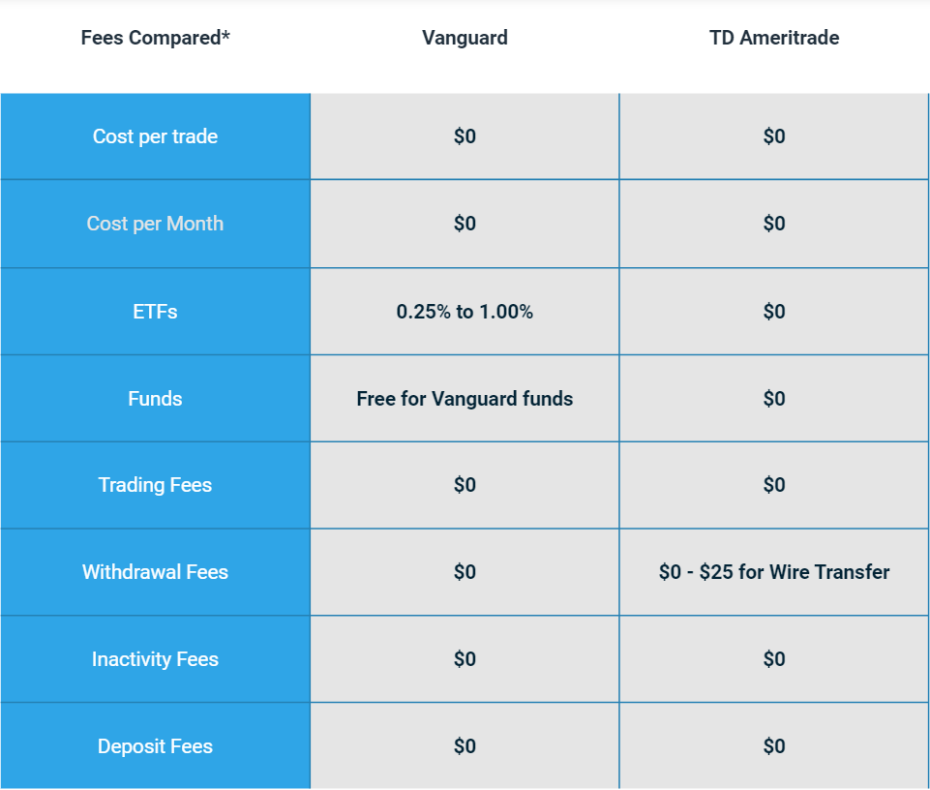

The modern investment landscape is characterized by a broad array of platforms, each offering distinct features and advantages tailored to various types of investors. Among the most prominent in this evolving market are Vanguard and TD Ameritrade, platforms celebrated for their comprehensive investment solutions. This article offers a comparison between Vanguard and TD Ameritrade, emphasizing their capabilities in algorithmic trading.

Algorithmic trading represents a significant development within financial markets, utilizing computer algorithms to execute trades rapidly and efficiently based on predetermined criteria. As this approach gains popularity, many investors are seeking platforms that provide advanced support for these techniques. Analyzing the usability, trade experience, order types, and costs associated with Vanguard and TD Ameritrade can guide investors in selecting the platform that best aligns with their trading needs.



Recently, the merger of TD Ameritrade into Charles Schwab has introduced changes to their service offerings. This integration is expected to enhance the platform's features and improve user experience, which will be an important consideration in our comparison. 

Understanding how Vanguard and TD Ameritrade cater to algorithmic trading is key for investors looking to employ such strategies effectively. By evaluating each platform's strengths and weaknesses, this article aims to provide investors with informed insights that will aid them in choosing a platform that complements their trading strategies and investment objectives.

## Table of Contents

## Overview of Vanguard and TD Ameritrade

Vanguard is a prominent investment management company recognized for its low-cost mutual funds and exchange-traded funds (ETFs). The firm has earned a reputation among individual investors seeking long-term, buy-and-hold investment strategies. Vanguard's platform is structured to provide straightforward, reliable investment solutions, primarily appealing to those focused on building and maintaining a diversified portfolio over the long term. Its approach to investment stems from a philosophy centered on minimizing costs and enhancing returns through low-fee investment options. 

TD Ameritrade, which has been integrated with Charles Schwab, stands out as a versatile broker offering a range of platforms catering to various types of investors, from novices to seasoned professionals. The merger aims to create a more cohesive and innovative service offering, capitalizing on both companies' strengths to enhance the user experience further. TD Ameritrade is known for its broad selection of investment tools and resources, which are designed to support both casual investors and those seeking complex trading strategies. With platforms such as thinkorswim, TD Ameritrade enables users to engage in sophisticated trading activities, providing advanced trading capabilities along with powerful analytical tools.

Both Vanguard and TD Ameritrade emphasize investor education, offering a wealth of content designed to equip users with the knowledge needed for informed investing. Vanguard, with its focus on fundamental investment principles and long-term financial planning, provides resources that are ideal for investors interested in understanding the basics of investment. On the other hand, TD Ameritrade delivers a diverse array of educational materials, including live programs and comprehensive courses that are beneficial for traders of all levels, from beginners to advanced users seeking to enhance their trading strategies. 

The integration of TD Ameritrade with Charles Schwab is expected to capitalize on the strengths of both entities, fostering a more integrated service suite. This merger is anticipated to improve the user experience by offering more unified and comprehensive investment solutions. As these companies continue to evolve, investors may find that the collaboration enhances the platforms' overall functionality and support, helping them navigate the complexities of today's investment landscape more effectively.

## Algorithmic Trading: A Key Feature Comparison

Algorithmic trading employs computer algorithms to automate investment strategies, significantly enhancing speed and execution efficiency in financial markets. This technological advance is crucial for investors seeking to optimize trade execution and capitalize on rapid market movements. Vanguard and TD Ameritrade offer distinct approaches to [algorithmic trading](/wiki/algorithmic-trading), each catering to different investor preferences and strategies.

Vanguard facilitates algorithmic trading primarily through its robo-advisory services. These services are designed for investors who prioritize long-term and stable investment strategies. The platform uses a systematic approach to portfolio management, automatically balancing portfolios according to predefined risk assessments and investment goals. This method suits buy-and-hold investors seeking minimal intervention and stable returns over extended periods. While Vanguard’s algorithmic capabilities focus more on portfolio management and rebalancing, they lack the depth of customization required for short-term or active trading strategies.

On the other hand, TD Ameritrade’s thinkorswim platform stands out for its advanced algorithmic trading capabilities. It offers sophisticated tools that appeal to both novice and experienced traders interested in more dynamic trading strategies. The platform supports thinkScript, a proprietary scripting language, allowing users to create customized trading algorithms and condition-based scripts. For instance, traders can develop scripts that automatically execute trades when certain technical indicators or market conditions are met. This level of flexibility and customization is beneficial for those looking to implement complex algorithmic strategies tailored to their personal trading preferences.

In terms of flexibility, TD Ameritrade provides a broader range of algorithmic trading tools compared to Vanguard. The thinkorswim platform supports a wide spectrum of custom scripts and strategies, enabling traders to fine-tune their approaches based on real-time market analysis and technical indicators. Furthermore, it provides a supportive environment for testing and [backtesting](/wiki/backtesting) these strategies, a critical feature for refining trading algorithms before executing them in live markets.

In conclusion, while Vanguard offers a robust solution for investors interested in long-term portfolio management through algorithmic support, TD Ameritrade’s thinkorswim platform is better suited for investors seeking comprehensive, customizable algorithmic trading tools. The choice between the two platforms should be guided by the investor's specific trading needs, strategy preferences, and desired level of involvement in the trading process.

## Usability and User Experience

Vanguard's platform is designed for investors who prefer a straightforward approach to portfolio management, prioritizing simplicity and ease of navigation. This approach caters to buy-and-hold investors, focusing on long-term financial growth. Users will appreciate the streamlined interface that facilitates smooth navigation, allowing them to perform essential functions such as buying and holding securities with minimal complexity.

In contrast, TD Ameritrade offers a dual-platform approach that accommodates a wider range of investor preferences. For general users, TD Ameritrade presents a trading platform with necessary features for everyday trading. However, for active traders and those interested in more complex strategies, the thinkorswim platform provides an advanced, customizable experience. Thinkorswim stands out for its range of options, allowing users to tailor their trading environment through sophisticated tools that meet the needs of algorithmic and active trading.

Evaluating the user experience, TD Ameritrade’s robust onboarding process simplifies account creation, guiding new users through setup efficiently. This ease of account opening reduces barriers for new investors entering the market. New users may find a steeper learning curve with the thinkorswim platform due to its vast features, but it is well-supported with extensive educational resources.  

Both Vanguard and TD Ameritrade offer mobile and web applications, each optimized for different investor demands. Vanguard’s mobile app emphasizes user-friendly design and quick access to key functions, ensuring that essential tasks such as checking balances and making trades are straightforward. Conversely, TD Ameritrade’s thinkorswim mobile app allows for more advanced trading activities, including comprehensive chart analysis and customizable alert systems. Despite its complexity, the interface is designed to be intuitive for users who need real-time data and the ability to execute trades on the go.

In terms of accessibility and interface design, Vanguard maintains a more traditional approach that appeals to investors focused on straightforward asset accumulation. TD Ameritrade, with its more involved offering, may cater more effectively to those comfortable with a steeper learning curve and a desire for a powerful, multi-faceted trading tool.

## Trade Experience and Order Types

Vanguard focuses on core order types that align with its long-term investment strategy, primarily utilizing market and limit orders. These order types are simple and effective for investors who aim to build and hold portfolios over extended periods. Market orders enable investors to purchase or sell securities immediately at the best available current price, ensuring swift execution. Limit orders, on the other hand, allow investors to set a specific price at which they are willing to buy or sell a security, providing more control over trade execution under certain conditions.

TD Ameritrade, in contrast, offers a wide array of order types catering to both novice and seasoned traders, enhancing its appeal to users interested in algorithmic trading. The platform includes sophisticated options such as trailing stops and conditional orders, including One-Cancels-Other (OCO) orders. These advanced order types are fundamental for traders who deploy algorithmic strategies that require precision and flexibility in trade execution.

To exemplify the use of a trailing stop order, a trader could set a trailing stop percentage, ensuring that if a stock price drops by a certain percentage, a sell order is triggered. This feature is especially useful for locking in profits while allowing the stock to continue its upward trajectory. Conditional orders like OCO allow traders to set multiple order conditions, where the execution of one cancels the other, further assisting in managing trades more strategically.

Execution speed and quality are pivotal when it comes to algorithmic trading, where milliseconds can make a difference. TD Ameritrade’s infrastructure is robust, providing rapid trade executions essential for high-frequency trading strategies. The platform's capacity to handle complex algorithms efficiently with minimal latency ensures that trades are performed at optimal prices, which is crucial for traders who rely on the accuracy and speed of order execution to maintain competitive edges in the market.

In summary, while Vanguard's approach is streamlined for simplicity and long-term investment goals, TD Ameritrade's extensive and flexible order types, along with its superior execution speed, present a significant advantage for traders engaged in algorithmic strategies.

## Cost Analysis

Both Vanguard and TD Ameritrade are well-known platforms offering commission-free online stock and [ETF](/wiki/etf-trading-strategies) trades. However, there are significant differences in their cost structures, particularly concerning mutual fund fees, option trading costs, and other potential charges like account maintenance or transfer fees.

### Mutual Fund Fees

Vanguard is renowned for its low-cost mutual funds, typically offering lower expense ratios compared to many of its competitors. This cost advantage can make a significant difference for investors focused on long-term growth, as lower fees contribute to higher net returns over time. For example, the average expense ratio for Vanguard funds is approximately 0.10%[1], while industry averages can be as high as 0.54%[2].

Conversely, TD Ameritrade provides access to various mutual funds, including its proprietary funds. Although some of these funds may come with additional costs, TD Ameritrade offers access to over 3,000 no-transaction-fee mutual funds[3], providing investors with a cost-effective selection.

### Option Trading Costs

For option trading costs, Vanguard is not particularly known for offering competitive rates. Although they provide options trading, their fees tend to be higher, which may not be suitable for active traders focusing on options-based strategies. Typically, Vanguard's options pricing involves a flat fee plus a per-contract charge.

TD Ameritrade, however, offers more competitive pricing for options trading. Since the thinkorswim platform is part of TD Ameritrade's offerings, it caters specifically to active traders with detailed strategies in options. They provide a cost structure that includes a base commission, which is often waived, accompanied by a per-contract fee that is competitive in the industry[4].

### Additional Fees

When examining other fees, such as account maintenance or transfer fees, both platforms exhibit varied structures. Vanguard generally does not charge account maintenance fees, though certain services like paper statements may incur small charges. On the other hand, TD Ameritrade typically does not impose maintenance fees on standard accounts but may have specific fees tied to particular account services.

For algorithmic traders, understanding these cost implications is essential. Trading frequency, investment strategy, and asset preferences can substantially impact the total cost incurred on either platform. Here’s a Python snippet that calculates potential costs for a hypothetical trader, comparing mutual fund and options costs on both platforms:

```python
# Hypothetical cost calculation for 100 trades
vanguard_expense_ratio = 0.001  # 0.10%
td_mutual_fund_cost = 0  # assuming no-transaction-fee fund

# Options cost per contract
vanguard_option_cost = 1.0  # hypothetical cost per contract
td_option_cost = 0.65  # typical TD cost per contract

# Calculating total cost for 100 option trades
vanguard_total_option_cost = 100 * vanguard_option_cost
td_total_option_cost = 100 * td_option_cost

# Output costs
print(f"Vanguard Total Option Cost: ${vanguard_total_option_cost}")
print(f"TD Ameritrade Total Option Cost: ${td_total_option_cost}")
```

Ultimately, choosing between Vanguard and TD Ameritrade requires a careful analysis of these varying costs. Investors should consider their trading style and preferences to select the platform that aligns best with their financial strategies and cost expectations.

### References:
1. Vanguard. (2023). "Vanguard mutual funds and ETFs."
2. Investment Company Institute. (2023). "Trends in the Expense Ratios of Mutual Funds."
3. TD Ameritrade. (2023). "No Transaction Fee Funds."
4. TD Ameritrade. (2023). "Options Trading Pricing."

## Advanced Trading Tools and Research

Vanguard and TD Ameritrade stand as contrasting figures when it comes to the sophistication and breadth of their advanced trading tools and research capabilities. Vanguard's approach is tailored for investors whose primary focus is long-term, passive investment strategies. As such, Vanguard provides basic research amenities geared towards fundamental investment analysis, but it lacks extensive charting or technical analysis tools. This makes it a suitable platform for investors who rely more on market fundamentals over short-term trading tactics.

Conversely, TD Ameritrade, particularly through its thinkorswim platform, caters to active traders, offering comprehensive research tools that are essential for complex trading strategies, including algorithmic trading. Thinkorswim distinguishes itself by providing advanced charting capabilities, a wide array of technical indicators, and the ability to customize scripts using thinkScript, a proprietary scripting language. This feature-rich environment facilitates real-time data analysis and the backtesting of prospective trading strategies, enabling traders to refine their approaches before live deployment.

For users interested in algorithmic trading, TD Ameritrade's research tools provide a decisive advantage. The platform's capacity for integrating real-time data with algorithmic mechanisms makes it an ideal choice for traders looking to leverage data-driven strategies. Resources such as strategy testing modules and paperMoney, a virtual trading simulator, allow users to experiment with and validate their trading algorithms without financial risk, improving their understanding and optimization of algorithmic rules.

The detailed comparison of these platforms' offerings highlights that, while Vanguard is suited for passive investors focused on long-term growth, TD Ameritrade's robust research capabilities and thinkorswim platform make it a superior option for active traders seeking an effective environment for algorithmic trading.

## Portfolio Analysis, Education, and Customer Support

Vanguard's educational content stands as a cornerstone for investors devoted to long-term financial planning and a fundamental understanding of investment principles. The content prioritizes guiding investors through the complexities of financial markets with a focus on steady and sustainable growth strategies. This approach caters particularly well to buy-and-hold investors who benefit from a comprehensive understanding of market cycles, asset allocation, and diversification strategies.

In contrast, TD Ameritrade distinguishes itself with a more diverse array of educational materials. The platform includes live programming and comprehensive courses, addressing the needs of both beginner investors and those with advanced strategies in mind. This diversity in educational content ensures that users can find materials suited to their experience level, from basic principles to intricate trading strategies. TD Ameritrade's educational offerings are structured to facilitate active trading and are beneficial for investors interested in short-term trading and algorithmic strategies.

Both Vanguard and TD Ameritrade offer customer support services to their users; however, TD Ameritrade has an edge in terms of service availability. Offering multiple channels of support, TD Ameritrade provides assistance through phone, email, and live chat, and it boasts extensive hours of operation. This versatility can be particularly appealing for users requiring prompt assistance or those navigating complex trading platforms. Meanwhile, Vanguard's customer support, while efficient, is more traditionally structured and may not offer the same level of immediacy in service that active traders might need.

In summary, the robustness of TD Ameritrade's educational resources and its versatile customer support make it particularly attractive for investors seeking active engagement and continuous learning opportunities in trading. On the other hand, Vanguard's offerings align well with investors aiming for a strong foundational understanding of long-term investment strategies.

## Security and Account Types

Both Vanguard and TD Ameritrade prioritize investor security by implementing comprehensive protocols that align with industry standards. This ensures a secure trading environment for their users. Both platforms are members of the Securities Investor Protection Corporation (SIPC), which provides protection to investors up to $500,000, including a $250,000 limit for cash balances, in the event of brokerage firm failure. Furthermore, they offer advanced security features such as biometric authentication options, including facial recognition and fingerprint scanning, to further safeguard account access.

These platforms present a diverse array of account types tailored to accommodate varying investor preferences and financial goals. Vanguard offers several account types: individual and joint taxable accounts, various retirement accounts including Traditional, Roth, and SEP IRAs, as well as custodial accounts for minors. Their focus is on helping long-term investors maximize their tax-advantaged benefits and build retirement savings effectively.

Similarly, TD Ameritrade, now under Charles Schwab, provides a comprehensive selection of account options. These include standard taxable brokerage accounts, multiple retirement accounts (such as Traditional, Roth, Rollover, and Beneficiary IRAs), custodial accounts, and trust or estate accounts. Additionally, TD Ameritrade offers specialty accounts for entities like businesses and partnerships, reflecting a broader scope suited to diverse trading and investment needs.

The choice of platform can significantly influence an investor’s convenience and investment strategy due to the differences in security features and the variety of account types offered. Investors prioritizing enhanced security measures may value the biometric authentication options available on both platforms. Those requiring specialized accounts or engaging in algorithmic trading might prefer TD Ameritrade's extensive array of accounts and robust infrastructure inherited from Charles Schwab post-merger.

Selecting the appropriate platform involves examining these factors alongside individual preferences and needs. Investors should consider their specific investment goals, the necessity for diverse account options, and the importance of advanced security features when making a decision.

## Final Verdict: Which Platform is Best for Algorithmic Trading?

While Vanguard is celebrated for its cost-effective approach to long-term investing, it does not adequately serve the needs of traders focused on implementing sophisticated algorithmic trading strategies. Vanguard’s platform primarily caters to buy-and-hold investors, emphasizing simplicity and long-term growth through mutual funds and ETFs. While it provides basic robo-advisory services, these are better suited for passive investment approaches rather than active trading strategies that rely on algorithmic methods.

Conversely, TD Ameritrade stands out for its advanced algorithmic trading capabilities, largely facilitated through its thinkorswim platform. Thinkorswim enables traders to create and execute sophisticated trading algorithms using its proprietary scripting language, thinkScript. This opens avenues for extensive customization, automation, and real-time analysis, making TD Ameritrade a compelling choice for traders seeking robust technological tools to enhance their trading strategies.

In conclusion, selecting the appropriate investment platform mandates an evaluation of one's trading strategy, cost implications, and the complexity of tools required. Vanguard caters to those seeking straightforward, low-cost, long-term investment solutions. In contrast, TD Ameritrade emerges as the preferred platform for tech-savvy traders committed to developing and executing intricate algorithmic trading strategies. Each investor must consider their specific needs and preferences to ensure the chosen platform aligns well with their trading objectives and financial goals.

## References & Further Reading

[1]: Bergstra, J., Bardenet, R., Bengio, Y., & Kégl, B. (2011). ["Algorithms for Hyper-Parameter Optimization."](https://papers.nips.cc/paper/4443-algorithms-for-hyper-parameter-optimization) Advances in Neural Information Processing Systems 24.

[2]: Marcos Lopez de Prado. ["Advances in Financial Machine Learning."](https://www.amazon.com/Advances-Financial-Machine-Learning-Marcos/dp/1119482089) Wiley, 2018.

[3]: Aronson, D. R. (2007). ["Evidence-Based Technical Analysis: Applying the Scientific Method and Statistical Inference to Trading Signals."](https://www.amazon.com/Evidence-Based-Technical-Analysis-Scientific-Statistical/dp/0470008741) Wiley.

[4]: Jansen, S. (2020). ["Machine Learning for Algorithmic Trading."](https://github.com/stefan-jansen/machine-learning-for-trading) Packt Publishing.

[5]: Chan, E. P. (2008). ["Quantitative Trading: How to Build Your Own Algorithmic Trading Business."](https://github.com/ftvision/quant_trading_echan_book) Wiley.