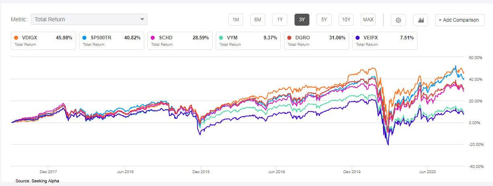

Vanguard has established itself as a leading global investment firm, renowned for its investor-centric approach and commitment to providing high-quality, low-cost index funds and ETFs. The firm's focus on mutual funds, particularly, has solidified its reputation in the financial industry. Among its diverse offerings are the Vanguard Equity Income Fund Investor Shares (VEIPX) and the Vanguard Dividend Growth Fund Investor Shares (VDIGX), both of which stand out for their emphasis on dividend-focused investment strategies.

VEIPX is designed to provide a high level of income by investing primarily in dividend-paying equities. The fund's strategy revolves around selecting companies with a history of paying steady or increasing dividends, thereby offering a reliable income stream and potential long-term capital appreciation to investors. On the other hand, VDIGX seeks to both offer current income and facilitate capital growth over the long term by investing in a diverse set of businesses expected to grow their dividends. VDIGX focuses on companies that not only have a solid dividend payment history but also exhibit strong growth prospects.



The appetite for algorithmic trading in fund management is growing rapidly. This technology-driven approach leverages advanced mathematical models and complex algorithms to make investment decisions at speeds and frequencies that are difficult for human traders to replicate. In the context of managing dividend-focused mutual funds like VEIPX and VDIGX, algorithmic trading holds the potential to optimize portfolio allocations, enhance returns, and manage risks with precision. The integration of sophisticated algorithms could lead to more informed decision-making, ultimately benefiting investors by improving fund performance and stability.

## Table of Contents

## Understanding VEIPX and VDIGX

Vanguard is renowned for its array of mutual funds, prominently featuring two dividend-focused offerings: the Vanguard Equity Income Fund Investor Shares (VEIPX) and the Vanguard Dividend Growth Fund Investor Shares (VDIGX). These funds cater to investors seeking income through dividends, although they differ in strategies and sector allocations.

### Vanguard Equity Income Fund Investor Shares (VEIPX)

VEIPX focuses on providing a high level of current income along with long-term capital appreciation by investing primarily in dividend-paying, undervalued stocks of large and mid-cap companies. The fund's strategy encompasses selecting equity holdings that are considered to be undervalued based on fundamental analysis. This approach involves evaluating the intrinsic value of securities compared to their current trading price, favoring stocks that offer above-average dividend yields.

The performance of VEIPX is underpinned by its diversified portfolio, primarily across sectors like financials, healthcare, and consumer goods, which traditionally pay higher dividends. Historical performance data indicate that VEIPX generally performs well in stable or rising [interest rate](/wiki/interest-rate-trading-strategies) environments when value stocks tend to outperform.

### Vanguard Dividend Growth Fund Investor Shares (VDIGX)

In contrast, VDIGX is geared towards investors seeking dividend growth over sheer dividend income. The fund aims for both income and long-term growth by investing predominantly in companies that are expected to increase dividends over time, a strategy focused on capital appreciation potential in addition to regular income. 

VDIGX's stock selection process involves looking for companies with strong balance sheets, robust earnings growth, and a proven history of raising dividends consistently. This intrinsic focus on dividend growth aligns with investments in sectors like technology and industrials, which might offer lower immediate dividend yields but higher potential for future increases. 

### Comparison of VEIPX and VDIGX

Though both VEIPX and VDIGX are dividend-focused, they differ in certain respects:

- **Sector Exposure:** VEIPX tends to have a higher allocation to the financial and utilities sectors, benefiting from higher current yields. Meanwhile, VDIGX often leans towards sectors like technology and industrials, representing future growth potential.

- **Investment Objectives:** VEIPX is oriented towards maximizing current income through dividends, attracting investors who prioritize short-term income streams. Conversely, VDIGX targets dividend growth and capital appreciation, suitable for investors with a longer-term horizon.

- **Management Styles:** VEIPX follows a value-investing strategy, identifying undervalued stocks with consistent dividends. In contrast, VDIGX employs a growth-oriented strategy, seeking companies with the potential for substantial dividend growth over time.

In evaluating these funds, investors should consider their income needs, growth expectations, and sector preferences, reflecting on how the distinct characteristics of VEIPX and VDIGX align with their financial goals. Each fund’s unique strategy offers pathways to harness dividend fund benefits, demonstrating Vanguard's adaptability in catering to diverse investor needs.

## Performance and Risk Assessment

To analyze the historical performance of Vanguard Equity Income Fund Investor Shares (VEIPX) and Vanguard Dividend Growth Fund Investor Shares (VDIGX), it's essential to evaluate both returns and risk measures. VEIPX focuses on generating income by investing in quality high-yield stocks, while VDIGX aims for a diversified portfolio of large-cap companies with prospects for dividend growth.

### Historical Performance

Historically, VEIPX has demonstrated robust returns driven by its income-focused strategy, often yielding higher dividends compared to VDIGX. Conversely, VDIGX tends to achieve its performance through capital appreciation by holding stocks with strong dividend growth potential. The difference in focus results in VEIPX often providing higher immediate payouts, whereas VDIGX might offer greater long-term growth.

### Risk Measures

#### Volatility

Volatility is a key metric indicating the degree of variation of a trading price series over time, usually measured by standard deviation. A lower [volatility](/wiki/volatility-trading-strategies) suggests more stable returns:

- VEIPX typically exhibits lower volatility due to its emphasis on established, income-generating stocks.
- VDIGX, seeking growth stocks that reinvest earnings, may show higher volatility.

#### Sharpe Ratio

The Sharpe ratio is calculated as:

$$
\text{Sharpe Ratio} = \frac{R_p - R_f}{\sigma_p}
$$

where $R_p$ is the portfolio return, $R_f$ is the risk-free rate, and $\sigma_p$ is the standard deviation of the portfolio's excess return.

- VEIPX often displays a higher Sharpe ratio, indicating better risk-adjusted returns, as it combines steady income with moderate price fluctuations.
- VDIGX may exhibit varying Sharpe ratios influenced by its growth-oriented holdings.

#### Maximum Drawdown

This metric quantifies the largest drop from a peak to a trough before a new peak is attained and represents potential downside risks:

- VEIPX generally experiences smaller maximum drawdowns given its investment in established dividend-paying sectors.
- VDIGX, subject to greater swings due to growth stock fluctuations, might reflect deeper drawdowns.

### Influence on Investor Decisions

Investors analyze these metrics to align fund selections with their risk appetites and return expectations. Those prioritizing income stability and risk mitigation might gravitate toward VEIPX. In contrast, investors willing to embrace greater risks for potential growth prospects could find VDIGX more appealing. Understanding the interplay of historical performance and risk measures helps in crafting diversified strategies that balance income needs and growth ambitions.

## Algorithmic Trading in Dividend Funds

Algorithmic trading has become an integral component of modern fund management, leveraging computer algorithms to automate investment decisions with precision and speed that surpass human capacity. In the context of dividend funds such as Vanguard's VEIPX and VDIGX, [algorithmic trading](/wiki/algorithmic-trading) offers numerous advantages that can optimize fund strategies and enhance overall returns.

One significant benefit of algorithmic trading in managing dividend-focused funds is the ability to process vast amounts of financial data rapidly. Algorithms can analyze price movements, dividend announcements, and macroeconomic indicators in real time, enabling fund managers to make informed decisions much faster than traditional methods allow. This capacity for rapid data analysis is particularly important in dividend funds, where timely responses to market changes can significantly impact yield outcomes.

Algorithmic trading also aids in managing risks associated with dividend funds. Advanced algorithms can be programmed to detect and respond to risk parameters, such as changes in market volatility or declines in stock price, which can be critical for funds like VEIPX and VDIGX that emphasize stability and income generation. By setting automatic stop-loss orders or dynamically reallocating assets in response to changing risk profiles, algorithms can help maintain the fund’s risk tolerance levels and protect investors' capital.

A practical example of how algorithmic trading can enhance returns and manage risks in VEIPX and VDIGX involves the use of mean-reversion strategies. Mean-reversion algorithms capitalize on the idea that asset prices and returns eventually return to their long-term mean. For instance, if VEIPX's portfolio includes a stock that has experienced an unusual drop in price, an algorithm might identify this deviation from its historical average and trigger a buy decision, anticipating a price correction and potential profit. Conversely, if a stock's price significantly exceeds its norm, the algorithm might initiate a sell order to capitalize on heightened prices before a reversion occurs.

To highlight the implementation of algorithmic trading in this context, consider a simple Python algorithm based on mean-reversion:

```python
import pandas as pd
import numpy as np

def mean_reversion_strategy(prices, lookback_period, threshold):
    mean = prices.rolling(window=lookback_period).mean()
    std_dev = prices.rolling(window=lookback_period).std()

    buy_signal = prices < (mean - threshold * std_dev)
    sell_signal = prices > (mean + threshold * std_dev)

    return buy_signal, sell_signal

# Example usage
historical_prices = pd.Series([100, 102, 105, 98, 95, 90, 93, 96])
lookback_period = 3
threshold = 1

buy_signals, sell_signals = mean_reversion_strategy(historical_prices, lookback_period, threshold)
```

In this example, the algorithm identifies buy and sell signals based on how far the current stock price deviates from its moving average over the defined lookback period, adjusted by a specified number of standard deviations (threshold).

By integrating these algorithmic strategies, dividend funds like VEIPX and VDIGX can achieve more consistent performance, balancing the pursuit of income with prudent risk management. Algorithmic trading, therefore, represents a promising frontier in the quest for maximizing returns and minimizing risks in dividend fund management.

## Comparative Analysis: VEIPX vs. VDIGX

The Vanguard Equity Income Fund Investor Shares (VEIPX) and the Vanguard Dividend Growth Fund Investor Shares (VDIGX) are both distinguished mutual funds provided by Vanguard, known for their focus on dividend stocks. However, they exhibit differing characteristics that cater to diverse investor preferences and financial goals.

**Expense Ratio, Returns, and Dividend Yield**

VEIPX features a relatively low expense ratio, typically around 0.28%, reflecting Vanguard's commitment to cost-efficient management. This contributes to its appeal for investors seeking sustainable income. Its dividend yield is usually higher, often surpassing 3%, making it attractive to those favoring consistent cash flows. Historically, VEIPX has exhibited solid performance with an average annual return of about 7-9% over the past decade.

Conversely, VDIGX, with an expense ratio slightly higher at approximately 0.27%, focuses on capital appreciation over higher immediate yields. Consequently, its dividend yield is often somewhat lower than VEIPX, generally around 1.5-2%. However, VDIGX compensates by achieving higher historical growth, with annual returns often averaging between 9-11%, appealing to investors with a growth-oriented strategy.

**Sector Allocations and Market Capitalization Preferences**

VEIPX typically allocates a significant portion of its assets in sectors like financials, consumer goods, and utilities. This diversified approach across stable, income-generating industries aligns with its objective of providing strong dividend returns. Additionally, VEIPX tends to have a preference for large-cap stocks renowned for steady dividend payments.

On the other hand, VDIGX focuses more on sectors poised for growth such as technology and healthcare, albeit maintaining a diversified portfolio. The fund has a strategic inclination toward both mid-cap and large-cap companies that demonstrate potential for dividend growth, aligning with its objective of achieving capital appreciation combined with income generation.

**Implications for Investor Goals**

The divergent strategies and characteristics of VEIPX and VDIGX imply distinct investor advantages. VEIPX's higher dividend yield and exposure to stable industries make it suitable for income-focused investors who prioritize immediate, reliable income streams. It appeals to more conservative investors seeking stability and dependable cash flow, particularly appealing for retirees and those relying on investment income.

VDIGX, with its growth-oriented approach and focus on sectors with high appreciation potential, caters to investors who desire portfolio growth with the added benefit of dividend income. This makes VDIGX attractive to investors with a longer investment horizon who are willing to accept higher volatility for the potential of greater capital gains. Such attributes are particularly suitable for younger investors or those in accumulation phases aiming to grow their wealth over time.

In summary, while VEIPX and VDIGX both serve the dividend-focused investment sphere, their differentiated strategies, predominantly in yield, sector preference, and market capitalization, provide unique avenues for fulfilling diverse financial objectives and risk appetites.

## Investment Strategies Using Algorithmic Insights

Algorithmic trading has become a pivotal component in optimizing investment strategies, particularly within dividend-focused mutual funds. By leveraging computational algorithms to execute trades at high speeds and with minimal human intervention, it offers a systematic approach to capitalizing on market inefficiencies and trends within dividend-yielding equities.

### Exploration of Unique Investment Strategies

Algorithmic trading facilitates several unique strategies for dividend funds, including statistical [arbitrage](/wiki/arbitrage), mean reversion, and [momentum](/wiki/momentum)-driven investments. For instance, [statistical arbitrage](/wiki/statistical-arbitrage) exploits pricing inefficiencies between assets with similar characteristics, enabling opportunistic trades that capture relative value discrepancies.

Mean reversion strategies assume that over time, asset prices tend to return to their historical mean. This approach can be implemented in dividend funds by identifying stocks that have deviated from their average dividend yield or price levels, suggesting potential buy or sell opportunities based on historical data patterns.

Momentum strategies focus on entering trades based on established trends in stock movements. By identifying persisting upward or downward trends in dividend stocks, algorithmic strategies can time market entry and [exit](/wiki/exit-strategy) points to maximize returns.

### Overview of Tools and Data Analysis Techniques

Several tools and techniques assist in algorithmic trading. Programming languages like Python, with libraries such as pandas, NumPy, and scikit-learn, facilitate data processing, statistical analysis, and [machine learning](/wiki/machine-learning) applications. These tools help in predicting stock price movements, evaluating risk, and developing sophisticated trading algorithms.

Backtesting is a critical technique used to assess the viability of an algorithmic strategy by testing it against historical data. This involves simulating the execution of trading strategies using past market data to estimate potential performance and identify any weaknesses or drawbacks.

A typical Python script for [backtesting](/wiki/backtesting) a mean reversion strategy might include the following components:

```python
import pandas as pd
from sklearn.linear_model import LinearRegression

def backtest_mean_reversion(prices, window_size):
    returns = prices.pct_change().dropna()
    rolling_mean = prices.rolling(window=window_size).mean()
    rolling_std = prices.rolling(window=window_size).std()
    z_scores = (prices - rolling_mean) / rolling_std
    signals = pd.DataFrame(index=prices.index)

    model = LinearRegression()
    X = z_scores.values.reshape(-1, 1)
    y = returns.values
    model.fit(X[1:], y)

    prediction = model.predict(X)
    signals['positions'] = np.where(prediction > 0, 1, -1)

    return signals

# Example usage
prices = pd.Series([110, 115, 112, 118, 120, 119, 125, 130])
signals = backtest_mean_reversion(prices, window_size=3)
print(signals)
```

### Case Study of Algorithmic Trading in Dividend Funds

A real-world scenario where algorithmic trading has been applied to dividend-focused investing involves implementing a machine learning model to predict changes in dividend yield based on numerous factors like market conditions, earnings reports, and historical dividend payments. 

For instance, an asset management firm may use a [neural network](/wiki/neural-network) to assess thousands of data points across dividend-yielding stocks. By training the network with features such as price-to-earnings ratios, payout ratios, and economic indicators, the algorithm can predict potential increases or decreases in dividend payments and adjust portfolio allocations in real-time.

Thus, through algorithmic insights, investors can construct well-diversified, yield-enhanced portfolios that align with specific risk-return objectives, tailored by advanced technology and data intelligence. This approach not only increases efficiency in trade execution but also enhances the potential for improved fund performance over traditional investment strategies.

## Conclusion

The exploration of Vanguard Equity Income Fund Investor Shares (VEIPX) and Vanguard Dividend Growth Fund Investor Shares (VDIGX) has highlighted their unique characteristics and benefits. VEIPX stands out for its focus on generating income by investing in high-dividend-paying stocks, while VDIGX emphasizes long-term capital appreciation through companies with the potential for increasing dividends. Both funds offer distinct advantages, with VEIPX potentially appealing more to investors seeking consistent income and VDIGX attracting those with growth-oriented objectives.

When choosing between VEIPX and VDIGX, individual investment goals and risk tolerance are paramount. Investors prioritizing immediate income might lean towards VEIPX due to its robust dividend yield. Conversely, those with a longer time horizon and an interest in capital growth, possibly accompanied by dividend appreciation, may find VDIGX more suitable. It is crucial for investors to assess their financial goals and risk profiles to make an informed decision.

Algorithmic trading presents a promising opportunity to enhance fund performance in both VEIPX and VDIGX. By leveraging data-driven strategies, algorithmic trading can optimize stock selection and timing, manage risks, and adapt to market fluctuations more efficiently than traditional methods. The integration of algorithmic insights can lead to improved investment outcomes by incorporating sophisticated data analysis and predictive modeling. As the investment landscape evolves, adopting algorithmic strategies could offer a competitive advantage, aligning with modern investors' increasing demand for precision and adaptability in fund management.

## References & Further Reading

[1]: ["Vanguard Equity Income Fund Investor Shares (VEIPX)"](https://investor.vanguard.com/investment-products/mutual-funds/profile/veipx) - Vanguard

[2]: ["Vanguard Dividend Growth Fund Investor Shares (VDIGX)"](https://investor.vanguard.com/investment-products/mutual-funds/profile/vdigx) - Vanguard

[3]: Aldridge, I. (2013). ["High-Frequency Trading: A Practical Guide to Algorithmic Strategies and Trading Systems."](https://www.amazon.com/High-Frequency-Trading-Practical-Algorithmic-Strategies/dp/1118343506) Wiley.

[4]: "Algorithmic Trading and DMA: An Introduction to Direct Access Trading Strategies" by Barry Johnson 

[5]: Chan, E. P. (2009). ["Quantitative Trading: How to Build Your Own Algorithmic Trading Business."](https://github.com/ftvision/quant_trading_echan_book) Wiley.

[6]: Cartea, A., Jaimungal, S., & Penalva, J. (2015). ["Algorithmic and High-Frequency Trading."](https://assets.cambridge.org/97811070/91146/frontmatter/9781107091146_frontmatter.pdf) Cambridge University Press.

[7]: ["Common Risk Factors in the Returns on Stocks and Bonds"](https://www.sciencedirect.com/science/article/pii/0304405X93900235) by Eugene F. Fama and Kenneth R. French, The Journal of Financial Economics

[8]: Kampakis, S. (2019). ["The Decision Maker's Handbook to Data Science."](https://books.google.com/books/about/The_Decision_Maker_s_Handbook_to_Data_Sc.html?id=P3fADwAAQBAJ) Technics Publications.