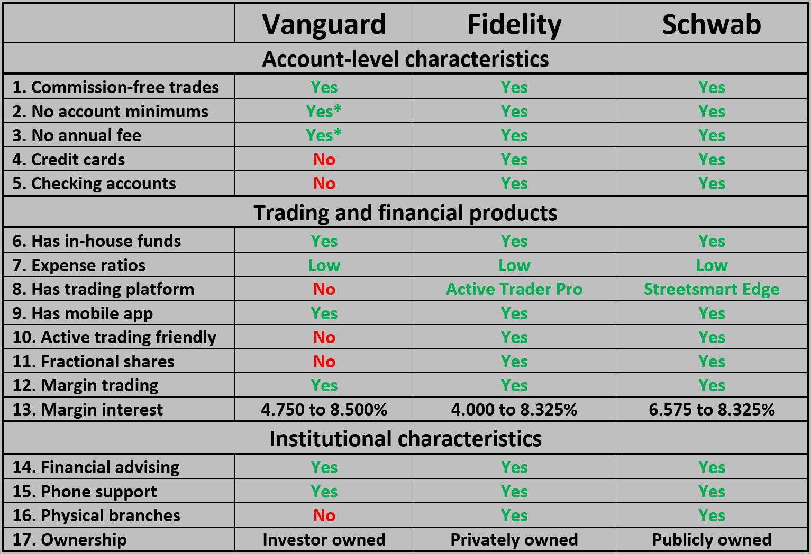

## Table of Contents

## What are Vanguard Mutual Funds and how do they work?

Vanguard Mutual Funds are a type of investment where many people pool their money together to buy a variety of stocks, bonds, or other assets. These funds are managed by Vanguard, a well-known investment company. When you invest in a Vanguard Mutual Fund, you own a small piece of each of the investments in the fund. This helps spread out the risk because your money is not tied to the success of just one company or asset.

The way these funds work is pretty straightforward. When you put money into a Vanguard Mutual Fund, it gets added to the pool of money from other investors. The fund managers then use this money to buy a diverse range of investments. Over time, the value of the fund can go up or down based on how well the investments perform. You can choose to keep your money in the fund and let it grow, or you can sell your shares if you need the money. Vanguard is known for keeping fees low, which means more of your money stays invested and working for you.

## What are Vanguard ETFs and how do they work?

Vanguard ETFs, or Exchange-Traded Funds, are another type of investment offered by Vanguard. Like mutual funds, ETFs allow you to invest in a basket of different stocks, bonds, or other assets. The big difference is that ETFs are traded on stock exchanges, just like individual stocks. This means you can buy and sell Vanguard ETFs throughout the trading day at the current market price, rather than waiting until the end of the day like you do with mutual funds.

When you invest in a Vanguard ETF, your money goes into the fund, and the fund managers use it to buy a diverse range of investments. This helps spread out your risk because your money is not tied to the success of just one company. The value of the ETF can go up or down based on how well the investments in the fund are doing. Vanguard ETFs are known for being low-cost, which means more of your money stays invested and can grow over time.

## What are the key differences between Vanguard Mutual Funds and Vanguard ETFs?

The main difference between Vanguard Mutual Funds and Vanguard ETFs is how you buy and sell them. With mutual funds, you can only buy or sell them at the end of the trading day, based on the fund's net asset value. On the other hand, ETFs are traded on stock exchanges, so you can buy and sell them anytime during the trading day, just like you would with a stock. This gives you more flexibility if you want to react quickly to changes in the market.

Another key difference is the way they are priced. Mutual funds are priced once a day after the market closes, and everyone gets the same price. ETFs, however, are priced continuously throughout the trading day, and the price can change based on supply and demand. This means you might buy or sell an ETF at a slightly different price than someone else, depending on when you make the trade. Both types of funds can be good investments, but these differences might make one more suitable for your needs than the other.

## How do the fees and expenses compare between Vanguard Mutual Funds and Vanguard ETFs?

Vanguard is known for keeping fees low for both their mutual funds and ETFs. The fees you pay are called the expense ratio, which is a small percentage of your investment that goes towards running the fund. For many Vanguard mutual funds and ETFs, the expense ratios are very similar. This means whether you choose a mutual fund or an ETF, you'll often pay about the same amount in fees.

However, there can be some small differences. Some Vanguard mutual funds might have a slightly higher expense ratio than their ETF counterparts, but the difference is usually very small. Also, if you're buying and selling ETFs, you might have to pay a commission to your broker, depending on which broker you use. Many brokers offer commission-free trading for Vanguard ETFs, but it's something to check. Overall, both Vanguard mutual funds and ETFs are designed to be cost-effective ways to invest your money.

## What are the tax implications of investing in Vanguard Mutual Funds versus Vanguard ETFs?

When you invest in Vanguard Mutual Funds, you might have to pay taxes on any money you make from them. This includes capital gains, which is the profit you make when you sell your shares for more than you paid, and dividends, which are payments the fund might make to you from the earnings of the investments it holds. Mutual funds can create taxable events even if you don't sell your shares because the fund itself might have to sell investments to pay people who are leaving the fund, which can lead to capital gains that are passed on to all the investors.

Vanguard ETFs can be a bit different when it comes to taxes. Because ETFs are traded on an exchange, they can use a special method called "in-kind" transactions to manage their investments. This means they can swap out investments without selling them, which can help reduce the capital gains that get passed on to you. So, ETFs might be more tax-efficient than mutual funds, especially if you're holding them for a long time. But remember, you'll still have to pay taxes on any dividends you receive and any profits you make when you sell your ETF shares.

## How does the trading flexibility differ between Vanguard Mutual Funds and Vanguard ETFs?

Vanguard Mutual Funds and Vanguard ETFs have different ways of trading. With mutual funds, you can only buy or sell them at the end of the trading day. The price you get is based on the net asset value, which is calculated once a day. This means if you want to invest or take out your money, you have to wait until the market closes to see what price you get.

On the other hand, Vanguard ETFs can be bought and sold anytime during the trading day, just like stocks. This gives you more flexibility because you can react quickly if the market is going up or down. The price of an ETF can change throughout the day based on what people are willing to pay, so you might get a different price than someone else depending on when you make your trade.

## What are the minimum investment requirements for Vanguard Mutual Funds and Vanguard ETFs?

Vanguard Mutual Funds usually have a minimum amount you need to invest to start. This amount can be different for each fund, but many of them let you start with as little as $3,000. Some funds might ask for more, like $50,000 or even $100,000 if they are special types of funds. If you want to invest more money later, you can usually add as little as $1 at a time.

Vanguard ETFs do not have a minimum investment amount like mutual funds do. Since ETFs are traded like stocks, you can buy as many or as few shares as you want, as long as your broker lets you. This means you could start with the cost of just one share, which might be a lot less than the minimum for a mutual fund. Just remember, the price of one share can change every day.

## How do the performance histories of Vanguard Mutual Funds compare to Vanguard ETFs?

The performance histories of Vanguard Mutual Funds and Vanguard ETFs can be very similar because many of them track the same indexes or have similar investment goals. For example, if there's a mutual fund and an ETF that both aim to match the performance of the S&P 500, they should have very close performance over time. The main thing that might make their performance a bit different is the fees they charge. Since Vanguard keeps fees low for both types of funds, the difference in performance due to fees is usually very small.

When you look at the long-term performance of Vanguard Mutual Funds and ETFs, you'll see that both types of funds can be good ways to grow your money. Over many years, the returns from these funds can be similar if they are invested in the same kinds of assets. But, because ETFs can be traded throughout the day and might have slightly lower fees, some people think they might have a tiny edge in performance. Still, the most important thing for your investment to do well is to pick the right fund that matches your goals and to keep your money invested for a long time.

## What types of investors might prefer Vanguard Mutual Funds over Vanguard ETFs, and vice versa?

Some investors might like Vanguard Mutual Funds more because they are easy to buy and sell at the end of the day. This can be good for people who don't want to watch the market all the time. Also, if you have a smaller amount of money to start with, some mutual funds let you add more money little by little. This can be helpful if you're just starting to invest or if you want to save regularly. People who like to set it and forget it might prefer mutual funds because they don't need to check the price all day.

On the other hand, some investors might choose Vanguard ETFs because they can buy and sell them anytime during the day. This can be good for people who want to react quickly to what's happening in the market. ETFs might also be better for people who want to start investing with just a little money because you can buy just one share. If you're the kind of person who likes to keep an eye on your investments and maybe make changes more often, ETFs could be the better choice for you.

## How does the dividend reinvestment process work for Vanguard Mutual Funds and Vanguard ETFs?

When you invest in Vanguard Mutual Funds, you can choose to have your dividends automatically reinvested. This means that instead of getting the dividend money in your bank account, it gets used to buy more shares of the mutual fund. This can help your investment grow over time because you're buying more shares without having to add more money. To set this up, you just need to tell Vanguard you want to reinvest your dividends, and they'll take care of it for you.

For Vanguard ETFs, the process is a bit different but still easy. If you want to reinvest your dividends, you'll need to set up a Dividend Reinvestment Plan (DRIP) with your broker. Not all brokers offer this, so you'll need to check if yours does. Once it's set up, any dividends you get from your ETFs will be used to buy more shares of the ETF. This can help your investment grow just like with mutual funds, but you'll need to make sure your broker supports this feature.

## What are the considerations for portfolio diversification when choosing between Vanguard Mutual Funds and Vanguard ETFs?

When thinking about portfolio diversification, both Vanguard Mutual Funds and Vanguard ETFs can help you spread your investments across different types of assets. This is good because it reduces the risk that comes from putting all your money in one place. Both types of funds can hold a mix of stocks, bonds, or other investments, so you can choose funds that fit with the kinds of investments you want to have. For example, if you want to invest in both U.S. and international stocks, you can find mutual funds and ETFs that do that.

The main thing to think about when choosing between mutual funds and ETFs for diversification is how easy it is to buy and sell them. If you like to make changes to your investments often, ETFs might be better because you can trade them anytime during the day. But if you prefer to set your investments and not change them much, mutual funds could be easier because you can buy them at the end of the day without worrying about the price changing all the time. Both types of funds can help you build a diversified portfolio, so it really comes down to what fits best with how you like to invest.

## How do Vanguard's Admiral Shares compare to their ETF equivalents in terms of cost and performance?

Vanguard's Admiral Shares are a type of mutual fund that usually have lower fees than their regular mutual fund counterparts. The expense ratios for Admiral Shares are often very close to the expense ratios of their ETF equivalents. This means that in terms of cost, Admiral Shares and ETFs are pretty similar. For example, if an Admiral Share fund has an expense ratio of 0.04%, the ETF that tracks the same index might have an expense ratio of 0.03%. The difference is small, but ETFs might sometimes be a tiny bit cheaper.

When it comes to performance, Admiral Shares and their ETF equivalents should be very similar because they usually track the same indexes. Over time, both types of investments should give you about the same returns if they are invested in the same kinds of assets. The small difference in fees might make ETFs perform just a bit better, but it's usually not a big difference. So, whether you choose Admiral Shares or ETFs, you can expect similar performance, and the choice might come down to how you like to buy and sell your investments.

## What are the risks and considerations for investors?

Algorithmic trading with ETFs (Exchange-Traded Funds) and mutual funds involves sophisticated strategies that require careful consideration of several risks and important operational factors. For investors looking to use Vanguard's financial products in such strategies, it is essential to be aware of these potential pitfalls and to consider various aspects related to market dynamics, compliance, and technology.

### Potential Pitfalls of Algorithmic Trading with ETFs and Mutual Funds

Algorithmic trading, while offering benefits such as speed and efficiency, also presents significant risks that can impact investments in ETFs and mutual funds. One primary concern is the risk of over-optimization, where a trading algorithm performs well on historical data but fails to achieve similar results in real-world conditions due to changing market dynamics. Additionally, algorithms can exacerbate market volatility during periods of extreme fluctuations, leading to potential losses.

### Important Market Factors

Several market factors must be considered when deploying algorithmic strategies. Market liquidity is crucial, especially for ETFs, as it affects the transaction cost and the ability to execute trades without significantly impacting asset prices. Volatility is another important [factor](/wiki/factor-investing), as it can influence the performance of certain algorithms, particularly those designed for trend following or [market making](/wiki/market-making).

The calculation of the bid-ask spread and slippage costs are critical in evaluating the efficiency of an algorithmic strategy. These costs can be represented mathematically as:

$$
\text{Effective Spread} = \text{Trade Price} - \frac{(\text{Best Bid} + \text{Best Ask})}{2}
$$

### Compliance and Regulatory Considerations

Algorithmic traders must navigate a complex regulatory landscape. Compliance with financial regulations is imperative to avoid penalties and legal issues. In the U.S., for example, the Securities and Exchange Commission (SEC) and the Financial Industry Regulatory Authority (FINRA) have specific guidelines regarding the use of algorithms in trading activities. Additionally, MiFID II in Europe imposes requirements on algorithmic trading to ensure market integrity and investor protection.

### Technology and Data Quality

Success in algorithmic trading is heavily reliant on the quality and speed of data as well as the robustness of the technology infrastructure. High-frequency trading ([HFT](/wiki/high-frequency-trading-strategies)) algorithms, in particular, depend on low-latency systems to execute trades within microseconds, making technology an essential component. Data quality, encompassing accuracy, consistency, and timeliness, is vital for developing and testing algorithms. Poor data quality can lead to suboptimal trading decisions and negative financial outcomes.

Python, with libraries such as NumPy, pandas, and TA-Lib, is often used to backtest and implement algorithms. Here is a simple example of a moving average crossover strategy implemented in Python:

```python
import pandas as pd
import numpy as np

# Load historical data
data = pd.read_csv('vanguard_etf_data.csv')

# Calculate moving averages
data['SMA_50'] = data['Close'].rolling(window=50).mean()
data['SMA_200'] = data['Close'].rolling(window=200).mean()

# Generate trading signals
data['Signal'] = np.where(data['SMA_50'] > data['SMA_200'], 1, 0)
data['Position'] = data['Signal'].diff()

# Display trading signals
print(data[['Date', 'Close', 'SMA_50', 'SMA_200', 'Signal', 'Position']].tail())
```

### Advice for Investors

Investors interested in using algorithmic trading with Vanguard products should conduct thorough research and seek professional advice to understand the complexities involved. It is advisable to implement robust testing frameworks to evaluate strategies across different market conditions. Additionally, diversification remains essential to mitigate risks associated with algorithmic trading. Investors should stay informed about evolving technologies and regulatory changes that could impact the effectiveness and compliance of their trading strategies. Leveraging low-cost Vanguard ETFs with diversified exposures could provide a strategic advantage in algorithmic models aiming to achieve long-term returns.

## References & Further Reading

[1]: Bergstra, J., Bardenet, R., Bengio, Y., & Kégl, B. (2011). ["Algorithms for Hyper-Parameter Optimization."](https://papers.nips.cc/paper/4443-algorithms-for-hyper-parameter-optimization) Advances in Neural Information Processing Systems 24.

[2]: ["Advances in Financial Machine Learning"](https://www.amazon.com/Advances-Financial-Machine-Learning-Marcos/dp/1119482089) by Marcos Lopez de Prado

[3]: ["Evidence-Based Technical Analysis: Applying the Scientific Method and Statistical Inference to Trading Signals"](https://www.amazon.com/Evidence-Based-Technical-Analysis-Scientific-Statistical/dp/0470008741) by David Aronson

[4]: ["Machine Learning for Algorithmic Trading"](https://github.com/PacktPublishing/Machine-Learning-for-Algorithmic-Trading-Second-Edition) by Stefan Jansen

[5]: ["Quantitative Trading: How to Build Your Own Algorithmic Trading Business"](https://www.amazon.com/Quantitative-Trading-Build-Algorithmic-Business/dp/1119800064) by Ernest P. Chan