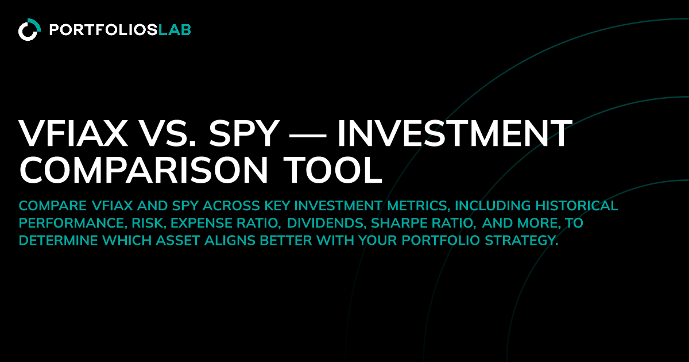

## Table of Contents

## What are VFIAX and SPY, and how do they differ in basic terms?

VFIAX is a mutual fund offered by Vanguard that tracks the performance of the S&P 500 index. It is designed for long-term investors who want to own a piece of the 500 largest companies in the U.S. You can buy or sell VFIAX only at the end of each trading day, at the fund's net asset value. This makes it a good choice for people who want to invest for the long term and don't need to trade frequently.

SPY, on the other hand, is an exchange-traded fund (ETF) that also tracks the S&P 500. Unlike VFIAX, SPY can be bought and sold throughout the trading day, just like a stock. This makes it more suitable for investors who might want to trade more frequently or need more flexibility. Both VFIAX and SPY aim to give you similar returns as the S&P 500, but they cater to different trading needs and styles.

## What are the expense ratios of VFIAX and SPY, and how do they impact returns?

The expense ratio for VFIAX, the Vanguard 500 Index Fund Admiral Shares, is currently 0.04%. This means for every $10,000 you invest, you pay $4 each year to cover the fund's operating costs. A lower expense ratio like this can help your investment grow more over time because you keep more of your returns instead of paying them as fees.

SPY, the SPDR S&P 500 ETF Trust, has an expense ratio of 0.095%. For the same $10,000 investment, you would pay $9.50 annually. Although this is still considered low, it's more than double the expense ratio of VFIAX. Over many years, this difference can add up, potentially reducing your overall returns compared to an investment with a lower expense ratio like VFIAX.

## How do the investment minimums for VFIAX compare to those for SPY?

VFIAX, the Vanguard 500 Index Fund Admiral Shares, has an investment minimum of $3,000. This means you need at least $3,000 to start investing in this fund. It's designed for people who want to invest a larger amount at once and hold it for a long time.

SPY, the SPDR S&P 500 ETF Trust, doesn't have a minimum investment requirement like VFIAX does. You can buy even just one share of SPY, which makes it easier for people to start investing with smaller amounts of money. This flexibility can be good if you want to invest little by little over time.

## What are the tax implications of investing in VFIAX versus SPY?

When you invest in VFIAX, which is a mutual fund, you might face different tax situations than with SPY, which is an ETF. Mutual funds like VFIAX often have to sell stocks inside the fund to meet investor withdrawals. This can lead to capital gains distributions, which are taxable events for you, even if you didn't sell any of your own shares. So, if you're holding VFIAX in a taxable account, you might have to pay taxes on these gains each year, even if you didn't do any trading yourself.

On the other hand, ETFs like SPY are generally more tax-efficient. They use a process called "in-kind" transfers, which helps them avoid selling stocks inside the fund. This means they're less likely to create taxable events for you. So, if you hold SPY in a taxable account, you might have fewer tax headaches because you'll mostly pay taxes only when you decide to sell your shares. This makes ETFs like SPY a good choice if you're worried about taxes.

## How do the trading and liquidity features of VFIAX and SPY differ?

VFIAX, which is a mutual fund, can only be bought or sold at the end of each trading day. This means if you want to invest in VFIAX, you place your order during the day, but it won't be processed until after the market closes. The price you get is based on the fund's net asset value at the end of the day. Because of this, VFIAX might not be as good for people who want to trade a lot or need to buy and sell quickly. But, it's usually very easy to buy or sell VFIAX because there's always enough of it available, so you don't have to worry about not being able to trade.

SPY, on the other hand, is an ETF that you can buy and sell anytime during the trading day, just like a stock. This means you can trade SPY whenever you want, and the price will change throughout the day based on what people are willing to pay for it. This makes SPY a better choice for people who want to trade more often or need more flexibility. However, because SPY trades like a stock, the number of shares available to buy or sell at any moment can change, which might affect how easily you can trade it, especially during busy times.

## What are the historical performance differences between VFIAX and SPY?

VFIAX and SPY both track the S&P 500, so their historical performances are very similar. Over the long term, both have given investors returns that closely match the overall performance of the S&P 500. For example, if you look at the past 10 years, both VFIAX and SPY would have grown your money at about the same rate, give or take a tiny bit due to their different expense ratios.

The small difference in their performance mainly comes from their expense ratios. VFIAX has a lower expense ratio of 0.04%, while SPY's is 0.095%. Over many years, this difference can add up, making VFIAX slightly better in terms of keeping more of your returns. But, unless you're investing a lot of money for a long time, the difference won't be huge. So, for most people, choosing between VFIAX and SPY based on historical performance alone won't make a big difference.

## How do the dividend yields of VFIAX and SPY compare?

VFIAX and SPY both track the S&P 500, so their dividend yields are very close to each other. The dividend yield is the percentage of the money you get back from the dividends the companies in the S&P 500 pay out. Because both funds hold the same companies, they should give you about the same amount of dividends each year. 

The small difference in their yields comes from their expense ratios. VFIAX has a lower expense ratio, so after paying the fees, the dividend yield for VFIAX might be a tiny bit higher than for SPY. But this difference is very small, so for most people, it won't make a big impact on their investment choices.

## What are the underlying indices that VFIAX and SPY track, and how closely do they replicate their performance?

VFIAX and SPY both track the S&P 500 index. The S&P 500 is a list of 500 big companies in the U.S. that people use to see how well the stock market is doing. Both VFIAX and SPY try to copy the performance of these 500 companies as closely as they can. They do this by holding the same stocks in the same amounts as the S&P 500.

Because VFIAX and SPY aim to match the S&P 500, their performance is very close to the index. They might not be exactly the same every day because of small differences like fees, but over time, they do a really good job at following the S&P 500. So, if you invest in either VFIAX or SPY, you can expect your money to grow in a way that's very similar to how the S&P 500 grows.

## How do the rebalancing strategies of VFIAX and SPY affect their tracking errors?

Both VFIAX and SPY aim to match the S&P 500 as closely as possible, but they use slightly different ways to do this. When the S&P 500 changes, like when a company is added or removed, both funds need to adjust their holdings to stay in line with the index. This process is called rebalancing. VFIAX, being a mutual fund, rebalances at the end of each trading day. This helps keep the fund's performance very close to the S&P 500 because it can quickly adjust to any changes in the index.

SPY, which is an ETF, also rebalances to follow the S&P 500, but it does so in a way that can sometimes cause small differences. ETFs like SPY use a method called "in-kind" transfers, which can lead to tiny differences in how closely the ETF tracks the index. These small differences are called tracking errors. Because of this, SPY might have a slightly higher tracking error compared to VFIAX, but for most investors, these differences are very small and don't make a big impact on their overall returns.

## What are the considerations for long-term investors choosing between VFIAX and SPY?

For long-term investors, choosing between VFIAX and SPY involves looking at a few key things. VFIAX is a mutual fund that you can only buy or sell at the end of the trading day. This can be good if you're planning to keep your money invested for many years without needing to trade often. VFIAX also has a very low expense ratio of 0.04%, which means you pay less in fees over time. This can help your investment grow more because you keep more of your returns. But, you need at least $3,000 to start investing in VFIAX.

SPY, on the other hand, is an ETF that you can trade anytime during the day, just like a stock. This might be better if you want more flexibility or plan to trade more often. SPY's expense ratio is a bit higher at 0.095%, so you pay a bit more in fees each year. But, you can start investing in SPY with any amount of money, even just one share. Also, ETFs like SPY can be more tax-friendly because they don't often create taxable events for you, which can be a big plus if you're investing outside of a retirement account.

## How do the portfolio composition and sector allocations of VFIAX and SPY compare?

VFIAX and SPY both hold the same stocks as the S&P 500, so their portfolio composition is very similar. They include stocks from the 500 largest companies in the U.S., covering a wide range of industries like technology, healthcare, finance, and more. Because they track the same index, they have the same companies in the same amounts, so their sector allocations are also the same. For example, if the S&P 500 has a lot of tech companies, both VFIAX and SPY will have a lot of tech companies too.

The main difference between VFIAX and SPY isn't in what they hold, but in how you can buy and sell them and how much they cost. VFIAX is a mutual fund with a lower expense ratio, which means you pay less in fees each year. SPY is an ETF that you can trade throughout the day, and it has a slightly higher expense ratio. But, for long-term investors, the choice between VFIAX and SPY won't change what companies you're invested in because both funds aim to give you the same exposure to the S&P 500.

## What advanced metrics, such as beta and standard deviation, can be used to compare the risk profiles of VFIAX and SPY?

Both VFIAX and SPY track the S&P 500, so they have very similar risk profiles. One way to measure risk is by looking at the beta, which shows how much a fund moves compared to the market. Both VFIAX and SPY have a beta close to 1, meaning they move almost exactly with the S&P 500. If the S&P 500 goes up or down, VFIAX and SPY will do the same thing, making them equally risky in terms of market movements.

Another way to look at risk is the standard deviation, which shows how much the returns of a fund can vary. VFIAX and SPY will have very similar standard deviations because they hold the same stocks in the same amounts. This means they will have about the same ups and downs over time. So, for someone trying to understand the risk of investing in VFIAX or SPY, these advanced metrics show that both funds are nearly the same in how they handle risk.

## References & Further Reading

[1]: ["Vanguard 500 Index Fund: Overview and Investment Approach"](https://investor.vanguard.com/investment-products/mutual-funds/profile/vfiax) - Vanguard

[2]: ["SPDR S&P 500 ETF Trust (SPY) Overview"](https://www.marketwatch.com/investing/fund/SPY) - State Street Global Advisors

[3]: Poterba, J. M., & Shoven, J. B. (2002). ["Exchange-traded funds: A new investment option for taxable investors."](https://economics.mit.edu/sites/default/files/publications/Exchange-Traded%20Funds%20A%20New%20Investment%20Option.pdf) American Economic Review, 92(2), 422-427.

[4]: ["Index Funds: The 12-Step Recovery Program for Active Investors"](https://www.amazon.com/Index-Funds-12-Step-Recovery-Investors/dp/0976802317) by Mark T. Hebner

[5]: ["A Random Walk Down Wall Street: The Time-Tested Strategy for Successful Investing"](https://www.amazon.com/Random-Walk-Down-Wall-Street/dp/0393358380) by Burton G. Malkiel

[6]: Ben-David, I., Franzoni, F., & Moussawi, R. (2014). ["Do ETFs increase volatility?"](https://onlinelibrary.wiley.com/doi/abs/10.1111/jofi.12727) The Journal of Finance, 69(6), 2185-2220.

[7]: ["The Index Revolution: Why Investors Should Join It Now"](https://archive.org/details/indexrevolutionw0000elli) by Charles D. Ellis

[8]: Clements, M. P., & Krolzig, H. M. (2002). ["Can oil shocks explain asymmetries in the US business cycle?"](https://link.springer.com/content/pdf/10.1007/978-3-642-51182-0_3.pdf) Empirical Economics, 29(1), 231-248.