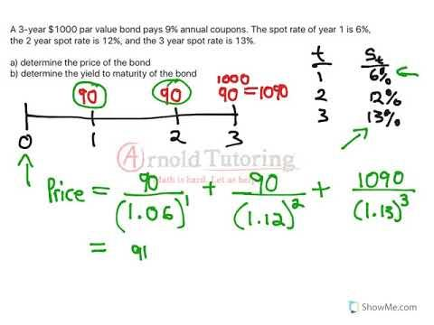

## Table of Contents

## What is Yield to Maturity (YTM)?

Yield to Maturity (YTM) is a way to measure the total return you can expect from a bond if you hold it until it matures. It takes into account the bond's current market price, its face value, the interest payments you'll receive, and the time left until the bond matures. YTM is expressed as an annual rate, helping investors compare the potential returns of different bonds.

Calculating YTM can be a bit tricky because it involves solving for the interest rate that makes the present value of all future cash flows from the bond equal to its current price. This means you need to consider not just the annual interest payments, but also the gain or loss you'll experience when the bond matures and you get the face value back. Because of this complexity, many people use financial calculators or software to find the YTM.

## What is a Spot Rate?

A spot rate is the interest rate for a loan or investment that starts right now and lasts for a specific time. It's like the price you pay today for borrowing or lending money for a certain period, like a day, a month, or a year. For example, if you want to borrow money for one year starting today, the spot rate for that year is the interest rate you'd pay.

Spot rates are important in finance because they help people figure out the value of future cash flows. They are used in things like bond pricing and understanding how interest rates change over time. When you know the spot rates for different times, you can see how much money today is worth compared to money in the future, which helps in making smart investment choices.

## How is Yield to Maturity calculated?

Yield to Maturity (YTM) is figured out by finding the interest rate that makes the total of all future cash flows from a bond equal to what the bond costs now. Imagine you buy a bond for $950 that will pay you $50 every year and give you back $1,000 when it's done in 5 years. YTM is the rate that makes the value of those $50 payments each year, plus the $1,000 at the end, add up to $950 today.

Calculating YTM can be tricky because it's like solving a puzzle. You need to guess an interest rate, then see if the value of the bond's payments at that rate matches its price. If it doesn't match, you guess again until you find the rate that works. Because this can be hard to do by hand, many people use special calculators or computer programs to find the YTM quickly and accurately.

## How are Spot Rates determined?

Spot rates are determined by looking at what people are willing to pay for loans or investments that start right away. Imagine you want to lend money for one year starting today. The spot rate for that year is the interest rate you'd get for lending that money now. This rate comes from what people in the market think is a fair price for borrowing or lending money for different lengths of time. It's influenced by things like how much people want to borrow or lend, what the economy is doing, and what people think will happen with interest rates in the future.

To find out spot rates, people often look at prices of things like government bonds or Treasury securities. These are considered very safe, so their prices can show what the market thinks about interest rates for different times. For example, if a one-year Treasury bond is selling at a certain price, you can figure out the spot rate for one year from that price. By looking at bonds with different times until they pay back, you can see a whole set of spot rates, which is called the spot rate curve. This curve helps people understand how interest rates change over time and make better choices about borrowing and lending.

## What are the key differences between YTM and Spot Rate?

Yield to Maturity (YTM) and spot rate are both important in understanding how much money you can make from bonds, but they look at things in different ways. YTM is like the overall return you'd get if you bought a bond and held onto it until it matures. It takes into account the bond's price, the interest payments you'll get, and the money you get back at the end. It's a single rate that gives you an idea of what you'll earn over the whole time you own the bond.

On the other hand, a spot rate is the interest rate for a loan or investment that starts right now and lasts for a specific time. It's like the price you pay today for borrowing or lending money for a certain period, like a day, a month, or a year. Spot rates are used to figure out the value of future cash flows, and they help you see how much money today is worth compared to money in the future. While YTM gives you a big picture of a bond's return, spot rates give you a more detailed view of what interest rates are at different times.

## In what scenarios would you use YTM over Spot Rate?

You would use Yield to Maturity (YTM) over spot rate when you want to know the total return you'll get from a bond if you hold it until it matures. YTM is like a summary of what you'll earn over the whole time you own the bond. It's helpful if you're comparing different bonds to see which one might give you a better return. For example, if you're thinking about buying a bond and want to know if it's a good deal compared to other bonds, YTM gives you a simple number to compare.

YTM is also useful when you're trying to figure out if a bond fits your long-term investment plans. Since YTM takes into account the bond's price, the interest payments you'll get, and the money you'll get back at the end, it gives you a complete picture of what to expect. This can help you decide if the bond's return matches your investment goals and how long you plan to keep the bond.

## In what scenarios would you use Spot Rate over YTM?

You would use spot rates over YTM when you need to understand the value of money at different points in time. Spot rates tell you the interest rate for borrowing or lending money starting right now for a specific period, like a day, a month, or a year. This is helpful if you're trying to figure out how much money today is worth compared to money in the future. For example, if you're pricing a bond or any investment that pays out at different times, spot rates help you see what each payment is worth right now.

Spot rates are also important if you want to understand how interest rates change over time. They can help you see the whole set of interest rates for different times, which is called the spot rate curve. This curve can show you if interest rates are expected to go up or down in the future, which can be useful for making investment decisions. If you're a financial analyst or someone who needs to understand the detailed movements of interest rates, spot rates give you a more precise tool than YTM.

## How do changes in interest rates affect YTM and Spot Rate?

When interest rates go up, the YTM of existing bonds goes up too. This is because new bonds will be issued with higher interest rates to match the market, making older bonds less attractive unless their price goes down. So, if you want to sell your old bond, you might have to lower its price to make it more appealing, which means its YTM will increase to match the new higher interest rates. On the other hand, when interest rates go down, the YTM of existing bonds goes down too. New bonds will have lower interest rates, making older bonds with higher rates more valuable, so their prices go up and their YTM goes down.

Changes in interest rates also affect spot rates directly. If interest rates go up, the spot rate for borrowing or lending money starting right now will go up too. This is because the market will adjust the price of money to match the new higher interest rates. If interest rates go down, the spot rate will go down as well, reflecting the lower cost of borrowing or lending money. Spot rates are important because they help people understand how much money is worth at different times, so any change in interest rates will change how we value money in the future.

## Can you explain the relationship between YTM, Spot Rate, and bond pricing?

The relationship between Yield to Maturity (YTM), spot rates, and bond pricing is all about figuring out how much a bond is worth and what return you can expect from it. YTM is like a summary of the total return you'll get if you buy a bond and keep it until it matures. It takes into account the bond's current price, the interest payments you'll receive over time, and the money you get back when the bond matures. When you calculate YTM, you're trying to find the interest rate that makes the value of all those future payments equal to what the bond costs now. So, YTM is closely tied to the bond's price because if the price changes, the YTM will change too.

Spot rates, on the other hand, help you understand the value of money at different points in time. They tell you the interest rate for borrowing or lending money starting right now for a specific period. When you're pricing a bond, spot rates are useful because they help you figure out what each of the bond's future payments is worth today. You use spot rates to calculate the present value of all the bond's cash flows, which gives you the bond's price. If spot rates go up, the value of future payments goes down, so the bond's price will go down. If spot rates go down, the value of future payments goes up, and so does the bond's price.

The connection between YTM, spot rates, and bond pricing is that they all work together to help you understand how much a bond is worth and what kind of return you can expect. YTM gives you a single number that represents the total return over the life of the bond, while spot rates give you a detailed view of what interest rates are at different times. When interest rates change, both YTM and spot rates change, which in turn affects the bond's price. If you know the spot rates, you can calculate the bond's price, and from the bond's price and its cash flows, you can find the YTM. It's like a puzzle where all the pieces fit together to give you a complete picture of the bond's value and return.

## How do YTM and Spot Rate impact investment decisions?

When you're thinking about investing in bonds, knowing the Yield to Maturity (YTM) helps you understand the total return you'll get if you hold the bond until it matures. It's like a quick way to see if a bond is a good deal compared to others. If a bond's YTM is higher than others, it might be a better investment because you'll earn more money over time. But if interest rates go up after you buy the bond, the YTM of your bond will go up too, which means its price might go down if you want to sell it before it matures. So, YTM is important for comparing bonds and planning how long you want to keep them.

Spot rates are also key for making smart investment choices. They tell you the interest rate for borrowing or lending money starting right now for different lengths of time. This helps you figure out how much money today is worth compared to money in the future, which is really important when you're pricing bonds or other investments. If spot rates go up, the value of future payments from a bond goes down, so the bond's price might drop. If spot rates go down, the bond's price might go up. By understanding spot rates, you can see how changes in interest rates might affect your investments and make better decisions about when to buy or sell bonds.

## What are the limitations of using YTM and Spot Rate in bond valuation?

Using Yield to Maturity (YTM) for bond valuation has some limitations. YTM assumes that you will hold the bond until it matures and that all interest payments will be reinvested at the same rate as the YTM. But in real life, interest rates can change, and you might not be able to reinvest at the same rate. Also, YTM doesn't tell you about the risk of the bond. If the bond's issuer might have trouble paying back the money, YTM won't show that. So, while YTM gives you a quick idea of what you might earn, it doesn't cover all the things that can affect your investment.

Spot rates also have their own limits when it comes to bond valuation. They give you a detailed view of what interest rates are at different times, but they can be hard to find for all the different times you need. Plus, spot rates can change quickly, so the value you calculate today might not be the same tomorrow. Spot rates also don't take into account things like the risk of the bond or what might happen in the economy. So, while they help you understand the value of money at different times, they don't give you the whole picture of what might happen with your investment.

## How can advanced models incorporate both YTM and Spot Rate for more accurate bond pricing?

Advanced models can use both Yield to Maturity (YTM) and spot rates to make bond pricing more accurate by combining the strengths of each. YTM gives you a quick idea of what you might earn if you hold a bond until it matures, but it assumes you'll reinvest all the interest payments at the same rate. Spot rates, on the other hand, help you figure out the value of each payment at different times, which is more detailed but can be tricky to find for all the times you need. By using both, these models can calculate the present value of all the bond's future cash flows more accurately. They use spot rates to value each payment and then adjust the overall YTM to match the bond's price, giving you a better picture of what the bond is worth.

These models also take into account other important things that YTM and spot rates alone might miss, like the risk of the bond's issuer not being able to pay back the money. They can use other data to adjust the bond's price based on how risky it is. This means the models can give you a more complete view of what might happen with your investment. By combining YTM and spot rates with information about risk and other factors, these advanced models help investors make smarter choices about buying and selling bonds.

## What is the relationship between Spot Rates and Yield to Maturity?

Spot rates and yield to maturity (YTM) are fundamental concepts in the fixed-income market, playing crucial roles in bond pricing and investment strategies. Understanding these metrics is essential for investors seeking to optimize their bond portfolios.

### Spot Rate Definition and Role

The spot rate represents the [interest rate](/wiki/interest-rate-trading-strategies) agreed upon today for a loan that begins immediately and lasts for a specific period. It is the current yield on zero-coupon bonds that are risk-free – typically government bonds. These rates are inherently tied to the concept of a yield curve, which graphically depicts the interest rates of bonds of equal credit quality but differing maturity dates. Each point on the yield curve represents a spot rate for a specific maturity.

Spot rates are used to determine the present value of future cash flows from a bond. By discounting each cash flow of a bond by the relevant spot rate, investors can value a bond accurately. In a mathematical sense, the present value (PV) of a bond's cash flows using spot rates is calculated as follows:

$$

PV = \sum_{t=1}^{T} \frac{C_t}{(1 + s_t)^t} 
$$

where $C_t$ is the cash flow at time $t$, $s_t$ is the spot rate for time $t$, and $T$ is the bond's term to maturity.

### Yield to Maturity (YTM) Definition and Calculation

Yield to Maturity (YTM) is the total return anticipated on a bond if it is held until it matures. It represents the internal rate of return (IRR) of the bond's cash flows, equating the present value of these cash flows to the bond's current market price. The calculation of YTM involves solving for the rate $r$ in the bond valuation formula:

$$

P = \sum_{t=1}^{T} \frac{C_t}{(1 + r)^t} 
$$

where $P$ is the current price of the bond, $C_t$ is the cash flow at time $t$, and $T$ is the bond's term to maturity. The complexity of this computation often necessitates numerical methods or financial calculators, as it requires solving for $r$ in a non-linear equation.

### Differences and Similarities

While both spot rates and YTM facilitate the valuation of bonds, they differ fundamentally in their derivation and application. The spot rate curve is derived from current market rates of zero-coupon bonds, providing a comprehensive view of prevailing interest rates across different maturities. Conversely, YTM is a single rate that encapsulates the total expected return on a bond, assuming it is held to maturity and that all coupon and principal payments are made as scheduled.

Despite these differences, both metrics leverage the time value of money principle in financial analyses, catering to the different needs of investors. Spot rates are essential for pinpointing the exact discount rates applicable to each cash flow, while YTM offers a quick estimate of a bond's average annual return.

### Utilization in Bonds Trading

Investors utilize spot rates and YTM to inform decisions about bond selection and valuation. For instance, if the YTM of a bond is higher than the current spot rate for the same maturity, the bond may be deemed undervalued, offering potential [arbitrage](/wiki/arbitrage) opportunities. Such analytical practices help investors achieve superior returns while managing interest rate risks effectively.

Further, in practical applications, traders often back-solve the necessary spot rates from observed bond prices using techniques like bootstrapping. This method computes a series of zero-coupon bond rates, allowing traders to construct the spot rate curve. By comparing these constructed rates to a bond’s YTM, investors can make informed judgments about current bond market conditions and potential investment alignments.

In conclusion, both spot rates and YTM provide invaluable insights into bond valuation and yield analysis. Mastery of these concepts empowers investors and traders in navigating the complexities of the fixed-income market, ensuring an informed approach to investment choices.

## What are the Basics of Bond Valuation?

Bond valuation is a fundamental aspect of the financial industry as it enables investors to estimate the fair value of bonds, which is crucial for making informed investment decisions. This process involves determining the present value of a bond's future cash flows, which include periodic interest payments, known as coupon payments, and the repayment of the principal amount, or par value, at maturity.

The key components involved in bond valuation include:

1. **Par Value**: This is the face value of the bond, which is the amount that the issuer agrees to repay the bondholder at maturity. Typically, par value is set at $1,000 for most corporate and government bonds. It serves as the baseline for calculating returns and is pivotal in determining the bond’s yield.

2. **Coupon Rate**: This is the annual interest rate paid by the bond issuer on the bond's par value. It determines the periodic interest payments to bondholders. For instance, a bond with a par value of $1,000 and a coupon rate of 5% yields annual coupon payments of $50. These payments are usually made semi-annually or annually and represent the primary source of fixed income from the bond.

3. **Discount Rate**: This rate reflects the required return by investors, based on the bond's risk and the prevailing market interest rates. The discount rate is used to calculate the present value of the bond's future cash flows. It's crucial because it incorporates the time value of money, which accounts for the preference to have money sooner rather than later due to potential income opportunities.

To value a bond, we calculate the present value of its future cash flows, which consist of the periodic coupon payments and the par value at maturity. The formula for bond valuation is expressed as:

$$

PV = \sum \left(\dfrac{C}{(1 + r)^t}\right) + \dfrac{M}{(1 + r)^n} 
$$

Where:
- $PV$ is the present value or price of the bond.
- $C$ is the coupon payment.
- $r$ is the discount rate or yield.
- $t$ is the time period when the coupon payment is received.
- $M$ is the maturity value or par value of the bond.
- $n$ is the total number of periods until maturity.

For practical calculation, Python can be used to calculate the present value of a bond:

```python
def bond_valuation(coupon_rate, par_value, discount_rate, periods):
    # Calculate coupon payment
    coupon_payment = coupon_rate * par_value
    present_value_coupons = sum([coupon_payment / ((1 + discount_rate) ** t) for t in range(1, periods + 1)])
    present_value_par = par_value / ((1 + discount_rate) ** periods)
    return present_value_coupons + present_value_par

# Example calculation
coupon_rate = 0.05  # 5%
par_value = 1000  # $1,000
discount_rate = 0.04  # 4%
periods = 10  # 10 years

bond_price = bond_valuation(coupon_rate, par_value, discount_rate, periods)
print(f"Bond Price: ${bond_price:.2f}")
```

This method of calculating a bond's present value is essential for investors as it offers insights into whether a bond is overvalued, undervalued, or fairly priced compared to its market price. Understanding bond valuation helps investors optimize their portfolios by selecting bonds that will enhance returns and manage risk effectively.

## References & Further Reading

[1]: Fabozzi, F. J. (2001). ["Bond Markets, Analysis, and Strategies"](https://books.google.com/books/about/Bond_Markets_Analysis_and_Strategies_ten.html?id=bQpNEAAAQBAJ). Pearson.

[2]: Hull, J. C. (2017). ["Options, Futures, and Other Derivatives"](https://www-2.rotman.utoronto.ca/~hull/ofod/index.html). Pearson.

[3]: Lopez de Prado, M. (2018). ["Advances in Financial Machine Learning"](https://www.amazon.com/Advances-Financial-Machine-Learning-Marcos/dp/1119482089). Wiley.

[4]: Jarrow, R. A., & Turnbull, S. M. (2000). ["Derivatives Securities"](https://www.jstor.org/stable/2329239). South-Western College Pub.

[5]: Chan, E. (2009). ["Quantitative Trading: How to Build Your Own Algorithmic Trading Business"](https://github.com/ftvision/quant_trading_echan_book). Wiley.

[6]: Jansen, S. (2020). ["Machine Learning for Algorithmic Trading: Second Edition"](https://www.oreilly.com/library/view/machine-learning-for/9781839217715/). Packt Publishing.

[7]: Rizova, S., & McKinney, K. (2021). ["Understanding Bond Valuation"](https://oxfordre.com/internationalstudies/display/10.1093/acrefore/9780190846626.001.0001/acrefore-9780190846626-e-470). Insight Articles, Dimensional Fund Advisors.