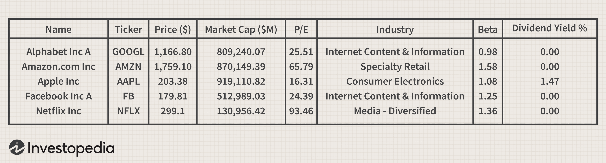

## Table of Contents

## What are old economy stocks?

Old economy stocks are shares of companies that belong to traditional industries, like manufacturing, energy, and basic materials. These companies have been around for a long time and are not usually involved in new technology or the internet. Examples of old economy stocks include companies in the automotive, steel, and oil industries. These stocks are often seen as stable and reliable because they are based on essential goods and services that people always need.

Investors might choose old economy stocks because they want to invest in something that has a long history and is less likely to be affected by fast-changing trends. These stocks can provide steady income through dividends, which are payments made by the company to its shareholders. However, old economy stocks may not grow as quickly as stocks in newer, more innovative sectors. This means they might not offer the same potential for high returns, but they can be a safer choice for those looking to protect their investments.

## What are new economy stocks?

New economy stocks are shares in companies that are part of modern industries, like technology, internet services, and renewable energy. These companies often focus on innovation and new ideas. They use technology to create new products and services, like smartphones, social media, and online shopping. Examples of new economy stocks include companies like Apple, Amazon, and Tesla. These stocks are popular because they can grow very quickly as new technology becomes more important in our lives.

Investing in new economy stocks can be exciting because they have the potential for big profits. If a company comes up with a new, popular product or service, its stock price can go up a lot. However, these stocks can also be risky. New technology can change fast, and companies that are doing well now might not do well in the future. So, while new economy stocks can offer high rewards, they also come with more uncertainty than old economy stocks.

## What are the main differences between old and new economy stocks?

Old economy stocks are from companies in traditional industries like manufacturing, energy, and basic materials. These companies have been around for a long time and usually do not use new technology. They are seen as stable and reliable because they provide essential goods and services that people always need. Investing in old economy stocks can be a safe choice because they often pay steady dividends, which are like regular payments to shareholders. However, these stocks may not grow as quickly as others, so they might not offer big profits.

New economy stocks come from companies in modern industries like technology, internet services, and renewable energy. These companies focus on innovation and new ideas, using technology to create new products and services. Examples include companies like Apple, Amazon, and Tesla. New economy stocks can be exciting to invest in because they have the potential for big profits if the company does well. But they can also be risky because new technology can change quickly, and a company that is doing well now might not do well in the future. So, while new economy stocks can offer high rewards, they also come with more uncertainty.

## How do old economy stocks typically perform during economic cycles?

Old economy stocks usually do well when the economy is growing. When people have more money, they buy more cars, use more energy, and need more basic materials. This means companies in these industries make more money, and their stock prices go up. These stocks are often seen as safe because they are based on things people always need, no matter what the economy is doing.

However, old economy stocks can struggle when the economy is not doing well. During a recession, people might not buy as many cars or use as much energy. This can hurt the profits of companies in these industries, and their stock prices can go down. But because these stocks are based on essential goods and services, they usually recover when the economy starts to grow again.

## How do new economy stocks typically perform during economic cycles?

New economy stocks often do well when the economy is growing and people are excited about new technology. Companies like Apple, Amazon, and Tesla can see their stock prices go up a lot because people want their new products and services. These stocks can grow very fast because new technology can change quickly, and when a company does something new and popular, its stock can go up a lot.

But new economy stocks can be risky when the economy is not doing well. During a recession, people might not spend as much money on new gadgets or online shopping. This can hurt the profits of tech companies, and their stock prices can go down a lot. Because new economy stocks are based on new ideas and technology, they can be more uncertain than old economy stocks, but they also have the chance for big rewards when the economy is doing well.

## What are the key sectors represented in old economy stocks?

Old economy stocks are from companies in traditional industries. The main sectors you find in old economy stocks are manufacturing, energy, and basic materials. Manufacturing includes companies that make things like cars, machinery, and appliances. Energy companies deal with oil, gas, and sometimes coal. Basic materials companies make things like steel, chemicals, and paper.

These sectors are important because they provide things people always need. Even when the economy is not doing well, people still need cars, energy, and basic materials. That's why old economy stocks are often seen as stable and reliable. They might not grow as fast as new economy stocks, but they can be a safe choice for investors who want to protect their money.

## What are the key sectors represented in new economy stocks?

New economy stocks come from companies in modern industries like technology, internet services, and renewable energy. Technology companies make things like smartphones, computers, and software. Internet services include companies that run websites, online shopping, and social media. Renewable energy companies focus on clean energy like solar and wind power.

These sectors are important because they use new ideas and technology to create products and services that people want. When the economy is growing, new economy stocks can do very well because people are excited about new technology. But they can also be risky because new technology can change quickly, and a company that is doing well now might not do well in the future.

## What are the risk profiles associated with old economy stocks?

Old economy stocks are usually seen as safer investments. They come from companies that have been around for a long time and make things people always need, like cars, oil, and steel. Because these companies are in stable industries, their stock prices do not go up and down as much as others. They often pay steady dividends, which are like regular payments to shareholders. This makes them a good choice for people who want to protect their money and get a reliable income.

However, old economy stocks are not completely risk-free. When the economy is not doing well, these companies can struggle. For example, during a recession, people might not buy as many cars or use as much energy. This can hurt the company's profits, and their stock prices can go down. But because these companies provide essential goods and services, they usually recover when the economy starts to grow again. So, while old economy stocks can be a safer choice, they still have some risks that investors need to think about.

## What are the risk profiles associated with new economy stocks?

New economy stocks can be exciting but also risky. These stocks come from companies in modern industries like technology, internet services, and renewable energy. They can grow very fast because new technology can change quickly. When a company comes up with a new, popular product or service, its stock price can go up a lot. This means there is a chance for big profits if you invest in the right company at the right time.

However, new economy stocks can also be very uncertain. New technology can change fast, and a company that is doing well now might not do well in the future. During a recession, people might not spend as much money on new gadgets or online shopping. This can hurt the profits of tech companies, and their stock prices can go down a lot. So, while new economy stocks can offer high rewards, they also come with more risk than old economy stocks.

## How have old economy stocks performed historically compared to new economy stocks?

Historically, old economy stocks have been more stable than new economy stocks. Old economy stocks come from companies in industries like manufacturing, energy, and basic materials. These companies have been around for a long time and make things people always need. Because of this, their stock prices do not go up and down as much as new economy stocks. They often pay steady dividends, which are like regular payments to shareholders. This makes old economy stocks a good choice for people who want to protect their money and get a reliable income.

New economy stocks, on the other hand, have shown the potential for big profits but also come with more risk. These stocks come from companies in modern industries like technology, internet services, and renewable energy. They can grow very fast because new technology can change quickly. When a company comes up with a new, popular product or service, its stock price can go up a lot. However, new technology can also change fast, and a company that is doing well now might not do well in the future. This makes new economy stocks more uncertain than old economy stocks.

Over time, old economy stocks have generally provided steady but slower growth compared to new economy stocks. During strong economic times, new economy stocks can do very well because people are excited about new technology. But during tough economic times, like a recession, new economy stocks can lose a lot of value because people might not spend as much money on new gadgets or online shopping. Old economy stocks, while they might not grow as fast, tend to be more resilient during economic downturns because they are based on essential goods and services.

## What are the valuation metrics used to assess old economy stocks?

When people want to know if old economy stocks are a good buy, they look at certain numbers to help them decide. These numbers are called valuation metrics. Some common ones for old economy stocks are the price-to-earnings ratio (P/E ratio), the dividend yield, and the price-to-book ratio (P/B ratio). The P/E ratio tells you how much you are paying for each dollar of the company's earnings. A lower P/E ratio might mean the stock is a good deal. The dividend yield shows how much money you get back from the company in dividends compared to the price of the stock. A higher dividend yield can be good for people who want a steady income. The P/B ratio compares the stock price to the company's book value, which is what the company would be worth if it sold all its stuff. A lower P/B ratio can mean the stock is undervalued.

Old economy stocks often have lower P/E and P/B ratios than new economy stocks because they are seen as safer and more stable. This means people are usually willing to pay less for each dollar of earnings or book value. The dividend yield is also important for old economy stocks because these companies often pay out a lot of their profits as dividends. Investors who want to get regular payments from their investments like old economy stocks for this reason. By looking at these valuation metrics, people can get a better idea of whether an old economy stock is priced right and if it might be a good investment.

## What are the valuation metrics used to assess new economy stocks?

When people want to know if new economy stocks are a good buy, they look at different numbers than they do for old economy stocks. These numbers are called valuation metrics. For new economy stocks, people often look at the price-to-earnings ratio (P/E ratio), the price-to-sales ratio (P/S ratio), and sometimes the price-to-growth ratio (PEG ratio). The P/E ratio tells you how much you are paying for each dollar of the company's earnings. New economy stocks often have higher P/E ratios because people are excited about their future growth. The P/S ratio compares the stock price to the company's sales. This can be useful for companies that are not making profits yet but have a lot of sales. The PEG ratio takes the P/E ratio and divides it by the company's expected growth rate. A lower PEG ratio can mean the stock is a good deal when you think about how fast the company is growing.

New economy stocks can be tricky to value because they are often based on new ideas and technology. They might not have a lot of earnings yet, so traditional metrics like the P/E ratio might not tell the whole story. That's why people also look at things like the company's growth potential, how much money they are spending on research and development, and how they are doing compared to other companies in their industry. These stocks can have big ups and downs, so it's important for investors to think about all these things when deciding if a new economy stock is priced right and if it might be a good investment.

## What are the characteristics and advantages of old economy stocks?

Old economy stocks play a crucial role in sustaining traditional industries such as automotive, industrial goods, and consumer products. These industries were predominant before the advent of the digital age, forming the backbone of the global economy. Old economy stocks are often characterized by their stability and reliability, frequently providing dividends and stable earnings across various market cycles.

Dependability is a key attribute of old economy stocks, making them attractive to value investors. These investors typically seek stocks that offer predictable returns and have a robust capacity to endure economic downturns. This is largely due to the established nature of the industries these stocks represent, which have a proven track record of resilience and financial stability.

The extensive historical data available for old economy stocks is a significant advantage for investors employing [fundamental analysis](/wiki/fundamental-analysis). Fundamental analysis involves evaluating a stock's financial health by examining metrics such as earnings, revenue growth, and dividends. For instance, investors might analyze the dividend yield, given by:

$$
\text{Dividend Yield} = \left( \frac{\text{Annual Dividends per Share}}{\text{Price per Share}} \right) \times 100
$$

This metric helps investors compare the return of a stock relative to its price, providing insights into the stock's income-generating potential.

Old economy stocks are integral to diversified investment portfolios seeking to achieve balance and mitigate overall risk. A portfolio diversified with old economy stocks benefits from the relatively lower [volatility](/wiki/volatility-trading-strategies) these stocks exhibit, offsetting the higher risk associated with more volatile stocks such as those found in new economy sectors. By maintaining a proportion of old economy stocks, investors can cushion their portfolios against market volatility while still participating in long-term growth opportunities.

In summary, old economy stocks continue to be a cornerstone for investors focused on stable income and risk management, underpinned by industries that remain critical to global economic infrastructure.

## References & Further Reading

[1]: [Jung, J., Park, J., & Min, S. (2017). Algorithmic Trading Using Machine Learning.](https://github.com/stefan-jansen/machine-learning-for-trading) Journal of the Korean Statistical Society.

[2]: ["Advances in Financial Machine Learning"](https://www.amazon.com/Advances-Financial-Machine-Learning-Marcos/dp/1119482089) by Marcos Lopez de Prado.

[3]: ["The Intelligent Investor: The Definitive Book on Value Investing"](https://www.amazon.com/Intelligent-Investor-3rd-Ed/dp/0063356724) by Benjamin Graham.

[4]: ["Machine Learning for Asset Managers"](https://github.com/emoen/Machine-Learning-for-Asset-Managers) by Marcos Lopez de Prado.

[5]: ["Quantitative Trading: How to Build Your Own Algorithmic Trading Business"](https://www.amazon.com/Quantitative-Trading-Build-Algorithmic-Business/dp/1119800064) by Ernest P. Chan.

[6]: ["Technical Analysis for the Trading Professional"](https://www.amazon.com/Technical-Analysis-Trading-Professional-Second/dp/007175914X) by Constance M. Brown.

[7]: ["Machine Learning for Algorithmic Trading"](https://github.com/stefan-jansen/machine-learning-for-trading) by Stefan Jansen.