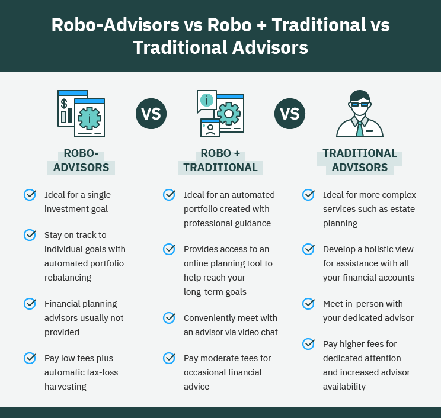

## Table of Contents

## What are online brokers and robo-advisors?

Online brokers are companies that let you buy and sell investments like stocks, bonds, and mutual funds over the internet. They usually charge lower fees than traditional brokers because they don't have physical offices. You can manage your investments yourself using their websites or apps. This gives you more control over your money, but it also means you need to do your own research and make your own decisions.

Robo-advisors are a type of online investment service that uses computer algorithms to manage your money for you. They ask you about your financial goals and how much risk you're willing to take, then they automatically invest your money in a diversified portfolio. Robo-advisors are usually cheaper than human financial advisors and are a good option if you want a hands-off approach to investing. They do the work for you, but you have less control over the specific investments.

## How do online brokers and robo-advisors differ in terms of services offered?

Online brokers give you a platform where you can buy and sell things like stocks, bonds, and mutual funds on your own. They have websites or apps that let you manage your investments anytime you want. You can choose exactly what you want to invest in and when to buy or sell. They might also offer tools to help you research and make decisions, like stock charts and analysis reports. However, you need to do all the work yourself, which means you need to know a bit about investing or be willing to learn.

Robo-advisors, on the other hand, take care of your investments for you. You tell them your goals and how much risk you're okay with, and they use computer programs to pick and manage your investments. They usually put your money into a mix of different investments to spread out the risk. Robo-advisors are good if you don't want to spend time managing your money, but you'll have less say in what specific investments are chosen. They often cost less than hiring a human advisor, making them a good choice for people who want an easy, hands-off way to invest.

## What are the typical fees associated with using online brokers versus robo-advisors?

Online brokers usually charge fees in different ways. The main one is called a commission, which is a small amount of money they take every time you buy or sell something like a stock or a bond. Some brokers have moved to a "no-commission" model, so you don't pay to trade, but they might make money in other ways, like charging for account maintenance or taking a small part of the interest on uninvested cash. Overall, the fees with online brokers can vary a lot, but they're often lower than what you'd pay with a traditional broker.

Robo-advisors work differently. They usually charge a percentage of the money you have invested with them, often called an "assets under management" fee. This fee might be around 0.25% to 0.50% per year, but it can be more or less depending on the robo-advisor. For example, if you have $10,000 invested and the fee is 0.25%, you'd pay $25 a year. Robo-advisors don't usually charge you every time you buy or sell, so their fees are more predictable and often cheaper than hiring a human financial advisor.

## How do the investment options vary between online brokers and robo-advisors?

Online brokers give you a lot of choices for what you can invest in. You can pick from stocks, bonds, mutual funds, exchange-traded funds (ETFs), and sometimes even things like options and futures. This means you can build your own investment plan and choose exactly what you want to buy or sell. If you like having control and want to invest in specific companies or industries, an online broker is a good choice. However, with so many options, you'll need to do your own research and understand what you're investing in.

Robo-advisors, on the other hand, usually don't let you pick your investments one by one. Instead, they use computer programs to put your money into a mix of investments that match your goals and how much risk you're okay with. This mix often includes ETFs and sometimes mutual funds. Robo-advisors focus on spreading your money across different types of investments to reduce risk. So, if you want a simple, hands-off way to invest without choosing each investment yourself, a robo-advisor is a good fit.

## What level of user control is available with online brokers compared to robo-advisors?

Online brokers give you a lot of control over your investments. You can pick exactly which stocks, bonds, or funds you want to buy or sell. You decide when to make these trades and how much money to put into each investment. This means you can tailor your investment strategy to what you think will work best for you. However, having this much control also means you need to do your own research and understand the market, which can be a lot of work.

Robo-advisors offer much less control but make things easier for you. You tell them your financial goals and how much risk you're comfortable with, and they handle the rest. They use computer programs to choose and manage your investments, usually spreading your money across different types of funds to keep things balanced. If you want a simple way to invest without having to make all the decisions yourself, robo-advisors are a good choice. But if you want to pick specific investments, you'll need to go with an online broker.

## How does the user experience differ between online brokers and robo-advisors?

Using an online broker is like being the captain of your own investment ship. You get to decide everything, from which stocks or funds to buy, to when to buy or sell them. Their websites or apps are usually set up to give you all the tools you need to make these decisions, like charts, research reports, and real-time market data. It can feel a bit overwhelming at first because there are so many choices and you need to keep an eye on your investments. But if you like being in charge and making your own investment moves, you'll find the experience rewarding.

On the other hand, using a robo-advisor is more like having an autopilot for your investments. You tell them what you want to achieve and how much risk you're okay with, and they do the rest. Their platforms are usually simpler and easier to use because you don't need to make as many decisions. You just set it up and check in now and then to see how things are going. This can be a relief if you don't want to spend a lot of time managing your money, but it might feel like you're not in control if you like to make your own investment choices.

## What are the minimum investment requirements for online brokers and robo-advisors?

Online brokers usually don't have a big minimum amount you need to start investing. Some let you open an account with no money at all, but you'll need some money to actually buy stocks or funds. The amount you need can be as little as $1 or $5 for some brokers, but it can be more if you want to buy certain types of investments. It really depends on the broker and what you want to invest in. So, if you're just starting out, you can find an online broker that fits your budget.

Robo-advisors often have a higher minimum amount you need to start with. This can be anywhere from $500 to $5,000, depending on the robo-advisor. They need this minimum to spread your money across different investments and manage it well. If you don't have a lot of money to start with, you might need to save up a bit before you can use a robo-advisor. But once you meet their minimum, they'll handle your investments for you, making it easier to invest without a lot of work.

## How do online brokers and robo-advisors handle tax strategies and optimization?

Online brokers usually don't do much to help you with tax strategies on their own. You have to manage your own investments, which means you need to think about taxes yourself. You can use tools they offer, like tax loss harvesting, where you sell investments at a loss to offset gains and lower your taxes. But it's up to you to decide when and how to use these strategies. If you're not sure about taxes, you might need to talk to a tax advisor or do some research on your own.

Robo-advisors often include some tax optimization in their services. They use computer programs to manage your investments, and part of that can include strategies like tax loss harvesting. They do this automatically, so you don't have to think about it. This can help you save on taxes without having to do the work yourself. However, the level of tax optimization can vary between different robo-advisors, so it's good to check what they offer before you choose one.

## What kind of customer support can users expect from online brokers versus robo-advisors?

Online brokers usually offer customer support through different ways like phone calls, emails, and live chat. Some might even have a help center with lots of articles and videos to help you learn. But, because they have so many users, you might have to wait a bit to get help, especially if you call during busy times. If you like to talk to someone when you have questions or problems, make sure to pick a broker that has good customer support.

Robo-advisors often have less personal customer support because they're set up to work automatically. You can usually reach them by email or through a chat on their website, but they might not have a phone number you can call. Some robo-advisors have help sections with guides and FAQs, but if you need help with something specific, you might have to wait longer for a response. If you're okay with less direct help and like things to be simple and automatic, a robo-advisor could still be a good choice for you.

## How do the performance and returns of online brokers compare to those of robo-advisors?

The performance and returns of online brokers depend a lot on the choices you make as an investor. Since you're in control, you pick the stocks, bonds, or funds you want to invest in. If you make good choices and the market does well, you could see higher returns. But if your picks don't do well, your returns might be lower. Online brokers give you the freedom to aim for high returns, but it also means you take on more risk because you're making all the decisions yourself.

Robo-advisors, on the other hand, aim for steady, long-term growth rather than big, quick wins. They use computer programs to spread your money across different investments to reduce risk. Because of this, the returns from robo-advisors might not be as high as what you could get from [picking](/wiki/asset-class-picking) the right investments with an online broker. But they're usually more consistent and less risky. If you want a safer way to invest without having to pick each investment yourself, robo-advisors can be a good choice.

## What security measures are in place for accounts with online brokers and robo-advisors?

Online brokers use strong security measures to keep your money and information safe. They usually have things like two-[factor](/wiki/factor-investing) authentication, which means you need more than just a password to get into your account. They also use encryption to protect your data when it's being sent over the internet. Plus, they watch for anything unusual, like someone trying to log in from a new place or making a lot of trades all at once, and they'll let you know if something seems off. It's a good idea to use strong passwords and be careful about where you click or what information you give out to stay even safer.

Robo-advisors also take security seriously. They use the same kinds of tools as online brokers, like two-factor authentication and encryption, to keep your account secure. They keep an eye on your account for anything strange and will alert you if they see something that doesn't look right. Because robo-advisors handle everything automatically, they make sure their systems are safe from hackers. Just like with online brokers, it's smart to use strong passwords and be careful online to help keep your robo-advisor account safe.

## How do regulatory compliance and investor protection differ between online brokers and robo-advisors?

Both online brokers and robo-advisors have to follow rules set by government agencies like the Securities and Exchange Commission (SEC) in the U.S. These rules are there to make sure your money is safe and that the companies are honest about what they're doing with your investments. Online brokers need to follow these rules just like traditional brokers. They have to keep your money separate from their own, give you clear information about fees and risks, and make sure you can get your money back when you want it. If something goes wrong, you might be protected by things like the Securities Investor Protection Corporation (SIPC), which can help if the broker goes out of business.

Robo-advisors also have to follow the same kinds of rules to protect you. They need to be clear about how they manage your money and what fees they charge. They have to make sure your investments are safe and that you can get your money when you need it. Like online brokers, robo-advisors are often covered by the SIPC, which can help if the company fails. The main difference is that robo-advisors use computer programs to manage your money, so they also have to make sure those programs follow the rules and work correctly. This means they need to test their systems a lot and make sure they're always up to date with the latest rules.

## References & Further Reading

[1]: ["The Bogleheads' Guide to Investing"](https://www.amazon.com/Bogleheads-Guide-Investing-Mel-Lindauer/dp/1119847672) by Taylor Larimore, Mel Lindauer, and Michael LeBoeuf

[2]: ["A Random Walk Down Wall Street: The Time-Tested Strategy for Successful Investing"](https://yourknowledgedigest.org/wp-content/uploads/2020/04/a-random-walk-down-wall-street.pdf) by Burton G. Malkiel

[3]: ["The Intelligent Investor: The Definitive Book on Value Investing"](https://www.amazon.com/Intelligent-Investor-Third-Definitive-Investing/dp/0063423537) by Benjamin Graham

[4]: ["Common Sense on Mutual Funds: New Imperatives for the Intelligent Investor"](https://www.amazon.com/Common-Sense-Mutual-Funds-Imperatives/dp/0471392286) by John C. Bogle

[5]: ["Robo-Advisors: Investing Through Algorithms"](https://www.amazon.com/Robo-Advisors-Algorithms-Mrs-Ravneet-Kaur/dp/B0DK8DBFTC) by CFA Institute

[6]: Barberis, N., & Thaler, R. (2003). ["A Survey of Behavioral Finance"](https://www.semanticscholar.org/paper/A-Survey-of-Behavioral-Finance-Barberis-Thaler/a4ab7d7161deac0f532d121b1614cf7b97d90e78) National Bureau of Economic Research

[7]: Menkhoff, L., Sarno, L., Schmeling, M., & Schrimpf, A. (2012). ["Currency Momentum Strategies"](https://papers.ssrn.com/sol3/papers.cfm?abstract_id=1809776) The Review of Financial Studies

[8]: Jagannathan, R., & Ma, T. (2003). ["Risk Reduction in Large Portfolios: Why Imposing the Wrong Constraints Helps"](https://www.jstor.org/stable/3648224) The Journal of Finance