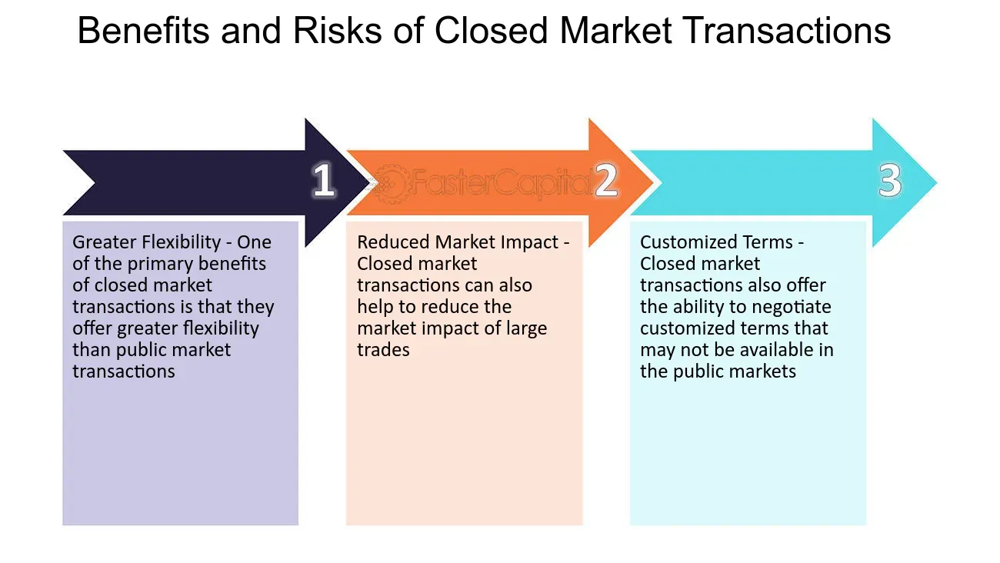

## Table of Contents

## What is an open-market transaction?

An open-market transaction is when a company buys or sells its own shares on the stock market, just like any other investor. This happens on a public stock exchange where anyone can see the trades. Companies might do this for different reasons, like wanting to buy back their own shares to increase the value of the remaining shares or to have shares available for employee stock options.

These transactions are important because they can affect the stock price and show what the company thinks about its own future. If a company buys back its shares, it might mean they believe the stock is a good investment. On the other hand, if they sell shares, it could mean they need money for something else. Open-market transactions are watched closely by investors because they can give clues about the company's plans and financial health.

## What is a closed-market transaction?

A closed-market transaction is when a company buys or sells its own shares, but it's not done on the public stock exchange. Instead, it happens privately, away from the eyes of the general public. This means only certain people know about the trade, and it's not open for everyone to see or participate in.

Companies might choose to do closed-market transactions for many reasons. For example, they might want to sell shares to a specific investor or group without affecting the public stock price. Or, they might want to buy back shares from a big shareholder without causing a stir in the market. Because these transactions are private, they don't influence the stock price in the same way open-market transactions do, and they can be used for strategic purposes that the company wants to keep under wraps.

## How do open-market and closed-market transactions differ?

Open-market transactions happen when a company buys or sells its own shares on a public stock exchange, where everyone can see the trades. This is like shopping in a big, open store where anyone can come in and see what's happening. When a company does this, it can affect the stock price because everyone knows about it. For example, if a company buys back its shares, it might make the stock price go up because it shows the company believes in its future. But if they sell shares, it could make the price go down because it might look like they need money.

Closed-market transactions are different because they happen privately, away from the public eye. It's like shopping in a private room where only a few people are allowed. In these transactions, a company might buy or sell shares to specific people or groups without the whole world knowing. This means the stock price usually doesn't change right away because the public doesn't see the trade. Companies might do this to keep their plans secret or to avoid affecting the stock price until they're ready.

Both types of transactions are important, but they serve different purposes. Open-market transactions are more transparent and can signal to investors what the company thinks about its future. Closed-market transactions are more secretive and can be used for strategic moves that the company wants to keep quiet for a while.

## What are the main advantages of open-market transactions?

Open-market transactions have some big advantages. One big plus is that they are very open and clear. When a company buys or sells its own shares on the public stock exchange, everyone can see what's happening. This openness helps build trust with investors because they know exactly what the company is doing. It's like everyone is shopping in the same big store, and no one is hiding anything. This transparency can make investors feel more confident about the company's future.

Another advantage is that open-market transactions can help set the stock price in a fair way. When a company buys back its shares, it can make the stock price go up because it shows the company believes in itself. On the other hand, if they sell shares, it can give a signal to the market about what the company needs or plans to do. This can help keep the stock price honest and reflect what's really going on with the company. It's like the stock price is a big sign that everyone can read and understand.

## What are the primary benefits of closed-market transactions?

Closed-market transactions help companies keep their plans secret. When a company wants to buy or sell its shares without everyone knowing, it can do this in private. This means they can make big moves without causing a stir in the market right away. For example, if a company wants to sell shares to a big investor without scaring off other investors, a closed-market transaction lets them do that quietly. This secrecy can be really helpful for making strategic plans that need to stay under wraps until the right time.

Another benefit of closed-market transactions is that they don't affect the stock price right away. Because these trades happen away from the public eye, the stock price doesn't change as soon as the trade happens. This can be useful if a company wants to avoid sudden changes in the stock price that might happen if everyone knew about the trade. It's like making a quiet move in a game without letting your opponents know what you're doing, which can give the company more control over when and how the market reacts.

## Can you provide examples of open-market transactions?

A big company called Apple might decide to buy back its own shares on the stock market. They think their stock is a good deal, so they start buying shares just like any other investor would. Everyone can see this happening because it's on the public stock exchange. When Apple does this, it can make the stock price go up because people see that Apple believes in its future. It's like Apple is saying, "We think our stock is worth more than what it's selling for, so we're buying it back."

Another example is when a company like Ford needs to raise money. They might sell some of their shares on the open market. This means they're putting their shares up for sale on the public stock exchange, and anyone can buy them. When Ford does this, it can make the stock price go down a bit because it looks like they need money. But it's all out in the open, so everyone knows what's going on. It's like Ford is saying, "We need some cash, so we're selling some of our shares to anyone who wants to buy them."

## Can you give examples of closed-market transactions?

A company called Tesla might want to sell some shares to a big investor like a pension fund, but they don't want everyone to know about it yet. So, they do a closed-market transaction. They sell the shares privately to the pension fund, away from the public stock exchange. This way, the stock price doesn't change right away because no one else knows about the trade. Tesla can keep their plans secret and make the big investor happy without causing a stir in the market.

Another example is when a company like Google wants to buy back some of its shares from a big shareholder, like a founder or an early investor. They might do this through a closed-market transaction to keep things quiet. Google would talk to the shareholder and agree on a price, then buy the shares without telling everyone. This helps Google control the stock price and keep their strategy hidden until they're ready to share it with the world.

## How do regulations affect open-market and closed-market transactions?

Regulations play a big role in how companies can do open-market and closed-market transactions. For open-market transactions, there are rules that make sure everything is fair and clear. Companies have to follow strict rules about when and how they can buy or sell their own shares on the public stock exchange. For example, they might need to tell everyone before they start buying back shares, so investors know what's happening. These rules help keep the market honest and make sure that everyone has the same information. If a company doesn't follow these rules, they could get in big trouble with the people who watch over the stock market.

Closed-market transactions also have to follow rules, but they can be a bit different because they happen in private. Companies still need to make sure they're not breaking any laws when they buy or sell shares away from the public eye. For example, they might need to report these transactions to the people who watch over the market, even if it's not open for everyone to see. These rules help make sure that closed-market transactions are used the right way and not to trick investors. If a company doesn't follow the rules for closed-market transactions, they could also face penalties and lose trust from investors.

## What role do intermediaries play in open and closed markets?

In open markets, intermediaries like stockbrokers and investment banks help companies buy or sell their own shares. They act like helpers who make sure the trades happen smoothly on the public stock exchange. When a company wants to buy back its shares, the intermediary will place the orders and follow the rules to make sure everything is done right. This helps keep the market fair and clear for everyone. Intermediaries also give advice to companies about the best times and ways to do these transactions, so the company can make smart choices that help their stock price and keep investors happy.

In closed markets, intermediaries play a different but important role. They help set up private deals between the company and specific investors or shareholders. For example, if a company wants to sell shares to a big investor without telling everyone, the intermediary will work behind the scenes to make sure the deal is done correctly and follows the rules. They help keep the transaction secret until it's time to tell the public. Intermediaries also make sure that the price and terms of the deal are fair for both the company and the investor. This way, the company can make strategic moves without causing a big fuss in the market.

## How do liquidity and pricing differ between open and closed markets?

In open markets, [liquidity](/wiki/liquidity-risk-premium) is usually high because lots of people can buy and sell shares. It's like a big, busy store where there are always people ready to trade. This means that companies can easily buy back their shares or sell new ones without waiting too long. The price of shares in open markets can change quickly because everyone can see what's happening. If a company starts buying back its shares, the price might go up because it looks like the company believes in its future. But if they sell shares, the price might go down because it looks like they need money.

In closed markets, liquidity can be lower because only a few people are involved in the trades. It's like a private room where only certain people are allowed to shop. This means it can take longer for a company to buy or sell shares because they have to find the right person to trade with. The price of shares in closed markets doesn't change right away because the trades are secret. When a company does a closed-market transaction, they can set the price with the other person without everyone knowing, which can help them keep the stock price steady until they're ready to tell the public.

## What are the risks associated with participating in open-market transactions?

One risk of open-market transactions is that the stock price can change a lot. When a company buys or sells its own shares on the public stock exchange, everyone can see it. This can make the stock price go up or down quickly. If a company starts buying back its shares, it might make the price go up because people think the company believes in its future. But if the company sells shares, it could make the price go down because it looks like they need money. This can be scary for investors who don't like big changes in the stock price.

Another risk is that other investors might not like what the company is doing. If a company buys back its shares, some investors might think it's a good sign and buy more shares too. But other investors might think the company is just trying to make the stock price go up for a short time and not really making the company better. If a company sells shares, some investors might think it's a bad sign and sell their shares too, which can make the stock price go down even more. So, open-market transactions can make some investors happy and others unhappy, which can be risky for the company.

## What advanced strategies can be employed in closed-market transactions to maximize benefits?

One advanced strategy in closed-market transactions is to use them for strategic partnerships. A company might want to sell shares to another company or a big investor who can help them grow. By doing this in private, the company can keep their plans secret until they're ready to share them with the world. This can help them build a strong relationship with the new partner without causing a big change in the stock price right away. It's like making a secret deal that can help the company get bigger and stronger without everyone knowing about it yet.

Another strategy is to use closed-market transactions to manage the stock price carefully. If a company wants to buy back shares from a big shareholder, like a founder or an early investor, they can do it privately. This way, they can control when and how the market finds out about the trade. The company can set a good price with the shareholder and keep the stock price steady until they're ready to tell everyone. This can be really helpful if the company wants to avoid sudden changes in the stock price that might scare off other investors. It's like quietly making a move that helps the company keep things calm and under control.

## References & Further Reading

To gain deeper insights into the intricacies of [algorithmic trading](/wiki/algorithmic-trading), market regulations, and financial strategies, a wealth of resources is available for further exploration. For those interested in the technical and strategic aspects of algorithmic trading, "Algorithmic Trading & DMA: An introduction to direct access trading strategies" by Barry Johnson is an authoritative guide. This work intricately discusses a broad range of strategies, exemplified by clear explanations and illustrative graphs, which can be foundational for both beginners and seasoned practitioners. 

In terms of understanding the regulatory landscape, the Securities and Exchange Commission (SEC) provides comprehensive guidelines and materials on US market regulations. The SEC's own website is a primary resource, offering access to federal securities laws and regulations [1]. Additionally, the book "Regulation of Securities: SEC Answer Book" by Steven Mark Levy provides practical insights and navigational tools for compliance with these regulations.

For comprehensive coverage on financial strategies and market structure analysis, "Trading and Exchanges: Market Microstructure for Practitioners" by Larry Harris is a seminal text. It gives readers a broad understanding of how trading processes work within markets, breaking down complex concepts into digestible sections, supplemented by real-world examples.

Furthermore, academic journals such as the "Journal of Finance" and "Journal of Financial Markets" frequently publish papers on cutting-edge research in these areas, offering valuable theoretical and empirical perspectives. Papers such as "The Role of Algorithmic Trading in Stock Market Liquidity" provide quantitative analyses and are invaluable for those seeking to understand the impacts of technological advancements in trading.

Each of these resources contributes to a well-rounded understanding of the dynamics at play within financial markets, offering both foundational knowledge and advanced insights.

**References:**  
[1] U.S. Securities and Exchange Commission. (n.d.). Laws and regulations. Retrieved from [https://www.sec.gov/laws/regulations](https://www.sec.gov/laws/regulations).

