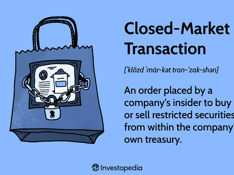

In the dynamic world of financial markets, grasping various transaction types and trading strategies is paramount for participants aiming to optimize their investment decisions. Financial markets consist of a wide array of components, each playing a crucial role in influencing market behavior and outcomes. Among these components, open-market transactions, closed-market transactions, and algorithmic trading are particularly significant.

Open-market transactions occur when company insiders, such as executives or board members, engage in buying or selling shares of their own company on the open stock market. These transactions are noteworthy for their transparency, as they are publicly disclosed and subject to regulations by entities like the U.S. Securities and Exchange Commission (SEC). Investors often scrutinize open-market transactions to infer insider sentiment about the company's future prospects.



In contrast, closed-market transactions are private exchanges typically involving pre-arranged agreements directly between the insider and the company. These transactions often relate to compensation packages, including stock options and restricted stock units, and do not necessarily indicate the insider's market sentiment. Understanding the distinction between these two transaction types is vital for accurate market assessments.

Algorithmic trading, a modern approach utilizing advanced algorithms, automates market transactions and is known for its speed, precision, and reliance on data to guide decision-making. This form of trading enables participants to minimize emotional biases, which often impact human traders. Furthermore, algorithmic trading plays a significant role in both open and closed-market transactions, facilitating efficient execution and creating opportunities for arbitrage.

This article aims to dissect these components by offering a comparative analysis of open-market and closed-market transactions, highlighting the strategic implications of each. It will also explore the opportunities algorithmic trading presents, emphasizing how this technology can enhance market participation and trading strategies. Through a thorough examination of these aspects, investors can make informed decisions that leverage the nuances of different market transactions and the innovations provided by algorithmic trading.

## Table of Contents

## Understanding Open-Market Transactions

Open-market transactions are a type of securities transaction where corporate insiders, which include a company's executives, directors, or employees who possess non-public information, buy or sell shares of their own company's stock on the open stock market. These transactions occur on public exchanges such as the New York Stock Exchange (NYSE) or NASDAQ and are characterized by transparency as they are reported to the U.S. Securities and Exchange Commission (SEC).

**Transparency and SEC Regulations**

The SEC mandates that insiders must report their open-market transactions to maintain transparency and prevent illegal insider trading. Specifically, insiders are required to file forms such as Form 4 within two business days of conducting a trade. This regulatory framework is instrumental in ensuring that all market participants have access to critical information regarding insider trading activities, fostering a fair market environment. Such transparency allows investors to discern the buying and selling activities of those closest to the company, often viewed as informed market participants.

**Insider Sentiment Analysis**

The analysis of open-market transactions provides investors with insights into insider sentiment, offering potential signals about a company's future prospects. When insiders purchase their company's stock, it may indicate their confidence in the company's growth potential or financial health. Conversely, significant insider selling could be perceived as a lack of confidence, though it is essential to note that sales may occur for various reasons, such as personal financial planning, and do not always reflect negative sentiment. Investors often incorporate this data into their broader market analysis strategies to optimize portfolio decisions.

In summary, open-market transactions are pivotal in maintaining market transparency and allow investors to infer insider confidence levels. These transactions are closely monitored, not only for regulatory compliance but also for the valuable insights they offer into a company's anticipated performance.

## Exploring Closed-Market Transactions

Closed-market transactions represent a specific kind of transaction that occurs privately between a company's insiders and the company itself. Unlike open-market transactions, which are executed on public exchanges and provide transparency, closed-market transactions often remain insulated from public scrutiny due to their nature and purpose. These transactions typically involve the transfer of equity through compensation packages, including stock options, restricted stock units (RSUs), or direct share allotments as part of executive remuneration.

A crucial aspect of closed-market transactions is their lack of direct indication toward insider sentiment about the company's future performance. Since these trades often stem from contractual obligations or planned compensation schemes, they do not serve as proactive decisions based on perceived market conditions or company prospects. Thus, these transactions do not exhibit the same informative value regarding insider confidence or concerns as open-market purchases, which insiders conduct with their funds.

Understanding the intricacies of closed-market transactions is pivotal for accurate market analysis. Investors and analysts must recognize that closed-market transactions primarily reflect compensation strategies rather than strategic buy or sell signals. By differentiating these transactions from open-market activities, analysts can avoid misleading interpretations of insider trading data, which are often used to predict stock movements or assess company health.

In the context of corporate governance, closed-market transactions reveal much about a company's compensation culture and the alignment of executive incentives with shareholder interests. These transactions can impact the overall supply of shares, thereby influencing stock prices indirectly. Therefore, while they may not serve as insider sentiment indicators, closed-market transactions hold significance in assessing executive alignment and the potential dilution effects on existing shareholders.

In conclusion, effective market analysis requires a clear understanding of closed-market transactions, acknowledging their purpose and limitations in signaling insider sentiment. By properly categorizing and interpreting these transactions, investors can gain a more nuanced view of insider activities and their implications for market dynamics.

## Algorithmic Trading: A Modern Approach

Algorithmic trading leverages sophisticated algorithms to automate market transactions, transforming the trading landscape by introducing unparalleled speed and precision. At its core, [algorithmic trading](/wiki/algorithmic-trading) involves utilizing computational programs to make trading decisions and execute orders based on pre-defined criteria. This modern approach minimizes the cognitive biases and emotional influences that can cloud human judgement, allowing for more rational and objective decision-making.

One of the primary advantages of algorithmic trading is its ability to rapidly process vast amounts of financial data. By analyzing real-time data streams and historical market information, algorithms can identify trading opportunities that might be missed by traditional manual processes. This analytical capability enables traders to capitalize on these opportunities with precision, facilitating efficient market entry and [exit](/wiki/exit-strategy) points.

In open-market transactions, algorithmic trading can enhance the monitoring of insider buying activities, which are often indicative of future stock performance. Algorithms are programmed to track patterns of insider trading, thereby providing insights into market trends and potential valuation shifts. This ability to process and analyze insider activities at speed adds a layer of strategic depth for traders looking to preemptively align their portfolios with emerging market movements.

Furthermore, the role of algorithmic trading in closed-market transactions is significant. While these transactions typically involve compensation arrangements and lack immediate market sentiment signals, algorithms can optimize trade execution timing based on compensation-linked trading patterns. By understanding the periodicity and [volume](/wiki/volume-trading-strategy) of closed transactions, algorithms can help optimize timing to maximize returns or minimize costs, providing a strategic edge in managing transaction flows.

A notable feature of algorithmic trading is its ability to facilitate [arbitrage](/wiki/arbitrage) opportunities. By exploiting small price differentials across different markets or securities, algorithms can execute trades that capitalize on these discrepancies before they vanish. The speed of execution and the breadth of market coverage available in algorithmic trading make it an effective tool for arbitrage strategies.

In summary, algorithmic trading offers a substantial improvement in the efficiency, speed, and analysis accuracy of market transactions. It underscores the technological advancement in the trading mechanisms that empower traders to make informed and timely decisions, thereby enhancing overall investment strategies. Through the integration of data-driven insights and strategic execution capabilities, algorithmic trading plays a pivotal role in modern financial markets.

## Market Comparison: Open vs. Closed Transactions

Open-market transactions and closed-market transactions are two distinct modalities through which insiders engage with the stock market, and understanding the nuances between them is crucial for making informed investment decisions.

Open-market transactions, carried out by corporate insiders such as executives or significant shareholders, occur on the public stock exchange. These trades are typically voluntary and provide transparency due to regulatory obligations, such as those imposed by the U.S. Securities and Exchange Commission (SEC). Insiders must report these transactions, offering investors insights into their perception of the company’s future prospects. For instance, a spate of insider buying might indicate confidence in the company’s impending success.

In contrast, closed-market transactions generally involve non-public exchanges directly between the insider and the company. These often include stock options and restricted stock units offered as part of executive compensation packages. While providing insight into how a company's leadership is rewarded, they do not necessarily signal the insider's perspective on the firm’s financial health or market trajectory. Instead, they serve more as mechanisms for aligning the interests of the management with shareholders.

A comparison between open-market and closed-market transactions reveals significant differences in terms of market sentiment and usage. Open-market transactions are often more reflective of true market sentiment because they represent the freely made decisions of insiders reacting to market conditions. Conversely, closed-market transactions are more related to corporate governance and employee compensation strategies and are less indicative of an insider’s personal views on the stock’s future performance.

Investors can leverage these transactions by considering the distinct advantages of each. Open-market activities can serve as a barometer for insider confidence and potential stock price movements, assisting in portfolio adjustments. Conversely, understanding closed-market transactions enables investors to assess company policies on executive compensation and potential stock dilution effects. 

In summary, effective portfolio management involves differentiating and interpreting the signals from both open and closed-market transactions. While open-market transactions can offer viable indications of market sentiment, closed-market deals primarily illuminate corporate governance practices rather than insider expectations of stock performance. This nuanced understanding informs strategic decisions and helps optimize investment outcomes.

## Integrating Algo Trading with Market Transactions

Algorithmic trading plays a crucial role in enhancing the efficiency and effectiveness of both open-market and closed-market transactions. By leveraging advanced algorithms, investors can gain actionable insights and optimize trading strategies to achieve better financial outcomes. 

In open-market transactions, algorithms offer the capability to meticulously track insider buying activities, providing vital signals that indicate broader market trends. For example, algorithms designed to parse large datasets can identify patterns in insider trading activities, allowing investors to make informed decisions based on potential market sentiment shifts. These algorithms can process vast amounts of transactional data, help in identifying anomalies, or confirm trends that human analysts might overlook due to the sheer volume of information involved.

```python
import pandas as pd

# Example dataset of insider transactions
data = {
    'Insider': ['Insider A', 'Insider B', 'Insider C'],
    'TransactionType': ['buy', 'buy', 'sell'],
    'Shares': [1000, 2000, 1500],
    'Price': [10, 15, 12]
}
df = pd.DataFrame(data)

# Example calculation of the total value of buys
total_buy_value = df[df['TransactionType'] == 'buy']['Shares'] * df[df['TransactionType'] == 'buy']['Price']
total_buy_value.sum()
```

In closed-market transactions, algorithmic trading offers opportunities to assess compensation-linked trading patterns. Here, the algorithms can optimize the timing for trades by evaluating the predictable nature of compensation-related stock movements. For instance, if it is determined that certain transactions typically occur in conjunction with quarterly earnings or bonus announcements, algorithms can prepare optimized trading strategies around these events to capitalize on anticipated market movements.

Besides tracking and timing, algorithms can execute trades at speeds and efficiencies beyond human capability, thereby minimizing the risk associated with market fluctuations. Their ability to adapt strategy on-the-fly using real-time data ensures that both open-market and closed-market transactions are executed with precision, ultimately improving the robustness of investment strategies. Thus, integrating algorithmic trading into market transactions transforms traditional investing techniques, enabling investors to respond to market dynamics more effectively.

## Advantages and Risks of Algorithmic Trading

Algorithmic trading, often referred to as algo trading, presents considerable advantages by leveraging computational algorithms to automate and enhance trading strategies. A key advantage is the rapid execution of trades, which allows market participants to capitalize on fleeting market opportunities that manual processes might miss. Algorithms can process vast datasets much quicker than humans, enabling real-time decision-making that is both precise and efficient. This computational prowess reduces human errors and emotional trading biases, potentially increasing the accuracy and profitability of trades.

Additionally, algorithmic trading allows for strategic precision, whereby traders can rigorously backtest strategies against historical data to ascertain their expected performance before deployment in real markets. This pre-deployment testing optimizes strategy parameters and fine-tunes execution tactics, ensuring the trading approach caters to specific objectives and market conditions.

However, like any technological advancement, algo trading carries inherent risks. One major risk is over-optimization, often called "curve fitting." This occurs when a strategy is excessively tailored to historical data, resulting in excellent past performance but poor adaptability in live markets where conditions differ from the past. Over-optimized models may fail to account for market [volatility](/wiki/volatility-trading-strategies), changes in asset [liquidity](/wiki/liquidity-risk-premium), or unexpected economic events, which can lead to substantial losses. 

Moreover, algorithmic trading systems are susceptible to both technological and market-related risks. On the technology front, there might be risks associated with latency, connectivity issues, data feed errors, and software bugs. Ensuring the reliability and robustness of technological infrastructure is crucial to mitigate these risks. Market risks include the potential for amplification of systemic disturbances, as algorithms can generate rapid large-scale trades, contributing to severe market anomalies, such as flash crashes.

Before deploying algorithmic strategies, it's vital to thoroughly evaluate technology infrastructure readiness. This includes robust systems for connectivity, data handling, execution efficiency, and compliance monitoring to align with regulatory standards. Implementing risk management protocols, such as stop-loss limits and diversification, can further safeguard against potential pitfalls, balancing the pursuit of gains with prudent risk management.

In conclusion, while algorithmic trading enhances trading efficiency and strategic precision, it necessitates cautious balance against potential risks. By ensuring technology readiness and judicious risk management, traders can harness the full potential of algorithmic trading while safeguarding against its inherent challenges.

## Conclusion

In the dynamic environment of financial markets, a nuanced understanding of open-market and closed-market transactions can provide investors with strategic insights for optimizing their investment portfolios. Open-market transactions, often reflective of insider sentiment, offer transparency and market signals that are highly valued by investors looking to discern the underlying market dynamics. These transactions allow investors to infer potential future performance based on the buying or selling behaviors of company insiders, who may have intimate knowledge of the firm’s prospects.

Closed-market transactions, on the other hand, usually take place within the confines of the company and often relate to compensation agreements such as stock options or restricted stock units. While these transactions might not directly indicate market sentiment, they serve essential roles in corporate strategy and reward systems. A keen understanding of these transactions allows investors to appreciate their implications on a company's financial health and insider incentives.

Algorithmic trading stands out as a formidable tool for enhancing investment strategy, leveraging vast datasets and sophisticated computational techniques to execute trades with speed and precision. This technological approach minimizes the psychological biases that may accompany manual trading and provides opportunities to exploit market inefficiencies. For instance, algorithms can be programmed to detect patterns of insider trading within open-market transactions that signal advantageous entry or exit points in the market.

By integrating algorithmic trading with market transaction analyses, investors can develop comprehensive strategies that maximize returns while mitigating risks. This involves maintaining an awareness of both technological capabilities and market regulations. Informed decisions, grounded in a thorough understanding of transaction types combined with algorithmic insights, can significantly enhance investment outcomes. Employing a strategic approach that combines human oversight with the precision of algorithms ensures a well-rounded investment strategy that not only responds to but anticipates market movements.

## References & Further Reading

To gain deeper insights into the intricacies of algorithmic trading, market regulations, and financial strategies, a wealth of resources is available for further exploration. For those interested in the technical and strategic aspects of algorithmic trading, "Algorithmic Trading & DMA: An introduction to direct access trading strategies" by Barry Johnson is an authoritative guide. This work intricately discusses a broad range of strategies, exemplified by clear explanations and illustrative graphs, which can be foundational for both beginners and seasoned practitioners. 

In terms of understanding the regulatory landscape, the Securities and Exchange Commission (SEC) provides comprehensive guidelines and materials on US market regulations. The SEC's own website is a primary resource, offering access to federal securities laws and regulations [1]. Additionally, the book "Regulation of Securities: SEC Answer Book" by Steven Mark Levy provides practical insights and navigational tools for compliance with these regulations.

For comprehensive coverage on financial strategies and market structure analysis, "Trading and Exchanges: Market Microstructure for Practitioners" by Larry Harris is a seminal text. It gives readers a broad understanding of how trading processes work within markets, breaking down complex concepts into digestible sections, supplemented by real-world examples.

Furthermore, academic journals such as the "Journal of Finance" and "Journal of Financial Markets" frequently publish papers on cutting-edge research in these areas, offering valuable theoretical and empirical perspectives. Papers such as "The Role of Algorithmic Trading in Stock Market Liquidity" provide quantitative analyses and are invaluable for those seeking to understand the impacts of technological advancements in trading.

Each of these resources contributes to a well-rounded understanding of the dynamics at play within financial markets, offering both foundational knowledge and advanced insights.

**References:**  
[1] U.S. Securities and Exchange Commission. (n.d.). Laws and regulations. Retrieved from [https://www.sec.gov/laws/regulations](https://www.sec.gov/laws/regulations).

