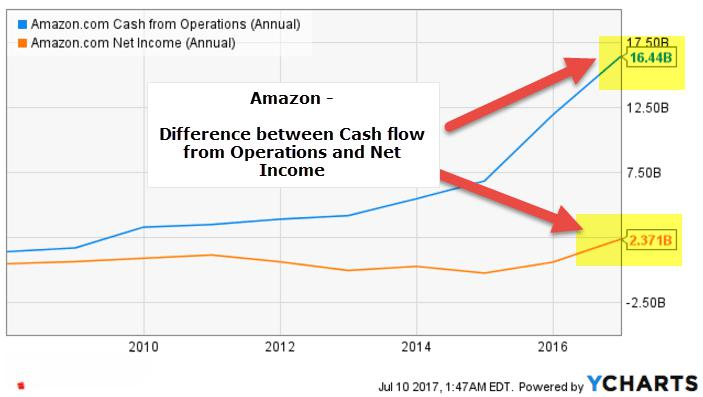

Operating cash flow is a critical component in assessing a company's financial performance. It represents the cash generated by a company's core business operations, excluding financing and investing activities. This metric provides insight into a company's ability to generate sufficient cash to maintain operations, pay debts, and fund future growth. Unlike net income, which is an accounting measure of profitability, operating cash flow emphasizes the liquidity aspect by focusing on the actual cash transactions. Net income is calculated according to accrual accounting conventions, which include non-cash expenses such as depreciation, and can be affected by aggressive accounting practices. Therefore, operating cash flow serves as a more transparent indicator of financial health. Companies exhibiting strong operating cash flow can often sustain operations and strategic investments, even when they report lower net income.

Algorithmic trading, or algo trading, refers to the use of computer programs and algorithms to execute trades at high speed and volume. Its growing impact on financial markets arises from the efficiency and precision with which these algorithms can process large datasets to identify trading opportunities, assess risk, and minimize transaction costs. Algorithms, which can be simple or complex, incorporate various financial metrics to make decisions, benefiting greatly from quantitative analysis. By leveraging real-time data on metrics like operating cash flow and net income, algo trading strategies improve their predictions about stock performance and market trends.

The intersection of operating cash flow, net income, and algo trading in investment strategies underscores the importance of a comprehensive approach to financial analysis. Investors use these indicators not only to evaluate company performance but also to optimize trading strategies. Operating cash flow and net income offer two different perspectives on a company’s financial standing—liquidity versus profitability—which can be pivotal inputs in algorithmic models designed to make quick, informed trading decisions. 

The purpose of this article is to explore how operating cash flow, net income, and algo trading intersect, enhancing our understanding of financial performance metrics and aiding in the development of sophisticated investment strategies. By analyzing these intersections, investors can make more informed decisions, adapting to the complexities of modern financial markets for better portfolio outcomes. Understanding these metrics allows investors to balance risks effectively and identify profitable opportunities, maximizing their chances of achieving superior market returns.

## Table of Contents

## Understanding Operating Cash Flow

Operating cash flow (OCF) is a critical financial metric that measures the cash generated by a company's core business operations. It reflects the liquidity available from routine business activities, excluding investments and financing. OCF is distinct from net income, which is defined as total revenue minus expenses, including taxes and interest. While net income is calculated on an accrual basis, OCF accounts for actual cash inflows and outflows, thus providing a clearer picture of cash availability.

One significant aspect of operating cash flow is its ability to assess a company's financial health. It indicates whether a company can generate sufficient cash to maintain or expand its operations without relying on external funding. Companies with strong operating cash flows are generally better positioned to weather economic downturns and pursue growth opportunities. For instance, a consistent positive OCF signals that a company effectively manages its working capital and operational efficiency.

Operating cash flow is one component of the broader cash flow statement, which typically includes cash flows from operating, investing, and financing activities. Investing cash flows represent the cash used for or generated from long-term investments such as property, plant, and equipment. Financing cash flows comprise cash movements related to equity, debt issuance, and dividend payments. Analyzing these components collectively helps stakeholders understand a company's overall cash position and strategy.

Examples of how operating cash flow can indicate business sustainability include its use in calculating the operating cash flow ratio, which measures a company's ability to cover its short-term liabilities with cash generated from operations. The formula for the operating cash flow ratio is:

$$
\text{Operating Cash Flow Ratio} = \frac{\text{Operating Cash Flow}}{\text{Current Liabilities}}
$$

This ratio assesses whether the company generates sufficient cash to meet its immediate financial obligations. A higher ratio suggests robust [liquidity](/wiki/liquidity-risk-premium) and operational efficiency.

Additionally, the free cash flow (FCF) is derived from operating cash flow and is a key metric for evaluating business sustainability. Free cash flow is the amount of cash left after a company covers its capital expenditures, and it is calculated as:

$$
\text{Free Cash Flow} = \text{Operating Cash Flow} - \text{Capital Expenditures}
$$

Positive free cash flow indicates that the company can invest in growth initiatives, pay down debt, or return capital to shareholders.

In summary, operating cash flow is a vital metric for understanding a company's financial health and liquidity. It provides insight into the efficiency of core business operations and is crucial for assessing sustainability. By considering operating cash flow alongside other financial metrics, investors and analysts can make more informed decisions about a company’s performance and potential.

## Net Income: An Essential Financial Metric

Net income, often referred to as the bottom line, is a crucial financial metric representing a company’s total earnings or profit. It is calculated by subtracting total expenses from total revenues. The formula for net income is:

$$
\text{Net Income} = \text{Total Revenue} - (\text{Total Expenses} + \text{Taxes} + \text{Interest})
$$

Net income serves as a primary indicator of a company's profitability over a specific period. It is a vital component of the income statement and provides insights into the efficiency of a company’s operations, cost management, and overall financial health.

While net income is integral to assessing profitability, it must be compared with other financial metrics, such as operating cash flow, to gain a fuller picture of a company’s performance. Operating cash flow, unlike net income, adjusts for non-cash items and changes in working capital, thus providing a more realistic view of the cash generated by a company’s core business operations. Where net income is bound by accounting principles that incorporate various non-cash expenses like depreciation, operating cash flow offers clarity on the cash liquidity available to sustain and grow business activities.

The reliance on net income alone can be misleading when evaluating financial performance. This is because net income can be influenced by accounting methods, one-time items, and non-cash transactions, which may not accurately reflect the company’s operational efficiency or cash-generating ability. For example, a company might report high net income alongside decreasing operating cash flow, flagging potential liquidity issues despite apparent profitability. Consequently, combining net income analysis with operating cash flow provides a balanced evaluation of financial stability.

To illustrate, consider a technology firm reporting a net income driven by significant non-cash amortization of acquired intangible assets. Although the net income appears robust, an analysis of operating cash flow may reveal underlying cash deficiencies due to high capital expenditures or depleted cash reserves for operational scaling. Such scenarios underscore the importance of integrating multiple financial metrics to avoid skewed interpretations derived solely from net income figures. Understanding this interplay is vital for investors seeking insight into the business's true economic viability.

## Algorithmic Trading and Financial Performance

Algorithmic trading, commonly referred to as algo trading, involves using computer algorithms to execute trades in financial markets with minimal human intervention. These algorithms are designed to make decisions based on established sets of rules or models that can include various market parameters, such as price, [volume](/wiki/volume-trading-strategy), and time. The primary advantage of this approach is its ability to execute orders at high speeds and frequencies that are beyond human capabilities.

The impact of [algorithmic trading](/wiki/algorithmic-trading) on financial markets has been profound. It is estimated that a significant portion of equity market transactions in developed markets is driven by algorithmic trading. This has led to increased market liquidity and more efficient price discovery. For individual investors, algorithmic trading can offer both benefits and drawbacks. While it may provide opportunities for better execution prices and reduced transaction costs, it also increases competition and can lead to increased market [volatility](/wiki/volatility-trading-strategies).

Algorithmic trading strategies can leverage operating cash flow and net income data by incorporating these financial performance metrics into their decision-making models. For example, algorithms may be programmed to analyze a company's operating cash flow to assess its liquidity and sustainability, aligning investment decisions with the company's financial health. Similarly, net income figures can be used to gauge profitability trends, which might signal long-term growth prospects or potential risks.

One notable case study of a successful algorithmic trading strategy utilizing financial performance metrics involves the use of predictive analytics. Such models might employ historical net income and cash flow data, alongside other financial indicators, to forecast future stock prices. These predictions can guide trading strategies, enabling algorithms to capitalize on short-term market movements or adjust portfolios to account for long-term growth trends.

Despite its advantages, algorithmic trading is not without challenges and risks. The complexity of developing and testing trading algorithms requires significant expertise and resources. Additionally, because these systems operate in real-time, they are susceptible to technical glitches or failures that can result in substantial financial losses. Moreover, the reliance on historical data for decision-making models can be a limitation, especially in volatile or unpredictable markets where past performance may not be indicative of future outcomes.

In conclusion, algorithmic trading is a powerful tool that, when effectively integrating operating cash flow and net income data, can enhance financial performance analysis. However, investors and traders must remain aware of the inherent challenges and risks, continuously refining their strategies to adapt to the ever-evolving market conditions.

## Interconnections between Operating Cash Flow, Net Income, and Algo Trading

Investors use operating cash flow and net income data in algo trading strategies by integrating these financial metrics into quantitative models that drive trading decisions. Operating cash flow offers a snapshot of a company's liquidity by revealing cash generated from core operations. This metric complements net income, which shows profitability but doesn't account for cash movements. Quantitative analysis is central to developing algorithmic trading models, which employ statistical and mathematical tools to analyze financial data and execute trades based on pre-set conditions.

A typical algorithm might incorporate both operating cash flow and net income to assess a company's financial health. For instance, an algorithm could use a formula such as:

$$
\text{Financial Score} = \alpha \times \left(\frac{\text{Operating Cash Flow}}{\text{Total Assets}}\right) + \beta \times \left(\frac{\text{Net Income}}{\text{Revenue}}\right)
$$

where $\alpha$ and $\beta$ are weights assigned based on historical data relevance. This score can determine if a stock is overvalued or undervalued, guiding buy or sell decisions.

Algorithms also exploit multiple data points for enhanced financial analysis, integrating cash flow, income data, and other factors like market trends and interest rates. This comprehensive approach allows for a nuanced assessment of company performance, potentially giving traders an edge in speculative markets.

Regarding future trends, the increasing availability of big data and [machine learning](/wiki/machine-learning) offers rich opportunities for algo trading, as algorithms become more sophisticated in processing large, complex datasets. These advancements may lead to algorithms that dynamically adjust their strategies based on real-time analysis of financial metrics, including operating cash flow and net income.

Traders are encouraged to refine models that leverage the interconnectedness of these metrics, aiming to anticipate market shifts more accurately. As technology evolves, the convergence of financial analysis and technical trading is expected to deepen, potentially reshaping investment strategies and market behaviors. This trend underscores the importance for investors to maintain an in-depth understanding of both operating cash flow and net income to effectively harness their potential in algorithmic trading.

## Conclusion

Operating cash flow and net income are vital metrics for assessing a company's financial health and profitability. Operating cash flow, reflecting the cash generated by regular business operations, provides insights into the sustainability of a company's core activities. In contrast, net income serves as a measure of profitability after accounting for all revenues and expenses. Both metrics, when analyzed together, offer a comprehensive view of financial performance.

Incorporating these metrics into algorithmic trading can offer significant advantages. Algorithms that integrate operating cash flow and net income data can make informed decisions, potentially improving investment outcomes. By using quantitative analysis and data-driven strategies, algorithmic trading can effectively leverage these metrics to enhance predictive accuracy.

However, there are challenges and risks associated with this integration. Algorithms must be designed carefully to avoid over-reliance on specific metrics, which could lead to misinterpretations of financial performance. The complexity of financial markets requires robust algorithms that can adapt to changing conditions and incorporate diverse data inputs.

Investors are encouraged to deepen their understanding of operating cash flow, net income, and their application in financial analysis. By gaining a thorough knowledge of these metrics and their interactions, investors can make wiser investment decisions and better navigate the complexities of financial markets. 

For those interested in expanding their expertise, exploring advanced topics such as comprehensive data analytics, machine learning in finance, and the development of sophisticated trading algorithms can provide valuable insights. These areas offer opportunities for innovation and the potential to further refine the integration of key financial metrics within trading strategies.

## References & Further Reading

[1]: García, R., & Tsafack, G. (2011). ["Dependence Structure and Risk Measurement in Algorithmic Trading."](https://www.scirp.org/reference/ReferencesPapers?ReferenceID=1834919) Journal of Financial Econometrics.

[2]: Schroff, G., & Eydeland, A. (2010). ["Algorithmic and High-Frequency Trading."](https://www.cambridge.org/gb/universitypress/subjects/mathematics/mathematical-finance/algorithmic-and-high-frequency-trading) McGraw-Hill.

[3]: ["Financial Statement Analysis and Security Valuation"](https://www.amazon.com/Financial-Statement-Analysis-Security-Valuation/dp/0073379662) by Stephen Penman

[4]: Pardo, R. (2008). ["The Evaluation and Optimization of Trading Strategies."](https://onlinelibrary.wiley.com/doi/book/10.1002/9781119196969) Wiley Trading.

[5]: ["Algorithmic Trading and DMA: An introduction to direct access trading strategies"](https://archive.org/details/algorithmictradi0000john) by Barry Johnson

[6]: Bodie, Z., Kane, A., & Marcus, A. J. (2013). ["Investments"](https://www.mheducation.com/highered/product/Investments-Bodie.html) (10th Edition). McGraw-Hill Education.