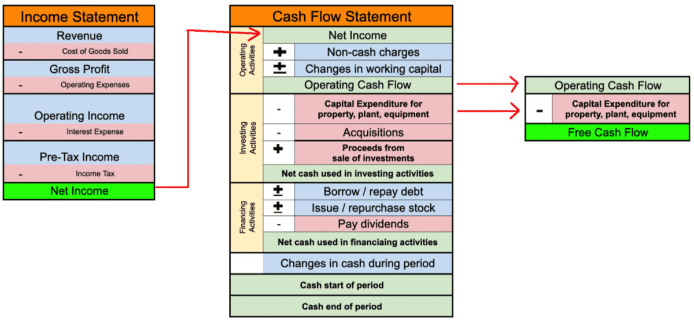

In the fast-paced world of finance, understanding key metrics and leveraging technology is essential for success. Navigating the complexities of financial markets requires a comprehensive grasp of critical components such as operating cash flow financial analysis, net operating income, and algorithmic trading. These elements form the backbone of insightful investment strategies and sophisticated algorithmic trading models.

Operating cash flow (OCF) and net operating income (NOI) are fundamental metrics that provide a clear picture of a company's financial health and operational efficiency. OCF measures the cash generated by a company's core business activities, reflecting its ability to maintain and grow operations without external financing. Meanwhile, NOI, which focuses on profitability before the influence of taxes and financial structures, allows investors to assess the core operating performance.



The integration of these financial metrics into algorithmic trading models has revolutionized the decision-making process in modern finance. Algorithmic trading, which uses complex algorithms to execute trades at speeds and frequencies that are impossible for human traders, relies heavily on accurate financial analysis to predict market trends and optimize trading strategies. By incorporating OCF and NOI into these algorithms, traders can enhance their models' precision and robustness.

The practical applications of merging financial analysis with algorithmic trading are vast. These elements not only support more informed decision-making but also contribute to increased profitability by minimizing human error and enabling rapid response to market changes. As technology continues to evolve, the synergy between traditional financial analysis and algorithmic trading presents a powerful opportunity for traders and investors to stay ahead in the competitive financial landscape.

## Table of Contents

## Understanding Operating Cash Flow

Operating cash flow (OCF) is a critical financial metric used to assess the cash that a company generates from its normal business operations. This metric is vital for evaluating a company's financial health because it indicates whether a company can generate sufficient positive cash flow to maintain and grow its operations without relying on external financing. Unlike net income, which can be affected by accounting policies such as depreciation methods and tax strategies, operating cash flow provides a more transparent view of financial performance by focusing solely on cash transactions related to operational activities.

### Differences Between Operating Cash Flow and Other Types of Cash Flow
Cash flow statements are divided into three main categories: operating cash flow, investing cash flow, and financing cash flow. While operating cash flow pertains to cash generated from core business operations, investing cash flow represents cash utilized for or generated from investment activities such as purchasing or selling property and equipment. Financing cash flow includes transactions related to raising capital and repaying investors, such as issuing stocks or paying dividends.

### Operational Efficiency Measurement
OCF is a vital tool in financial analysis for measuring a company's operational efficiency. It indicates how well a company can convert its revenues into actual cash. Companies that consistently generate strong OCF are typically viewed as financially stable, as they possess the inherent ability to satisfy liabilities, reinvest in their operations, pay dividends, and withstand economic downturns.

### Calculation and Interpretation of Operating Cash Flow Margins
Calculating OCF involves adjusting net income for changes in non-cash items and working capital. The formula is typically expressed as:

$$
\text{OCF} = \text{Net Income} + \text{Non-Cash Expenses} - \Delta \text{Working Capital}
$$

Where:
- **Net Income** is the profit after taxes.
- **Non-Cash Expenses** can include depreciation and amortization.
- $\Delta \text{Working Capital}$ represents changes in current assets and liabilities.

Operating cash flow margin is a related metric that measures the efficiency of a company's core business operations in terms of cash generation:

$$
\text{OCF Margin} = \frac{\text{Operating Cash Flow}}{\text{Net Sales}} \times 100\%
$$

A high OCF margin is often indicative of a company's strong ability to convert revenue into cash and might suggest robust operational practices.

### Importance for Investors and Analysts
Investors and analysts place significant emphasis on operating cash flow because it is less susceptible to manipulation than other accounting metrics. While earnings can be influenced by management's choices in accounting methods, cash flow typically offers a transparent snapshot of a company's financial health. A positive OCF indicates strong [liquidity](/wiki/liquidity-risk-premium) and the potential for growth, making it an attractive indicator for investors interested in stable companies. Furthermore, OCF trends provide insight into future performance and potential for sustained profitability, influencing investment decisions.

## Analyzing Net Operating Income

Net Operating Income (NOI) is a key financial metric that signifies a company's profitability from its core business operations. Unlike other measurements that may include non-operational income or expenses, NOI focuses solely on the revenue generated from business activities and the costs associated with maintaining these operations. It serves as a fundamental indicator for investors and analysts in assessing the profitability of a company, particularly in industries with significant fixed asset investments.

**Components of Net Operating Income**

NOI is calculated by subtracting operating expenses from the total revenue generated by a company's core operations. The formula can be represented as:

$$
\text{NOI} = \text{Revenue} - \text{Operating Expenses}
$$

Revenue includes all income derived from the primary business activities, such as sales of goods and services. Operating expenses encompass costs directly tied to the day-to-day running of the business, such as salaries, rent, utilities, and maintenance costs, but explicitly exclude interest expenses, taxes, and any one-time costs.

**Difference Between NOI and Net Income**

The distinction between NOI and net income lies primarily in the scope of expenses accounted for in each metric. Net income encompasses the total earnings of a company, subtracting not only the operating expenses but also interest, taxes, and extraordinary items. This broader calculation provides a comprehensive picture of a company's overall profitability. However, it may not accurately reflect the operational efficiency of a business, which is where NOI proves advantageous.

Analysts stress the importance of NOI as it offers a clearer view of a company's operational strength. By focusing on operational efficiency, it allows for better comparisons among companies within the same industry, effectively normalizing factors like tax strategies or debt structures that can vary significantly across different enterprises.

**Comparing Company Performance Using NOI**

Within the same industry, companies can be compared based on their NOI to evaluate how efficiently they manage their core operations relative to their peers. A higher NOI margin indicates better cost management and operational efficiency, allowing analysts to identify companies that might be outperforming their competitors.

**Significance of NOI in Real Estate and Fixed Asset Sectors**

NOI holds particular significance in real estate and industries where investments in fixed assets are predominant. In real estate, NOI is critical for property valuation as it provides a direct measure of income yield from property investments, excluding financing costs. This focus on operational income allows investors to evaluate potential investments against others in the market and make informed decisions about buying, selling, or managing properties.

For sectors with substantial fixed investments, NOI offers insights into how effectively a company's capital is being deployed to generate income from its assets. For example, in industries like manufacturing or telecommunications, a consistent or improving NOI could indicate efficient utilization of assets and effective cost management, providing a sound basis for operational performance assessment.

By focusing on the elements that drive NOI, such as sales growth and cost control, companies and analysts alike can better understand the core factors affecting profitability and make informed investments, operational adjustments, or strategic decisions.

## Integrating Financial Analysis with Algorithmic Trading

Algorithmic trading, involving the use of computer algorithms to automatically execute trades, is transforming financial markets with its precision and speed. It allows for efficient processing and execution of complex trading strategies by analyzing large datasets in real-time, thus impacting market dynamics significantly. A notable example of its influence is seen in the vast increase in trading [volume](/wiki/volume-trading-strategy); [algorithmic trading](/wiki/algorithmic-trading) accounts for a significant percentage of equity market trading volumes globally.

Financial analysis, particularly metrics such as Operating Cash Flow (OCF) and Net Operating Income (NOI), plays a crucial role in developing these algorithmic strategies. OCF is used to assess a company’s cash-generating efficiency from operations, excluding startup activities and financial investment. Investors and traders utilize OCF to gauge a company’s liquidity and sustainability, which are critical factors in predicting stock performance. On the other hand, NOI, primarily used in evaluating profitability, measures the income generated after deducting operating expenses but before taxes and interest. This measure is particularly useful for assessing the performance of income-generating assets.

Traders employ these metrics to anticipate market trends and incorporate them into their algorithmic models. By analyzing historical OCF and NOI data, traders can identify patterns or anomalies that might indicate future performance shifts. For instance, an unexpected decrease in OCF might signal underlying issues, such as inefficient operational practices, that could negatively affect stock performance. Similarly, changing NOI trends might highlight shifts in a company’s core profitability, offering insights into future market movements.

There are algorithmic models explicitly designed to integrate OCF and NOI to enhance trading performance. One such approach is the development of forecast algorithms that use regression analysis to predict future OCF and NOI. These models often employ [machine learning](/wiki/machine-learning) techniques to improve prediction accuracy by training on extensive historical datasets. Implementing such algorithms needs the careful consideration of data quality, with the integration of continuous data validation processes to ensure reliability.

Advantages of algorithmic trading include increased efficiency and reduced human error. Algorithms execute trades at optimal prices, based on predefined criteria, without being influenced by human emotions or decisions. This mechanized trading ensures consistency and reduces the likelihood of mistakes, especially during high-frequency trading operations. Moreover, algorithms can process and respond to market shifts much faster than human traders, offering a competitive edge in rapidly changing environments.

The synergy between financial analysis and algorithmic trading provides powerful tools for modern traders. By integrating robust financial metrics such as OCF and NOI into algorithmic systems, traders can develop sophisticated models that deliver improved trading outcomes while also managing risk more effectively. As technology continues to advance, the intersection of financial analysis and algorithmic trading holds the promise of even greater efficiency and profitability in the years to come.

## Strategies for Leveraging Financial Analysis in Trading Algorithms

Leveraging financial analysis in trading algorithms involves several strategic approaches that enhance the accuracy and profitability of investment strategies. One approach is incorporating key financial metrics such as Operating Cash Flow (OCF) and Net Operating Income (NOI) into algorithmic models, which allows traders to consider a company's financial health and operational performance as part of their decision-making processes.

**Strategies for Incorporation**

1. **Integration of OCF and NOI into Algorithic Models**: Traders can integrate OCF and NOI data by constructing algorithms that automatically extract and analyze this financial information from company reports. This can involve statistical models or machine learning techniques that weigh OCF and NOI alongside other financial indicators to signal buy or sell decisions. 

2. **Use of Backtesting**: Backtesting is a crucial process that involves simulating the performance of trading algorithms using historical financial data to evaluate their viability before deployment in live trading. For instance, backtesting an algorithm that uses OCF and NOI data can help identify patterns associated with stock performance, allowing adjustments and optimizations to improve accuracy.

    ```python
    import pandas as pd
    import numpy as np
    import backtrader as bt

    class FinancialMetricsStrategy(bt.SignalStrategy):
        def __init__(self):
            self.signal_add(bt.SIGNAL_LONG, self.calculate_signal())

        def calculate_signal(self):
            # Example logic for deciding on a trading signal
            # Uses simple threshold logic for demonstration
            ocf_threshold = 1000000  # Example threshold
            noi_threshold = 500000   # Example threshold
            if self.data.ocf[0] > ocf_threshold and self.data.noi[0] > noi_threshold:
                return 1  # Buy signal
            return 0  # Hold or sell signal

    # Dataframe containing historical OCF, NOI, and other needed attributes
    data = pd.DataFrame({
        'ocf': np.random.rand(100) * 2000000,  # Example
        'noi': np.random.rand(100) * 1000000,  # Example
        'close': np.random.rand(100) * 100,    # Example
    })

    cerebro = bt.Cerebro()
    cerebro.addstrategy(FinancialMetricsStrategy)
    cerebro.run()
    ```

**Challenges and Considerations**

Integrating financial metrics into algorithmic trading poses challenges such as ensuring data accuracy and managing the volume of financial reports. The quality and timeliness of OCF and NOI data are critical, as discrepancies can lead to erroneous trading signals. Additionally, market anomalies and data snooping bias should be accounted for when designing algorithms.

**Impact of Market Volatility and Economic Cycles**

Market [volatility](/wiki/volatility-trading-strategies) and economic cycles significantly affect OCF and NOI. During economic downturns, companies might experience reduced cash flow and profitability, influencing their stock performance. Algorithms need to be adaptive, possibly integrating macroeconomic indicators or sentiment analysis to adjust weights on financial metrics based on prevailing market conditions.

**Tools and Platforms**

Several tools and platforms facilitate the integration of financial analysis into trading algorithms. Quantitative analysis platforms such as QuantConnect, Alpaca, and [Interactive Brokers](/wiki/interactive-brokers-api) provide robust APIs for accessing and processing financial data efficiently. These platforms allow for the creation of sophisticated models using real-time data feeds and historical datasets, supporting the rapid prototyping and deployment of trading strategies.

In summary, effective leveraging of OCF and NOI in trading algorithms requires careful planning, [backtesting](/wiki/backtesting), and overcoming the challenges posed by market dynamics. Successful traders utilize modern platforms and analytical tools to streamline the integration of these metrics, ultimately enhancing their trading decision-making capabilities.

## Conclusion

In the fast-paced environment of finance, the integration of operating cash flow (OCF), net operating income (NOI), and algorithmic trading offers significant advantages for crafting robust investment strategies. These financial metrics provide a comprehensive understanding of a company's operational efficiency and profitability, forming the bedrock of sound financial analysis. By leveraging these metrics, traders can develop sophisticated algorithmic trading models that predict market trends with increased accuracy, potentially leading to improved profitability.

Operating cash flow and net operating income are critical as they reflect a company's ability to generate cash and the effectiveness of its operational activities. OCF offers insights into the liquidity position by showing the cash generated from core operations, excluding external financing or investment activities. Similarly, NOI serves as a measure of profitability that excludes non-operating factors, providing a clearer picture of financial health and operational success. Together, these metrics allow investors to gauge a company's financial stability and make informed decisions.

Algorithmic trading harnesses this data to automate and refine trading decisions, reducing human error and increasing execution speed. Incorporating OCF and NOI data into trading algorithms enhances the ability to model financial trends, potentially yielding higher returns. As technology advances, more sophisticated algorithms can process large data sets and apply complex models, incorporating these financial metrics seamlessly into trading strategies.

The relationship between traditional financial metrics and modern trading technologies is crucial, offering a balanced view that enhances decision-making and strategy development. As financial markets continue to evolve, ongoing advancements in financial analysis and algorithmic trading technology promise further benefits and opportunities for future investors. Traders and analysts are encouraged to explore this synergy, ensuring they remain at the forefront of technological and financial innovation.

## References & Further Reading

[1]: ["Advances in Financial Machine Learning"](https://www.amazon.com/Advances-Financial-Machine-Learning-Marcos/dp/1119482089) by Marcos Lopez de Prado

[2]: Bergstra, J., Bardenet, R., Bengio, Y., & Kégl, B. (2011). ["Algorithms for Hyper-Parameter Optimization."](https://dl.acm.org/doi/10.5555/2986459.2986743) Advances in Neural Information Processing Systems 24.

[3]: ["Evidence-Based Technical Analysis: Applying the Scientific Method and Statistical Inference to Trading Signals"](https://www.amazon.com/Evidence-Based-Technical-Analysis-Scientific-Statistical/dp/0470008741) by David Aronson

[4]: ["Machine Learning for Algorithmic Trading"](https://github.com/stefan-jansen/machine-learning-for-trading) by Stefan Jansen

[5]: ["Quantitative Trading: How to Build Your Own Algorithmic Trading Business"](https://www.amazon.com/Quantitative-Trading-Build-Algorithmic-Business/dp/1119800064) by Ernest P. Chan