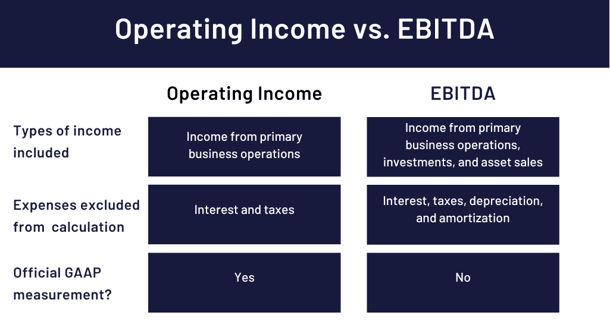

## Table of Contents

## What is operating income?

Operating income is the money a company makes from its main business activities before paying taxes and interest. It's like the profit a company gets from doing what it does best, whether that's selling products, providing services, or both. To find operating income, you start with the company's total revenue and then subtract the costs of running the business, like the cost of goods sold and operating expenses. These expenses include things like salaries, rent, and utilities.

Operating income is important because it shows how well a company is managing its core business. If a company has a high operating income, it means it's good at making money from its main activities. On the other hand, if the operating income is low or negative, it might mean the company is struggling to make enough money to cover its basic costs. Investors and managers look at operating income to see if a business is healthy and to make decisions about where to improve or invest.

## What is EBITDA?

EBITDA stands for Earnings Before Interest, Taxes, Depreciation, and Amortization. It's a way to measure a company's performance by looking at its profits before taking away some expenses. These expenses include interest on loans, taxes, and the costs of wearing out or using up things like machines and buildings over time. By not counting these costs, EBITDA gives a clearer picture of how much money a company is making from its main business activities.

People use EBITDA to compare companies more easily, especially if they have different amounts of debt or different tax situations. It helps to see how well a company is doing at making money from its core business, without the influence of how it's financed or taxed. However, EBITDA doesn't tell the whole story because it leaves out important costs that can affect a company's real profits. So, while it's a useful tool, it's important to look at other financial measures too to get a full understanding of a company's health.

## How is operating income calculated?

Operating income is found by taking a company's total revenue and then subtracting the costs of running the business. These costs include the cost of goods sold, which is what it costs to make or buy the products the company sells. It also includes operating expenses, like salaries for employees, rent for the office or store, and utilities like electricity and water.

This calculation gives you the profit the company makes from its main business activities before paying interest and taxes. It's important because it shows how well the company is doing at its core business, without the influence of how it's financed or taxed. A high operating income means the company is good at making money from what it does best, while a low or negative operating income might mean it's struggling to cover its basic costs.

## How is EBITDA calculated?

EBITDA is a way to see how much money a company makes before taking away some costs. To find EBITDA, you start with the company's total earnings. Then, you add back the money the company paid for interest on loans, the taxes it paid, and the costs of depreciation and amortization. Depreciation is the cost of machines and buildings wearing out over time, and amortization is similar but for things like patents.

EBITDA helps people see how well a company is doing at making money from its main business, without worrying about how it's financed or taxed. It's useful for comparing different companies, especially if they have different amounts of debt or different tax situations. But, it's important to remember that EBITDA doesn't show the whole picture because it leaves out important costs that affect a company's real profits.

## What are the key differences between operating income and EBITDA?

Operating income and EBITDA both help us understand how well a company is doing, but they look at different things. Operating income is the money a company makes from its main business activities after paying for the costs of making or buying what it sells and running the business. This includes things like salaries, rent, and utilities. It shows us how profitable the core business is before paying interest and taxes.

EBITDA, on the other hand, stands for Earnings Before Interest, Taxes, Depreciation, and Amortization. It's a bit different because it adds back some costs that operating income doesn't. Specifically, it adds back the money spent on interest, taxes, and the costs of wearing out machines and buildings (depreciation) or using up intangible assets like patents (amortization). This makes EBITDA useful for comparing companies more easily, especially if they have different amounts of debt or different tax situations.

While both measures give us a good idea of a company's performance, they serve different purposes. Operating income gives a clearer picture of the actual profit from the core business activities, while EBITDA provides a broader view that can be helpful for comparing companies. However, because EBITDA leaves out important costs, it's important to use it alongside other financial measures to get a complete understanding of a company's financial health.

## Why might a company prefer to report EBITDA instead of operating income?

A company might prefer to report EBITDA because it shows a bigger number than operating income. This is because EBITDA adds back some costs that operating income doesn't, like the money spent on interest, taxes, and the wear and tear of machines and buildings. By showing a higher number, a company can look more profitable and attractive to investors and lenders. It's like showing off the best part of the business without the heavy costs that can drag down the numbers.

Also, EBITDA is useful for comparing companies that are different in how they are financed or taxed. For example, one company might have a lot of loans and pay a lot of interest, while another might not. By using EBITDA, people can see how well each company is doing at its core business without these differences getting in the way. However, it's important to remember that EBITDA doesn't tell the whole story. It leaves out important costs that can affect a company's real profits, so it's best to look at other financial measures too to get a full picture.

## How do operating income and EBITDA impact a company's financial analysis?

Operating income and EBITDA both help people understand how well a company is doing, but they look at different parts of the business. Operating income shows the money a company makes from its main business activities after paying for the costs of making or buying what it sells and running the business. This includes things like salaries, rent, and utilities. It gives a clear picture of how profitable the core business is before paying interest and taxes. When people look at operating income, they can see if the company is good at making money from what it does best. A high operating income means the company is doing well, while a low or negative one might mean it's struggling.

EBITDA, which stands for Earnings Before Interest, Taxes, Depreciation, and Amortization, looks at the company's profits in a different way. It adds back the money spent on interest, taxes, and the costs of wearing out machines and buildings or using up intangible assets like patents. This makes EBITDA a bigger number than operating income, which can make the company look more attractive to investors and lenders. It's also useful for comparing different companies, especially if they have different amounts of debt or different tax situations. However, because EBITDA leaves out important costs, it doesn't show the whole picture of a company's financial health. People need to look at other financial measures too to get a complete understanding.

## Can you provide an example of how operating income and EBITDA might differ for a specific company?

Let's imagine a small bakery called "Sweet Treats." They make cakes and pastries and sell them to customers. In a year, Sweet Treats earns $500,000 from selling their baked goods. To make these treats, they spend $200,000 on ingredients and supplies. They also have to pay $100,000 for rent, salaries, and utilities. So, after subtracting these costs, their operating income is $200,000. This number shows how much profit Sweet Treats makes from their main business of baking and selling treats, before paying any interest on loans or taxes.

Now, let's look at Sweet Treats' EBITDA. In addition to the costs we already talked about, Sweet Treats has a loan that they have to pay interest on, which costs them $20,000 a year. They also have to pay $30,000 in taxes. Plus, their baking equipment and store fittings are getting old, so they have to account for $10,000 in depreciation. To find EBITDA, we start with the operating income of $200,000 and add back the interest, taxes, and depreciation. So, Sweet Treats' EBITDA is $260,000. This number is higher than their operating income because it doesn't include the costs of interest, taxes, and depreciation, making the bakery look more profitable.

## What are the limitations of using EBITDA as a performance metric?

Using EBITDA as a way to measure how well a company is doing has some problems. One big issue is that it doesn't count all the costs that a company has to pay. For example, it leaves out interest on loans, taxes, and the costs of things like machines and buildings getting old. These are real costs that can make a big difference in how much money a company actually makes. If a company has a lot of debt or old equipment, leaving these costs out can make the company look better than it really is.

Another problem with EBITDA is that it can be used to hide the truth about a company's financial health. Because it shows a higher number than other measures like operating income, it can make a company seem more profitable and attractive to investors. But if people only look at EBITDA, they might not see the whole picture. It's important to use other financial measures too, so you can understand all the costs and get a true idea of how well the company is doing.

## How do investors and analysts typically use operating income and EBITDA in their evaluations?

Investors and analysts use operating income to see how well a company is doing at its main business. They look at this number to understand how much profit the company makes after paying for things like the cost of making or buying what it sells, and the costs of running the business, like salaries, rent, and utilities. Operating income helps them see if the company is good at making money from what it does best. If the operating income is high, it means the company is doing well in its core business. If it's low or negative, it might mean the company is struggling to cover its basic costs.

EBITDA is another number that investors and analysts look at. It stands for Earnings Before Interest, Taxes, Depreciation, and Amortization. They use EBITDA to compare different companies more easily, especially if those companies have different amounts of debt or different tax situations. By adding back the costs of interest, taxes, and the wear and tear of machines and buildings, EBITDA shows a bigger number than operating income. This can make a company look more profitable and attractive to investors. But because it leaves out important costs, investors and analysts also need to look at other financial measures to get a full picture of a company's financial health.

## In what scenarios might operating income be a better indicator of a company's financial health than EBITDA?

Operating income might be a better indicator of a company's financial health than EBITDA when you want to see how well the company is doing at its main business. Operating income shows the profit a company makes after paying for things like the cost of making or buying what it sells, and the costs of running the business, like salaries, rent, and utilities. This gives a clearer picture of how profitable the core business is, without the influence of how the company is financed or taxed. If a company has a lot of debt or old equipment, looking at operating income helps you see if the business can make enough money to cover its basic costs.

In scenarios where a company's financial health depends a lot on its ability to manage its core business well, operating income is more useful. For example, if a company is trying to improve its operations or cut costs, operating income will show how these changes affect the bottom line. It's also important for companies that don't have a lot of debt or big tax bills, because operating income gives a truer picture of their profits. While EBITDA can be helpful for comparing different companies, operating income gives a more realistic view of how well a company is doing at what it does best.

## How do accounting standards affect the calculation and reporting of operating income and EBITDA?

Accounting standards play a big role in how companies calculate and report operating income and EBITDA. These standards are rules that companies have to follow when they keep track of their money. They make sure that everyone is doing things the same way, so people can trust the numbers. For operating income, accounting standards tell companies what costs they can take away from their total earnings. This includes things like the cost of making or buying what they sell, and the costs of running the business, like salaries, rent, and utilities. If companies didn't follow these rules, they might count different things as costs, and it would be hard to compare them.

EBITDA is a bit different because it adds back some costs that operating income doesn't count. These costs include interest on loans, taxes, and the wear and tear of machines and buildings. Accounting standards also affect how companies report these numbers. They have to make sure they're adding back the right amounts for interest, taxes, depreciation, and amortization. If companies didn't follow the standards, they might add back different things or different amounts, and it would be hard to trust their EBITDA numbers. So, accounting standards help make sure that both operating income and EBITDA are calculated and reported in a fair and consistent way.

## What is the understanding of EBITDA and Operating Income?

EBITDA, or Earnings Before Interest, Taxes, Depreciation, and Amortization, is a key financial metric used to assess a company's operating performance. It is calculated by adding back interest, taxes, depreciation, and amortization to net income. The formula for EBITDA can be expressed as:

$$
\text{EBITDA} = \text{Net Income} + \text{Interest} + \text{Taxes} + \text{Depreciation} + \text{Amortization}
$$

EBITDA provides insights into a company's profitability by focusing on income generated from core business activities, excluding external factors such as financing and accounting decisions. This makes it a valuable tool for comparing companies within the same industry, as it neutralizes discrepancies arising from differing capital structures and tax environments.

Operating income, sometimes referred to as operating profit, differs from EBITDA as it represents the profit realized from a business's operational activities, excluding non-operating income and expenses. Operating income is calculated by subtracting operating expenses from gross profit:

$$
\text{Operating Income} = \text{Gross Profit} - \text{Operating Expenses}
$$

While EBITDA excludes depreciation and amortization, operating income includes these costs, providing a view of profitability that accounts for the wear and tear of physical assets and the amortization of intangible assets. Thus, operating income gives investors and analysts a clearer picture of a company's core operational efficiency.

The role of EBITDA in evaluating a company's profitability is to offer a standardized measure that facilitates a comparison across companies and industries by removing the effects of financing and capital expenditures. It is especially useful for assessing firms with significant capital investments, as it focuses purely on operating earnings.

Operating income is crucial for providing insights into core business operations. By considering costs like depreciation and amortization, it reflects the company's ability to manage its operational expenses effectively and generate profit. This insight is essential for understanding the sustainability of profitability over time, particularly in asset-heavy industries.

In financial analysis, both metrics are employed to evaluate different facets of a company's financial health. For example, EBITDA is commonly used in valuations, such as enterprise value comparisons or private equity evaluations, because it represents a company's earnings potential without the influence of capital expenses. On the other hand, operating income is often used to measure operational performance, helping to make comparisons in efficiency and profitability across firms with similar operations.

Overall, both EBITDA and operating income are integral in financial analysis, offering distinct yet complementary perspectives on a company's financial standing. They help in uncovering the underlying performance and investment potential by focusing on specific elements of profit generation.

## References & Further Reading

[1]: Damodaran, A. (2002). ["Investment Valuation: Tools and Techniques for Determining the Value of Any Asset."](https://archive.org/details/investmentvaluat0000damo_n6k9) Wiley Finance.

[2]: McKinsey & Company. (2010). ["Valuation: Measuring and Managing the Value of Companies."](https://www.mckinsey.com/capabilities/strategy-and-corporate-finance/our-insights/valuation-measuring-and-managing-the-value-of-companies)

[3]: Hull, J. C. (2017). ["Options, Futures, and Other Derivatives."](https://www.semanticscholar.org/paper/Options%2C-Futures%2C-and-Other-Derivatives-Hull/89bdee500c8623864fc9eb7a471546aa713acc44) Pearson.

[4]: Pardo, R. (2008). ["The Evaluation and Optimization of Trading Strategies."](https://onlinelibrary.wiley.com/doi/book/10.1002/9781119196969) Wiley Trading.

[5]: James, G., Witten, D., Hastie, T., & Tibshirani, R. (2013). ["An Introduction to Statistical Learning."](https://link.springer.com/book/10.1007/978-1-0716-1418-1) Springer.