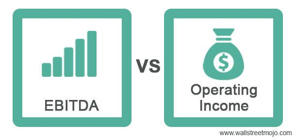

Algorithmic trading, also known as algo trading, refers to the use of computer algorithms to automate trading strategies. These strategies leverage data analytics and quantitative models to make investment decisions at speeds and frequencies far beyond what is achievable by human traders. A crucial component of successful algorithmic trading is the inclusion of relevant financial metrics, which provide insights into the financial health and operational efficiency of a company.

EBITDA (Earnings Before Interest, Taxes, Depreciation, and Amortization) and operating income are two pivotal financial metrics used to assess a company's profitability. EBITDA is calculated as follows:



$$
\text{EBITDA} = \text{Net Income} + \text{Interest} + \text{Taxes} + \text{Depreciation} + \text{Amortization}
$$

This metric provides an approximate measure of a company's operating cash flow from its core operations, excluding the effects of capital structure, taxation, and non-cash accounting items like depreciation and amortization.

In contrast, operating income, also known as operating profit, focuses more on the profitability from a company's core business operations. It excludes non-operating income and expenses, providing insight into the efficiency and profitability of the company's principal business activities. It is calculated by subtracting operating expenses from gross profit:

$$
\text{Operating Income} = \text{Gross Profit} - \text{Operating Expenses}
$$

Leveraging the right financial metrics is essential in algorithmic trading strategies, as these metrics inform the decision-making processes that drive buy and sell signals. Choosing the appropriate metrics can significantly affect trading outcomes and ensure strategies are aligned with the financial realities of their targeted assets.

This article aims to compare EBITDA and operating income within the context of algorithmic trading. We will explore which metric might better serve specific trading strategies, considering factors such as the nature of the company, industry context, and the goals of the trading model. In the following sections, we will provide detailed definitions of these metrics, discuss their integration into algo trading, compare their effectiveness, and offer guidance on building an algorithmic strategy using them. Additionally, we will examine the challenges that arise when these metrics are applied in practice and provide insights into best practices for optimizing trading algorithms.

## Table of Contents

## Understanding EBITDA and Operating Income

EBITDA, or Earnings Before Interest, Taxes, Depreciation, and Amortization, is a key financial metric used to assess a company's operating performance. It is calculated by adding back interest, taxes, depreciation, and amortization to net income. The formula for EBITDA can be expressed as:

$$
\text{EBITDA} = \text{Net Income} + \text{Interest} + \text{Taxes} + \text{Depreciation} + \text{Amortization}
$$

EBITDA provides insights into a company's profitability by focusing on income generated from core business activities, excluding external factors such as financing and accounting decisions. This makes it a valuable tool for comparing companies within the same industry, as it neutralizes discrepancies arising from differing capital structures and tax environments.

Operating income, sometimes referred to as operating profit, differs from EBITDA as it represents the profit realized from a business's operational activities, excluding non-operating income and expenses. Operating income is calculated by subtracting operating expenses from gross profit:

$$
\text{Operating Income} = \text{Gross Profit} - \text{Operating Expenses}
$$

While EBITDA excludes depreciation and amortization, operating income includes these costs, providing a view of profitability that accounts for the wear and tear of physical assets and the amortization of intangible assets. Thus, operating income gives investors and analysts a clearer picture of a company's core operational efficiency.

The role of EBITDA in evaluating a company's profitability is to offer a standardized measure that facilitates a comparison across companies and industries by removing the effects of financing and capital expenditures. It is especially useful for assessing firms with significant capital investments, as it focuses purely on operating earnings.

Operating income is crucial for providing insights into core business operations. By considering costs like depreciation and amortization, it reflects the company's ability to manage its operational expenses effectively and generate profit. This insight is essential for understanding the sustainability of profitability over time, particularly in asset-heavy industries.

In financial analysis, both metrics are employed to evaluate different facets of a company's financial health. For example, EBITDA is commonly used in valuations, such as enterprise value comparisons or private equity evaluations, because it represents a company's earnings potential without the influence of capital expenses. On the other hand, operating income is often used to measure operational performance, helping to make comparisons in efficiency and profitability across firms with similar operations.

Overall, both EBITDA and operating income are integral in financial analysis, offering distinct yet complementary perspectives on a company's financial standing. They help in uncovering the underlying performance and investment potential by focusing on specific elements of profit generation.

## Relevance of Financial Metrics in Algorithmic Trading

Algorithmic trading leverages financial metrics to make informed trading decisions by integrating them into quantitative models. Metrics like EBITDA (Earnings Before Interest, Taxes, Depreciation, and Amortization) and operating income are pivotal in identifying market opportunities. EBITDA, by excluding non-operational elements, provides a clear view of a company's operational profitability, making it easier to compare companies across different capital structures. Operating income, on the other hand, offers insight into the profitability of core business activities by accounting for operating expenses such as wages and costs of goods sold.

These financial metrics can be instrumental in identifying undervalued stocks or overperforming market sectors. For instance, companies with high EBITDA margins may indicate strong operational efficiency, suggesting potential investment opportunities. Conversely, a decline in operating income might signal underlying issues in a company's business operations, serving as a warning sign for algorithmic traders.

Incorporating [fundamental analysis](/wiki/fundamental-analysis) with technical indicators enriches [algorithmic trading](/wiki/algorithmic-trading) strategies. While technical indicators such as moving averages or Relative Strength Index (RSI) focus on price trends and market patterns, fundamental metrics like EBITDA and operating income provide a deeper understanding of a company's intrinsic value. By combining both approaches, traders can enhance their decision-making process, ensuring a comprehensive analysis of both market sentiment and financial health.

Algo trading systems are designed to incorporate these financial metrics by utilizing data feeds and sophisticated mathematical models. For example, Python, along with libraries like Pandas and NumPy, is often used to process and analyze large datasets. Here's a simple example using Python to calculate EBITDA margin:

```python
import pandas as pd

# Example data
data = {'Revenue': [1000, 850, 920],
        'Operating Income': [200, 150, 180],
        'Depreciation': [50, 40, 45],
        'Amortization': [30, 25, 28]}

# Convert data to DataFrame
df = pd.DataFrame(data)

# Calculate EBITDA
df['EBITDA'] = df['Operating Income'] + df['Depreciation'] + df['Amortization']

# EBITDA Margin calculation
df['EBITDA Margin'] = (df['EBITDA'] / df['Revenue']) * 100
print(df[['EBITDA', 'EBITDA Margin']])
```

In automated trading, these computed metrics can be integrated into decision models to trigger buy or sell signals based on predefined criteria. Such integration allows for the continuous evaluation of market conditions and the automatic execution of orders, which can significantly increase the trading speed and profitability.

The potential outcomes of using financial metrics in algorithmic trading are multifaceted. They enable traders to capitalize on insights typically inaccessible through technical analysis alone. By integrating metrics like EBITDA and operating income, traders can enhance predictive accuracy and make more informed, data-driven trading decisions, balancing short-term market fluctuations with long-term value assessments. This approach not only aids in achieving better returns but also contributes to a holistic understanding of market dynamics.

## Comparing EBITDA and Operating Income for Algo Trading

When evaluating financial metrics for algorithmic trading, both EBITDA (Earnings Before Interest, Taxes, Depreciation, and Amortization) and operating income play pivotal roles, albeit with distinct advantages and limitations. Understanding their use in algorithmic trading can aid in the development of more effective trading strategies.

### Pros and Cons of Using EBITDA in Algorithmic Trading

EBITDA serves as a proxy for a company's operational profitability by eliminating the effects of financing and accounting decisions. Its primary advantage lies in its ability to provide a clearer view of cash flow generating capabilities from core operations, unaffected by non-operating factors. This can be beneficial in algorithmic trading where consistent cash flows may indicate financial strength or resilience, influencing trading decisions to favor long positions in such companies.

However, the use of EBITDA is not without its drawbacks. It does not account for capital expenditure, which can lead to misleading representations of financial health, especially in capital-intensive industries. Furthermore, EBITDA can sometimes mask financial distress, as it bypasses significant cost categories like depreciation.

### Evaluating Operating Income in Algorithmic Trading

Operating income provides insight into the efficiency of a company's core business operations. It includes the effects of depreciation and amortization, thereby incorporating elements of the company’s asset management into profitability assessments. This makes operating income a valuable metric when assessing the underlying operational success of a company, which can signal potential upward movement in stock prices.

A potential downside to relying solely on operating income is its vulnerability to non-cash expenses that do not affect the company’s immediate cash flow. Additionally, operating income can fluctuate significantly due to changes in accounting policies or business models, introducing [volatility](/wiki/volatility-trading-strategies) that may not always be indicative of long-term trends.

### Comparative Analysis and Influence on Trading Decisions

The choice between EBITDA and operating income in algorithmic trading hinges on specific objectives and company characteristics. EBITDA could be more useful in scenarios emphasizing cash flow and [liquidity](/wiki/liquidity-risk-premium), particularly for companies with significant debt, as it portrays an unlevered view of earnings. Alternatively, operating income might be preferred where understanding the impact of asset utilization and cost management on profitability is crucial, offering a more complete picture of operational efficiency.

For instance, consider a case where two companies in the manufacturing sector are analyzed: Company A has high EBITDA due to significant tax benefits and low interest costs, while Company B maintains strong operating income with lower depreciation than its peers. An algorithmic strategy focusing on cash-rich companies might prefer Company A, whereas a strategy seeking efficient operation might select Company B.

### Hypothetical Example

A hypothetical scenario could involve an algorithm designed to identify undervalued stocks. This algorithm could use EBITDA as a filter to screen for companies with robust cash flow, ensuring operational strength regardless of capital structure. Meanwhile, operating income could be used to rank these companies based on operational efficiency, thus honing in on firms with solid business models. 

```python
# Example algorithmic screening using Python
import pandas as pd

# Sample data
data = {'Company': ['A', 'B', 'C'],
        'EBITDA': [100, 150, 75],
        'Operating_Income': [80, 70, 65],
        'Current_Price': [50, 60, 30]}

df = pd.DataFrame(data)

# EBITDA filter: Select companies with EBITDA > 90
strong_cash_flow = df[df['EBITDA'] > 90]

# Rank based on Operating Income
ranked_companies = strong_cash_flow.sort_values(by='Operating_Income', ascending=False)

print(ranked_companies)
```

### Scenarios for Preferential Use

- **Preference for EBITDA**: In industries with high leverage where understanding core profitability absent of debt burdens is necessary.
- **Preference for Operating Income**: When assessing companies wherein cost control and operational efficiency are priorities, leading to more sustainable profitability.

In algorithmic trading, neither EBITDA nor operating income should dictate strategies in isolation. A comprehensive approach, incorporating both metrics, can offer nuanced insights leading to more robust trading decisions.

## Developing an Algorithmic Strategy Using Financial Metrics

Creating an algorithmic trading strategy using financial metrics like EBITDA and operating income involves several structured steps designed to leverage these metrics' insights into a company's financial health. By understanding how these metrics reflect on a company’s profitability and operational efficiency, traders can build algorithms that make informed trades based on anticipated market movements.

**Steps to Create the Algorithmic Trading Strategy**

1. **Data Collection and Preparation:**
   - Gather historical financial data on EBITDA and operating income for companies of interest. This data is often available from financial databases such as Bloomberg, Yahoo Finance, or company financial statements.
   - Clean and preprocess the data to handle missing values, outliers, and ensure consistency. Libraries such as Pandas in Python are useful for these tasks:
     ```python
     import pandas as pd

     # Sample code to handle missing data
     df = pd.read_csv('financial_data.csv')
     df.fillna(method='ffill', inplace=True)  # Forward fill to handle missing values
     ```

2. **Strategy Formulation:**
   - Develop hypothesis-driven strategies that utilize EBITDA and operating income. For example, a strategy might be to buy stocks of companies with increasing EBITDA over successive quarters while shorting those with decreasing operating income.
   - Consider the integration of technical indicators alongside financial metrics to strengthen trading signals.

3. **Technology and Tools:**
   - Utilize trading platforms that support algorithmic strategies such as MetaTrader, QuantConnect, or custom Python scripts.
   - Python offers a rich ecosystem of libraries like NumPy for numerical operations, Backtrader for back-testing, and Scikit-learn for machine learning implementation:
     ```python
     from backtrader import Cerebro, Strategy

     class MyStrategy(Strategy):
         def __init__(self):
             # Define strategy parameters here
             pass

         def next(self):
             # Implement trading logic based on EBITDA and Operating Income
             pass

     cerebro = Cerebro()
     cerebro.addstrategy(MyStrategy)
     ```

4. **Back-testing and Validation:**
   - Simulate the strategy against historical data to evaluate its performance. This helps in identifying potential flaws or areas of improvement.
   - Analyze key performance metrics such as the Sharpe Ratio, win/loss ratio, and drawdowns to assess the strategy's robustness.

5. **Optimization:**
   - Continuously refine the algorithm by adjusting parameters to achieve optimal results. Optimization can be done manually by trial and error or using automated tools.
   - Avoid overfitting by validating the strategy on out-of-sample data.

6. **Risk Management:**
   - Apply risk management techniques like position sizing, stop losses, and portfolio diversification to mitigate risks.
   - Utilize Value at Risk (VaR) or Conditional Value at Risk (CVaR) to quantify and manage potential losses.

   ```python
   # Example: Implementing a simple stop-loss mechanism
   def next(self):
       if self.position:
           if self.data.close[0] < self.position.price * 0.95:  # Stop-loss at 5% below purchase price
               self.sell(size=self.position.size)
   ```

The implementation of financial metrics in algorithmic trading requires a balanced approach. While EBITDA and operating income provide critical insights into a company’s financial health, they should be used in conjunction with technical analysis and robust risk management practices. Continuous monitoring and strategy adjustments will ensure adaptability in dynamic market conditions.

## Challenges and Considerations

Integrating financial metrics such as EBITDA and operating income into algorithmic trading presents a set of unique challenges that need careful consideration. While these metrics can offer valuable insights into a company's financial performance, their integration into automated trading strategies is not without risks.

One of the primary challenges is the potential pitfall of relying solely on EBITDA or operating income for trading decisions. Although these metrics provide crucial information about a company’s profitability and efficiency, they do not offer a comprehensive view. EBITDA, for instance, ignores capital expenditures, debt levels, and changes in working capital, which can lead to distorted perceptions of cash flow and financial health. Similarly, operating income accounts only for the profits generated from core business activities, excluding the impact of interest expenses and taxes, which can be significant. A sole focus on these metrics might result in overlooking other financial indicators or macroeconomic factors that could influence market dynamics.

Market volatility is another critical [factor](/wiki/factor-investing) affecting the efficacy of algorithmic strategies incorporating financial metrics. The stock market is inherently volatile, and price movements can be influenced by multiple factors besides a company's financial performance, such as geopolitical events, market sentiment, and economic indicators. Algorithms that weigh financial metrics heavily may underperform in volatile markets where technical indicators or sentiment analysis might be more relevant. To mitigate this risk, it is essential to integrate a diverse range of inputs, including technical analysis, sentiment data, and macroeconomic indicators, into the trading algorithms.

Continuous monitoring and adjustments of trading algorithms are essential to maintaining their efficacy. Financial conditions and market environments are dynamic, meaning that an algorithmic strategy that performs well in one market condition might fail in another. Implementing a feedback loop that allows for ongoing performance evaluation and calibration of the algorithm is crucial. This involves regularly updating algorithms with the latest data, refining predictive models, and adopting [machine learning](/wiki/machine-learning) techniques to adapt to new patterns.

Regulatory considerations and ethical implications also play a significant role when integrating financial metrics into algorithmic trading. Financial markets are subject to regulations that ensure fair trading practices and transparency. Algorithms need to comply with these regulations, such as avoiding activity that could be classified as market manipulation or insider trading. Moreover, there are ethical concerns about the social impact of high-frequency trading and its potential to exacerbate market volatility. Traders and developers must be aware of these aspects and design algorithms that promote fairness and stability in the financial markets.

In conclusion, while financial metrics like EBITDA and operating income provide valuable insights, their integration into algorithmic trading requires a balanced approach. Incorporating a wide array of data points, continuously monitoring and updating algorithms, and adhering to regulatory and ethical standards are crucial steps to overcome the challenges and enhance the overall success of algorithmic trading strategies.

## Conclusion

In conclusion, this article has highlighted the importance of employing a balanced approach when leveraging financial metrics such as EBITDA and operating income in algorithmic trading strategies. Both metrics offer unique insights: EBITDA provides a broad view of a company's profitability excluding the effects of financing and accounting decisions, while operating income offers a more focused look at the efficiency of core business operations. By integrating these metrics, traders can enhance their understanding of a company's fiscal health, allowing for more informed, data-driven trading decisions.

To develop robust algorithmic trading strategies, it is crucial for practitioners to consider both EBITDA and operating income. This combined approach can help in identifying market opportunities and making more accurate predictions about asset performance. Additionally, it encourages a viewpoint that harmonizes both fundamental analysis and technical indicators, resulting in more comprehensive trading systems.

Exploring further resources and tools can augment one's ability to implement algorithmic trading strategies effectively. Numerous platforms and software tools provide capabilities to incorporate complex financial metrics into algorithmic models. Conducting back-tests, optimizing algorithms, and utilizing technological advancements like machine learning can also aid in refining and enhancing strategy performance.

Finally, staying informed about ongoing developments in the field of algorithmic trading is essential. As technology evolves and markets become more sophisticated, continuous learning and adaptation will ensure that traders remain competitive and responsive to the dynamic nature of financial markets. Actively engaging with up-to-date research, attending relevant conferences, and participating in trading communities are valuable steps to sustain an edge in the ever-evolving domain of algorithmic trading.

## References & Further Reading

[1]: Damodaran, A. (2002). ["Investment Valuation: Tools and Techniques for Determining the Value of Any Asset."](https://archive.org/details/investmentvaluat0000damo_n6k9) Wiley Finance.

[2]: McKinsey & Company. (2010). ["Valuation: Measuring and Managing the Value of Companies."](https://www.mckinsey.com/capabilities/strategy-and-corporate-finance/our-insights/valuation-measuring-and-managing-the-value-of-companies)

[3]: Hull, J. C. (2017). ["Options, Futures, and Other Derivatives."](https://www.semanticscholar.org/paper/Options%2C-Futures%2C-and-Other-Derivatives-Hull/89bdee500c8623864fc9eb7a471546aa713acc44) Pearson.

[4]: Pardo, R. (2008). ["The Evaluation and Optimization of Trading Strategies."](https://onlinelibrary.wiley.com/doi/book/10.1002/9781119196969) Wiley Trading.

[5]: James, G., Witten, D., Hastie, T., & Tibshirani, R. (2013). ["An Introduction to Statistical Learning."](https://link.springer.com/book/10.1007/978-1-0716-1418-1) Springer.