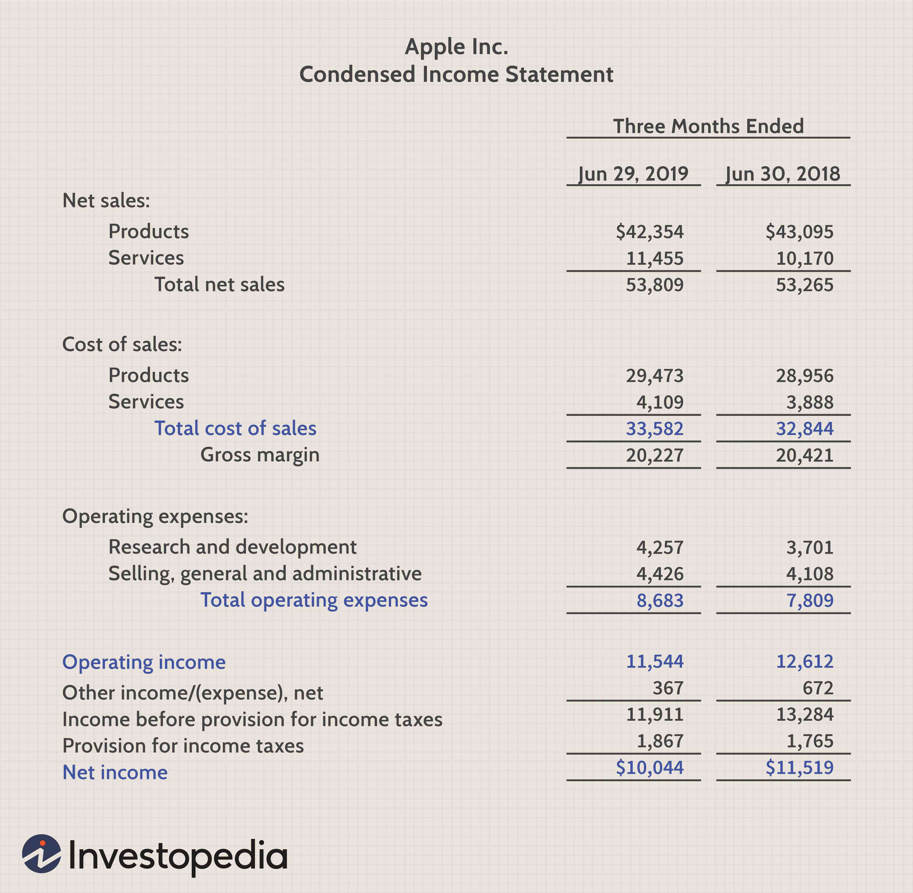

## Table of Contents

## What is operating income?

Operating income is the money a company makes from its main business activities before it pays interest and taxes. It's calculated by taking the company's gross income, which is the money made from selling products or services, and then subtracting the costs of running the business, like rent, salaries, and utilities. This number shows how well the company is doing at its core business, without considering other financial activities like investments or loans.

Knowing the operating income is important because it helps business owners and investors see if the company's main operations are profitable. If the operating income is high, it means the company is good at making money from what it does every day. If it's low or negative, it might mean the company needs to cut costs or find ways to increase sales. This information is useful for making decisions about the future of the business.

## What is gross profit?

Gross profit is the money a company makes from selling its products or services after it pays for the things it needs to make or buy them. It's like if you sell cookies for $2 each and it costs you $1 to make each cookie, your gross profit per cookie would be $1. For a business, gross profit is found by taking the total sales money and subtracting the cost of goods sold (COGS), which includes the cost of materials and direct labor.

Gross profit is important because it shows how efficiently a company is at making or buying the things it sells. If the gross profit is high, it means the company is good at keeping the costs of making or buying its products low compared to what it sells them for. If the gross profit is low, it might mean the company needs to find cheaper ways to make its products or maybe charge more for them. This number helps business owners and managers make decisions about pricing and costs.

## How is operating income calculated?

Operating income is found by taking the money a company makes from selling its products or services, which is called revenue, and then subtracting the costs of making or buying those products, called the cost of goods sold (COGS). This gives you the gross profit. After that, you subtract all the other costs of running the business, like rent, salaries, and utilities. These costs are called operating expenses. What's left after subtracting these expenses from the gross profit is the operating income.

This number is important because it shows how much money the company is making from its main business before it has to pay interest on loans or taxes. If the operating income is high, it means the company's main business activities are doing well. If it's low or negative, it might mean the company needs to cut costs or find ways to make more money from what it does every day.

## How is gross profit calculated?

Gross profit is the money a company has left after it pays for the things it needs to make or buy the products it sells. Imagine you sell lemonade for $2 a cup and it costs you $1 to make each cup. Your gross profit for each cup would be $1. For a business, you find the gross profit by taking the total money from sales, which is called revenue, and then subtracting the cost of making or buying the products, called the cost of goods sold (COGS).

This number is important because it shows how well a company is at keeping the costs of making or buying its products low compared to what it charges for them. If the gross profit is high, it means the company is good at managing its costs. If it's low, it might mean the company needs to find cheaper ways to make its products or maybe charge more for them. Knowing the gross profit helps business owners and managers make decisions about pricing and costs.

## Why are operating income and gross profit important financial metrics?

Operating income and gross profit are important financial metrics because they help business owners and managers understand how well their company is doing. Gross profit tells you how much money is left after paying for the things needed to make or buy the products sold. It's like if you sell cookies for $2 each and it costs you $1 to make each cookie, your gross profit is $1 per cookie. This number is important because it shows if the company is good at keeping the costs of making or buying its products low compared to what it charges for them.

Operating income goes a step further. It takes the gross profit and subtracts all the other costs of running the business, like rent, salaries, and utilities. This gives you the money the company makes from its main business before paying interest on loans or taxes. If the operating income is high, it means the company's main business activities are doing well. If it's low or negative, it might mean the company needs to cut costs or find ways to make more money from what it does every day. Both these numbers help in making smart decisions about the future of the business.

## What is the difference between operating income and gross profit?

Gross profit is the money a company has left after it pays for the things it needs to make or buy the products it sells. For example, if you sell lemonade for $2 a cup and it costs you $1 to make each cup, your gross profit is $1 per cup. This number shows how well the company is at keeping the costs of making or buying its products low compared to what it charges for them.

Operating income is different because it takes the gross profit and then subtracts all the other costs of running the business, like rent, salaries, and utilities. This gives you the money the company makes from its main business before it pays interest on loans or taxes. If the operating income is high, it means the company's main business activities are doing well. If it's low or negative, it might mean the company needs to cut costs or find ways to make more money from what it does every day.

## Can you provide an example of how to calculate operating income and gross profit for a hypothetical company?

Let's say you own a small bakery that makes and sells cakes. In one month, you sell 100 cakes for $20 each, so your total revenue is $2,000. The cost to make each cake, including ingredients and direct labor, is $10. So, your cost of goods sold (COGS) is $1,000 (100 cakes x $10 per cake). To find your gross profit, you subtract the COGS from the revenue: $2,000 - $1,000 = $1,000. This means your gross profit for the month is $1,000.

Now, to calculate your operating income, you need to subtract the other costs of running your bakery from the gross profit. Let's say your monthly rent is $300, your utilities cost $100, and you pay your staff $200 in salaries. Adding these up, your total operating expenses are $600. To find your operating income, you subtract these operating expenses from your gross profit: $1,000 - $600 = $400. So, your operating income for the month is $400. This number shows how much money your bakery makes from its main business before paying any interest or taxes.

## How do operating income and gross profit reflect a company's operational efficiency?

Gross profit shows how well a company is at making money from what it sells. It's the money left after paying for the things needed to make or buy the products. If a company has a high gross profit, it means they are good at keeping the costs of making or buying their products low compared to what they sell them for. This is a sign of good operational efficiency because it means the company is managing its costs well. If the gross profit is low, it might mean the company needs to find cheaper ways to make its products or maybe charge more for them.

Operating income takes things a step further. It shows how much money a company makes from its main business after paying for everything it needs to run the business, like rent, salaries, and utilities. If a company has a high operating income, it means their main business activities are doing well and they are efficient at managing all their costs. A low or negative operating income might mean the company needs to cut costs or find ways to make more money from what it does every day. Both gross profit and operating income help business owners and managers see how efficient their operations are and make smart decisions about the future.

## What factors can affect the difference between operating income and gross profit?

The difference between operating income and gross profit is affected by how much a company spends on things other than making its products. Gross profit is what's left after paying for the materials and direct labor to make the products. But operating income subtracts more costs, like rent, salaries for staff who aren't making the products, and utilities. If these other costs are high, the difference between gross profit and operating income will be bigger. This means the company might be good at making money from what it sells, but it's spending a lot to keep the business running.

Another [factor](/wiki/factor-investing) that can change the difference is how well the company manages its other expenses. If a company can keep its rent, utilities, and other operating costs low, the operating income will be closer to the gross profit. This shows the company is efficient at running its business. But if these costs go up, maybe because of higher rent or more staff, the operating income will be much lower than the gross profit. This tells business owners and managers where they might need to cut costs or find ways to make more money to keep their business healthy.

## How can changes in operating income and gross profit over time indicate a company's financial health?

Changes in gross profit over time can show how well a company is doing at making money from what it sells. If gross profit goes up, it means the company is selling more products or selling them for more money, or it's getting better at keeping the costs of making those products low. This is a good sign because it means the company is getting better at its main business. But if gross profit goes down, it might mean the company is selling fewer products, or the costs of making those products are going up. This could be a warning that the company needs to find ways to sell more or make things cheaper.

Operating income also tells a story about a company's financial health over time. If operating income goes up, it means the company is not just good at selling its products, but also at managing all the other costs of running the business, like rent and salaries. This is a strong sign that the company is doing well overall. But if operating income goes down, even if gross profit stays the same or goes up, it might mean the company is spending too much on things like rent or utilities. This could be a sign that the company needs to cut back on these costs to stay healthy. By looking at both gross profit and operating income over time, business owners and managers can see where they're doing well and where they might need to make changes.

## What are some industry-specific considerations when comparing operating income and gross profit?

Different industries have their own ways of making money and their own costs, so looking at operating income and gross profit can mean different things depending on the industry. For example, in the retail industry, gross profit might be high because they buy things at a low price and sell them for more. But their operating income might be lower because they have to pay for things like rent for big stores and lots of staff. In manufacturing, gross profit might be lower because it costs a lot to make things, but if they can keep other costs like factory rent and machinery maintenance low, their operating income could still be good.

In the tech industry, gross profit can be very high because once a software or app is made, it doesn't cost much to sell more copies. But operating income might be affected by big costs like research and development or high salaries for tech workers. In the restaurant industry, gross profit might be lower because food costs can be high, but if they can keep other costs like rent and labor low, their operating income could still be okay. Understanding these industry differences helps people see what's normal for a business and where they might need to focus on improving.

## How can investors use the comparison of operating income and gross profit to make informed decisions?

Investors can use the comparison of operating income and gross profit to understand how well a company is doing at making money from what it sells and how good it is at managing all its costs. If a company has a high gross profit but a low operating income, it might mean they're good at selling things but spending too much on other stuff like rent or salaries. This could be a warning sign for investors because it shows the company might not be as healthy as it looks at first. On the other hand, if both gross profit and operating income are high, it's a good sign that the company is doing well overall. This might make investors feel more confident about putting their money into the company.

By looking at how these numbers change over time, investors can also see if the company is getting better or worse at making money and managing costs. If gross profit is going up but operating income is staying the same or going down, it might mean the company is facing new costs that are eating into their profits. This could make investors think twice before investing more money. But if both gross profit and operating income are going up, it's a strong sign that the company is improving and might be a good place to invest. Understanding these trends helps investors make smarter choices about where to put their money.

## What are the key financial metrics and how can they be understood?

Operating income and gross profit are essential metrics for evaluating a company's financial health.

Gross profit is a critical indicator of a company's efficiency in using its resources to produce and sell goods. It represents the difference between revenue and the cost of goods sold (COGS). Mathematically, it can be expressed as:

$$
\text{Gross Profit} = \text{Revenue} - \text{COGS}
$$

This calculation provides a snapshot of a company's profitability at the most fundamental level, revealing how well it manages the direct costs associated with its core business activities. By efficiently managing production and sales costs, a company can improve its gross profit, which, in turn, can enhance its competitive position and potential for growth.

Operating income offers a broader view of profitability by considering a company's core operational efficiency. It accounts for all operating expenses subtracted from gross profit, excluding non-operational financial activities and tax influences. The formula for calculating operating income is:

$$
\text{Operating Income} = \text{Gross Profit} - \text{Operating Expenses}
$$

Operating income thus provides insight into a company's ability to generate profit from its primary operations. It reflects the company's operational performance without the distortion of outside financial and tax pressures. This metric is crucial for understanding how well a company can sustain its operations profitably and represents a key performance indicator for analysts and investors assessing both short-term and long-term viability.

Understanding these metrics enables investors and financial analysts to evaluate different aspects of a company's financial and operational performance, providing a nuanced view of its overall health.

## How do Gross Profit and Operating Income Differ?

Gross profit and operating income are distinct financial metrics that offer different insights into a company's financial performance. Gross profit is a foundational indicator of profitability, measuring the difference between revenue (sales) and the cost of goods sold (COGS). It focuses exclusively on the direct costs associated with production, such as raw materials and labor, providing a snapshot of how effectively a company can generate profit from its core operations. The formula for calculating gross profit is:

$$
\text{Gross Profit} = \text{Revenue} - \text{Cost of Goods Sold (COGS)}
$$

Operating income, on the other hand, extends beyond gross profit by accounting for all operational expenses. These expenses include selling, general, and administrative expenses (SG&A), research and development costs, and other operational overheads that are not directly tied to the production process. Operating income thus provides a broader view of a company's operational efficiency and its ability to generate profit from its core business activities after covering all operational costs. The formula for calculating operating income is:

$$
\text{Operating Income} = \text{Gross Profit} - \text{Operating Expenses}
$$

Understanding the differences between gross profit and operating income is essential for investors and financial analysts. Gross profit is useful for evaluating how well a company can manage its production-related costs and pricing strategies. Meanwhile, operating income offers insights into a company's overall efficiency in managing its operating costs and utilizing its resources effectively. While gross profit shows the potential for profitability, operating income reveals the actual profitability from operations, excluding non-operational factors such as interest and taxes.

These distinctions can aid in assessing a company's financial health and operational effectiveness, influencing investment decisions and financial analysis. Investors often analyze these metrics together to gain a comprehensive understanding of where a company stands financially and how efficiently it is operating.

## How can Gross Profit and Operating Income be implemented in trading strategies?

Traders can effectively integrate financial metrics such as gross profit and operating income into [algorithmic trading](/wiki/algorithmic-trading) strategies to adapt and respond proficiently to market dynamics. These financial indicators provide critical insights that can refine algorithmic models and, in turn, enhance decision-making processes in trading.

To implement these metrics effectively, traders utilize both real-time data and historical financial information, enabling the adjustment of algorithms to hedge against risks while maximizing potential returns. Real-time data allows for the immediate application of financial movements, whereas historical data provides a foundation for understanding trends and patterns over extended periods.

For example, a trading algorithm might be adjusted based on historical gross profit margins to predict future performance, using a simple regression model in Python:

```python
import pandas as pd
from sklearn.linear_model import LinearRegression

# Assume gross_profit_data is a DataFrame with historical dates and gross profit values
gross_profit_data = pd.read_csv('gross_profit_historical.csv') # replace with actual data source

# Prepare data for the model
X = gross_profit_data['Date'].values.reshape(-1, 1)
y = gross_profit_data['Gross Profit'].values

# Fit the regression model
model = LinearRegression().fit(X, y)

# Predicting future gross profit
future_dates = [[20230101], [20230201], [20230301]] # add future dates in proper format
predicted_gross_profit = model.predict(future_dates)
```

In addition to gross profit and operating income, incorporating other performance metrics such as the Sharpe Ratio and Maximum Drawdown can provide a more comprehensive view of risk-adjusted returns and potential losses. The Sharpe Ratio quantifies the trade-off between risk and return, computed as:

$$
\text{Sharpe Ratio} = \frac{R_p - R_f}{\sigma_p}
$$

where $R_p$ represents the expected portfolio return, $R_f$ is the risk-free rate, and $\sigma_p$ is the standard deviation of the portfolio's excess return.

Maximum Drawdown is used to assess the potential loss from a peak to a trough in the portfolio, offering insights into possible vulnerabilities:

$$
\text{Maximum Drawdown} = \max_{t \in (0, T)} \left(\frac{P_t - P_{\text{max}}}{P_{\text{max}}}\right)
$$

where $P_t$ is the portfolio value at time $t$ and $P_{\text{max}}$ is the historical maximum value of the portfolio.

By considering these metrics and applying them in algorithmic models, traders can develop robust strategies that not only capitalize on financial strengths but also prepare for potential market downturns. This dynamic approach fosters a balanced trading environment that leverages detailed financial analysis to enhance trading performance efficiently.

## How are companies leveraging financial metrics according to case studies?

Case studies can highlight how companies like Best Buy and Macy's effectively use financial metrics to influence their trading strategies.

Best Buy is a leading electronics retailer that excels in maximizing gross profit through efficient cost management. The company strategically manages its cost of goods sold (COGS) to enhance its gross profit margin. By negotiating better terms with suppliers and optimizing its supply chain, Best Buy successfully reduces COGS, thereby increasing its gross profits. Best Buy's efforts in cost management emphasize the importance of gross profit as a key metric for assessing the company's operational efficiency and financial health. This focus on maximizing gross profits enables Best Buy to reinvest in areas like customer service enhancements and digital transformation initiatives, which can attract more customers and increase sales, ultimately benefiting their trading strategies.

Macy's, a renowned department store chain, prioritizes effective inventory management to maintain healthy profit margins. Macy's employs sophisticated inventory management systems to ensure the right products are available at the right time, minimizing excess stock and markdowns. By effectively managing inventory turnover, Macy's reduces holding costs and improves cash flow, which helps maintain a stable operating income. Key financial metrics like inventory turnover ratio, calculated as:

$$
\text{Inventory Turnover Ratio} = \frac{\text{Cost of Goods Sold}}{\text{Average Inventory}}
$$

help Macy’s assess the efficiency of their inventory management processes. Strong inventory management practices not only enhance Macy's gross profit but also improve operational income by reducing overhead costs associated with excess inventory. 

Analyzing these real-world implementations provides valuable insights into the practical applications of financial metrics in trading. Companies like Best Buy and Macy's demonstrate that harnessing financial metrics such as gross profit and operating income can significantly influence business strategies and market performance. These metrics not only inform internal decision-making processes but also equip companies with the financial insights needed to optimize their strategies in dynamic trading environments. For traders and investors, understanding how industry leaders leverage these metrics can guide them in integrating similar principles into their algorithmic trading models, potentially improving trade outcomes and investment returns.

## References & Further Reading

[1]: Bergstra, J., Bardenet, R., Bengio, Y., & Kégl, B. (2011). ["Algorithms for Hyper-Parameter Optimization."](https://papers.nips.cc/paper/4443-algorithms-for-hyper-parameter-optimization) Advances in Neural Information Processing Systems 24.

[2]: ["Advances in Financial Machine Learning"](https://www.amazon.com/Advances-Financial-Machine-Learning-Marcos/dp/1119482089) by Marcos Lopez de Prado

[3]: ["Evidence-Based Technical Analysis: Applying the Scientific Method and Statistical Inference to Trading Signals"](https://www.amazon.com/Evidence-Based-Technical-Analysis-Scientific-Statistical/dp/0470008741) by David Aronson

[4]: ["Machine Learning for Algorithmic Trading"](https://github.com/stefan-jansen/machine-learning-for-trading) by Stefan Jansen

[5]: ["Quantitative Trading: How to Build Your Own Algorithmic Trading Business"](https://www.amazon.com/Quantitative-Trading-Build-Algorithmic-Business/dp/1119800064) by Ernest P. Chan