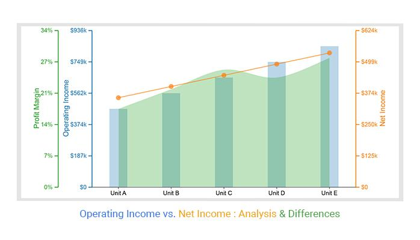

## Table of Contents

## What is operating income?

Operating income is the money a company makes from its main business activities, before taking away taxes and interest. It is calculated by subtracting the costs of running the business, like salaries and rent, from the money earned from selling products or services. This number shows how well the company is doing at its core business, without considering other financial factors like loans or investments.

For example, if a company sells shoes and makes $1 million from sales, but it spends $600,000 on making and selling those shoes, the operating income would be $400,000. This figure is important because it helps business owners and investors see if the company can make money from its main activities before other costs are considered. It's a key measure of a company's health and efficiency.

## What is net income?

Net income is the money a company has left after paying all its expenses. It's like the final amount you get to keep after all the bills are paid. This number is important because it shows if a company is making a profit or a loss. To find net income, you start with the total money earned from sales, then subtract all the costs like the cost of making the product, salaries, rent, interest on loans, and taxes.

Think of net income as the bottom line on a company's income statement. It's what's left for the owners or shareholders after everything else is paid. If a company's net income is positive, it means they made more money than they spent, which is good. If it's negative, they spent more than they made, which can be a problem. Net income is a key number that helps people decide if a company is doing well financially.

## How is operating income calculated?

Operating income is the money a company makes from its main business activities before paying taxes and interest. To calculate it, you start with the total money earned from sales, which is called revenue. Then, you subtract the costs that are directly related to making and selling the products or services. These costs are called the cost of goods sold (COGS). After subtracting COGS from revenue, you get the gross profit.

Next, you need to subtract the operating expenses from the gross profit. Operating expenses include things like salaries, rent, utilities, and other costs needed to run the business day-to-day. Once you subtract all these operating expenses from the gross profit, the number you're left with is the operating income. This figure shows how much money the company is making from its core business before other costs like taxes and interest are taken into account.

## How is net income calculated?

Net income is the money a company has left after paying all its bills. It's like the final amount you get to keep after everything is paid. To find net income, you start with the total money earned from sales, which is called revenue. Then, you subtract the cost of making and selling the products or services, which is called the cost of goods sold (COGS). After that, you subtract other costs like salaries, rent, and utilities, which are called operating expenses. The result is the operating income.

Next, you need to subtract other costs that aren't part of the main business activities. These include interest on loans and taxes. After subtracting these, you get the net income. This number tells you if the company made more money than it spent. If the net income is positive, the company made a profit. If it's negative, the company had a loss. Net income is important because it shows how well the company is doing overall.

## What are the key differences between operating income and net income?

Operating income and net income are both important numbers that show how well a company is doing, but they tell us different things. Operating income is the money a company makes from its main business activities before paying taxes and interest. It's calculated by taking the total money earned from sales, then subtracting the cost of making and selling the products or services and other costs like salaries and rent. This number helps us see if the company is good at making money from its core business without considering other financial factors like loans or investments.

Net income, on the other hand, is the money left after paying all the bills. It's the final amount a company has after everything is paid, including taxes and interest. To find net income, you start with the total money earned from sales, then subtract the cost of goods sold, operating expenses, interest on loans, and taxes. Net income tells us if the company made more money than it spent overall. If the net income is positive, the company made a profit; if it's negative, the company had a loss. This number gives a complete picture of the company's financial health.

## Why is operating income important for a business?

Operating income is important for a business because it shows how well the company is doing at its main job. It tells you if the company can make money from selling its products or services before paying taxes and interest. This number helps business owners and investors see if the company is good at its core business. If the operating income is high, it means the company is doing well at what it does best. If it's low, it might mean the company needs to find ways to make more money or cut costs.

Knowing the operating income also helps a business plan for the future. It gives a clear picture of how much money the company can expect to make from its main activities. This information is useful for making decisions about growing the business, like opening new stores or making new products. It also helps in figuring out if the company can afford to pay its bills and still have money left over. In short, operating income is a key number that shows the health and efficiency of a company's main business activities.

## Why is net income important for a business?

Net income is important for a business because it shows if the company is making more money than it spends. It's like the final amount you get to keep after paying all your bills. If the net income is positive, it means the company made a profit. If it's negative, the company had a loss. This number is crucial because it tells everyone, like the owners and investors, how well the company is doing overall. It's the bottom line that shows if the business is successful or not.

Knowing the net income also helps a business plan for the future. It tells the company how much money it has left after everything is paid, which can be used for growing the business, like opening new stores or making new products. It also helps in deciding if the company can pay its bills and still have money left over. Net income is a key number that gives a complete picture of the company's financial health and helps in making important decisions.

## How can operating income affect a company's financial health?

Operating income is like a health check for a company's main business activities. It shows how much money the company makes from selling its products or services before paying taxes and interest. If the operating income is high, it means the company is doing well at what it does best. This is good because it shows the company can make money from its core business. If the operating income is low, it might mean the company is not doing well and needs to find ways to make more money or cut costs. This can be a warning sign that the company's financial health might be in trouble.

A company's financial health can also be affected by how the operating income changes over time. If the operating income keeps going up, it's a good sign that the company is getting better at making money from its main activities. This can make investors and owners feel confident about the company's future. But if the operating income keeps going down, it might mean the company is struggling, and this can worry people about the company's financial health. Keeping an eye on operating income helps everyone understand if the company is on the right track or if it needs to make changes to stay healthy.

## How can net income affect a company's financial health?

Net income is like the final score that tells you if a company is making more money than it spends. It's really important because it shows if the company is doing well overall. If the net income is positive, it means the company made a profit. This is good news because it shows the company can pay its bills and still have money left over. But if the net income is negative, it means the company lost money. This can be a big problem because it might mean the company can't pay its bills or grow.

Watching how net income changes over time is also key. If the net income keeps going up, it's a good sign that the company is getting better at making money. This can make owners and investors feel good about the company's future. But if the net income keeps going down, it might mean the company is struggling. This can worry people about the company's financial health. So, keeping an eye on net income helps everyone understand if the company is on the right track or if it needs to make changes to stay healthy.

## What are some common adjustments made to operating income to arrive at net income?

To go from operating income to net income, a company needs to make some adjustments. The first thing to do is take away any interest the company has to pay on its loans. This is because operating income doesn't include interest, but net income needs to show all the money the company spends, including interest. If a company borrowed money to buy new equipment, the interest on that loan would be subtracted from the operating income.

Next, the company has to subtract taxes. Operating income doesn't include taxes, but net income must show how much the company pays in taxes. The government might take a big chunk of the company's money, so this can make a big difference between operating income and net income. After subtracting interest and taxes from the operating income, you get the net income, which is the final amount the company has left after paying all its bills.

## How do investors use operating income and net income to assess a company's performance?

Investors use operating income to see how well a company is doing at its main job. They look at this number to understand if the company can make money from selling its products or services before paying taxes and interest. If the operating income is high, it's a good sign that the company is doing well at what it does best. Investors like this because it shows the company's core business is strong. If the operating income is low, it might mean the company needs to find ways to make more money or cut costs. This can be a warning sign for investors that the company might not be doing as well as it should.

Net income is also important for investors because it tells them if the company is making more money than it spends after paying all its bills. If the net income is positive, it means the company made a profit, which is good news for investors. It shows the company can pay its bills and still have money left over. But if the net income is negative, it means the company lost money, which can worry investors. They use net income to get a complete picture of the company's financial health and to decide if the company is a good investment. Both operating income and net income help investors understand if the company is on the right track or if it needs to make changes.

## Can you provide a case study where the difference between operating income and net income significantly impacted a company's strategic decisions?

A good example of how the difference between operating income and net income affected a company's decisions is the story of a small bakery called "Sweet Delights." The bakery had been doing well, and its operating income was strong because it sold a lot of delicious cakes and pastries. The owners were happy because this meant their main business of baking was successful. However, when they looked at their net income, they saw a different story. After paying interest on a big loan they took out to expand their business and paying their taxes, their net income was much lower. This made them realize they needed to find a way to lower their costs or increase their sales to keep growing.

So, the owners of Sweet Delights decided to focus on reducing their interest costs. They worked hard to pay off their loan faster and also looked for ways to cut other expenses. They started buying ingredients in bulk to save money and found cheaper suppliers. They also decided to add new types of pastries to their menu to attract more customers and increase sales. By doing these things, they were able to improve their net income over time. This case shows how understanding the difference between operating income and net income helped the bakery make smart decisions to keep their business healthy and growing.

## What is Understanding Operating Income?

Operating income, also known as operating profit or operating earnings, is a critical measure of a company's profitability from its core business activities, excluding any income from non-operational aspects. It is calculated as follows:

$$
\text{Operating Income} = \text{Revenue} - \text{Operating Expenses} - \text{Depreciation} - \text{Amortization}
$$

Components of operating income typically include revenues from sales and services, and deduct relevant costs such as cost of goods sold (COGS), selling, general and administrative expenses (SG&A), and depreciation and amortization. Unlike net income, operating income does not account for taxes, interest expenses, or income from investments, making it an effective measure of how efficiently a company is running its business.

Operating income effectively reflects the profitability of core business operations. By focusing only on the revenues and expenses directly tied to the company's main activities, it provides insight into how well a company is managing its resources to generate income. High operating income suggests efficient management and a strong core business; conversely, low operating income might indicate inefficiencies or challenges despite overall revenue.

The difference between operating income and gross profit is significant. Gross profit is defined as:

$$
\text{Gross Profit} = \text{Revenue} - \text{Cost of Goods Sold (COGS)}
$$

Gross profit measures the efficiency of production and sales activities but does not account for other operating expenses and depreciation, which are included in operating income. Therefore, operating income provides a more comprehensive understanding of operational efficiency compared to gross profit.

Operating income is vital in financial analysis as it allows investors and analysts to assess the performance of core business activities without the noise from non-operating income and expenses, providing a clearer picture of operational success. It is particularly critical in industries where core operational efficiency is directly linked to profitability and competitiveness. For instance, in the manufacturing industry, closely monitoring operating income is essential to evaluate production efficiency and cost management. Similarly, in retail, where margins are often thin, tracking operating income can signal how well a company is managing inventory and operational costs.

Understanding operating income can be instrumental in decision-making processes for both internal management and external investors, as it highlights the true earnings potential from the company's core operations. This measure has broader implications for strategic planning, resource allocation, and assessing the underlying health of a business.

## What is Understanding Net Income?

Net income, often referred to as the "bottom line," serves as a comprehensive profitability measure for companies. It represents the total profit of a company after all expenses, including operating costs, taxes, and interest, have been subtracted from total revenue. This figure is crucial as it determines the earnings available to shareholders and provides insights into the company’s financial health.

Net income is calculated by starting with operating income and then accounting for non-operating expenses and income, taxes, and interests. Mathematically, it can be expressed as:

$$
\text{Net Income} = \text{Operating Income} - \text{Interest} - \text{Taxes} + \text{Non-operating Income} - \text{Non-operating Expenses}
$$

For shareholders and investors, net income carries significant implications. It signals the company's ability to generate profit from total operations and impacts decisions regarding dividend payouts. Additionally, consistent net income growth can indicate a financially stable and efficient company, making it an attractive investment.

Net income is integral in calculating key financial ratios like Earnings Per Share (EPS). EPS is determined by dividing net income by the number of outstanding shares of a company, thus:

$$
\text{EPS} = \frac{\text{Net Income}}{\text{Number of Outstanding Shares}}
$$

EPS is pivotal for assessing company performance on a per-share basis and is a critical metric for investors in making informed equity investment decisions.

However, net income reporting has its limitations and potential inaccuracies. Non-recurring items such as asset sales, write-offs, and restructuring expenses can distort net income figures, making them either more optimistic or pessimistic than the actual ongoing profitability of a company. Furthermore, different accounting standards and practices can alter net income figures, complicating cross-company comparisons. Therefore, while net income is a vital measure, it must be analyzed alongside other financial metrics for a well-rounded understanding of a company’s financial condition.

## What is the financial comparison between operating income and net income?

Operating income and net income are foundational metrics used to evaluate a company’s financial performance. Despite their apparent similarity, they serve different purposes and provide distinct insights into a business's financial health.

Operating income is derived from subtracting operating expenses, such as wages, cost of goods sold (COGS), and depreciation, from gross profit. This measure focuses on the profitability of a company’s core business operations before accounting for costs such as taxes and interest. As a result, operating income is a useful indicator for assessing how efficiently a company is managing its primary business operations. Industries like manufacturing, retail, and technology, which involve significant operational processes, often closely monitor operating income to gauge their operational efficiency and effectiveness.

Net income, on the other hand, represents the company’s total earnings after accounting for all expenses, including operating costs, taxes, interest, and other non-operational costs. It is considered the all-encompassing measure of a company’s profitability and is of particular interest to shareholders and investors as it directly affects financial ratios like Earnings Per Share (EPS). Net income can be calculated as:

$$
\text{Net Income} = \text{Operating Income} - \text{Taxes} - \text{Interest} - \text{Other Expenses}
$$

When comparing operating income and net income, key differences arise relating to their scope and applicability. Operating income is more suitable for analyzing the core operational efficiency of a company, whereas net income provides a complete picture of overall financial profitability. A scenario where operating income might be more favorable than net income is when a company is burdened by high-interest payments on debt, which affects net income but not operating income. Conversely, net income might look favorable if a company benefits from tax incentives or has minimal financing costs.

Understanding both metrics is crucial for conducting a holistic financial analysis. Solely focusing on one can lead to overlooking critical aspects of financial health. For instance, strong operating income might suggest efficient operations, but if net income is weak, it might indicate issues like high tax burdens or excessive debt.

Common misconceptions include viewing operating income as a more conservative measure since it excludes non-operating costs. However, failing to consider net income could ignore potential financial strategies affecting taxation and interest management that impact shareholder returns. Another misconception is equating consistent net income growth with overall financial health, neglecting the possibility of declining operating margins or increasing operational inefficiencies masked by one-time gains or cost reductions in other areas.

By effectively understanding and utilizing both operating and net income, businesses, analysts, and traders can make better-informed decisions, leading to more accurate valuations and strategic financial planning.

## References & Further Reading

[1]: Bergstra, J., Bardenet, R., Bengio, Y., & Kégl, B. (2011). ["Algorithms for Hyper-Parameter Optimization."](https://papers.nips.cc/paper/4443-algorithms-for-hyper-parameter-optimization) Advances in Neural Information Processing Systems 24.

[2]: ["Advances in Financial Machine Learning"](https://www.amazon.com/Advances-Financial-Machine-Learning-Marcos/dp/1119482089) by Marcos Lopez de Prado

[3]: ["Evidence-Based Technical Analysis: Applying the Scientific Method and Statistical Inference to Trading Signals"](https://www.amazon.com/Evidence-Based-Technical-Analysis-Scientific-Statistical/dp/0470008741) by David Aronson

[4]: ["Machine Learning for Algorithmic Trading"](https://github.com/stefan-jansen/machine-learning-for-trading) by Stefan Jansen

[5]: ["Quantitative Trading: How to Build Your Own Algorithmic Trading Business"](https://www.amazon.com/Quantitative-Trading-Build-Algorithmic-Business/dp/1119800064) by Ernest P. Chan