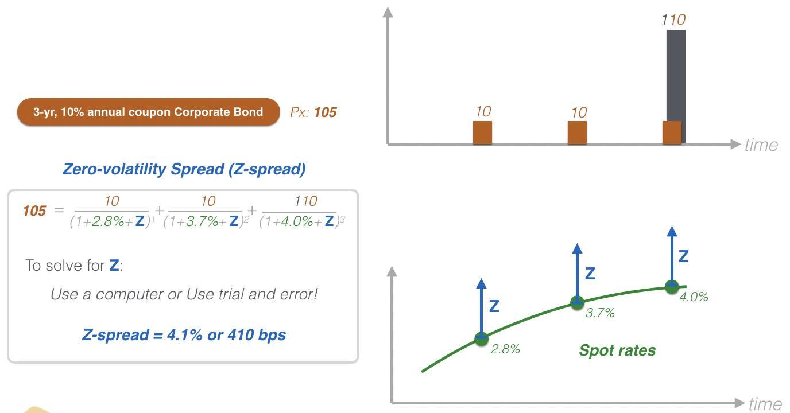

## Table of Contents

## What is an option-adjusted spread (OAS)?

An option-adjusted spread (OAS) is a measure used in finance to evaluate the value of bonds with embedded options, like callable or putable bonds. It helps investors understand the extra yield they get from a bond compared to a similar bond without options, after considering the impact of those options. Think of it as a way to see how much more return you're getting for the risk you're taking with the bond's options.

Calculating OAS involves complex math that looks at many possible future interest rate scenarios. This helps to figure out the average extra yield the bond offers over a risk-free bond, like a Treasury bond, after accounting for the options. By using OAS, investors can make better decisions about whether a bond is a good investment, considering both its yield and the risks from its embedded options.

## What is a zero-volatility spread (Z-spread)?

A zero-volatility spread, or Z-spread, is a way to measure how much extra return, or yield, an investor gets from a bond compared to a risk-free bond like a Treasury bond. It's called "zero-volatility" because it assumes that interest rates won't change in the future. To find the Z-spread, you add a constant spread to the yield of the risk-free bond at each point along the yield curve. This spread is what makes the present value of the bond's cash flows equal to its current market price.

The Z-spread is useful for comparing bonds that don't have options, like callable or putable bonds. It gives investors a clear picture of the bond's yield without having to worry about the impact of changing interest rates. By understanding the Z-spread, investors can better assess if a bond is a good investment based on the extra yield it offers over a risk-free bond.

## How are option-adjusted spreads calculated?

Option-adjusted spreads are calculated by figuring out the average extra yield a bond gives compared to a risk-free bond, after considering the effect of any options the bond has. To do this, you start by creating many different scenarios for what might happen to interest rates in the future. Each scenario shows a possible path that interest rates could take. Then, you use these scenarios to calculate the bond's value, taking into account the options it has, like being callable or putable.

Next, you compare the bond's value in each scenario to the value of a similar bond without options. The difference in value between the two bonds in each scenario is the spread. You then average these spreads across all the scenarios to get the option-adjusted spread. This average spread tells you how much extra yield you can expect from the bond, after considering the impact of its options and the uncertainty of future interest rates.

## How are zero-volatility spreads calculated?

Zero-volatility spreads, or Z-spreads, are calculated by figuring out the extra return, or yield, a bond gives compared to a risk-free bond like a Treasury bond. To do this, you take the yield curve of the risk-free bond and add a constant spread to it at every point. This spread is what makes the present value of all the bond's future cash flows equal to its current market price. You keep adjusting this spread until the present value matches the market price.

The Z-spread is useful because it assumes that interest rates won't change in the future, which is why it's called "zero-volatility." This makes it easier to compare bonds that don't have options, like callable or putable bonds. By using the Z-spread, investors can see the extra yield they're getting from the bond without having to worry about how changing interest rates might affect it.

## What are the main differences between OAS and Z-spread?

The main difference between option-adjusted spread (OAS) and zero-volatility spread (Z-spread) is how they handle the impact of interest rate changes and bond options. OAS takes into account the possibility of interest rates changing in the future and the effects of any options the bond might have, like being callable or putable. It does this by creating many different scenarios for future interest rates and then calculating the average extra yield the bond offers over a risk-free bond across all these scenarios. This makes OAS a more complex but also more realistic measure for bonds with options.

On the other hand, Z-spread assumes that interest rates will stay the same in the future, which is why it's called "zero-volatility." It calculates the extra yield a bond gives compared to a risk-free bond by adding a constant spread to the yield curve of the risk-free bond at every point. This spread is adjusted until the present value of the bond's cash flows equals its current market price. Z-spread is simpler to calculate and is best used for bonds without options, as it doesn't account for the potential impact of changing interest rates or bond options.

## In what types of securities are OAS and Z-spread typically used?

OAS is mainly used for bonds that have options built into them, like callable or putable bonds. These options give the issuer or the bondholder the right to do something, like calling back the bond before it matures or putting it back to the issuer. Because these options can change the bond's value depending on what happens with interest rates, OAS helps investors see the extra yield they get from the bond after considering these options and the uncertainty of future interest rates. So, OAS is a good tool for figuring out the value of mortgage-backed securities, asset-backed securities, and other bonds with options.

Z-spread, on the other hand, is used for bonds that don't have options, like corporate bonds or government bonds. Since these bonds don't have options that can affect their value, Z-spread focuses on the extra yield they offer over a risk-free bond like a Treasury bond. Z-spread is simpler because it assumes interest rates won't change in the future. This makes it a useful measure for investors who want to compare the yield of different bonds without worrying about interest rate changes.

## Why would an investor prefer to use OAS over Z-spread?

An investor would prefer to use OAS over Z-spread if they are looking at bonds that have options, like callable or putable bonds. OAS helps investors see the extra return they can get from these bonds after taking into account the options and the chance that interest rates might change. This is really important because the options can make the bond's value go up or down depending on what happens with interest rates. So, OAS gives a more complete picture of the bond's value and helps investors make better decisions about whether it's a good investment.

On the other hand, Z-spread doesn't look at options or the chance that interest rates might change. It's simpler because it assumes interest rates will stay the same, which is good for bonds without options. But if an investor is looking at bonds with options, using Z-spread might not give them the full story. That's why OAS is a better choice for these kinds of bonds. It gives a more realistic view of the bond's value by considering all the possible scenarios for future interest rates and the impact of the options.

## Under what conditions is Z-spread more appropriate than OAS?

Z-spread is more appropriate than OAS when you're looking at bonds that don't have options, like regular corporate bonds or government bonds. These bonds don't give the issuer or the bondholder any special rights, so you don't need to worry about how options might change the bond's value. Z-spread is simpler because it assumes that interest rates won't change in the future. This makes it easier to compare the extra yield you get from these bonds over a risk-free bond like a Treasury bond.

If you're trying to figure out the value of a bond without options, Z-spread gives you a clear picture of the bond's yield without the added complexity of considering different interest rate scenarios. It's like looking at a straightforward path instead of a bunch of possible paths. So, if you want a simple way to see how much more return you're getting from a bond without options, Z-spread is the better choice.

## How do interest rate volatility and embedded options impact OAS and Z-spread?

Interest rate volatility and embedded options have a big effect on the option-adjusted spread (OAS). OAS is used for bonds with options like callable or putable bonds. These options can change the bond's value depending on what happens with interest rates. If interest rates are expected to change a lot, this can make the bond's value go up or down more because of the options. OAS takes this into account by looking at many different possible future interest rate scenarios. It then figures out the average extra return the bond gives over a risk-free bond after considering these scenarios and the options. So, if interest rates are very volatile, OAS will show a different value compared to when rates are stable.

On the other hand, the zero-volatility spread (Z-spread) doesn't consider interest rate volatility or embedded options. Z-spread is used for bonds without options, like regular corporate or government bonds. It assumes that interest rates will stay the same in the future, which is why it's called "zero-volatility." Because it doesn't look at different interest rate scenarios or options, Z-spread gives a simpler view of the bond's extra yield over a risk-free bond. If you use Z-spread on a bond with options, it won't show you the full picture because it ignores how the options might affect the bond's value if interest rates change.

## Can you provide a case study comparing OAS and Z-spread in a specific bond?

Let's look at a case study with a callable corporate bond to compare OAS and Z-spread. Imagine a company issues a bond with a face value of $1,000 that pays a 5% annual coupon and matures in 10 years. The bond can be called back by the issuer after 5 years. Right now, the bond is trading at $1,050 in the market. When we calculate the Z-spread, we assume interest rates won't change and find that the Z-spread is 100 basis points over the Treasury yield curve. This means the bond offers an extra 1% yield compared to a similar Treasury bond, but it doesn't consider the fact that the bond can be called back early.

Now, let's look at the OAS for the same bond. OAS takes into account the possibility of the bond being called back and the chance that interest rates might go up or down. We create many different scenarios for future interest rates and figure out what the bond's value would be in each one. After averaging these scenarios, we find that the OAS is 75 basis points. This is lower than the Z-spread because OAS considers the risk of the bond being called back, which could happen if interest rates drop and the issuer decides to issue new bonds at a lower rate. So, OAS gives a more realistic view of the bond's extra yield, showing that the bond's value might not be as high as the Z-spread suggests because of the callable option.

## How do changes in the yield curve affect the calculations of OAS and Z-spread?

Changes in the yield curve can really change how we calculate the option-adjusted spread (OAS). OAS looks at many different possible future interest rate scenarios, and the yield curve is a big part of these scenarios. If the yield curve changes, like if it gets steeper or flatter, it means the interest rates at different times in the future are different. This can change how likely it is that a bond with options, like a callable bond, will be called back. So, when the yield curve changes, OAS has to look at new scenarios and might show a different extra yield for the bond.

The zero-volatility spread (Z-spread) also changes when the yield curve moves, but in a simpler way. Z-spread adds a constant spread to the yield curve at every point to find the extra yield a bond gives over a risk-free bond. If the yield curve changes, the Z-spread has to be recalculated to make sure the present value of the bond's cash flows still matches its market price. But because Z-spread assumes interest rates won't change in the future, it doesn't look at different scenarios like OAS does. So, changes in the yield curve affect Z-spread in a more straightforward way, just by changing the base yield curve that the spread is added to.

## What advanced modeling techniques are used to refine OAS and Z-spread calculations?

To make OAS calculations more accurate, advanced modeling techniques like Monte Carlo simulations are often used. These simulations create many different possible future paths for interest rates, which helps to see how a bond with options might behave in different situations. By running these simulations, we can get a better idea of the average extra yield the bond offers over a risk-free bond, after considering all the possible scenarios. Another technique used is binomial tree modeling, which breaks down the bond's life into small steps and looks at the options at each step. This helps to figure out the best times for the bond to be called or put, making the OAS more precise.

For Z-spread calculations, advanced techniques like bootstrapping are used to get a more accurate yield curve. Bootstrapping helps to find the right interest rates at different points along the yield curve by using the prices of risk-free bonds. This makes sure the Z-spread is based on a solid foundation. Another technique is to use optimization methods to find the Z-spread that makes the present value of the bond's cash flows match its market price as closely as possible. These methods help to refine the Z-spread and make it a more reliable measure of the bond's extra yield over a risk-free bond.

## What is an overview of understanding financial spreads?

A financial spread refers to the difference between two related prices, rates, or yields in financial contracts. It plays a pivotal role in understanding the valuation, risk, and potential returns associated with financial instruments. Financial spreads are a key tool for traders and investors as they provide insights into market dynamics, liquidity, and sentiment.

Spreads are often used to compare the difference between the bid and ask price of an asset, known as the bid-ask spread. This form of spread is a direct reflection of the [liquidity](/wiki/liquidity-risk-premium) and trading [volume](/wiki/volume-trading-strategy) in a market. Narrow bid-ask spreads typically indicate high liquidity and active trading, while wider spreads may suggest less liquidity and higher transaction costs.

In evaluating bonds or credit instruments, the spread is often measured against a benchmark rate, such as the yield on government securities. This is commonly referred to as the "credit spread." Credit spreads provide a measure of the additional yield an investor earns for taking on credit risk over a risk-free rate. The formula for calculating the yield spread is:

$$
\text{Spread} = \text{Yield of Instrument} - \text{Benchmark Yield}
$$

Spreads can also be used to assess the potential profitability of trading strategies. For instance, traders might engage in spread trading, where they take simultaneous long and short positions in related assets to profit from changes in the spread over time. Such strategies are essential in managing risk and capitalizing on market inefficiencies.

The ability to interpret spreads is critical for making informed decisions in both stable and volatile market conditions. By analyzing spreads, investors can gauge liquidity conditions, forecast market movements, and identify attractive investment opportunities. This analysis is an integral part of portfolio management, helping in optimizing asset allocation and risk management.

Overall, understanding financial spreads enables traders and investors to navigate the complexities of financial markets effectively. They serve not only as a measure of relative value but also as a strategic tool for enhancing investment decision-making.

## What is the Zero-Volatility Spread (Z-spread)?

The Zero-Volatility Spread (Z-spread) is a critical financial metric that provides a nuanced view of a bond’s potential yield by measuring the yield spread over the term structure of interest rates. This metric is particularly useful for evaluating bonds with embedded options, such as callable or puttable bonds, as it accounts for the yield differences that arise due to the presence of these options.

In technical terms, the Z-spread is the constant spread that needs to be added to the spot yield curve to equate the present value of a bond’s cash flows to its market price. Mathematically, the Z-spread can be expressed as an adjustment to the discount rate in the bond pricing formula:

$$
\text{Price} = \sum_{t=1}^{N} \frac{C_t}{(1 + r_t + \text{Z-spread})^t}
$$

where $C_t$ represents the cash flow at time $t$, $r_t$ denotes the spot rate for period $t$, and $N$ is the total number of periods.

Z-spreads provide invaluable insights for traders, especially in volatile market conditions, as they enable a thorough analysis of how changes in spreads impact bond valuations. This is crucial for mortgage-backed securities (MBS) and corporate bonds, where [interest rate](/wiki/interest-rate-trading-strategies) [volatility](/wiki/volatility-trading-strategies) and credit risk prominently influence pricing. By leveraging Z-spreads, investors can better predict shifts in market dynamics, thereby aiding in strategic portfolio modifications and risk management.

For mortgage-backed securities and corporate bonds, the Z-spread becomes a versatile tool. In MBS, the Z-spread reflects prepayment risks alongside interest rate changes, while in corporate bonds, it addresses credit risk over the term structure.

Traders and portfolio managers who adeptly utilize Z-spreads can enhance investment analysis and make informed decisions concerning asset allocation and portfolio diversification. Understanding Z-spreads aids in discerning the true yield potential of bonds in varying market contexts, facilitating optimally balanced and responsive investment portfolios.

## What is Option-Adjusted Spread (OAS)?

Option-Adjusted Spread (OAS) explicitly accounts for the effects of embedded options within financial securities, providing a refined mechanism for evaluating risk and return. Unlike traditional spread measures, OAS adjusts the spread to reflect the fair value of options embedded in bonds, such as call or put features. This adjustment is critical because embedded options can significantly influence a bond's value, particularly in response to interest rate fluctuations.

Calculating OAS involves comparing the security's yield to a benchmark curve, after accounting for the value of the embedded options. This spread is particularly useful for securities with embedded options, such as callable bonds and mortgage-backed securities (MBS). The OAS effectively isolates the non-option-related component of the bond's yield, offering a clearer view of expected returns.

$$
\text{OAS} = \text{Z-spread} - \text{Option Cost}
$$

Where:
- $\text{Z-spread}$ is the spread required to discount the bond's cash flows to its market price assuming a static interest rate.
- $\text{Option Cost}$ represents the valuation adjustment for the embedded options.

Utilizing OAS is instrumental in assessing the profitability and risk of fixed-income securities. For instance, in callable bonds, where the issuer possesses the right to redeem the bond before maturity, the OAS provides a more comprehensive understanding of the bond's true yield by factoring in various interest rate scenarios and the probability of the call option being exercised.

For investors and portfolio managers, OAS is a powerful tool for strategizing bond portfolios to meet specific investment goals. By offering a nuanced view of how embedded options affect potential yields, OAS assists investors in making informed decisions regarding which securities to hold or trade. This detailed analysis of risk-adjusted returns helps in aligning bond investments with broader investment objectives, particularly in environments characterized by interest rate volatility. 

Thus, the utilization of OAS extends beyond merely being an analytical metric; it is integral to the formulation of strategic bond investment decisions that balance risk and reward effectively.

## What is the difference between Zero-Volatility Spread and Option-Adjusted Spread?

Zero-Volatility Spread (Z-spread) and Option-Adjusted Spread (OAS) are fundamental tools used to evaluate bond yields, yet they differ in their approach and application. Both aim to offer insights into potential yields but do so by incorporating different financial elements.

Z-spread, often referred to as the static spread, offers a baseline measure by focusing on interest rate risks. It is calculated over the entire term structure of interest rates, assuming the bond cash flows are fixed and devoid of any options. This spread is instrumental in understanding how changes in forecasted interest rates can impact the valuation of a bond, providing a linear adjustment to account for interest rate variance. 

Mathematically, the Z-spread is the constant yield spread added to a risk-free spot rate curve, such that the discounted cash flows of the bond equal its market price. It can be represented as:

$$
\text{Price} = \sum_{t=1}^N \frac{\text{Cash Flow}_t}{(1 + r_t + \text{Z-spread})^t}
$$

where $r_t$ is the risk-free rate at time $t$.

In contrast, the Option-Adjusted Spread (OAS) adjusts for the impact of embedded options within a bond. This spread refines the Z-spread by factoring in the various paths interest rates might take, considering the prepayment or call features. OAS, therefore, portrays a more dynamic analysis, catering to options that might be exercised under certain interest rate environments, thus offering a broader perspective on risk and return potential. This adjustment provides traders a better understanding of the true economic cost of options embedded within securities.

The key distinction between these spreads lies in Z-spread's focus on interest rate risk and OAS's incorporation of option-related risks. While the Z-spread offers a tidy uniform adjustment over interest rates, OAS investigates into the stochastic nature of interest rates and option exercises, making it particularly useful for bonds with embedded options such as callable bonds or mortgage-backed securities.

Understanding the practical applications of Z-spread and OAS is crucial for traders and investors. The Z-spread is often used in markets where bonds have no embedded options, providing insights into the straightforward interest rate environment. OAS, with its flexibility in adjusting for options, proves invaluable in more complex securities. It helps traders and portfolio managers align strategies with their risk tolerance and market outlook, optimizing returns. 

By appreciating these differences, savvy investors can tailor their strategies accordingly, harnessing the fuller scope of financial forecasting and risk management offered by these analytical spreads.

## References & Further Reading

[1]: Tuckman, B., & Serrat, A. (2012). ["Fixed Income Securities: Tools for Today's Markets."](https://www.wiley.com/en-us/Fixed+Income+Securities%3A+Tools+for+Today%27s+Markets%2C+4th+Edition-p-9781119835554) John Wiley & Sons.

[2]: Fabozzi, F. J. (2007). ["Fixed Income Analysis."](https://books.google.com/books/about/Fixed_Income_Analysis.html?id=lujLawVLS3YC) CFA Institute Investment Series.

[3]: Hagan, P. S., Kumar, D., Lesniewski, A. S., & Woodward, D. E. (2002). ["Managing Smile Risk."](https://www.researchgate.net/publication/235622441_Managing_Smile_Risk) Wilmott Magazine. 

[4]: Jha, R. (2020). ["Bond & Money Markets: Strategy, Trading, Analysis."](https://books.google.com/books/about/Bond_and_Money_Markets.html?id=c1N36C7LxU4C) CBS Publishers & Distributors.

[5]: ["Option Adjusted Spread (OAS) - Understanding an Important Bond Metric"](https://www.investopedia.com/terms/o/optionadjustedspread.asp) by Investopedia.

[6]: Hull, J. C. (2018). ["Options, Futures, and Other Derivatives."](https://www.semanticscholar.org/paper/Options%2C-Futures%2C-and-Other-Derivatives-Hull/89bdee500c8623864fc9eb7a471546aa713acc44) Pearson Education.