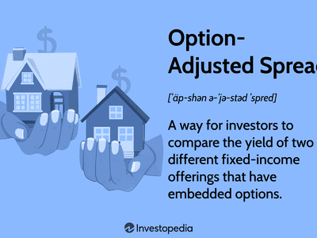

In finance, understanding various types of spreads is crucial for traders and investors alike. Financial spreads serve as key indicators in evaluating risk, return potential, and market sentiment. Among the array of spreads, the Zero-Volatility Spread (Z-spread) and Option-Adjusted Spread (OAS) stand out for their significance in both theoretical analysis and practical application. These spreads are particularly useful in the context of bond investments, derivatives, and complex financial portfolios.

The Z-spread measures the constant spread that must be added to the spot rate Treasury curve to equate the present value of a bond’s cash flows to its market price, providing insights into a bond's yield relative to a risk-free rate. It takes into account the entire yield curve, allowing for an assessment of potential yield changes due to shifts in market conditions. This makes it particularly applicable when analyzing mortgage-backed securities and corporate bonds, helping investors navigate volatile market environments by better understanding yield movements.



On the other hand, the Option-Adjusted Spread adjusts the Z-spread by factoring in the value of embedded options within securities, such as callable bonds. This allows traders to account for the optionality component, offering a more accurate measure of a bond’s risk-adjusted return. OAS becomes indispensable when assessing fixed income securities with embedded options, as it provides a means to analyze and manage the additional risks posed by these options.

Algorithmic trading, which relies on computational algorithms to execute trades efficiently, increasingly incorporates these spreads to optimize decision-making. By factoring Z-spread and OAS into trading algorithms, traders can achieve greater accuracy and speed in predicting price movements, ultimately enhancing trading performance. These sophisticated trading strategies allow investors to automate responses to market fluctuations and manage large datasets effectively, ensuring optimal trade execution.

Overall, mastering the concepts of Z-spread and OAS is imperative for any modern trader. Their integration into algorithmic trading not only highlights the convergence of traditional finance and technology but also underscores the importance of quantitative analysis in developing robust trading strategies. Understanding and leveraging these financial spreads empower traders to optimize portfolio returns, align with investment objectives, and mitigate potential risks, thus becoming indispensable instruments in contemporary financial markets.

## Table of Contents

## Understanding Financial Spreads: An Overview

A financial spread refers to the difference between two related prices, rates, or yields in financial contracts. It plays a pivotal role in understanding the valuation, risk, and potential returns associated with financial instruments. Financial spreads are a key tool for traders and investors as they provide insights into market dynamics, liquidity, and sentiment.

Spreads are often used to compare the difference between the bid and ask price of an asset, known as the bid-ask spread. This form of spread is a direct reflection of the [liquidity](/wiki/liquidity-risk-premium) and trading [volume](/wiki/volume-trading-strategy) in a market. Narrow bid-ask spreads typically indicate high liquidity and active trading, while wider spreads may suggest less liquidity and higher transaction costs.

In evaluating bonds or credit instruments, the spread is often measured against a benchmark rate, such as the yield on government securities. This is commonly referred to as the "credit spread." Credit spreads provide a measure of the additional yield an investor earns for taking on credit risk over a risk-free rate. The formula for calculating the yield spread is:

$$
\text{Spread} = \text{Yield of Instrument} - \text{Benchmark Yield}
$$

Spreads can also be used to assess the potential profitability of trading strategies. For instance, traders might engage in spread trading, where they take simultaneous long and short positions in related assets to profit from changes in the spread over time. Such strategies are essential in managing risk and capitalizing on market inefficiencies.

The ability to interpret spreads is critical for making informed decisions in both stable and volatile market conditions. By analyzing spreads, investors can gauge liquidity conditions, forecast market movements, and identify attractive investment opportunities. This analysis is an integral part of portfolio management, helping in optimizing asset allocation and risk management.

Overall, understanding financial spreads enables traders and investors to navigate the complexities of financial markets effectively. They serve not only as a measure of relative value but also as a strategic tool for enhancing investment decision-making.

## The Zero-Volatility Spread (Z-spread)

The Zero-Volatility Spread (Z-spread) is a critical financial metric that provides a nuanced view of a bond’s potential yield by measuring the yield spread over the term structure of interest rates. This metric is particularly useful for evaluating bonds with embedded options, such as callable or puttable bonds, as it accounts for the yield differences that arise due to the presence of these options.

In technical terms, the Z-spread is the constant spread that needs to be added to the spot yield curve to equate the present value of a bond’s cash flows to its market price. Mathematically, the Z-spread can be expressed as an adjustment to the discount rate in the bond pricing formula:

$$
\text{Price} = \sum_{t=1}^{N} \frac{C_t}{(1 + r_t + \text{Z-spread})^t}
$$

where $C_t$ represents the cash flow at time $t$, $r_t$ denotes the spot rate for period $t$, and $N$ is the total number of periods.

Z-spreads provide invaluable insights for traders, especially in volatile market conditions, as they enable a thorough analysis of how changes in spreads impact bond valuations. This is crucial for mortgage-backed securities (MBS) and corporate bonds, where [interest rate](/wiki/interest-rate-trading-strategies) [volatility](/wiki/volatility-trading-strategies) and credit risk prominently influence pricing. By leveraging Z-spreads, investors can better predict shifts in market dynamics, thereby aiding in strategic portfolio modifications and risk management.

For mortgage-backed securities and corporate bonds, the Z-spread becomes a versatile tool. In MBS, the Z-spread reflects prepayment risks alongside interest rate changes, while in corporate bonds, it addresses credit risk over the term structure.

Traders and portfolio managers who adeptly utilize Z-spreads can enhance investment analysis and make informed decisions concerning asset allocation and portfolio diversification. Understanding Z-spreads aids in discerning the true yield potential of bonds in varying market contexts, facilitating optimally balanced and responsive investment portfolios.

## Understanding Option-Adjusted Spread (OAS)

Option-Adjusted Spread (OAS) explicitly accounts for the effects of embedded options within financial securities, providing a refined mechanism for evaluating risk and return. Unlike traditional spread measures, OAS adjusts the spread to reflect the fair value of options embedded in bonds, such as call or put features. This adjustment is critical because embedded options can significantly influence a bond's value, particularly in response to interest rate fluctuations.

Calculating OAS involves comparing the security's yield to a benchmark curve, after accounting for the value of the embedded options. This spread is particularly useful for securities with embedded options, such as callable bonds and mortgage-backed securities (MBS). The OAS effectively isolates the non-option-related component of the bond's yield, offering a clearer view of expected returns.

$$
\text{OAS} = \text{Z-spread} - \text{Option Cost}
$$

Where:
- $\text{Z-spread}$ is the spread required to discount the bond's cash flows to its market price assuming a static interest rate.
- $\text{Option Cost}$ represents the valuation adjustment for the embedded options.

Utilizing OAS is instrumental in assessing the profitability and risk of fixed-income securities. For instance, in callable bonds, where the issuer possesses the right to redeem the bond before maturity, the OAS provides a more comprehensive understanding of the bond's true yield by factoring in various interest rate scenarios and the probability of the call option being exercised.

For investors and portfolio managers, OAS is a powerful tool for strategizing bond portfolios to meet specific investment goals. By offering a nuanced view of how embedded options affect potential yields, OAS assists investors in making informed decisions regarding which securities to hold or trade. This detailed analysis of risk-adjusted returns helps in aligning bond investments with broader investment objectives, particularly in environments characterized by interest rate volatility. 

Thus, the utilization of OAS extends beyond merely being an analytical metric; it is integral to the formulation of strategic bond investment decisions that balance risk and reward effectively.

## Zero-Volatility Spread vs. Option-Adjusted Spread

Zero-Volatility Spread (Z-spread) and Option-Adjusted Spread (OAS) are fundamental tools used to evaluate bond yields, yet they differ in their approach and application. Both aim to offer insights into potential yields but do so by incorporating different financial elements.

Z-spread, often referred to as the static spread, offers a baseline measure by focusing on interest rate risks. It is calculated over the entire term structure of interest rates, assuming the bond cash flows are fixed and devoid of any options. This spread is instrumental in understanding how changes in forecasted interest rates can impact the valuation of a bond, providing a linear adjustment to account for interest rate variance. 

Mathematically, the Z-spread is the constant yield spread added to a risk-free spot rate curve, such that the discounted cash flows of the bond equal its market price. It can be represented as:

$$
\text{Price} = \sum_{t=1}^N \frac{\text{Cash Flow}_t}{(1 + r_t + \text{Z-spread})^t}
$$

where $r_t$ is the risk-free rate at time $t$.

In contrast, the Option-Adjusted Spread (OAS) adjusts for the impact of embedded options within a bond. This spread refines the Z-spread by factoring in the various paths interest rates might take, considering the prepayment or call features. OAS, therefore, portrays a more dynamic analysis, catering to options that might be exercised under certain interest rate environments, thus offering a broader perspective on risk and return potential. This adjustment provides traders a better understanding of the true economic cost of options embedded within securities.

The key distinction between these spreads lies in Z-spread's focus on interest rate risk and OAS's incorporation of option-related risks. While the Z-spread offers a tidy uniform adjustment over interest rates, OAS investigates into the stochastic nature of interest rates and option exercises, making it particularly useful for bonds with embedded options such as callable bonds or mortgage-backed securities.

Understanding the practical applications of Z-spread and OAS is crucial for traders and investors. The Z-spread is often used in markets where bonds have no embedded options, providing insights into the straightforward interest rate environment. OAS, with its flexibility in adjusting for options, proves invaluable in more complex securities. It helps traders and portfolio managers align strategies with their risk tolerance and market outlook, optimizing returns. 

By appreciating these differences, savvy investors can tailor their strategies accordingly, harnessing the fuller scope of financial forecasting and risk management offered by these analytical spreads.

## The Role of Algorithmic Trading in Financial Spreads

Algorithmic trading, a cornerstone of modern financial markets, emphasizes speed and precision through the use of advanced algorithms. These algorithms are adept at managing complex calculations and data analyses, essential for effectively trading financial spreads like Zero-Volatility Spread (Z-spread) and Option-Adjusted Spread (OAS). The integration of these spreads within [algorithmic trading](/wiki/algorithmic-trading) frameworks significantly enhances the precision of predicting price movements by providing a nuanced understanding of potential yields and risks associated with financial instruments.

Incorporating Z-spread and OAS into trading algorithms provides a rich source of data for making informed trading decisions. The Z-spread informs algorithms about the yield spread over the benchmark yield curve, helping identify under- or over-priced bonds. Meanwhile, OAS adjusts for embedded options such as call or put options, refining the yield measurement to adapt to potential option exercises by issuers. This refined data enables algorithms to forecast more accurate price movements and yield opportunities.

The enhancement of trading efficiency through algorithms is primarily due to automation, allowing systems to react instantly to market changes. By leveraging these spread insights, trading algorithms can make informed decisions in milliseconds, a speed unattainable by human traders. This capability is crucial in exploiting small and transient price differentials across markets, commonly referred to as [arbitrage](/wiki/arbitrage) opportunities.

In practice, trading firms deploy these algorithms to sift through extensive financial data, identifying patterns and trends that might not be immediately evident to human analysts. The algorithms are not only programmed to recognize these patterns but also to execute trades accordingly, optimizing entry and [exit](/wiki/exit-strategy) points to maximize trading gains. Here’s a simple Python example using a hypothetical trading model with spreads:

```python
def calculate_z_spread(bond_yield, benchmark_yield_curve):
    spread = bond_yield - benchmark_yield_curve
    return spread

def evaluate_oas(spread, option_cost):
    adjusted_spread = spread - option_cost
    return adjusted_spread

# Example usage:
bond_yield = 0.05  # 5% bond yield
benchmark_yield_curve = 0.03  # 3% benchmark
option_cost = 0.005  # Option cost of 0.5%

z_spread = calculate_z_spread(bond_yield, benchmark_yield_curve)
oas = evaluate_oas(z_spread, option_cost)

print(f"Z-Spread: {z_spread:.2%}")
print(f"Option-Adjusted Spread: {oas:.2%}")
```

Such algorithms can be scaled to accommodate vast trading operations, sifting through large datasets to detect and act upon optimum trading intervals. This efficiency not only helps in maximizing returns but also in minimizing risks by quickly adapting to market conditions. Thus, algorithmic trading continuously advances the efficacy of spread trading, highlighting the symbiotic relationship between technology and financial strategy in modern trading environments.

## Conclusion

Zero-Volatility Spread (Z-spread) and Option-Adjusted Spread (OAS) are essential tools in financial trading, offering unique insights into bond valuation and investment risk assessment. Their role in algorithmic trading reflects the advancements in modern finance that integrate traditional financial analysis with sophisticated technology, allowing for more precise and informed decision-making.

Understanding and applying Z-spread and OAS effectively enables traders and investors to enhance portfolio strategies. These tools assist in identifying and mitigating potential risks while capitalizing on viable investment opportunities. As financial markets grow more complex and competitive, proficiency in using such metrics will be increasingly vital for achieving favorable outcomes.

Ultimately, Z-spread and OAS are not merely technical metrics. They are critical components of a strategic framework that guides traders toward making sound investment decisions. By mastering these tools, finance professionals can navigate market volatility with enhanced confidence, ensure robust performance, and maximize returns on investments.

## References & Further Reading

[1]: Tuckman, B., & Serrat, A. (2012). ["Fixed Income Securities: Tools for Today's Markets."](https://www.wiley.com/en-us/Fixed+Income+Securities%3A+Tools+for+Today%27s+Markets%2C+4th+Edition-p-9781119835554) John Wiley & Sons.

[2]: Fabozzi, F. J. (2007). ["Fixed Income Analysis."](https://books.google.com/books/about/Fixed_Income_Analysis.html?id=lujLawVLS3YC) CFA Institute Investment Series.

[3]: Hagan, P. S., Kumar, D., Lesniewski, A. S., & Woodward, D. E. (2002). ["Managing Smile Risk."](https://www.researchgate.net/publication/235622441_Managing_Smile_Risk) Wilmott Magazine. 

[4]: Jha, R. (2020). ["Bond & Money Markets: Strategy, Trading, Analysis."](https://books.google.com/books/about/Bond_and_Money_Markets.html?id=c1N36C7LxU4C) CBS Publishers & Distributors.

[5]: ["Option Adjusted Spread (OAS) - Understanding an Important Bond Metric"](https://www.investopedia.com/terms/o/optionadjustedspread.asp) by Investopedia.

[6]: Hull, J. C. (2018). ["Options, Futures, and Other Derivatives."](https://www.semanticscholar.org/paper/Options%2C-Futures%2C-and-Other-Derivatives-Hull/89bdee500c8623864fc9eb7a471546aa713acc44) Pearson Education.