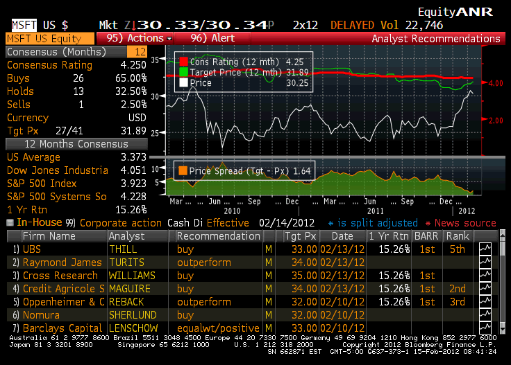

Options trading has become a fundamental aspect of today's financial markets. This investment approach provides investors the flexibility to either hedge their positions against potential losses or speculate on future price movements. The appeal of options lies in their inherent characteristics, allowing traders to gain exposure to an asset's price changes without owning the asset itself. Through options contracts, traders obtain the right, though not the obligation, to buy (call options) or sell (put options) a stock at a predetermined price before the contract's expiration date.

The evolution of digital financial platforms has greatly influenced options trading, making it more accessible and sophisticated than ever before. As we look ahead to 2024, the selection of an optimal options trading platform is increasingly crucial for traders seeking to maximize potential gains while managing risk effectively. This article explores foremost options trading platforms, assessing their financial tools, user interfaces, educational resources, and their integration with algorithmic trading systems.



Algorithmic trading has gained prominence for its ability to enhance trading strategies through automation and advanced data analysis. It empowers traders to execute intricate strategies quickly and accurately, often outperforming traditional manual methods. In options trading, algorithmic approaches can optimize trade execution processes, making them indispensable for high-frequency traders and those utilizing complex strategies.

This guide is designed to equip traders with the requisite knowledge and analytical tools to successfully navigate options trading in the coming year. By understanding the available trading platforms and their capabilities, traders can make informed choices aligned with their strategic goals and experience levels, thereby leveraging the full potential of options trading efficiently and effectively.

## Table of Contents

## Understanding Options Trading

Options trading is a crucial component of modern financial markets, offering participants strategic flexibility. At its core, an options contract is a financial derivative that offers the holder the right—but not the obligation—to buy (call option) or sell (put option) an underlying asset, usually stock, at a predetermined price, known as the strike price, before or at a specified expiry date.

The principal advantage of options is their capability to provide leverage. This means a trader can control a larger position with a relatively small amount of capital. For instance, purchasing a call option permits a trader to benefit from upward price movements in the stock with potentially lower risk compared to buying the stock outright. Conversely, a put option allows traders to hedge against or profit from decreases in the stock price, functioning as an insurance policy by securing a sell price.

Consider this example: A call option on stock XYZ with a strike price of $50 allows the trader to purchase XYZ shares at $50 before expiry, regardless of the current market price. If the market price exceeds $50, the trader can exercise the option to buy shares at the lower predefined price, potentially generating a profit. The call option formula can be mathematically expressed using Black-Scholes model parameters, $C = S_0N(d_1) - Ke^{-rt}N(d_2)$, where:
- $C$ is the call option price,
- $S_0$ is the current stock price,
- $K$ is the strike price,
- $r$ is the risk-free interest rate,
- $t$ is the time to maturity,
- $N$ is the cumulative distribution function of the standard normal distribution,
- $d_1$ and $d_2$ are variables derived from these parameters.

Options serve multifaceted purposes:
1. **Hedging**: Investors use options to offset potential losses in their investment portfolios. For example, buying put options can guard against stock price declines.
2. **Speculation**: Traders speculate on price directions, capitalizing on potential stock movements without owning the underlying asset.
3. **Income Generation**: Strategies like covered calls involve selling options to earn premium income while holding the underlying stock.

Due to their complexity, mastering options requires understanding specifics like implied [volatility](/wiki/volatility-trading-strategies), Greeks (Delta, Gamma, Theta, Vega), and other risk factors influencing option pricing. Robust trading platforms play a pivotal role in this context by providing the necessary tools and analytics to navigate these intricacies efficiently. Such platforms often offer real-time data, comprehensive option chains, and educational resources to support traders in making informed decisions.

Successful options trading involves comprehending these fundamental concepts and selecting platforms equipped to manage the inherent complexities, ultimately aiding traders in achieving their strategic financial goals in various market conditions.

## Top Options Trading Platforms of 2024

In 2024, selecting an optimal options trading platform requires evaluating various attributes tailored to different trader needs and expertise levels. Tastytrade is distinguished for its competitive pricing structures, making it particularly attractive for frequent options traders who prioritize cost-efficiency. Its user-friendly interface is designed to facilitate rapid trade execution, which can be crucial for traders engaging in numerous transactions.

[Interactive Brokers](/wiki/interactive-brokers-api) stands out as a comprehensive platform for advanced traders, especially those well-versed in [algorithmic trading](/wiki/algorithmic-trading). It provides a powerful suite of tools that support complex trading strategies and high-frequency trading. The platform’s API allows for the integration of custom trading algorithms, offering flexibility and functionality that appeal to technically adept users.

Charles Schwab's incorporation of the thinkorswim platform positions it as a top choice for intermediate traders. Its robust charting tools and analytical capabilities support strategic decision-making, allowing traders to thoroughly analyze market conditions before executing trades. The intuitive interface combined with extensive educational resources makes it ideal for those who are transitioning to more advanced trading.

Webull emerges as a cost-effective alternative for traders focused on minimizing trading expenses. Known for its zero-commission structure on options trading, it allows traders to maximize their profitability by reducing fees. Webull also offers a streamlined platform that caters to both beginners and those with experience, although it lacks some of the more intricate tools found on other platforms.

Each of these platforms provides distinguishing features catering to varied levels of trading experience and strategic priorities. By aligning platform capabilities with trader objectives, investors can optimize their options trading practices in 2024.

## Algorithmic Trading in Options

Algorithmic trading in options is a sophisticated approach that automates the execution of trades by following a set of predefined rules and algorithms. This type of trading is particularly effective in options markets, where the complexity and speed of transactions can benefit from automation. The core advantage of algorithmic trading lies in its ability to execute orders at a speed and frequency that human traders cannot match, enabling the implementation of complex strategies with high precision.

Platforms like TradeStation and Interactive Brokers are notable for providing comprehensive tools that facilitate the development and execution of algorithmic trading strategies. These platforms offer users access to powerful APIs and software development kits (SDKs), which allow traders to create custom algorithms tailored to their specific trading objectives. The process typically involves the use of historical data to backtest strategies, ensuring they are robust and effective before applying them in live markets.

Algorithmic trading is particularly advantageous for high-frequency trading ([HFT](/wiki/high-frequency-trading-strategies)), where the objective is to capture small price changes across a large number of trades executed within short time frames. HFT strategies often rely on intricate statistical and mathematical models to identify trading signals. Consider a simple mean-reversion strategy implemented in Python:

```python
import numpy as np
import pandas as pd
import yfinance as yf  # For more datasets, visit: https://paperswithbacktest.com/datasets

# Fetch historical data
def get_data(ticker, start, end):
    return yf.download(ticker, start=start, end=end)

# Define a simple mean-reversion signal
def mean_reversion_signal(prices, window=20):
    mean = prices.rolling(window=window).mean()
    std = prices.rolling(window=window).std()
    z_score = (prices - mean) / std
    return z_score

# Example usage
data = get_data("AAPL", "2023-01-01", "2023-12-31")
z_score = mean_reversion_signal(data['Close'])
signal = np.where(z_score > 1, -1, np.where(z_score < -1, 1, 0))  # -1: sell, 1: buy, 0: hold
```

This code snippet demonstrates a basic mean-reversion strategy, where trades are signaled when the price deviates significantly from its mean, as indicated by the z-score. Such strategies can be expanded and modified to include sophisticated [machine learning](/wiki/machine-learning) techniques or optimization algorithms for better performance.

When selecting a platform for algorithmic options trading, traders should consider factors such as the availability of real-time data, latency of order execution, and compatibility with various programming languages. Furthermore, robust risk management tools are essential to monitor and control the potential risks associated with automated trading systems.

Overall, as the complexity of options trading continues to grow, the integration of algorithmic trading provides traders with powerful means to enhance their strategies, optimize execution, and potentially improve trade outcomes.

## Financial Tools for Options Trading

Modern trading platforms are increasingly equipped with sophisticated financial tools, enhancing the options trading experience for both novice and seasoned traders. Among the essential tools offered are risk management features, options screeners, and advanced analytical tools.

Risk management tools are crucial in options trading due to its inherently volatile nature. They enable traders to set stop-loss orders, alerts, and execute hedging strategies to mitigate potential losses. These tools assist traders in maintaining a balanced portfolio by assessing and controlling exposure to market risks.

Options screeners are vital for identifying opportunities in the options market that align with a trader's strategic goals. These screeners allow users to filter options based on specific criteria such as expiration dates, contract [volume](/wiki/volume-trading-strategy), implied volatility, and strike prices. By utilizing options screeners, traders can pinpoint options that meet their expectations for risk and reward.

Advanced analytical tools provide traders with in-depth insights into market conditions and trends. Charles Schwab and tastytrade, for instance, offer comprehensive educational resources to enhance traders' understanding and execution capabilities. These platforms supply interactive charting tools, historical data analysis, and volatility metrics, empowering traders to make informed decisions based on quantitative data.

The role of educational content cannot be overstated. Platforms like Charles Schwab and tastytrade offer extensive educational materials, including webinars, tutorials, and market analysis, which are valuable in equipping traders with the knowledge required for effective trading. This content not only serves to educate but also helps traders adapt to the rapidly evolving options market landscape.

Quality customer support is another critical [factor](/wiki/factor-investing), offering traders assistance with technical issues and providing guidance on platform usage, thereby ensuring a seamless trading experience. The availability of responsive and knowledgeable support teams adds value to the trading platforms, enhancing the overall user experience.

In sum, the integration of robust financial tools into options trading platforms is vital for traders aiming to capitalize on market opportunities. With the right combination of tools, education, and support, traders can significantly improve their trading performance and capitalize on the dynamic options market.

## Conclusion

Selecting an optimal options trading platform is a nuanced decision that entails evaluating various factors such as pricing structures, available tools, educational resources, and customer support. Each element plays a significant role in determining the suitability of a platform for a trader’s specific needs. Pricing is typically a primary consideration, as it impacts the overall cost of trading and potential profitability. Platforms that offer competitive or zero-commission trading can be advantageous for cost-conscious traders, allowing them to maximize returns on their investments.

Algorithmic trading emerges as a vital feature for platforms aiming to cater to the needs of tech-savvy and high-frequency traders. This technology enables the automation of trading strategies through predefined rules and sophisticated algorithms, thus enhancing the efficiency and precision of executing trades. For traders interested in incorporating algorithmic trading into their strategies, platforms with robust algorithmic trading tools offer a distinct advantage.

Conducting thorough research and analysis is essential for traders to make informed platform selections. This involves evaluating not only the cost and features of a platform but also assessing its reliability, user experience, and the quality of its educational materials. Platforms that provide comprehensive educational content can empower traders by enhancing their market understanding and trading skills. Such resources are particularly beneficial for novice traders who are navigating the complexities of options trading for the first time.

With the right selection of tools and platforms, traders are well-equipped to effectively harness the potential of options trading in 2024. The integration of advanced technology and educational support can significantly influence a trader's success, enabling them to execute strategies with greater confidence and accuracy. Therefore, a well-considered platform choice is essential for any trader seeking to capitalize on the opportunities presented by options trading in the contemporary financial landscape.

## Frequently Asked Questions

### Frequently Asked Questions

**What is the best options trading platform for beginners?**

The best options trading platform for beginners is often one that combines user-friendly interfaces, comprehensive educational resources, and robust customer support. Webull is frequently recommended due to its intuitive design and zero-commission trading, making it accessible for those new to options trading. The platform offers detailed tutorials and a paper-trading feature, allowing beginners to practice trading without risking real capital. Additionally, the Charles Schwab platform, integrating the thinkorswim service, provides extensive educational materials and tools that are particularly beneficial for those at the start of their trading journey.

**How does algorithmic trading enhance options trading strategies?**

Algorithmic trading enhances options strategies by allowing traders to execute complex trading plans with speed and precision. It utilizes predefined rules and sophisticated algorithms to identify opportunities, reduce human error, and manage trades efficiently. Algorithms can assess multiple indicators and market conditions simultaneously, adjusting strategies in real-time to capitalize on market movements. For instance, traders can use algorithms to automatically execute delta-neutral strategies, balancing portfolios to minimize risk. As a result, algorithmic trading can significantly improve the performance and execution of strategies that rely on quick reaction to market changes.

**What should traders look for in a platform when integrating algorithmic trading?**

When integrating algorithmic trading, traders should prioritize platforms with advanced analytical tools, customizable programming environments, and reliable execution capabilities. Platforms like Interactive Brokers and TradeStation provide robust APIs that allow traders to develop and test trading algorithms efficiently. Traders should also consider the availability of historical data for [backtesting](/wiki/backtesting), as well as real-time data feeds to ensure the accuracy of their algorithms. Moreover, the platform should support multiple programming languages, such as Python or C++, enabling users to implement highly customized strategies. Reliable customer support and community forums can also aid in troubleshooting and optimizing algorithmic strategies.

**Are there platforms that offer zero-commission options trading?**

Yes, several platforms offer zero-commission options trading, making it easier for traders to manage costs and maximize profitability. Webull and Robinhood are leading platforms in this space, both providing commission-free trading for options. This can be especially advantageous for beginners or traders with smaller accounts, as it reduces the financial barrier to entering the market. While commission-free trading is beneficial, traders should also consider other potential costs, such as the bid-ask spread, and ensure that the platform offers the necessary features to support their trading strategies.

**How important is educational content in selecting an options trading platform?**

Educational content is crucial for selecting an options trading platform, particularly for beginners and intermediate traders. A platform that offers comprehensive educational resources can significantly affect a trader's ability to understand market mechanics and develop effective strategies. Platforms like Charles Schwab and tastytrade are known for providing quality educational materials, including tutorials, webinars, and market analysis, which can enhance a trader’s skills and confidence. Access to such resources ensures traders are well-informed and can make better decisions, ultimately contributing to a more favorable trading outcome.

## References & Further Reading

[1]: Bergstra, J., Bardenet, R., Bengio, Y., & Kégl, B. (2011). ["Algorithms for Hyper-Parameter Optimization."](https://papers.nips.cc/paper/4443-algorithms-for-hyper-parameter-optimization) Advances in Neural Information Processing Systems 24.

[2]: ["Advances in Financial Machine Learning"](https://www.amazon.com/Advances-Financial-Machine-Learning-Marcos/dp/1119482089) by Marcos Lopez de Prado

[3]: ["Evidence-Based Technical Analysis: Applying the Scientific Method and Statistical Inference to Trading Signals"](https://www.amazon.com/Evidence-Based-Technical-Analysis-Scientific-Statistical/dp/0470008741) by David Aronson

[4]: ["Machine Learning for Algorithmic Trading"](https://github.com/PacktPublishing/Machine-Learning-for-Algorithmic-Trading-Second-Edition) by Stefan Jansen

[5]: ["Quantitative Trading: How to Build Your Own Algorithmic Trading Business"](https://www.amazon.com/Quantitative-Trading-Build-Algorithmic-Business/dp/1119800064) by Ernest P. Chan