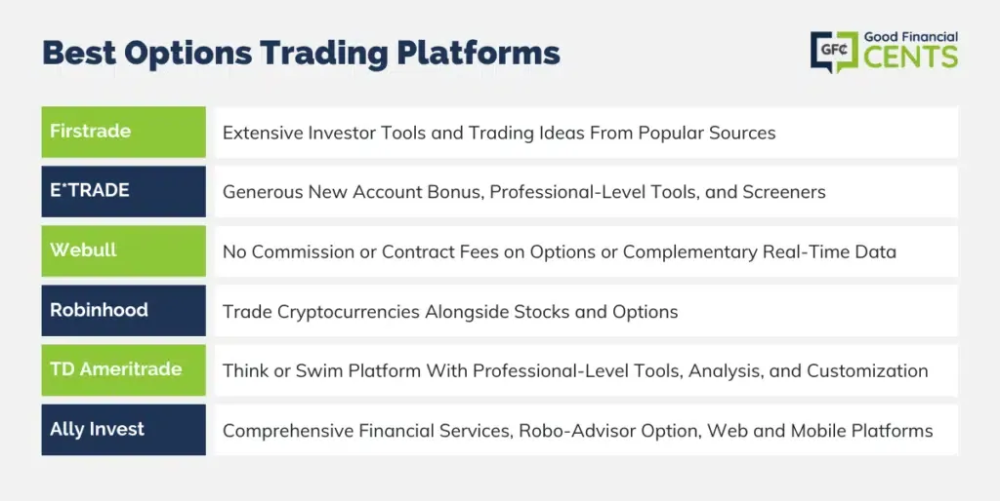

## Table of Contents

## What are the key features to look for in an options trading platform for beginners?

When choosing an options trading platform as a beginner, it's important to look for features that make learning and trading easier. A good platform should have a user-friendly interface that is easy to navigate. This means the design should be simple and the menus should be clear so you can find what you need without getting confused. It's also helpful if the platform offers educational resources like tutorials, videos, and guides. These can teach you about options trading and help you understand the different strategies you can use.

Another key feature to consider is the availability of a demo or paper trading account. This allows you to practice trading with fake money before you start using real money. It's a great way to get comfortable with the platform and test out your trading strategies without any risk. Additionally, make sure the platform has good customer support. If you have questions or run into problems, it's important to have access to helpful and responsive support staff who can guide you through the process.

Lastly, consider the fees and commissions charged by the platform. As a beginner, you want to keep your costs low so that you can maximize your potential profits. Look for a platform that offers competitive pricing and doesn't charge high fees for trades or account maintenance. By focusing on these features, you can find an options trading platform that supports your learning and helps you succeed as you start your trading journey.

## How do the fee structures of different options trading platforms compare in 2024?

In 2024, the fee structures of options trading platforms vary quite a bit. Some platforms charge a flat fee per options contract, which can be as low as $0.50 per contract. Others might charge a percentage of the trade value, which can be more costly for larger trades. For example, a platform might charge 0.1% of the total trade value, which means the more you trade, the more you pay in fees. There are also platforms that offer free trades up to a certain number of contracts per month, but then charge for any trades beyond that limit.

Another aspect to consider is the account maintenance fees. Some platforms have monthly or annual fees just for keeping your account open, which can range from $10 to $50 per year. These fees can add up over time, so it's important to check if there are ways to waive them, like maintaining a minimum account balance. Additionally, some platforms might charge extra for features like real-time data or advanced trading tools, which can be important for active traders but might not be necessary for beginners.

Overall, when comparing fee structures, it's crucial to look at the total cost of trading, including any hidden fees. A platform with low contract fees might seem attractive, but if it charges high maintenance fees or extra for essential tools, it might end up costing more in the long run. Always read the fine print and consider your trading habits to find a platform that offers the best value for your needs.

## What are the minimum account requirements for opening an options trading account across various platforms?

In 2024, different options trading platforms have different rules for how much money you need to start trading. Some platforms let you open an account with as little as $100, which is good for beginners who want to start with a small amount. Other platforms might ask for more, like $2,000 or even $25,000, especially if they want to make sure you have enough money to handle the risks of options trading. The amount you need can also depend on the type of options you want to trade, like basic options or more complex ones that need special approval.

It's also important to know that some platforms have different levels of trading. For example, you might be able to start trading with a smaller amount if you stick to basic options, but if you want to trade more advanced options, you might need more money in your account. Always check the platform's rules before you start, because they can change and you want to make sure you meet all the requirements. This way, you can pick a platform that fits your budget and trading goals.

## How user-friendly are the interfaces of top options trading platforms for new traders?

The interfaces of top options trading platforms in 2024 are designed to be easy for new traders to use. Platforms like Robinhood and Webull have simple designs that make it easy to find what you need. They use clear menus and buttons, so you can quickly buy and sell options without getting confused. These platforms also let you customize your screens, so you can set them up in a way that makes sense to you. This can help you feel more comfortable as you start trading.

Another platform, E*TRADE, also has a user-friendly interface. It has a tool called the "OptionsHouse" that shows you all the important information in one place. This makes it easier for beginners to understand what's going on with their trades. Plus, E*TRADE has a practice account where you can try trading without using real money. This is a great way for new traders to learn without risking their money. Overall, these platforms try to make trading as simple as possible for people who are just starting out.

## What types of educational resources and tools do options trading platforms offer to help beginners learn?

Options trading platforms offer a variety of educational resources to help beginners learn. Many platforms provide free online courses and tutorials that explain the basics of options trading. These courses often include videos, written guides, and interactive lessons that cover topics like how options work, different trading strategies, and risk management. Some platforms, like TD Ameritrade, have a whole section called "Education" where you can find these resources easily. They also offer webinars and live events where experts talk about options trading and answer questions from beginners.

In addition to courses, platforms often include tools that help new traders practice and learn. A popular tool is the paper trading or demo account, which lets you trade with fake money. This is a safe way to try out different strategies and get used to the platform without risking your own money. Platforms like E*TRADE and Webull have these demo accounts. They also provide tools like option screeners and risk analyzers, which help you understand the potential outcomes of your trades. These tools can show you graphs and charts that make it easier to see what might happen with your options, helping you learn as you go.

## How do the advanced charting and analysis tools differ among options trading platforms for experienced traders?

For experienced traders, options trading platforms offer a range of advanced charting and analysis tools that can greatly enhance their trading strategies. Platforms like Thinkorswim by TD Ameritrade provide comprehensive charting capabilities with customizable indicators and drawing tools. Traders can overlay multiple technical indicators, such as moving averages, Bollinger Bands, and Relative Strength Index (RSI), to analyze market trends and make informed decisions. Additionally, Thinkorswim offers advanced options analysis tools like the "Analyze" tab, which allows traders to simulate different options strategies and see potential profit and loss scenarios. This level of detail and customization is crucial for experienced traders who need precise data to refine their strategies.

Other platforms, such as [Interactive Brokers](/wiki/interactive-brokers-api)' Trader Workstation (TWS), also cater to experienced traders with sophisticated charting and analysis features. TWS includes real-time data feeds and advanced charting options that allow users to create complex charts with multiple time frames and data sets. Traders can use tools like the OptionTrader feature to analyze and trade options with detailed risk graphs and [volatility](/wiki/volatility-trading-strategies) metrics. This platform is known for its robust analytical capabilities, enabling traders to perform in-depth technical analysis and backtest their strategies using historical data. While both platforms offer powerful tools, the choice between them may depend on specific needs, such as the type of analysis preferred or the level of customization required.

## What are the options trading platforms' capabilities for real-time data and execution speed, crucial for expert traders?

For expert traders, real-time data and fast execution speed are very important. Platforms like Interactive Brokers are known for providing real-time data with very little delay. This means traders can see what's happening in the market right away and make quick decisions. Interactive Brokers also has fast execution speeds, which means when a trader decides to buy or sell, the order goes through almost instantly. This can be a big advantage in fast-moving markets where timing is everything.

Another platform, like Thinkorswim by TD Ameritrade, also offers strong real-time data and fast execution. Traders can see live data feeds that update in real time, helping them stay on top of market changes. Thinkorswim's execution speed is also very good, often completing trades in milliseconds. This is crucial for expert traders who need to act quickly to take advantage of market opportunities. Both platforms aim to give traders the tools they need to make fast, informed decisions.

## How do options trading platforms support mobile trading, and which platforms are best for trading on the go?

Many options trading platforms have apps that let you trade on your phone or tablet. These apps are made to be easy to use, even on a small screen. You can check your account, buy and sell options, and see real-time market data all from your mobile device. Platforms like Robinhood and Webull have very user-friendly mobile apps that work well for trading on the go. They have simple designs and quick access to the most important features, which makes it easy to trade anytime, anywhere.

For expert traders, platforms like Thinkorswim by TD Ameritrade and Interactive Brokers also offer strong mobile apps. These apps give you access to advanced charting tools and real-time data, just like on a computer. Thinkorswim's app is known for its powerful features and fast execution speeds, which are important for making quick trades. Interactive Brokers' app is also very good, with fast trade execution and detailed market information. Both of these platforms are great choices if you need to trade options while you're away from your desk.

## What are the options trading platforms' policies on margin trading and leverage, and how do they impact expert strategies?

Options trading platforms have different rules about margin trading and leverage, which can affect how expert traders use their strategies. Margin trading lets you borrow money from the platform to buy more options than you could with just your own money. This can make your potential profits bigger, but it also makes your potential losses bigger. Some platforms, like Interactive Brokers, let you use a lot of leverage, which means you can borrow a lot of money. This can be good for expert traders who know how to handle the extra risk. But if you're not careful, you could lose more money than you put in.

The amount of leverage you can use depends on the platform and your account type. For example, TD Ameritrade's Thinkorswim platform has different margin requirements based on the type of options you're trading. They might let you use more leverage for certain strategies, but less for others. This can impact how expert traders plan their moves. If a platform has strict rules on margin, traders might need to adjust their strategies to use less leverage, which can change how they approach the market. Knowing these rules is important for expert traders so they can use leverage in a way that fits their trading style and risk level.

## How do the platforms handle complex options strategies like iron condors or butterflies, and which are most suitable for these?

Options trading platforms like Thinkorswim by TD Ameritrade and Interactive Brokers are well-equipped to handle complex options strategies such as iron condors and butterflies. These platforms offer advanced tools that make it easy for traders to set up and manage these strategies. For example, Thinkorswim has a feature called "Strategy Roller" that helps you adjust your iron condor or butterfly positions as the market moves. This tool can automatically roll your positions to new strikes or expiration dates, which is very useful for managing risk and maximizing profits. Interactive Brokers also provides detailed options analytics and risk graphs, allowing traders to see the potential outcomes of their strategies in real-time.

Both platforms are suitable for trading complex options strategies, but they cater to different needs. Thinkorswim is known for its user-friendly interface and strong educational resources, which can be helpful if you're still learning how to use these strategies effectively. On the other hand, Interactive Brokers is favored by more experienced traders for its low fees and high level of customization. If you're an expert trader looking for precise control over your trades and the ability to handle large volumes, Interactive Brokers might be the better choice. Ultimately, the best platform for you will depend on your trading style, experience level, and what specific features you need to execute your complex options strategies successfully.

## What are the customer support options available on different platforms, and how responsive are they to traders' needs?

Different options trading platforms offer various customer support options to help traders. Some platforms, like Robinhood and Webull, provide 24/7 customer support through live chat, email, and phone. This means you can get help at any time, which is great if you have a question or problem outside of regular business hours. Other platforms, such as TD Ameritrade's Thinkorswim, also offer round-the-clock support but focus more on phone and email. They have a reputation for being very helpful and knowledgeable, which is important for traders who need detailed guidance on complex trading strategies.

The responsiveness of customer support can vary between platforms. Robinhood and Webull are known for quick responses, often getting back to you within minutes through live chat. This can be a big help when you need to make a quick decision. On the other hand, Interactive Brokers also offers good support but might take a bit longer to respond, especially during busy trading times. However, their support team is very experienced and can handle more advanced questions. Overall, the best platform for you will depend on how quickly you need help and the type of support you're looking for.

## How do options trading platforms integrate with third-party applications and APIs for advanced trading automation?

Options trading platforms often let you connect with other apps and tools through something called APIs, which stands for Application Programming Interfaces. This is really helpful for people who want to do advanced trading and automate their strategies. For example, Interactive Brokers has a strong API that lets you build your own trading programs. You can use it to automatically buy and sell options based on certain rules you set up. This can save you a lot of time and help you trade more efficiently. Platforms like TD Ameritrade's Thinkorswim also offer APIs, but they might be a bit more limited compared to Interactive Brokers. Still, they can help you connect with other tools to make your trading easier.

Not all platforms support APIs in the same way. Some, like Robinhood, don't offer an official API for options trading, which means you might not be able to automate your trades as easily. If you're looking to use third-party apps for things like advanced charting or risk analysis, you'll want to check if the platform you're using can connect with these tools. For example, platforms like Webull might let you use certain third-party apps, but the options might be more limited than what you'd find with Interactive Brokers or Thinkorswim. Choosing a platform that fits your needs for automation and integration can make a big difference in how you trade.

## References & Further Reading

[1]: Bergstra, J., Bardenet, R., Bengio, Y., & Kégl, B. (2011). ["Algorithms for Hyper-Parameter Optimization."](https://papers.nips.cc/paper/4443-algorithms-for-hyper-parameter-optimization) Advances in Neural Information Processing Systems 24.

[2]: ["Advances in Financial Machine Learning"](https://www.amazon.com/Advances-Financial-Machine-Learning-Marcos/dp/1119482089) by Marcos Lopez de Prado

[3]: ["Evidence-Based Technical Analysis: Applying the Scientific Method and Statistical Inference to Trading Signals"](https://www.amazon.com/Evidence-Based-Technical-Analysis-Scientific-Statistical/dp/0470008741) by David Aronson

[4]: ["Machine Learning for Algorithmic Trading"](https://github.com/PacktPublishing/Machine-Learning-for-Algorithmic-Trading-Second-Edition) by Stefan Jansen

[5]: ["Quantitative Trading: How to Build Your Own Algorithmic Trading Business"](https://www.amazon.com/Quantitative-Trading-Build-Algorithmic-Business/dp/1119800064) by Ernest P. Chan