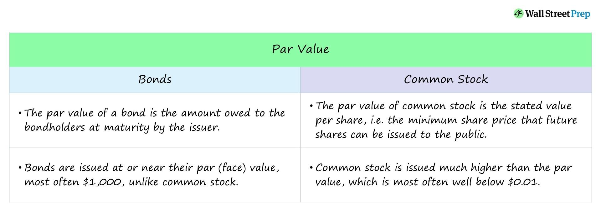

## Table of Contents

## What is par value?

Par value is a term used in finance that means the face value or the nominal value of a bond, stock, or other financial instrument. For bonds, it's the amount that the issuer agrees to pay back to the bondholder when the bond matures. For stocks, par value is a small, arbitrary amount set by the company when the stock is issued, and it's often much lower than the stock's market value.

Understanding par value is important because it helps in calculating interest payments for bonds. If a bond has a par value of $1,000 and an annual interest rate of 5%, the bondholder will receive $50 each year. For stocks, par value doesn't affect the stock's market price, but it can be important for accounting purposes, like when a company calculates its legal capital.

## What is market value?

Market value is the current price at which you can buy or sell something in the market. It's what people are willing to pay for it right now. For example, if you want to sell your car, the market value is what someone would actually pay you for it, not what you think it's worth or what you paid for it originally.

This value changes all the time because it depends on what buyers and sellers think is fair. For stocks, the market value is the price you see on the stock exchange. It goes up and down based on things like how well the company is doing, news about the company, and what's happening in the economy. For houses, the market value can change based on the neighborhood, how much people want to live there, and how many houses are for sale.

## How is par value determined for a stock?

When a company decides to issue stock, they set a par value for it. This is usually a small, fixed amount that doesn't change. It's like a minimum price for the stock, but it's not what the stock actually sells for in the market. Companies often set the par value very low, like $0.01 or even $0.001 per share, to make sure it's much less than what people will pay for the stock.

The par value doesn't have much to do with how much the stock is worth in the market. It's more of a legal and accounting thing. When a company issues stock, they have to keep track of the par value for their records. It helps them figure out their legal capital, which is the amount of money they need to keep in the business and can't pay out as dividends. So, while the par value is set when the stock is created, it's the market value that really matters to investors.

## How is market value determined for a stock?

The market value of a stock is the price you see when you want to buy or sell it on the stock market. This price changes all the time because it's based on what people are willing to pay for the stock right now. If more people want to buy the stock than sell it, the price goes up. If more people want to sell than buy, the price goes down. It's like a big auction where the price keeps changing until someone agrees to buy or sell.

Many things can affect the market value of a stock. How well the company is doing, like if they are making more money or not, can make the stock price go up or down. News about the company, like new products or problems, can also change the price. Even things happening in the world, like the economy or big events, can affect it. All these things together help decide what people think the stock is worth at any moment.

## Why is par value important for bonds?

Par value is important for bonds because it tells you how much money you will get back when the bond finishes, or matures. If you buy a bond with a par value of $1,000, that's the amount the company or government that issued the bond promises to pay you at the end. This makes it easier for you to know what to expect when you invest in a bond.

The par value also helps figure out how much interest you will get every year. If a bond has a par value of $1,000 and an interest rate of 5%, you will get $50 every year until the bond matures. This way, you can see how much money you will earn from the bond over time. Knowing the par value helps you plan your investments better.

## Can the market value of a stock be lower than its par value?

Yes, the market value of a stock can be lower than its par value. The market value is what people are willing to pay for the stock right now, and it can go up and down a lot. The par value is just a small, fixed number that the company sets when they make the stock. It's like a starting point, but it doesn't affect what the stock actually sells for in the market.

If a company is not doing well, or if people think it might have problems, they might not want to pay as much for its stock. This can make the market value drop below the par value. Even though the par value is usually very low, like $0.01 per share, the market value can still go lower if people think the stock is not worth much.

## How do par value and market value affect the perception of a company's stock?

Par value and market value can both affect how people see a company's stock, but in different ways. Par value is like a starting number that the company sets when they make the stock. It's usually a very small amount, like $0.01 per share, and it doesn't change. People don't really look at par value when they're deciding to buy or sell a stock. It's more of a legal and accounting thing, like a minimum price, but it doesn't say much about how good or bad the company is doing.

Market value, on the other hand, is what people are willing to pay for the stock right now. It changes all the time and can go up or down based on how well the company is doing, news about the company, and what's happening in the world. If the market value is high, people might think the company is doing well and want to buy its stock. If the market value is low, people might think the company is having problems and not want to buy its stock. So, market value is a big part of how people see a company's stock because it shows what they think it's worth right now.

## What role does par value play in accounting and financial reporting?

Par value is important in accounting and financial reporting because it helps companies keep track of their legal capital. Legal capital is the amount of money a company has to keep in the business and can't pay out as dividends. When a company issues stock, they record the par value of the stock as part of their legal capital. This means that the par value sets a minimum amount of money that has to stay in the company, which is important for protecting the company's financial health.

Even though par value is usually a very small number, like $0.01 per share, it's still important for financial reporting. When a company sells stock for more than the par value, the extra money is recorded as "additional paid-in capital" on the company's balance sheet. This helps show how much money the company got from selling its stock, and it's part of the company's total equity. So, while par value might not seem important to investors, it plays a key role in how a company keeps its books and reports its financial situation.

## How does market value reflect investor sentiment?

Market value shows what investors think about a company at any given time. It's like a big vote where everyone buying and selling the stock decides what they believe it's worth. If lots of people want to buy the stock, the market value goes up, showing that investors feel good about the company. They might think the company is doing well, making more money, or has exciting new plans. On the other hand, if many people want to sell the stock, the market value goes down. This can mean that investors are worried about the company, maybe because it's not doing well or there's bad news.

So, market value is a quick way to see how investors feel about a company. It changes all the time because people's opinions can change fast. Things like the company's earnings, news about new products, or even what's happening in the world can make investors feel differently about a company. By looking at the market value, you can get a good idea of whether investors are feeling hopeful or worried about the company's future.

## What are the implications of a significant difference between par value and market value?

When the market value of a stock is a lot different from its par value, it can mean different things. Par value is just a small number the company sets when they make the stock, usually something like $0.01 per share. It's not really about how much the stock is worth to investors. So if the market value is much higher than the par value, it shows that people really like the company and think it's doing well. They're willing to pay a lot more than the tiny par value because they believe the company will keep making money or grow.

On the other hand, if the market value is much lower than the par value, it might mean that people are worried about the company. Even though the par value is very small, the market value can still drop below it if investors think the company is in trouble. This big difference can make people think twice about buying the stock because it might seem risky. So, a big gap between par value and market value can tell us a lot about how investors feel about the company and its future.

## How do changes in interest rates impact the market value of bonds relative to their par value?

When interest rates go up, the market value of bonds usually goes down. This happens because new bonds will be issued with higher interest rates, making the old bonds with lower rates less attractive to investors. If you have a bond with a par value of $1,000 and a 5% interest rate, and new bonds are being issued at 6%, people will want the new bonds more. To sell your old bond, you might have to lower its price below the $1,000 par value, so its market value becomes less than its par value.

On the other hand, when interest rates go down, the market value of bonds usually goes up. If new bonds are issued with lower interest rates, like 4%, your old bond with a 5% rate looks better to investors. They'll be willing to pay more for your bond, so its market value can go above the $1,000 par value. This means you could sell your bond for more than what you'll get when it matures. So, changes in interest rates can make the market value of a bond move away from its par value, either up or down.

## What strategies can investors use to take advantage of discrepancies between par value and market value?

Investors can use a strategy called "buying at a discount" when the market value of a bond is lower than its par value. If you find a bond that's selling for less than what it will be worth when it matures, you can buy it at a lower price and then hold onto it until it reaches its par value. For example, if a bond with a par value of $1,000 is selling for $950, you can buy it for $950 and then get $1,000 back when it matures. This way, you make a profit of $50. This strategy works well when interest rates are expected to go down because the bond's market value will likely go up as it gets closer to its par value.

Another strategy is to sell bonds when their market value is higher than their par value. If interest rates go down and the market value of your bond goes up to $1,050, you can sell it for a profit of $50 over its par value of $1,000. This is good if you think interest rates will stay low or go even lower. But you need to be careful because if interest rates go up, the market value of your bond could drop below its par value, and you might lose money if you have to sell it then. So, watching interest rates and understanding how they affect bond prices is key to making these strategies work.

## What is Understanding Stock Valuation?

Stock valuation is a fundamental concept in finance that involves determining the economic value of a company's stock. This process is critical for investors as it aids in making informed decisions about buying, holding, or selling shares. An accurate valuation helps investors identify undervalued or overvalued stocks, facilitating decisions that can lead to potential gains or minimize losses.

There are several methods of stock valuation, each with its own applications and limitations. The intrinsic value approach seeks to determine a stock's true worth based on [fundamental analysis](/wiki/fundamental-analysis). This method considers factors such as earnings, dividends, and growth prospects. A common formula used in intrinsic valuation is the Discounted Cash Flow (DCF) model, which calculates the present value of expected future cash flows:

$$

PV = \sum \frac{CF_t}{(1 + r)^t} 
$$

where $PV$ is the present value, $CF_t$ is the cash flow at time $t$, and $r$ is the discount rate.

Relative valuation, on the other hand, involves comparing a company's financial ratios with those of similar companies or industry averages. Common metrics used in relative valuation include the Price-to-Earnings (P/E) ratio, Price-to-Book (P/B) ratio, and Price-to-Sales (P/S) ratio. These metrics provide a quick snapshot of how a company is valued relative to its peers.

Stock valuation plays a pivotal role in investment decision-making as it provides a basis for comparison and assessment. By understanding a stock's valuation, investors can make better predictions about future price movements and market behavior. However, accurately valuing stocks presents significant challenges. Market [volatility](/wiki/volatility-trading-strategies), changes in economic conditions, and unforeseen events can all impact the estimated value. Additionally, assumptions made during the valuation process, such as growth rates and discount rates, can alter the outcomes significantly.

Key metrics in stock valuation often include various financial ratios and earnings estimates. These metrics serve as benchmarks for assessing a company's financial health and potential for future growth. Understanding these metrics and methods enable investors to navigate the complexities of the financial markets more effectively, enhancing their strategic planning and investment outcomes.

## References & Further Reading

[1]: ["Advances in Financial Machine Learning"](https://www.amazon.com/Advances-Financial-Machine-Learning-Marcos/dp/1119482089) by Marcos Lopez de Prado

[2]: ["Quantitative Trading: How to Build Your Own Algorithmic Trading Business"](https://www.amazon.com/Quantitative-Trading-Build-Algorithmic-Business/dp/1119800064) by Ernest P. Chan

[3]: ["Machine Learning for Algorithmic Trading"](https://github.com/stefan-jansen/machine-learning-for-trading) by Stefan Jansen

[4]: ["Evidence-Based Technical Analysis: Applying the Scientific Method and Statistical Inference to Trading Signals"](https://www.amazon.com/Evidence-Based-Technical-Analysis-Scientific-Statistical/dp/0470008741) by David Aronson

[5]: ["The Quants: How a New Breed of Math Whizzes Conquered Wall Street and Nearly Destroyed It"](https://www.amazon.com/Quants-Whizzes-Conquered-Street-Destroyed/dp/0307453383) by Scott Patterson