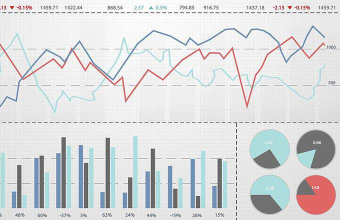

Choosing the right investment strategy is essential for achieving financial goals. Two primary investment strategies in asset management are passive and active management. 

Passive management is geared towards long-term growth by replicating the performance of a benchmark index, such as the S&P 500. This approach minimizes costs and diversifies risk, making it an attractive option for investors seeking steady growth with minimal intervention. By adopting a strategy that involves fewer trades, passive management benefits from lower transaction costs and management fees, aligning with the principles of the Efficient Market Hypothesis (EMH), which posits that asset prices fully reflect all available information. As a result, consistently outperforming the market becomes challenging, reinforcing the idea that a passive approach can be advantageous for risk-averse investors.

In contrast, active management aims to outperform the market through strategic buying and selling, often necessitating frequent trading and extensive market analysis. This hands-on strategy involves higher costs and risks but offers the potential for higher returns. Active managers utilize various analytical tools, including technical and fundamental analysis, to exploit market inefficiencies. This approach is tailored for investors who have a deep understanding of market dynamics and are willing to engage actively in managing their portfolios.

The advent of technology has given rise to algorithmic trading, a method that leverages computer algorithms to execute trades based on predefined criteria. Algorithmic trading enhances the speed and accuracy of executing investment strategies, reducing human error and capitalizing on market inefficiencies. It has become increasingly popular among institutional investors and tech-savvy individual traders, enabling the implementation of complex trading strategies while requiring substantial resources in technology and financial expertise.

This article aims to explore the intricacies of passive versus active asset management, discuss the role of algorithmic trading in modern investing, and provide guidance on selecting the right strategy to meet your investment objectives. Whether prioritizing low-cost, hands-off investing or embracing a more interactive, technology-driven approach, understanding these strategies' strengths and limitations will help you make informed decisions.

## Table of Contents

## Understanding Passive Investing

Passive investing is a strategy that aims to replicate the performance of a specific market index, such as the S&P 500, through a long-term approach. This strategy minimizes trading activity and typically employs index funds or exchange-traded funds (ETFs) to achieve broad market exposure. By investing in a diversified portfolio that tracks a market index, passive investors can capture the overall movement of the market with reduced effort and oversight.

A crucial advantage of passive investing is its cost-efficiency. Since this approach involves less frequent trading compared to active management, it incurs lower transaction costs. Additionally, passive funds have lower management fees, reflecting the reduced resources required for research and trading activities. This cost-effectiveness is particularly beneficial in enhancing net returns over time.

The philosophy behind passive investing is rooted in the Efficient Market Hypothesis (EMH), which posits that financial markets are efficient, meaning that prices fully reflect all available information. According to EMH, it is challenging to consistently outperform the market through active trading because any available profit opportunities are quickly capitalized upon by other market participants. Therefore, by adhering to the market trends and avoiding speculative trading, passive investors aim to achieve consistent, gradual growth.

Passive investing is suitable for investors who prefer a hands-off approach to portfolio management and are content with returns that mirror the broader market. This strategy aligns with the goals of those seeking steady growth over the long term without the need for ongoing market analysis or frequent portfolio adjustments. Overall, passive investing offers a compelling strategy for investors focused on long-term wealth accumulation with minimal oversight and cost.

## Exploring Active Investing

Active investing is characterized by a proactive approach, where investors actively manage their portfolios with the goal of surpassing market benchmarks. This strategy hinges on frequent trading activities and positions itself to take advantage of short-term price fluctuations within financial markets. The potential for achieving higher returns exists in active investing, but it is accompanied by increased risks and typically higher management fees compared to passive strategies.

A key aspect of active investing is its reliance on both technical and [fundamental analysis](/wiki/fundamental-analysis) to drive decision-making. Technical analysis involves examining statistical trends gathered from trading activity, such as price movement and [volume](/wiki/volume-trading-strategy). This method uses charts and other tools to identify patterns and signals that indicate future market behaviors. Fundamental analysis, on the other hand, focuses on evaluating a company's financial health, including its earnings, expenses, assets, and liabilities, to estimate its intrinsic value.

For instance, an active investor might use technical analysis to determine entry and [exit](/wiki/exit-strategy) points, based on support and resistance levels, while concurrently employing fundamental analysis to select stocks with strong growth potential or undervalued securities that are primed for appreciation. This dual approach allows investors not only to capitalize on immediate opportunities but also to secure long-term gains from well-chosen assets.

Active investing necessitates a profound understanding of market dynamics and a willingness to engage constantly with market conditions. It is best suited for investors who are prepared to dedicate considerable time and resources to oversee their investment portfolios. The commitment required includes staying informed about market news, economic indicators, and global events that could impact asset prices.

The strategy also often involves a higher turnover rate in the portfolio, resulting in greater transaction costs and more significant tax implications. Nevertheless, when executed proficiently, active investing can unlock substantial financial rewards, rewarding those who have the aptitude and dedication to navigate the complexities of continuously fluctuating markets.

In summary, active investing is a dynamic approach that provides opportunities for extensive gains through active market participation and informed decision-making, accommodating investors ready to bear the inherent risks and rigorous demands associated with such investments.

## The Rise of Algorithmic Trading

Algorithmic trading utilizes sophisticated computer algorithms to execute trades with heightened speed and precision, allowing traders to exploit market inefficiencies. These algorithms are programmed with pre-set criteria that enable them to act on market data in real time, minimizing human intervention and reducing the likelihood of error.

By automating trading processes, [algorithmic trading](/wiki/algorithmic-trading) significantly increases efficiency, facilitating rapid transaction execution that would be impossible manually. This technology-driven approach has found widespread adoption among institutional investors and technology-savvy individual traders who recognize its potential to increase trading accuracy and efficiency.

The appeal of algorithmic trading lies in its ability to process vast amounts of market data quickly and identify trends or opportunities that may not be visible to human traders. Moreover, it incorporates elements of [artificial intelligence](/wiki/ai-artificial-intelligence) and [machine learning](/wiki/machine-learning) to refine trading strategies, making predictions based on historical data and current market conditions. For instance, algorithms can be designed to detect [arbitrage](/wiki/arbitrage) opportunities—buying and selling the same asset on different markets to profit from price discrepancies—or execute high-frequency trades that capitalize on short-lived, minute price movements.

Despite its numerous advantages, implementing algorithmic trading requires significant expertise and resources. Developing effective algorithms necessitates a strong understanding of financial markets and proficiency in programming languages such as Python or C++. Moreover, the infrastructure required to support algorithmic trading, including high-performance computers and reliable data feeds, can be costly.

As a field that continually evolves with technological advancements, algorithmic trading embodies the fusion of finance and technology. It enhances the predictive capabilities of traders, allowing for the execution of complex strategies that can adapt to changing market dynamics. However, the high-tech nature of algorithmic trading also means it is better suited for those with the appropriate resources and expertise to navigate the intricacies of this approach. For investors possessing these capabilities, algorithmic trading offers a powerful tool for optimizing trading outcomes in today's fast-paced financial environment.

## Comparing the Strategies

Comparing passive, active, and algorithmic trading strategies highlights distinct approaches tailored to varying investor needs and preferences.

Passive investing focuses on minimizing costs while maintaining alignment with market indices, offering investors a cost-effective solution for steady, long-term growth. This strategy particularly appeals to investors prioritizing lower management fees and reduced trading activity. The S&P 500 index, for instance, has historically returned about 10% annually over the long term[1]. Such predictable growth makes passive investing attractive to those seeking stability.

Conversely, active investing aims for higher returns through tactical buying and selling decisions based on market research, employing tools such as technical and fundamental analysis[2]. This hands-on approach involves higher risks and management fees, justified by the potential to outperform market indices. For example, mutual funds that are actively managed have been known to take advantage of short-term market fluctuations to achieve higher returns, though success is contingent on the accuracy of market predictions.

In recent years, algorithmic trading has emerged as a hybrid approach, leveraging technological advancements to automate trading decisions based on pre-determined criteria[3]. This method integrates elements of both passive and active strategies. Algorithms can execute trades at speeds impossible for human traders, capitalizing on market inefficiencies effectively. Institutional traders often use these sophisticated tools to gain an edge, though they demand substantial initial investment in technology and expertise.

Choosing between these strategies depends significantly on an investor's risk tolerance, financial objectives, and overall expertise in financial markets. Passive investing suits those who prioritize cost savings and gradual wealth accumulation. Active investing appeals to individuals confident in their market analysis skills and willing to assume more risk for potentially greater rewards. Algorithmic trading, while requiring a higher degree of technical know-how, offers automation and efficiency advantages, particularly appealing to those comfortable with leveraging technology in investment.

Understanding these strategies' respective strengths and limitations is vital for investors making informed decisions that align with their specific financial goals and resources.

---

[1] Bogle, J. C. (1999). Common Sense on Mutual Funds: New Imperatives for the Intelligent Investor. John Wiley & Sons.
[2] Graham, B., & Zweig, J. (2003). The Intelligent Investor: The Definitive Book on Value Investing. HarperCollins.
[3] Aldridge, I. (2013). High-Frequency Trading: A Practical Guide to Algorithmic Strategies and Trading Systems. John Wiley & Sons.

## Choosing the Right Strategy for You

Selecting the appropriate investment strategy involves aligning it with your financial objectives and individual risk tolerance. This decision is pivotal in determining the success of your investment journey and is influenced by various factors, including the investor’s time horizon, financial goals, and comfort with risk.

Passive management is tailored for those who prioritize cost efficiency and steady market growth. This hands-off approach is advantageous for investors who may not have the time or expertise to actively manage their portfolios but are content with returns that mirror the market index. Passive investing typically involves lower management fees, as it requires minimal trading and relies on index funds or exchange-traded funds (ETFs) to achieve broad market exposure. This strategy is underpinned by the Efficient Market Hypothesis, which suggests that consistently outperforming the market is challenging due to all available information being reflected in asset prices.

Active investing, on the other hand, is suited for individuals willing to engage deeply in market analysis, trading more frequently to capitalize on short-term price movements. This strategy involves higher risks and management fees, as investors strive to outperform market indices through thorough research and strategic buying and selling. Active investors need a solid understanding of market dynamics and must be ready to dedicate significant time and effort to monitoring and adjusting their portfolios. The potential for higher returns in active investing is appealing, but it requires a robust appetite for risk and a commitment to continuous market evaluation.

Algorithmic trading represents a modern approach that integrates technology into the investment strategy. It is especially attractive to those with expertise in programming and a desire to leverage technology for optimal trading results. By employing computer algorithms to execute trades based on predefined criteria, algorithmic trading enhances speed and precision while reducing human error. It is a technologically advanced method that can efficiently analyze large volumes of data and execute complex trading strategies in real-time, providing a competitive edge in fast-paced market environments.

The decision of which strategy to pursue necessitates a careful evaluation of your investment profile. Consideration of risk tolerance, financial goals, and available resources will help determine the strategy that aligns best with your long-term financial aspirations. By understanding the distinctive attributes and limitations of each approach, you can make informed decisions that cater to your specific investment needs and navigate market complexities effectively.

## Conclusion

Navigating investment strategies requires a clear understanding of the differences and advantages of passive and active management. Passive investing is characterized by its cost-efficiency, minimizing management fees and reducing transaction costs, which cumulatively contribute to steady long-term growth. This strategy suits investors prioritizing financial stability and low-risk exposure.

In contrast, active investing provides opportunities for higher returns through strategic asset selection and market timing. However, this potential comes with increased management fees and higher risks due to frequent trading and market predictions. The active approach demands a comprehensive understanding of market dynamics and often involves leveraging both technical and fundamental analysis to capitalize on short-term market fluctuations.

Algorithmic trading offers an innovative method, integrating technology to facilitate rapid and precise trade execution. By automating trading processes, it reduces human error and exploits market inefficiencies, offering a potential advantage in dynamic markets. Despite its benefits, algorithmic trading requires a strong technological foundation and expertise in both financial markets and programming.

Investors should thoroughly assess personal financial goals, risk tolerance, and available resources to identify the most appropriate strategy. Understanding the nuances of each strategy ensures that investment decisions align with individual objectives, contributing to sustained financial success. As market conditions evolve, it is crucial to adapt strategies accordingly, ensuring they remain aligned with one's financial aspirations over the long term.

## References & Further Reading

[1]: ["Common Sense on Mutual Funds: New Imperatives for the Intelligent Investor"](https://www.amazon.com/Common-Sense-Mutual-Funds-Imperatives/dp/0471392286) by John C. Bogle

[2]: ["The Intelligent Investor: The Definitive Book on Value Investing"](https://www.amazon.com/Intelligent-Investor-Third-Definitive-Investing/dp/0063423537) by Benjamin Graham and Jason Zweig

[3]: ["High-Frequency Trading: A Practical Guide to Algorithmic Strategies and Trading Systems"](https://www.ahmetbeyefendi.com/wp-content/uploads/2020/07/High-Frequency-Trading-Irene-Aldridge.pdf) by Irene Aldridge

[4]: ["A Random Walk Down Wall Street: The Time-Tested Strategy for Successful Investing"](https://www.amazon.com/Random-Walk-Down-Wall-Street/dp/0393358380) by Burton G. Malkiel

[5]: ["Flash Boys: A Wall Street Revolt"](https://en.wikipedia.org/wiki/Flash_Boys) by Michael Lewis