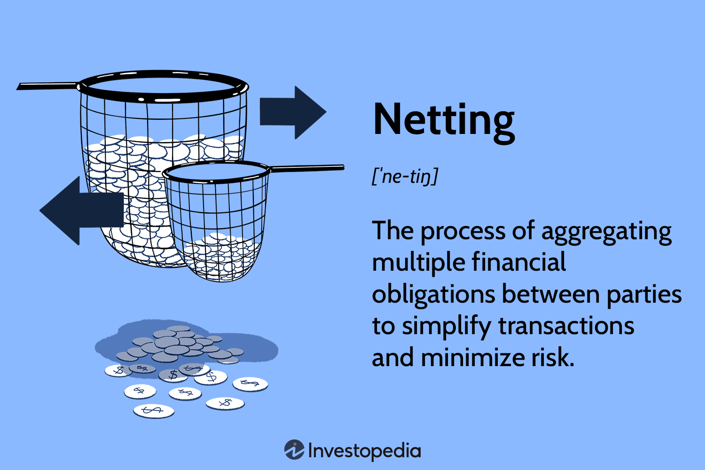

## Table of Contents

## What is payment netting?

Payment netting is a process used by businesses and financial institutions to reduce the number of payments they need to make. Instead of sending and receiving multiple payments for different transactions, they calculate the total amount they owe to or are owed by another party. Then, they only make one payment for the net amount. This simplifies the payment process and can save time and money on transaction fees.

For example, if Company A owes Company B $100, and Company B owes Company A $80, they can net these amounts. Instead of Company A paying $100 and Company B paying $80, Company A would just pay Company B the net amount of $20. This method is commonly used in industries like banking, trading, and international commerce where many transactions occur daily.

## What is close-out netting?

Close-out netting is a way to handle payments when one party in a contract can't meet their obligations, like if a company goes bankrupt. Instead of dealing with each payment separately, all the payments that are due are added up to find the total amount one party owes the other. This total is called the net amount. By doing this, it makes things simpler and less risky for the party that is still able to pay.

For example, if Company A owes Company B $100 and Company B owes Company A $80, but Company B goes bankrupt, close-out netting would mean calculating the net amount. Company A would only have to pay Company B $20 instead of the full $100, because Company B can't pay back the $80. This process helps to limit the financial damage when one party can't fulfill their part of the deal.

## How do payment netting and close-out netting differ?

Payment netting and close-out netting are ways to simplify payments between two parties, but they are used in different situations. Payment netting is used when both parties are still able to pay and do their transactions as usual. It helps to reduce the number of payments by calculating the total amount one party owes the other and making just one payment for that amount. This is helpful for businesses that have many transactions every day, like in banking or trading.

Close-out netting, on the other hand, is used when one party can't meet their obligations, like in cases of bankruptcy. It's a way to handle the payments that are due when one side can't pay. Instead of dealing with each payment separately, all the payments are added up to find the net amount one party owes the other. This makes things easier and less risky for the party that can still pay, by limiting the financial damage when the other party can't fulfill their part of the deal.

In simple terms, payment netting is about making things easier when everything is going well, while close-out netting is about managing payments when something goes wrong. Both methods help to simplify the payment process, but they serve different purposes based on the situation.

## What are the primary benefits of using payment netting?

Payment netting makes things simpler for businesses. Instead of sending and receiving lots of payments for different transactions, they can figure out the total amount they owe to or are owed by another party. Then, they only make one payment for the net amount. This cuts down on the work they have to do and saves time. It's especially helpful for businesses that have many transactions every day, like banks or trading companies.

Another big benefit is that payment netting can save money. When businesses make fewer payments, they spend less on transaction fees. These fees can add up, especially for international transactions. By using payment netting, companies can keep more of their money and use it for other important things in their business.

## What are the key advantages of close-out netting?

Close-out netting helps a lot when one company can't pay what they owe, like if they go bankrupt. It makes things easier by adding up all the payments that are due to find out the total amount one company owes the other. Instead of trying to get each payment separately, which can be hard and take a long time, the company that can still pay only has to deal with one net amount. This makes the whole process simpler and quicker.

Another big advantage is that close-out netting reduces the risk for the company that can still pay. When one company goes bankrupt, it can be scary because you might lose a lot of money. But with close-out netting, the company that can still pay only has to pay the net amount. This limits how much money they could lose and makes things less risky. It's like a safety net that helps protect businesses from big financial problems.

## In what types of financial transactions is payment netting commonly used?

Payment netting is often used in banking. Banks have lots of transactions every day, like when people move money between accounts or pay bills. Instead of sending and receiving many small payments, banks can use payment netting to figure out the total amount they owe to or are owed by other banks. Then, they only need to make one payment for the net amount. This makes things easier and saves time and money on fees.

Payment netting is also common in trading, especially in financial markets. Traders buy and sell things like stocks, bonds, and currencies all the time. They might owe money to other traders or have money coming to them. By using payment netting, traders can add up all their transactions and just make one payment for the net amount. This helps them manage their money better and reduces the costs of making many small payments.

In international commerce, payment netting is helpful too. Companies that do business in different countries often have to make and receive payments in different currencies. Payment netting lets them figure out the total amount they owe or are owed across all their transactions. Then, they can make one payment in the net amount, which simplifies the process and saves on the fees that come with international transfers.

## Under what circumstances is close-out netting typically applied?

Close-out netting is used when one company can't pay what they owe, like if they go bankrupt. It helps the other company figure out how much money they are owed or owe in total. Instead of trying to get each payment separately, which can be hard and take a long time, the company that can still pay only has to deal with one net amount. This makes the whole process simpler and quicker.

Another time close-out netting is used is when there's a big change in a company's situation that makes it impossible for them to keep up with their payments. This could be because of a big financial loss, a legal problem, or something else that stops them from doing business as usual. Close-out netting helps the other company limit how much money they could lose and makes things less risky by figuring out the net amount they need to deal with.

## What are the legal and regulatory considerations for implementing payment netting?

When a business wants to use payment netting, they need to think about the laws and rules in their country or region. Different places have different rules about how payment netting can be done. For example, some countries have laws that say payment netting is okay and even encourage it to make business easier. But other places might have rules that make it harder to use payment netting, like needing special agreements or permissions. It's important for businesses to check the local laws and make sure they follow them when they set up payment netting.

There are also rules from bigger groups like international banks or trade organizations that businesses need to think about. These groups often have their own rules about how payment netting should be done, especially for businesses that work in many countries. For example, the International Swaps and Derivatives Association (ISDA) has rules that many financial companies follow. Businesses need to make sure they follow these international rules too, so they don't get into trouble. It's a good idea for businesses to talk to lawyers or experts who know about these laws and rules to make sure they are doing everything right.

## How do legal frameworks affect the application of close-out netting?

Legal frameworks play a big role in how close-out netting can be used. Different countries have different laws about close-out netting. Some countries have laws that make it easy to use close-out netting when a company goes bankrupt. These laws help businesses know exactly what to do and make sure they can get the money they are owed without too much trouble. But in other places, the laws might not be as clear or might make it harder to use close-out netting. Businesses need to understand the local laws to make sure they are doing things the right way.

There are also international rules that can affect close-out netting. Big organizations like the International Swaps and Derivatives Association (ISDA) have their own rules that many businesses follow, especially if they work in different countries. These rules help make sure that close-out netting works the same way everywhere, which is important for businesses that do a lot of international trading. Companies need to check both the local laws and these international rules to make sure they are following everything correctly. Talking to lawyers or experts can help businesses understand all these rules and use close-out netting the right way.

## What are the potential risks and challenges associated with payment netting?

One big risk with payment netting is that if one company doesn't pay what they owe, it can cause problems for the other company. Even though payment netting is supposed to make things easier, if one side doesn't follow through, it can lead to disagreements and financial trouble. Another challenge is making sure all the numbers are right. If there's a mistake in calculating the net amount, it can lead to paying too much or too little, which can cause more problems and disagreements.

Another challenge is dealing with different laws and rules in different places. Some countries might have strict rules about how payment netting can be done, which can make it harder for businesses to use it. If a business works in many countries, they have to make sure they follow all the different rules, which can be confusing and time-consuming. Also, setting up the systems and agreements for payment netting can be hard and might need help from experts, which can cost money and take time.

## What complexities arise when executing close-out netting in multi-jurisdictional transactions?

When a company tries to use close-out netting in deals that happen in many different countries, things can get really complicated. Each country has its own laws about how close-out netting can be done, especially when a company goes bankrupt. Some countries might have clear rules that make it easy to use close-out netting, but others might have rules that make it hard or even not allow it at all. This means a company has to know and follow all these different rules, which can be very confusing and take a lot of time to figure out.

Another challenge is making sure that the agreements for close-out netting are the same in all the countries involved. If the rules are different, it can be hard to make sure everyone agrees on how to handle the payments when one company can't pay. This can lead to disagreements and legal problems. To make things work smoothly, companies often need help from lawyers and experts who know about the laws in each country. This can be expensive and take a lot of time, but it's important to make sure close-out netting is done the right way.

## How can financial institutions optimize their use of both payment netting and close-out netting to manage risk and enhance efficiency?

Financial institutions can optimize their use of payment netting by setting up clear and efficient systems to calculate and process net payments. This means using good technology and software that can handle a lot of transactions quickly and accurately. By doing this, they can reduce the number of payments they need to make, which saves time and money on transaction fees. It's also important for them to have strong agreements with other parties about how payment netting will work. This helps avoid disagreements and makes sure everyone knows what to expect. By keeping a close eye on their transactions and making sure everything is done correctly, financial institutions can use payment netting to manage their cash flow better and make their operations more efficient.

For close-out netting, financial institutions need to understand the laws and rules in all the places where they do business. This is especially important for multi-jurisdictional transactions where different countries might have different rules about what to do when a company goes bankrupt. By working with lawyers and experts who know these laws, financial institutions can make sure they are following everything correctly. They should also have strong contracts in place that clearly explain how close-out netting will be used if one party can't pay. By doing this, they can reduce the risk of losing money and make the process of dealing with a default quicker and smoother. Overall, using both payment netting and close-out netting well can help financial institutions manage risk better and keep their operations running smoothly.

## References & Further Reading

[1]: Gregory, J. (2010). ["Counterparty Credit Risk: The New Challenge for Global Financial Markets."](https://www.scirp.org/reference/referencespapers?referenceid=1520907) Wiley Finance.

[2]: Hull, J. C. (2015). ["Options, Futures, and Other Derivatives."](https://www.amazon.com/Options-Futures-Other-Derivatives-Global/dp/1292410655) Pearson Education.

[3]: Pirrong, C. (2011). ["The Economics of Clearing in Derivatives Markets: Netting, Asymmetric Information, and the Sharing of Default Risks Through a Central Counterparty."](https://www.bauer.uh.edu/spirrong/clearing_organization.pdf) Journal of Financial Intermediation, 20(2), 181-203.

[4]: Gomber, P., Arndt, B., Lutat, M., & Uhle, T. (2011). ["High-Frequency Trading."](https://papers.ssrn.com/sol3/papers.cfm?abstract_id=1858626) In Global Algorithmic Capital Markets (pp. 221-236). Springer.

[5]: Kroszner, R. S., & Strahan, P. E. (1999). ["What Drives Deregulation? Economics and Politics of the Relaxation of Bank Branching Restrictions."](https://academic.oup.com/qje/article/114/4/1437/1934050) American Economic Review, 88(4), 770-793.