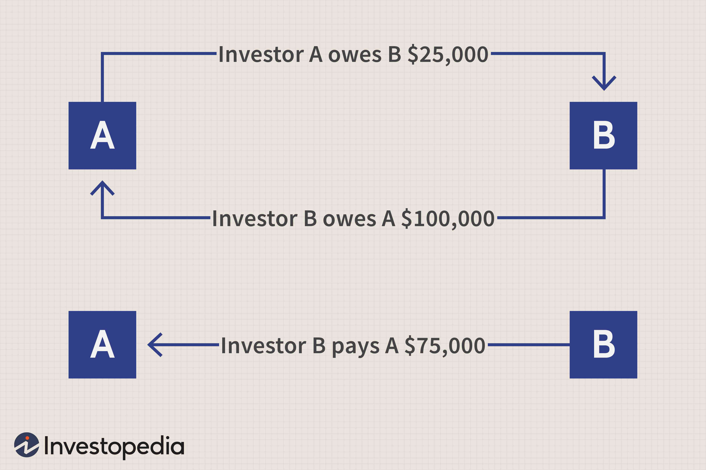

The financial industry is marked by a web of intricate transactions and inherent risks. To navigate these challenges, financial institutions implement various methods, one of which is netting. Netting involves the aggregation of multiple financial obligations into a single net amount, thus streamlining the settlement process. By reducing the number of cash flows exchanged between parties, netting minimizes transaction costs and mitigates risk exposure. This technique is pivotal, particularly in areas like derivatives trading, where large volumes of transactions occur daily.

Moreover, as the financial landscape evolves, technology plays an increasingly vital role in enhancing netting strategies. Algorithmic trading has emerged as a transformative technology, automating and optimizing trading strategies. These computer-driven algorithms facilitate efficient execution and settlement of transactions, enabling institutions to apply netting methods more effectively. The integration of algorithmic trading within netting processes not only enhances operational efficiency but also contributes to maintaining the stability of global financial markets.



Through this article, we examine the essential concepts and mechanisms underlying financial netting, payment netting, and close-out netting. We also discuss the significant role algorithmic trading plays in refining these netting strategies, ensuring effective risk management and cost efficiency in today's financial environments.

## Table of Contents

## Understanding Financial Netting

Financial netting serves as an essential risk mitigation tool in finance and trading, primarily by consolidating multiple financial transactions. This strategic process is instrumental in minimizing the number of payments exchanged between involved parties. By aggregating obligations and rights of payment, netting effectively reduces both risk exposure and transaction costs.

### Concepts and Mechanisms

Financial netting works by determining the net balance of a series of transactions. For instance, if two parties are involved in various trades over a specific period, instead of settling each transaction individually, the net difference is calculated and settled. This method significantly decreases the number of payments and thus reduces operational complexity.

### Risk and Cost Reduction

One of the primary benefits of financial netting is the reduction of counterparty risk. When trades are settled on a net basis, the outstanding debt between parties is considerably minimized, lowering the chance of default. This is particularly useful in scenarios where large volumes of trades are conducted, as the individual risk of each transaction is blended into a single netted outcome.

Furthermore, netting contributes to cost efficiency by decreasing transaction costs. By settling the net amounts, parties incur fewer fees associated with transaction processing and clearing, which can be particularly beneficial in high-frequency trading environments.

### Applications in Various Financial Sectors

- **Derivatives Market**: In the context of derivatives, netting is crucial for managing multiple positions that an entity might hold simultaneously. By netting out positions before settlement, traders can mitigate substantial financial risks associated with price movements in derivative instruments.

- **Corporate Finance**: Corporations often enter into multiple financial contracts that require frequent settlements. Financial netting facilitates the efficient management of cash flows, reducing the need for multiple fund transfers, thereby conserving liquidity and improving balance sheet management.

- **Banking Sector**: Banks benefit extensively from netting, especially in interbank trading and foreign exchange transactions. Through netting agreements, banks lower the number and value of transactions they process, leading to significant operational efficiencies and reduced settlement risk.

Netting is a fundamental strategy widely adopted across various segments of the financial industry, aiding in the efficient and risk-adjusted management of large-scale financial transactions. As financial markets continue to evolve, the application and sophistication of netting practices are expected to expand, with technological advancements offering further enhancements to these processes.

## Payment Netting Explained

Payment netting is a financial strategy aimed at refining the efficiency of transactions by offsetting payment obligations between different parties. This streamlined process ensures that only the net amount of a transaction is settled, rather than processing each payment obligation individually. By consolidating these transactions, payment netting significantly decreases the [volume](/wiki/volume-trading-strategy) of payment instructions necessary for settlement, thereby mitigating associated settlement risks.

In practical terms, if Party A owes Party B $100,000 and simultaneously Party B owes Party A $80,000, payment netting would allow for a single net payment of $20,000 from Party A to Party B instead of two separate transactions. This consolidation minimizes the complexity and administrative burden involved in clearing each transaction separately. Here is a simple Python example illustrating this concept:

```python
def calculate_net_payment(party_a_to_b, party_b_to_a):
    net_payment = party_a_to_b - party_b_to_a
    return f"Net payment from Party A to Party B: ${net_payment}" if net_payment > 0 else f"Net payment from Party B to Party A: ${-net_payment}"

# Example of usage
party_a_to_b = 100000  # Party A owes Party B this amount
party_b_to_a = 80000   # Party B owes Party A this amount
result = calculate_net_payment(party_a_to_b, party_b_to_a)
print(result)
```

Payment netting is particularly vital in the foreign exchange and commodity markets, where numerous transactions are conducted frequently across different currencies or commodities. In these markets, payment netting minimizes the risk of settlement failure, which can occur due to mismatches between payments and receipts. By reducing the number of individual transactions that require settlement, the method diminishes the chance of default or delay in payments, thereby enhancing the overall stability and reliability of the financial system.

Furthermore, the use of payment netting can lead to reduced transaction costs, as fewer transactions translate into lower processing fees and reduced demand for [liquidity](/wiki/liquidity-risk-premium). This optimization is of particular significance in high-volume environments, where the savings from reduced fees and better liquidity management can be substantial.

Overall, payment netting functions as a critical mechanism in modern financial markets, enabling institutions to handle complex financial relationships more securely and efficiently.

## Close-Out Netting: Managing Default Risk

Close-out netting is a crucial mechanism utilized in the financial industry to manage default risk, particularly in the context of derivatives trading. This process comes into effect when a default scenario arises, enabling the termination and offsetting of all open positions between the involved parties. The result is a single net payable or receivable amount that captures the overall exposure. By doing so, close-out netting plays an essential role in mitigating counterparty risk, which is the risk that one party involved in a financial transaction will fail to fulfill its obligations, thereby causing financial loss to the other party.

The primary function of close-out netting is to consolidate all outstanding transactions into one netted amount, rather than settling each position individually. This consolidation reduces the number of transactions and the overall credit exposure, which in turn, limits the potential loss that the non-defaulting party might incur. Without close-out netting, counterparties would have to settle each obligation separately, risking further complications and delays during financially turbulent times.

The International Swaps and Derivatives Association (ISDA) Master Agreement provides a robust framework to facilitate close-out netting. The ISDA Master Agreement standardizes the terms and conditions under which derivatives transactions are executed. It includes provisions that allow for the automatic or elective early termination of transactions upon the occurrence of certain events, including bankruptcy or insolvency. The ability to rely on these standardized documents lends legal certainty and operational efficiency, ensuring that close-out netting can be executed swiftly and effectively.

Close-out netting has become indispensable in the derivatives market due to the high volume and complexity of trades that occur on a daily basis. By mitigating the risks associated with counterparty defaults, close-out netting enhances the stability of financial institutions and the broader financial system. In addressing these risks, financial institutions are better equipped to handle adverse economic conditions, thereby contributing to overall market stability.

## The Role of Algorithmic Trading in Netting

Algorithmic trading employs sophisticated computer algorithms to automate and optimize trading strategies. In the context of financial netting, [algorithmic trading](/wiki/algorithmic-trading) plays a crucial role in enhancing the efficiency and execution of netting processes by minimizing manual interventions and reducing the time required to complete transactions.

Emerging technologies, specifically [artificial intelligence](/wiki/ai-artificial-intelligence) (AI) and [machine learning](/wiki/machine-learning) (ML), are key enablers in the evolution of algorithmic trading. These technologies allow for the development of advanced trading algorithms that can process and analyze large sets of financial data to identify netting opportunities. Through real-time analysis and decision-making, these algorithms ensure optimal execution of both payment netting and close-out netting.

The primary advantage of integrating algorithmic trading into netting lies in its ability to handle complex and high-frequency transactions with minimal latency. For example, in payment netting, algorithms can be programmed to assess netting possibilities across multiple bilateral agreements and execute net transactions, thus limiting settlement risks and reducing the volume of transactions.

Close-out netting also benefits from algorithmic trading, as algorithms can swiftly determine the net obligations in the event of a counterparty default. This process is critical in mitigating risk and ensuring that exposures are contained within manageable levels. Furthermore, by leveraging AI and machine learning, the algorithms can adapt to changing market conditions, predict risk patterns, and optimize trading strategies.

The incorporation of machine learning techniques can enhance pattern recognition in transaction data, facilitating more effective execution of netting strategies. For instance, unsupervised learning models might cluster transaction data to reveal hidden patterns that suggest potential netting benefits. Supervised models, on the other hand, could be used to predict default events, assisting in the timely implementation of close-out netting.

As algorithmic trading continues to evolve, its integration with financial netting systems is anticipated to improve further, driven by advancements in computational power and data analytics. This evolution not only streamlines financial operations but also enhances the robustness and reliability of global financial systems.

## Examples and Applications

In financial markets, payment netting is closely linked to currency swaps, particularly in the derivatives sector. Currency swaps involve exchanging principal and interest payments in different currencies between parties. By applying payment netting, parties can offset their obligations, settling only the net amount at the end of a predetermined period. This reduces the number of transactions and mitigates settlement risk—a key concern in volatile currency markets. The streamlined process minimizes the potential for discrepancies and reduces the costs associated with the settlement of numerous individual trades.

Close-out netting is a vital tool for financial institutions dealing with default scenarios. It enables the termination and offsetting of all transactions between defaulting and non-defaulting parties to produce a single net payment obligation. This consolidated approach allows institutions to manage credit exposure effectively. For derivatives and other financial contracts, determining a net payable or receivable ensures that institutions are not overly burdened by counterparty defaults. The use of close-out netting provides a layer of protection, enhancing stability in financial markets by preventing cascading defaults.

Multilateral netting is another crucial application, especially employed by clearinghouses to enhance their trade settlement processes. This method aggregates multiple bilateral netting positions among various parties into a single net position for each participant. By doing so, clearinghouses substantially reduce the total number of transactions and required capital, thereby increasing liquidity and decreasing systemic risk. For example, multilateral netting in clearinghouses reduces the number of securities or cash transfers, thus achieving operational efficiency and lowering the default risk within the system. These applications demonstrate the pivotal role of netting in maintaining order in complex financial systems and reducing systemic vulnerabilities.

## Regulatory Frameworks

Regulatory frameworks play a crucial role in managing and mitigating risks associated with financial transactions and netting processes. These frameworks ensure the stability and efficiency of financial markets by establishing rules and guidelines for institutions to follow.

Basel III, developed by the Basel Committee on Banking Supervision, is a comprehensive set of reform measures introduced to improve the regulation, supervision, and risk management within the banking sector. Basel III emphasizes the importance of netting agreements to enhance the resilience of banks by allowing them to reduce their counterparty risk exposure. The framework mandates adequate capital requirements and robust risk management practices, thereby supporting the use of netting as a method to mitigate credit risks and stabilize the financial system.

The European Market Infrastructure Regulation (EMIR) is another critical regulatory framework within the European Union. EMIR mandates the use of netting agreements to manage systemic risks in derivative markets. By requiring that counterparties to derivative contracts clear their trades through central counterparties (CCPs) and report their transactions to trade repositories, EMIR enhances transparency and reduces counterparty risk. Netting, under EMIR, offers financial institutions the means to consolidate their positions, lowering the potential for systemic disruptions.

In the United States, the Dodd-Frank Wall Street Reform and Consumer Protection Act provides a comprehensive overhaul of the financial regulatory environment. It aims to increase transparency and reduce risks in derivatives markets by subjecting them to stringent oversight. One of the key provisions of the Dodd-Frank Act is the requirement for standardized netting agreements to be used, which enhances market stability and ensures that the interconnectedness of financial markets does not contribute to systemic risk. Through mandatory clearing and exchange trading of swaps, the Dodd-Frank Act aligns closely with the principles of netting to mitigate credit and operational risks.

The International Swaps and Derivatives Association (ISDA) plays a pivotal role in standardizing documentation for derivative transactions, promoting legal certainty and market efficiency. ISDA's Master Agreement serves as the global standard for managing counterparty credit risk and facilitates close-out netting, allowing parties to offset their positions in the event of a default. This legal framework ensures that institutions can effectively manage their exposures, thereby contributing to the overall stability of the financial system.

Together, these regulatory frameworks provide a structured approach to managing financial transactions and associated risks, underscoring the importance of netting in maintaining the robustness and efficiency of the global financial system.

## Conclusion

Netting has established itself as an essential component of contemporary financial operations, thanks to its ability to streamline transactions and enhance risk management. By offsetting multiple transactions, netting mitigates counterparty risk and reduces transaction costs, thereby improving overall market efficiency. This financial technique is particularly beneficial in areas with high transaction volumes, such as derivatives and foreign exchange markets, where it reduces the sheer volume of payments and minimizes credit exposure.

Technological advancements have significantly bolstered the application of netting, particularly through the integration of algorithmic trading. Algorithmic trading enhances the efficiency of executing netting strategies by automating complex trading processes and making real-time computations that traditional methods cannot achieve. This automation not only speeds up transactions but also optimizes the execution price, further reducing costs and risks inherent in financial trades.

As financial markets continue to grow in complexity and scale, the fusion of netting practices with advanced technological solutions promises to provide a robust framework for managing economic activities more efficiently. The incorporation of artificial intelligence and machine learning can further refine these processes, allowing for more precise risk assessments and optimized trading strategies. This evolution is not merely beneficial but necessary for maintaining the stability and integrity of global financial systems, as it supports effective risk management and ensures orderly market operations.

The ongoing development in netting and algorithmic trading practices will likely lead to more sophisticated and resilient financial infrastructures. These advancements are expected to continue playing a crucial role in sustaining the stability of financial systems worldwide, underscoring the importance of innovative solutions in today’s rapidly evolving economic landscape.

## References & Further Reading

[1]: Gregory, J. (2010). ["Counterparty Credit Risk: The New Challenge for Global Financial Markets."](https://www.scirp.org/reference/referencespapers?referenceid=1520907) Wiley Finance.

[2]: Hull, J. C. (2015). ["Options, Futures, and Other Derivatives."](https://www.amazon.com/Options-Futures-Other-Derivatives-Global/dp/1292410655) Pearson Education.

[3]: Pirrong, C. (2011). ["The Economics of Clearing in Derivatives Markets: Netting, Asymmetric Information, and the Sharing of Default Risks Through a Central Counterparty."](https://www.bauer.uh.edu/spirrong/clearing_organization.pdf) Journal of Financial Intermediation, 20(2), 181-203.

[4]: Gomber, P., Arndt, B., Lutat, M., & Uhle, T. (2011). ["High-Frequency Trading."](https://papers.ssrn.com/sol3/papers.cfm?abstract_id=1858626) In Global Algorithmic Capital Markets (pp. 221-236). Springer.

[5]: Kroszner, R. S., & Strahan, P. E. (1999). ["What Drives Deregulation? Economics and Politics of the Relaxation of Bank Branching Restrictions."](https://academic.oup.com/qje/article/114/4/1437/1934050) American Economic Review, 88(4), 770-793.