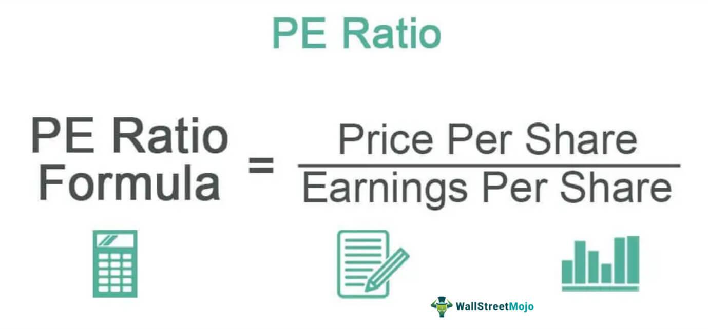

In today's financial landscape, evaluating a company's financial health and investment potential requires the use of various critical metrics. Among these, Earnings Yield, EPS (Earnings Per Share), and the P/E (Price-to-Earnings) ratio stand out as essential tools for investors and traders. These financial metrics provide a quantitative basis for assessing a company's value, profitability, and potential for growth within the market.

Earnings Yield, calculated as the inverse of the P/E ratio, is expressed as a percentage and offers insight into the return a company generates per dollar invested in its stock. It is an essential metric for investors seeking to compare potential equity investments with other asset classes, such as bonds, to evaluate which might offer better returns relative to the level of risk involved.



EPS serves as a key indicator of a company’s profitability by measuring the amount of profit attributed to each outstanding share of common stock. This metric aids investors in comparing the profitability of companies across different sizes and industries and provides a foundation for deriving more complex valuations.

The P/E ratio is one of the most widely-used metrics in stock valuation, comparing a company's current share price relative to its per-share earnings. A high P/E ratio may suggest that a stock is overvalued, or investors are expecting high growth rates in the future, while a low P/E may indicate an undervalued stock or a company with static or declining earnings.

In addition to serving as indicators of investment potential, these metrics play a pivotal role in algorithmic trading strategies. Traders and investment firms increasingly rely on quantitative analysis that incorporates such metrics to optimize portfolio selections and execute trades based on predictive models of price movements.

Understanding and effectively utilizing Earnings Yield, EPS, and the P/E ratio are crucial for making informed and strategic investment decisions. These metrics empower investors and traders to navigate the complexities of the financial markets, enabling enhanced decision-making and improved investment outcomes.

## Table of Contents

## Understanding Key Financial Metrics

In today's financial analysis, key metrics such as the Price-to-Earnings (P/E) ratio, Earnings Per Share (EPS), and Earnings Yield are vital tools for assessing a company's financial performance. Each of these metrics offers unique insights into different aspects of a company's financial health and investment attractiveness. 

The Price-to-Earnings (P/E) ratio is a widely used metric that helps investors evaluate whether a stock is overvalued or undervalued in relation to its earnings. It is calculated by dividing the current market price per share by the earnings per share (EPS). The formula for the P/E ratio is:

$$
\text{P/E Ratio} = \frac{\text{Market Price per Share}}{\text{Earnings per Share (EPS)}}
$$

A higher P/E ratio might suggest that a stock is overvalued, or investors expect high growth rates in the future. Conversely, a lower P/E ratio might indicate that a stock is undervalued or not experiencing significant growth.

Earnings Per Share (EPS) is an important measure of a company's profitability. It is calculated by dividing a company’s net income by the number of outstanding shares. The EPS formula is:

$$
\text{EPS} = \frac{\text{Net Income}}{\text{Number of Outstanding Shares}}
$$

EPS provides a direct view of the profit attributed to each share, facilitating comparisons among companies, especially those within the same industry but of differing sizes. It is a crucial indicator for investors to assess how effectively a company is generating profits.

Earnings Yield, on the other hand, provides a return perspective, showing the percentage of earnings generated per dollar invested in a stock. It is the inverse of the P/E ratio, expressed as a percentage, calculated as:

$$
\text{Earnings Yield} = \frac{\text{EPS}}{\text{Market Price per Share}} \times 100\%
$$

Earnings Yield is particularly useful for comparing the relative attractiveness of stocks against other investment opportunities like bonds. A higher earnings yield indicates a higher return on investment per share price, making it an attractive metric for value investors.

In summary, the P/E ratio, EPS, and Earnings Yield each contribute valuable information for evaluating a company's financial performance. Investors rely on these metrics to make informed decisions about stock valuation, profitability, and returns relative to investment, forming the foundation for sound financial analysis and investment strategy.

## Price-to-Earnings (P/E) Ratio

The Price-to-Earnings (P/E) ratio is an essential tool for investors analyzing a company's stock valuation in relation to its earnings. This ratio is calculated by dividing the current market price per share by the Earnings Per Share (EPS). The formula is as follows:

$$
\text{P/E Ratio} = \frac{\text{Market Price per Share}}{\text{Earnings Per Share (EPS)}}
$$

The P/E ratio offers insights into whether a stock is overvalued, undervalued, or fairly priced by comparing it to the stock's earnings. A higher P/E ratio may indicate that investors expect higher earnings growth in the future, whereas a lower P/E ratio may suggest that the stock is undervalued or that the company is facing challenges.

Investors frequently use variations of the P/E ratio to develop a more comprehensive view of a company's value. The two primary variations are the trailing P/E and forward P/E ratios. The trailing P/E ratio uses the earnings per share from the previous 12 months, and is calculated as:

$$
\text{Trailing P/E} = \frac{\text{Current Market Price per Share}}{\text{EPS from the last 12 months}}
$$

This backward-looking approach helps investors assess how a company has performed historically and whether it was previously over- or undervalued. Conversely, the forward P/E ratio utilizes projected earnings for the next 12 months to analyze a company's future potential:

$$
\text{Forward P/E} = \frac{\text{Current Market Price per Share}}{\text{Projected EPS for the next 12 months}}
$$

This forward-looking measure allows investors to estimate the future earnings potential and growth of a company. By comparing trailing and forward P/E ratios, investors can gauge the growth trajectory and future valuation expectations of a company, assisting them in making informed investment decisions.

## Earnings Per Share (EPS)

Earnings Per Share (EPS) is an essential measure of a company's profitability. It is calculated by dividing the company's net income by the number of its outstanding shares. Mathematically, this can be expressed as:

$$
\text{EPS} = \frac{\text{Net Income}}{\text{Outstanding Shares}}
$$

This metric provides a direct insight into the amount of profit that is attributed to each share of the company, thereby allowing investors to compare the financial performance of companies of different sizes within the same industry. By focusing on EPS, investors can ascertain the actual earnings allocated to each share, which facilitates a more nuanced comparison across companies.

EPS serves as a fundamental indicator when evaluating a company's financial health and is frequently used in conjunction with other financial metrics like the Price-to-Earnings (P/E) ratio to provide a comprehensive view of financial performance. Higher EPS values typically suggest better profitability and are often indicative of a company's ability to generate earnings growth over time. However, it is critical to consider potential variations in EPS due to accounting practices or share count changes, such as stock splits or buybacks, when using this metric as part of an investment decision-making process.

## Earnings Yield

Earnings Yield is a crucial financial metric that serves as the inverse of the Price-to-Earnings (P/E) ratio and is typically represented as a percentage. It offers investors a unique perspective on the income generated by a company relative to the price of its stock. Mathematically, Earnings Yield is calculated using the formula:

$$
\text{Earnings Yield} = \frac{\text{Earnings per Share (EPS)}}{\text{Market Price per Share}} \times 100
$$

This calculation provides the amount of earnings returned from each dollar invested in the stock, offering a direct measure of the [earning](/wiki/earning-announcement) power relative to the stock price.

The interpretation of Earnings Yield is straightforward: a higher Earnings Yield suggests that a stock is potentially undervalued, as it returns more earnings per unit of investment. Conversely, a lower Earnings Yield may indicate that a stock is overvalued, with less income generated per investment dollar. This metric provides a useful basis for comparison not only with other stocks but also with different types of investment vehicles such as bonds. For instance, if the Earnings Yield of a stock exceeds the yield of a government or corporate bond, the stock might present a more attractive investment opportunity, given its higher return potential.

The application of Earnings Yield extends beyond simple valuation. It is particularly advantageous in periods of rising interest rates or inflation when investors are keen to compare the equity yields with fixed-income yields. By using Earnings Yield, investors can identify stocks that may offer returns superior to those of less volatile, fixed-income securities.

In summary, Earnings Yield plays a vital role in evaluating the investment attractiveness of stocks, providing a simplified yet effective quantitative tool for investors to assess potential returns, especially in comparison to other investment options like bonds.

## Earnings Yield in Algorithmic Trading

In [algorithmic trading](/wiki/algorithmic-trading), the Earnings Yield serves as an essential component for quantitatively assessing stock value and predicting future price movements. Earnings Yield, calculated as the inverse of the Price-to-Earnings (P/E) ratio, indicates the percentage of earnings generated per dollar invested in a stock. This metric becomes particularly useful in algorithmic trading as it facilitates the identification of undervalued stocks that may offer potential price appreciation.

Algorithmic trading systems can employ Earnings Yield to filter stocks based on specific criteria. For instance, by setting a threshold for the minimum acceptable Earnings Yield, an algorithm can systematically exclude overvalued stocks, ensuring that only those with attractive valuations are considered for investment. This approach can help optimize portfolio construction by focusing on stocks with higher returns relative to their price.

Furthermore, Earnings Yield can be integrated into multifactor models, where it serves as one of several indicators used to predict stock price trajectories. These models commonly utilize [machine learning](/wiki/machine-learning) techniques to enhance predictive accuracy. A basic implementation might begin with retrieving stock data, calculating Earnings Yield, and establishing a decision rule. Here’s a simple Python example illustrating this concept:

```python
import yfinance as yf  # For more datasets, visit: https://paperswithbacktest.com/datasets

# Define a function to calculate Earnings Yield
def calculate_earnings_yield(stock_ticker):
    stock = yf.Ticker(stock_ticker)
    pe_ratio = stock.info['trailingPE']
    if pe_ratio:  # ensure the P/E ratio is not zero to avoid division errors
        earnings_yield = 1 / pe_ratio
        return earnings_yield
    return None

# List of stocks to evaluate
stock_list = ['AAPL', 'MSFT', 'GOOGL']

# Filter stocks based on a minimum Earnings Yield threshold
min_earnings_yield = 0.05  # Example threshold
selected_stocks = [stock for stock in stock_list if calculate_earnings_yield(stock) and calculate_earnings_yield(stock) > min_earnings_yield]

print("Selected stocks based on Earnings Yield criteria:", selected_stocks)
```

In this example, the algorithm identifies stocks with an Earnings Yield greater than a predefined threshold, thereby selecting those more likely to be undervalued relative to their earnings potential.

Moreover, Earnings Yield is often contrasted with bond yields to assess the relative attractiveness of equity investments. In periods of low bond yields, stocks with higher Earnings Yields become particularly enticing as they represent a better return on investment. This comparison can be vital for algorithmic trading strategies that dynamically allocate assets between stocks and other securities.

Overall, Earnings Yield is a valuable tool in algorithmic trading, providing insights that support the selection and analysis of potential investment opportunities. By leveraging this metric, algorithmic traders can enhance their decision-making processes, ensuring that portfolios are built on strong, data-driven foundations.

## Challenges and Considerations

Financial metrics such as Earnings Per Share (EPS) and Earnings Yield are indispensable tools for evaluating a company's financial health. However, their effectiveness can be hampered by inherent limitations and potential manipulation, which necessitates a cautious approach for traders and investors. 

EPS, a measure of a company's profitability, is calculated by dividing net income by the number of outstanding shares. While it provides a useful snapshot of profitability on a per-share basis, EPS can be susceptible to manipulation through various accounting practices. Companies might engage in activities such as altering depreciation methods or changing inventory accounting methods to artificially inflate their net income, thus distorting the EPS. Such practices can mislead investors about a company's actual performance and financial condition.

Earnings Yield, expressed as the inverse of the Price-to-Earnings (P/E) ratio, offers investors a percentage-based perspective on the return generated by a company's earnings relative to its share price. Although it is valuable for comparing stock returns against other investments like bonds, Earnings Yield may also present challenges. It could be affected by the same accounting manipulations that impact EPS, leading to misrepresentations of a company's real return potential. Moreover, Earnings Yield may not reflect the growth potential or risk profile of the company, which are critical factors in investment decision-making.

Considering these limitations, traders and investors are advised to employ a diversified set of financial indicators when analyzing stocks. Relying solely on metrics like EPS and Earnings Yield could lead to incomplete assessments. Incorporating additional financial ratios and indicators, such as the debt-to-equity ratio, free cash flow, and return on equity, can paint a more comprehensive picture of a company's financial health. Moreover, qualitative factors such as industry conditions, management quality, and market trends should also be considered in conjunction. This broader analytical approach mitigates the risks associated with over-reliance on a singular metric and enhances the robustness of trading strategies. 

Employing more sophisticated tools such as algorithmic trading systems can also aid in integrating multiple data points and indicators, allowing for more dynamic and adaptable investment strategies. These systems can analyze large datasets, identify correlations, and optimize stock selection, thus improving decision-making effectiveness and reducing exposure to isolated risks associated with specific financial metrics.

## Conclusion

Earnings Yield, EPS, and P/E ratios serve as fundamental metrics in evaluating a company's financial health and potential as an investment. Each metric provides a distinct perspective: Earnings Yield focuses on the percentage return of a stock relative to its price, EPS measures profitability on a per-share basis, and the P/E ratio offers insight into a stock's valuation compared to its earnings. Together, these metrics form a comprehensive toolkit for investors.

Integrating these measures into sophisticated algorithmic trading strategies allows investors to harness data-driven insights for superior financial decision-making. Algorithms can efficiently process large volumes of data, identifying patterns and trends that may elude human analysis. By incorporating Earnings Yield as a screening tool, traders can filter undervalued stocks; similarly, deploying EPS measures can enhance comparative assessments of company profitability. The P/E ratio further augments this by assisting in gauging relative value within sectors or broader markets.

Algorithmic trading systems can be programmed to leverage these metrics systematically. For example, a Python script might fetch real-time stock data, calculate earnings yield, EPS, and P/E ratios, and execute trades based on predefined criteria. This approach can optimize portfolio construction, enhance timing precision, and align with investor risk profiles.

While these metrics are invaluable, their effectiveness is maximized when used in conjunction with other financial indicators and qualitative assessments. This holistic approach mitigates risks of over-reliance on any single metric and enhances the robustness of investment strategies. By combining quantitative metrics with algorithmic technologies, investors can significantly improve their market insights, leading to more informed and timely investment decisions.

## References & Further Reading

[1]: ["Security Analysis"](https://drive.google.com/file/d/0B8yPeYHl2ueSTEpmOGZVXzVFZ00/view?usp=sharing) by Benjamin Graham and David Dodd

[2]: ["The Intelligent Investor: The Definitive Book on Value Investing"](https://www.amazon.com/Intelligent-Investor-Third-Definitive-Investing/dp/0063423537) by Benjamin Graham and Jason Zweig

[3]: Bodie, Z., Kane, A., & Marcus, A. J. (2014). ["Investments"](https://www.mheducation.com/highered/product/Investments-Bodie.html). McGraw-Hill Education.

[4]: ["Principles of Corporate Finance"](https://www.wallstreetmojo.com/corporate-finance/) by Richard A. Brealey, Stewart C. Myers, and Franklin Allen

[5]: ["Algorithmic and High-Frequency Trading"](https://www.amazon.com/Algorithmic-High-Frequency-Trading-Mathematics-Finance/dp/1107091144) by Álvaro Cartea, Sebastian Jaimungal, and José Penalva