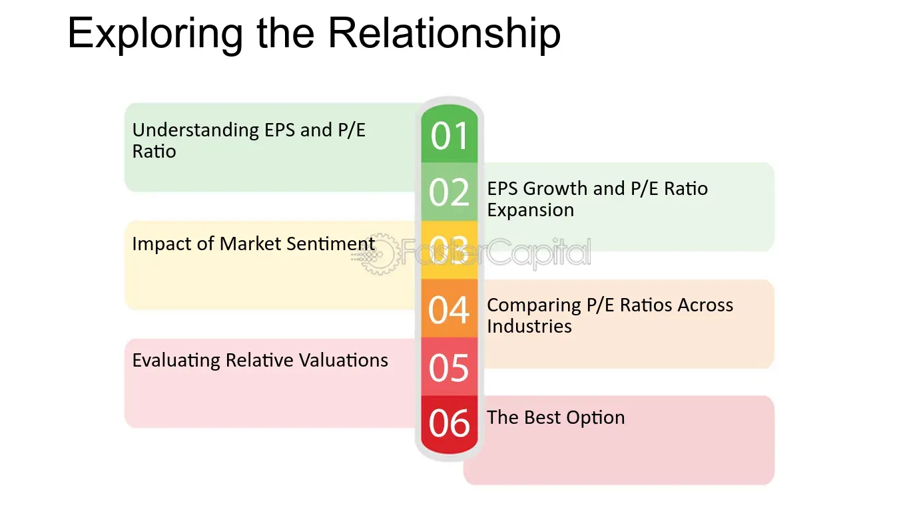

## Table of Contents

## What is the Price-to-Earnings (P/E) Ratio and how is it calculated?

The Price-to-Earnings (P/E) Ratio is a way to figure out how much investors are willing to pay for each dollar of a company's earnings. It's like a tool that helps you see if a stock is a good buy or if it's too expensive. The P/E Ratio is calculated by taking the current market price of a stock and dividing it by the company's earnings per share (EPS). For example, if a stock is trading at $50 and the company's EPS is $5, the P/E Ratio would be 10. This means investors are willing to pay $10 for every $1 of the company's earnings.

The P/E Ratio can be used to compare the value of different companies or to see how a company's value has changed over time. If a company has a high P/E Ratio, it might mean that investors expect the company to grow a lot in the future. On the other hand, a low P/E Ratio might mean that the company is not expected to grow much or that it's undervalued. However, the P/E Ratio should not be the only thing you look at when deciding to invest in a stock. It's just one piece of the puzzle and should be used along with other information.

## What does Earnings Per Share (EPS) represent and how is it computed?

Earnings Per Share (EPS) is a way to measure how much money a company makes for each share of its stock. It tells you how profitable a company is from the perspective of a single share. If a company has a high EPS, it means the company is making more money per share, which is generally seen as a good thing by investors.

To calculate EPS, you take the company's total earnings, or profit, and divide it by the number of outstanding shares. For example, if a company made $1 million in profit and has 1 million shares, the EPS would be $1 per share. This number can be found on a company's income statement and is often reported on a quarterly or annual basis.

## How is Earnings Yield defined and what is its formula?

Earnings Yield is a way to see how much money a company makes compared to how much it's worth. It tells you the percentage of each dollar invested in the stock that comes back to you as earnings. It's kind of like the opposite of the Price-to-Earnings (P/E) Ratio. While the P/E Ratio shows how much you pay for each dollar of earnings, the Earnings Yield shows how much earnings you get for each dollar you invest.

To calculate the Earnings Yield, you take the company's Earnings Per Share (EPS) and divide it by the current market price of the stock. Then, you multiply that number by 100 to turn it into a percentage. For example, if a company's EPS is $2 and the stock price is $40, the Earnings Yield would be (2/40) * 100 = 5%. This means that for every dollar you invest in the stock, you get 5 cents back in earnings.

## Why are P/E Ratio, EPS, and Earnings Yield important for investors?

The P/E Ratio, EPS, and Earnings Yield are important numbers that help investors understand if a stock is a good buy. The P/E Ratio tells you how much you have to pay for each dollar of a company's earnings. If the P/E Ratio is high, it might mean the stock is expensive, but it could also mean that people think the company will do really well in the future. If the P/E Ratio is low, the stock might be a good deal, or it could mean the company isn't expected to grow much. This helps investors decide if a stock is worth buying at its current price.

EPS, or Earnings Per Share, shows how much money a company makes for each share of its stock. A high EPS means the company is making more money per share, which is usually good for investors. By looking at the EPS, investors can see how profitable a company is and compare it with other companies. This helps them figure out which companies are doing well and might be good investments.

Earnings Yield is another useful number because it tells you how much earnings you get for each dollar you invest in a stock. It's kind of like the opposite of the P/E Ratio. A high Earnings Yield means you're getting more earnings for your investment, which can be a good sign. Investors use this to compare different stocks and see which ones might give them the best return on their money. Together, these three numbers give investors a better picture of a company's value and potential for growth.

## How can the P/E Ratio be used to evaluate a company's stock?

The P/E Ratio is a helpful tool for investors to figure out if a company's stock is a good buy. It tells you how much you have to pay for each dollar of the company's earnings. If the P/E Ratio is high, it means the stock is expensive compared to its earnings. This might happen if people think the company will grow a lot in the future. But if the P/E Ratio is low, the stock might be a good deal because you're paying less for each dollar of earnings. This could mean the company isn't expected to grow much, or it could be a sign that the stock is undervalued.

Investors can also use the P/E Ratio to compare different companies or to see how a company's stock has changed over time. For example, if you're looking at two companies in the same industry, the one with the lower P/E Ratio might be a better value. But it's important to remember that the P/E Ratio is just one piece of the puzzle. You should also look at other things like the company's growth, its debt, and what's happening in the market. By using the P/E Ratio along with other information, investors can make smarter choices about which stocks to buy.

## What insights can EPS provide about a company's profitability?

EPS, or Earnings Per Share, is a number that tells you how much money a company makes for each share of its stock. It's a way to see how profitable a company is from the view of one share. If a company has a high EPS, it means the company is making more money per share. This is usually seen as a good thing by investors because it shows the company is doing well and making profits.

You can use EPS to compare how different companies are doing. If one company has a higher EPS than another, it might mean that the first company is more profitable. But it's not just about comparing companies. You can also look at how a company's EPS changes over time. If the EPS is going up, it's a sign that the company is getting more profitable. But if the EPS is going down, it might mean the company is having a hard time making money. So, EPS is a useful tool for investors to understand a company's profitability and make smart investment choices.

## In what ways can Earnings Yield help in comparing investment opportunities?

Earnings Yield is a number that tells you how much money you get back in earnings for every dollar you invest in a stock. It's like a percentage that shows how much profit you're getting from your investment. If a company has a high Earnings Yield, it means you're getting more earnings for your money, which is usually a good thing. This can help you compare different stocks to see which one might give you the best return on your investment.

For example, if you're looking at two different stocks, you can use the Earnings Yield to see which one is a better deal. If one stock has an Earnings Yield of 5% and another has an Earnings Yield of 3%, the first stock is giving you more earnings for your investment. This can help you decide which stock to buy. But remember, Earnings Yield is just one thing to look at. You should also think about other stuff like how the company is doing and what's happening in the market before you make a decision.

## How do P/E Ratio, EPS, and Earnings Yield relate to each other?

The P/E Ratio, EPS, and Earnings Yield are all numbers that help you understand a company's stock and how much money it's making. The P/E Ratio shows how much you have to pay for each dollar of the company's earnings. It's calculated by dividing the stock's price by the EPS. The EPS, or Earnings Per Share, tells you how much money the company makes for each share of its stock. It's found by dividing the company's total earnings by the number of shares. Earnings Yield is kind of like the opposite of the P/E Ratio. It tells you how much earnings you get for each dollar you invest in the stock. You find it by dividing the EPS by the stock's price and then turning that into a percentage.

These three numbers are connected because they all use the same pieces of information but look at it in different ways. The P/E Ratio and Earnings Yield are directly related because if you know one, you can figure out the other. If the P/E Ratio is high, the Earnings Yield will be low, and if the P/E Ratio is low, the Earnings Yield will be high. EPS is the link between them because it's used to calculate both the P/E Ratio and the Earnings Yield. By looking at all three numbers together, investors can get a better picture of how much a stock is worth and how profitable the company is.

## What are the limitations of using P/E Ratio as a valuation metric?

The P/E Ratio is a helpful way to figure out if a stock is a good buy, but it has some limitations. One big problem is that it doesn't tell you everything about a company. For example, it doesn't look at the company's debt, how fast it's growing, or what's happening in the market. So, if you only use the P/E Ratio to decide if a stock is worth buying, you might miss important information that could change your mind.

Another issue with the P/E Ratio is that it can be hard to compare across different industries. Some industries naturally have higher P/E Ratios because they're expected to grow a lot in the future. If you compare a tech company with a high P/E Ratio to a utility company with a low P/E Ratio, you might think the utility company is a better deal, but that's not always true. It's important to compare companies within the same industry to get a fair idea of their value.

## Can EPS be manipulated by companies, and if so, how?

Yes, companies can sometimes play around with their EPS to make it look better than it really is. One way they might do this is by changing how they count their earnings. For example, a company might decide to include some one-time gains in their earnings to make the EPS look higher. They could also use accounting tricks to move expenses around, making it seem like they're making more money than they really are. This can make the EPS look better, but it's not a true picture of how the company is doing.

Another way companies can mess with EPS is by playing with the number of shares. They might buy back their own shares to reduce the total number of shares out there. When there are fewer shares, the EPS goes up because the same amount of earnings is spread over fewer shares. This can make the company look more profitable, but it doesn't mean they're actually making more money. It's important for investors to be careful and look at other numbers too, not just the EPS, to get a full picture of a company's health.

## How does Earnings Yield compare to other yield metrics like dividend yield?

Earnings Yield and dividend yield are both ways to see how much money you can get back from investing in a stock, but they look at different things. Earnings Yield tells you how much of the company's earnings you get for each dollar you invest. It's calculated by dividing the Earnings Per Share (EPS) by the stock's price and turning that into a percentage. This number is useful because it shows how profitable the company is compared to its stock price. If the Earnings Yield is high, it means you're getting a lot of earnings for your investment, which is usually a good sign.

Dividend yield, on the other hand, tells you how much money you get back in dividends for each dollar you invest. Dividends are payments that companies make to their shareholders out of their profits. The dividend yield is calculated by dividing the annual dividend per share by the stock's price and turning that into a percentage. This number is important if you're looking for regular income from your investments. A high dividend yield means you're getting a lot of money back in dividends, but it doesn't tell you anything about the company's overall profitability or growth. So, while both Earnings Yield and dividend yield are useful, they give you different information about a stock's value and what you can expect to get back from your investment.

## What advanced techniques can be used to analyze P/E Ratio, EPS, and Earnings Yield in conjunction for deeper investment insights?

To get deeper insights into a company's stock, investors can use advanced techniques to analyze the P/E Ratio, EPS, and Earnings Yield together. One way to do this is by looking at how these numbers change over time. By comparing the P/E Ratio and Earnings Yield of a company over several years, you can see if the stock is becoming more or less expensive compared to its earnings. If the P/E Ratio is going up and the Earnings Yield is going down, it might mean that people are expecting the company to grow a lot in the future. But if the P/E Ratio is going down and the Earnings Yield is going up, it could be a sign that the stock is becoming a better deal. Also, watching how the EPS changes can help you see if the company is getting more or less profitable over time.

Another advanced technique is to compare these numbers across different companies in the same industry. This can help you see which companies are more profitable or offer better value for your investment. For example, if one company has a lower P/E Ratio and a higher Earnings Yield than its competitors, it might be a good deal. But if another company has a higher EPS and a growing P/E Ratio, it might be a good choice if you think it will keep growing. It's also important to look at other things like the company's debt, how fast it's growing, and what's happening in the market. By using these advanced techniques to analyze the P/E Ratio, EPS, and Earnings Yield together, investors can get a fuller picture of a company's value and make smarter investment choices.

## What are key financial metrics and how can they be understood?

In today's financial analysis, key metrics such as the Price-to-Earnings (P/E) ratio, Earnings Per Share (EPS), and Earnings Yield are vital tools for assessing a company's financial performance. Each of these metrics offers unique insights into different aspects of a company's financial health and investment attractiveness. 

The Price-to-Earnings (P/E) ratio is a widely used metric that helps investors evaluate whether a stock is overvalued or undervalued in relation to its earnings. It is calculated by dividing the current market price per share by the earnings per share (EPS). The formula for the P/E ratio is:

$$
\text{P/E Ratio} = \frac{\text{Market Price per Share}}{\text{Earnings per Share (EPS)}}
$$

A higher P/E ratio might suggest that a stock is overvalued, or investors expect high growth rates in the future. Conversely, a lower P/E ratio might indicate that a stock is undervalued or not experiencing significant growth.

Earnings Per Share (EPS) is an important measure of a company's profitability. It is calculated by dividing a company’s net income by the number of outstanding shares. The EPS formula is:

$$
\text{EPS} = \frac{\text{Net Income}}{\text{Number of Outstanding Shares}}
$$

EPS provides a direct view of the profit attributed to each share, facilitating comparisons among companies, especially those within the same industry but of differing sizes. It is a crucial indicator for investors to assess how effectively a company is generating profits.

Earnings Yield, on the other hand, provides a return perspective, showing the percentage of earnings generated per dollar invested in a stock. It is the inverse of the P/E ratio, expressed as a percentage, calculated as:

$$
\text{Earnings Yield} = \frac{\text{EPS}}{\text{Market Price per Share}} \times 100\%
$$

Earnings Yield is particularly useful for comparing the relative attractiveness of stocks against other investment opportunities like bonds. A higher earnings yield indicates a higher return on investment per share price, making it an attractive metric for value investors.

In summary, the P/E ratio, EPS, and Earnings Yield each contribute valuable information for evaluating a company's financial performance. Investors rely on these metrics to make informed decisions about stock valuation, profitability, and returns relative to investment, forming the foundation for sound financial analysis and investment strategy.

## What is the Price-to-Earnings (P/E) Ratio?

The Price-to-Earnings (P/E) ratio is an essential tool for investors analyzing a company's stock valuation in relation to its earnings. This ratio is calculated by dividing the current market price per share by the Earnings Per Share (EPS). The formula is as follows:

$$
\text{P/E Ratio} = \frac{\text{Market Price per Share}}{\text{Earnings Per Share (EPS)}}
$$

The P/E ratio offers insights into whether a stock is overvalued, undervalued, or fairly priced by comparing it to the stock's earnings. A higher P/E ratio may indicate that investors expect higher earnings growth in the future, whereas a lower P/E ratio may suggest that the stock is undervalued or that the company is facing challenges.

Investors frequently use variations of the P/E ratio to develop a more comprehensive view of a company's value. The two primary variations are the trailing P/E and forward P/E ratios. The trailing P/E ratio uses the earnings per share from the previous 12 months, and is calculated as:

$$
\text{Trailing P/E} = \frac{\text{Current Market Price per Share}}{\text{EPS from the last 12 months}}
$$

This backward-looking approach helps investors assess how a company has performed historically and whether it was previously over- or undervalued. Conversely, the forward P/E ratio utilizes projected earnings for the next 12 months to analyze a company's future potential:

$$
\text{Forward P/E} = \frac{\text{Current Market Price per Share}}{\text{Projected EPS for the next 12 months}}
$$

This forward-looking measure allows investors to estimate the future earnings potential and growth of a company. By comparing trailing and forward P/E ratios, investors can gauge the growth trajectory and future valuation expectations of a company, assisting them in making informed investment decisions.

## What is Earnings Per Share (EPS)?

Earnings Per Share (EPS) is an essential measure of a company's profitability. It is calculated by dividing the company's net income by the number of its outstanding shares. Mathematically, this can be expressed as:

$$
\text{EPS} = \frac{\text{Net Income}}{\text{Outstanding Shares}}
$$

This metric provides a direct insight into the amount of profit that is attributed to each share of the company, thereby allowing investors to compare the financial performance of companies of different sizes within the same industry. By focusing on EPS, investors can ascertain the actual earnings allocated to each share, which facilitates a more nuanced comparison across companies.

EPS serves as a fundamental indicator when evaluating a company's financial health and is frequently used in conjunction with other financial metrics like the Price-to-Earnings (P/E) ratio to provide a comprehensive view of financial performance. Higher EPS values typically suggest better profitability and are often indicative of a company's ability to generate earnings growth over time. However, it is critical to consider potential variations in EPS due to accounting practices or share count changes, such as stock splits or buybacks, when using this metric as part of an investment decision-making process.

## What is Earnings Yield?

Earnings Yield is a crucial financial metric that serves as the inverse of the Price-to-Earnings (P/E) ratio and is typically represented as a percentage. It offers investors a unique perspective on the income generated by a company relative to the price of its stock. Mathematically, Earnings Yield is calculated using the formula:

$$
\text{Earnings Yield} = \frac{\text{Earnings per Share (EPS)}}{\text{Market Price per Share}} \times 100
$$

This calculation provides the amount of earnings returned from each dollar invested in the stock, offering a direct measure of the [earning](/wiki/earning-announcement) power relative to the stock price.

The interpretation of Earnings Yield is straightforward: a higher Earnings Yield suggests that a stock is potentially undervalued, as it returns more earnings per unit of investment. Conversely, a lower Earnings Yield may indicate that a stock is overvalued, with less income generated per investment dollar. This metric provides a useful basis for comparison not only with other stocks but also with different types of investment vehicles such as bonds. For instance, if the Earnings Yield of a stock exceeds the yield of a government or corporate bond, the stock might present a more attractive investment opportunity, given its higher return potential.

The application of Earnings Yield extends beyond simple valuation. It is particularly advantageous in periods of rising interest rates or inflation when investors are keen to compare the equity yields with fixed-income yields. By using Earnings Yield, investors can identify stocks that may offer returns superior to those of less volatile, fixed-income securities.

In summary, Earnings Yield plays a vital role in evaluating the investment attractiveness of stocks, providing a simplified yet effective quantitative tool for investors to assess potential returns, especially in comparison to other investment options like bonds.

## References & Further Reading

[1]: ["Security Analysis"](https://drive.google.com/file/d/0B8yPeYHl2ueSTEpmOGZVXzVFZ00/view?usp=sharing) by Benjamin Graham and David Dodd

[2]: ["The Intelligent Investor: The Definitive Book on Value Investing"](https://www.amazon.com/Intelligent-Investor-Third-Definitive-Investing/dp/0063423537) by Benjamin Graham and Jason Zweig

[3]: Bodie, Z., Kane, A., & Marcus, A. J. (2014). ["Investments"](https://www.mheducation.com/highered/product/Investments-Bodie.html). McGraw-Hill Education.

[4]: ["Principles of Corporate Finance"](https://www.wallstreetmojo.com/corporate-finance/) by Richard A. Brealey, Stewart C. Myers, and Franklin Allen

[5]: ["Algorithmic and High-Frequency Trading"](https://www.amazon.com/Algorithmic-High-Frequency-Trading-Mathematics-Finance/dp/1107091144) by Álvaro Cartea, Sebastian Jaimungal, and José Penalva