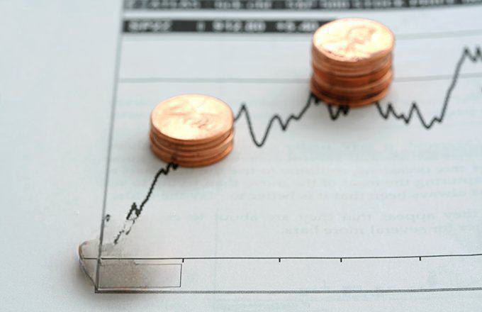

## Table of Contents

## What are penny stocks?

Penny stocks are stocks that trade at a very low price, usually less than a dollar. They are often from small companies that are just starting out or are not doing well. Because they are cheap, people think they can buy a lot of them and make a big profit if the price goes up. But penny stocks can be risky because the companies might not have a lot of information available about them, and their stock prices can go up and down a lot.

Investing in penny stocks can be exciting because you might find a small company that grows a lot and makes you a lot of money. However, it's important to be careful. Some people try to trick others into buying penny stocks by spreading false information, a practice known as "pump and dump." This can lead to big losses if the stock price suddenly drops after you buy it. So, if you're thinking about investing in penny stocks, make sure to do a lot of research and understand the risks involved.

## What is forex trading?

Forex trading, or foreign exchange trading, is when people buy and sell different currencies from around the world. The goal is to make money from the changes in the value of one currency compared to another. For example, if you think the US dollar will become stronger compared to the Euro, you might buy dollars and sell Euros. If the dollar does become stronger, you can then sell your dollars back for more Euros than you started with, making a profit.

Forex trading happens all the time because the market is open 24 hours a day, five days a week. This is different from stock markets, which have set hours. Because forex trading involves so many countries and currencies, it's a very big market with a lot of money moving around. But it can also be risky because currency values can change quickly due to things like news events or economic reports. So, it's important to learn about the market and be careful when trading.

## How do the initial investment requirements compare between penny stocks and forex trading?

When it comes to initial investment requirements, penny stocks and forex trading can be quite different. Penny stocks are usually very cheap, often costing less than a dollar per share. This means you can start investing with a small amount of money. For example, if you have $100, you could buy a lot of penny stock shares. However, you need to be careful because even though the initial cost is low, the risks can be high.

Forex trading, on the other hand, often requires a bit more money to start. Many brokers have a minimum amount you need to deposit to open an account, which can be anywhere from $100 to $1,000 or more. In forex, you trade in lots, and each lot represents a certain amount of currency. While you can use leverage to trade with less money, this also increases the risk. So, forex trading might need a bigger initial investment, but it also offers different ways to manage your money.

## What are the typical risks associated with penny stocks?

Penny stocks are risky because they are usually from small companies that might not have much information available about them. This makes it hard to know if the company is doing well or if it will grow in the future. Because of this, the price of penny stocks can go up and down a lot, sometimes very quickly. If you buy a penny stock and its price drops a lot, you could lose a big part of your money.

Another big risk with penny stocks is something called "pump and dump" schemes. This is when people spread false information to make others buy the stock, pushing the price up. Then, these people sell their shares at the higher price, leaving everyone else with a stock that quickly loses value. It's like a trick that can make you lose money if you're not careful. So, if you're thinking about investing in penny stocks, it's important to do a lot of research and be aware of these risks.

## What are the typical risks associated with forex trading?

Forex trading can be risky because the value of currencies can change a lot and very quickly. News events, like when a country's leader makes an important announcement, or economic reports, like when a country shares how well its economy is doing, can make currency values go up or down fast. If you're not ready for these changes, you could lose money. Also, forex markets are open all the time during the week, which means you need to keep an eye on your trades even when you're not at work or school.

Another risk in forex trading is using something called leverage. Leverage lets you trade with more money than you actually have, kind of like borrowing money from your broker. While this can help you make more money if things go well, it can also make you lose more money if things go badly. It's like using a big tool that can help you a lot but can also be dangerous if you're not careful. So, it's important to understand how leverage works and use it wisely.

## How does liquidity differ between penny stocks and forex markets?

Liquidity means how easy it is to buy or sell something without changing its price a lot. In forex markets, there's a lot of liquidity because people all over the world are trading currencies all the time. This means you can usually buy or sell a currency quickly and at a price that's close to what you expect. It's like being able to trade at a big, busy market where there are always people ready to buy or sell.

Penny stocks, on the other hand, have less liquidity. These stocks are from small companies, and not as many people are trading them. So, if you want to sell your penny stocks, it might take longer to find someone who wants to buy them. And when you do find a buyer, the price might be different from what you expected because there are fewer people trading. It's like trying to sell something at a small, quiet market where not many people are around.

## What are the potential returns from investing in penny stocks versus forex trading?

Penny stocks can offer really high returns if you pick the right ones. Since they're cheap, if the company does well and the stock price goes up a lot, you could make a big profit. For example, if you buy a penny stock at 10 cents and it goes up to $1, that's a 10 times increase! But, it's also risky because many penny stocks don't do well, and you could lose all your money if the company fails or if there's a "pump and dump" scheme going on.

Forex trading can also give you good returns, but usually not as high as the big wins you might see with penny stocks. In forex, you're trying to make money from small changes in currency values. If you use leverage, you can make more money, but it also means you could lose more if things go the wrong way. Forex trading is more about making steady profits over time, rather than hoping for one big win. But because it's a big market with lots of people trading, you can usually trade more easily and predictably than with penny stocks.

## How does the regulatory environment impact penny stocks compared to forex trading?

The regulatory environment for penny stocks is less strict than for bigger stocks. In the United States, penny stocks are often traded on the over-the-counter (OTC) markets, which don't have the same rules as big stock exchanges like the New York Stock Exchange. This means companies selling penny stocks don't have to share as much information about their business. Because of this, it can be harder for investors to know if a penny stock is a good investment or if someone is trying to trick them with false information. The less strict rules can make penny stocks riskier because there's less protection for investors.

Forex trading, on the other hand, has more rules to follow. In the U.S., forex brokers have to be registered with the National Futures Association (NFA) and the Commodity Futures Trading Commission (CFTC). These groups make rules to protect people who trade forex, like making sure brokers tell the truth about their services and don't trick people. Because of these rules, forex trading can be a bit safer than penny stocks, but it's still important to be careful and understand the rules. The stricter regulations in forex can help make the market more fair and transparent for everyone.

## What strategies are commonly used in penny stock trading?

One common strategy for penny stock trading is called momentum trading. This means looking for penny stocks that are already going up in price and buying them, hoping they will keep going up. People who use this strategy watch the stock market closely to see which penny stocks are getting a lot of attention and trading activity. They try to jump in early and sell the stock before the price goes down. It's like trying to catch a wave and ride it as long as you can.

Another strategy is called value investing. This is when you look for penny stocks that you think are undervalued, meaning they're worth more than their current price. You do a lot of research to find out if the company behind the penny stock has good products, a solid plan, and the potential to grow. If you believe in the company, you buy the stock and hold onto it for a long time, hoping that other people will eventually see its value too, and the price will go up. This strategy takes patience and a lot of research.

Some people also use a strategy called swing trading with penny stocks. This involves holding onto a stock for a few days or weeks, trying to make money from short-term price movements. Swing traders look for patterns in the stock's price and try to buy low and sell high within a short time frame. It's a bit like trying to guess where the stock price will go next and making quick moves to take advantage of those guesses.

## What strategies are commonly used in forex trading?

One common strategy in forex trading is called trend following. This is when traders look at charts to see which way a currency's price is moving. If the price is going up, they buy that currency, hoping it will keep going up. If the price is going down, they might sell it or sell it short, hoping to make money as the price falls. Trend followers use tools like moving averages to help them see the direction of the trend and make decisions about when to buy or sell.

Another strategy is called range trading. This is when traders notice that a currency's price stays between two levels for a while. They buy the currency when it's near the bottom of the range and sell it when it's near the top. This strategy works well when the market is not moving a lot, and the price stays in a predictable pattern. Range traders use tools like support and resistance levels to help them decide when to make their trades.

A third strategy is called carry trading. This involves borrowing money in a currency with a low interest rate and using that money to buy a currency with a higher interest rate. The trader makes money from the difference in interest rates, called the carry. This strategy works best when the exchange rate between the two currencies stays stable. But if the exchange rate changes a lot, the trader could lose money. So, carry traders need to watch the market carefully to make sure their trade stays profitable.

## How does market volatility affect penny stocks and forex trading differently?

Market volatility means how much and how fast prices go up and down. For penny stocks, volatility can be really big. Because these stocks are from small companies and don't trade a lot, their prices can jump around a lot more than bigger stocks. If something good or bad happens with the company, the price can change a lot very quickly. This can be exciting because you might make a lot of money if you buy at the right time, but it's also risky because you could lose a lot if the price suddenly drops.

In forex trading, volatility is also important, but it's different. The forex market is huge and always open, so there are a lot of people trading all the time. This means the prices of currencies can move a lot too, especially when big news comes out about a country's economy or politics. But because the market is so big, the changes are usually smoother than with penny stocks. Forex traders can use tools like stop-loss orders to help protect their money from big, sudden drops, but they still need to be careful because volatility can make trading risky.

## What are the advanced tools and platforms available for trading penny stocks and forex, and how do they compare?

For trading penny stocks, many people use online brokerages that offer platforms like E*TRADE, Robinhood, or TD Ameritrade. These platforms often have tools that help you see how the stocks are doing, like charts and graphs. Some even have features that let you set up alerts if the stock price changes a lot. But because penny stocks are traded less often, these platforms might not have all the fancy tools you see for bigger stocks. They're good for keeping an eye on your penny stocks and making trades, but they might not have everything you need for really detailed analysis.

For forex trading, traders often use special platforms like MetaTrader 4 (MT4) or MetaTrader 5 (MT5). These platforms are made just for forex and have a lot of advanced tools. You can use them to see how currency prices are moving, set up automatic trading with something called Expert Advisors, and even test out your trading ideas without using real money. Forex platforms usually have more tools than penny stock platforms because the forex market is bigger and more people trade there. So, if you want to do a lot of detailed analysis and use advanced trading strategies, forex platforms might be better for you.

## References & Further Reading

[1]: Bergstra, J., Bardenet, R., Bengio, Y., & Kégl, B. (2011). ["Algorithms for Hyper-Parameter Optimization."](https://dl.acm.org/doi/10.5555/2986459.2986743) Advances in Neural Information Processing Systems 24.

[2]: ["Advances in Financial Machine Learning"](https://www.amazon.com/Advances-Financial-Machine-Learning-Marcos/dp/1119482089) by Marcos Lopez de Prado

[3]: ["Evidence-Based Technical Analysis: Applying the Scientific Method and Statistical Inference to Trading Signals"](https://www.amazon.com/Evidence-Based-Technical-Analysis-Scientific-Statistical/dp/0470008741) by David Aronson

[4]: ["Machine Learning for Algorithmic Trading"](https://github.com/stefan-jansen/machine-learning-for-trading) by Stefan Jansen

[5]: ["Quantitative Trading: How to Build Your Own Algorithmic Trading Business"](https://www.amazon.com/Quantitative-Trading-Build-Algorithmic-Business/dp/1119800064) by Ernest P. Chan