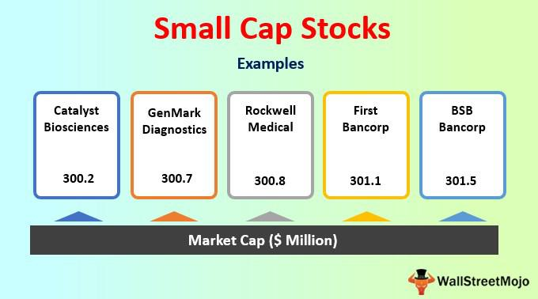

## Table of Contents

## What are penny stocks?

Penny stocks are stocks that trade for a very low price, usually less than a dollar. They are often from small companies that are just starting out or are not doing well financially. Because they are cheap, some people think they can make a lot of money by buying a lot of them. But penny stocks can be risky because the companies might not have a lot of information available about them, and their stock prices can go up and down a lot.

Investing in penny stocks can be exciting because of the potential for big gains, but it's important to be careful. Since these stocks are not traded on big stock exchanges like the New York Stock Exchange, it can be hard to find good information about them. Also, some people might try to trick others into buying penny stocks by spreading false information. So, if you're thinking about investing in penny stocks, it's a good idea to do a lot of research and maybe talk to a financial advisor first.

## What are small cap stocks?

Small cap stocks are stocks from companies that are smaller than the big ones you might know about. These companies usually have a market value between $300 million and $2 billion. Because they are smaller, they might be growing fast and trying new things, which can make their stocks exciting to invest in. But, they can also be riskier because they don't have as much money or as many resources as bigger companies.

Investing in small cap stocks can be a good way to find companies that might grow a lot in the future. Since they are smaller, they might be able to grow faster than big companies. But, because they are smaller, they can also have bigger ups and downs in their stock prices. So, if you're thinking about buying small cap stocks, it's important to do your homework and understand that they might be more risky than stocks from bigger companies.

## How do penny stocks and small cap stocks differ in terms of market capitalization?

Penny stocks and small cap stocks differ a lot when it comes to how much they are worth in the market. Penny stocks come from very small companies that might not even be worth $50 million. They are called penny stocks because they usually cost less than a dollar each. On the other hand, small cap stocks are from companies that are bigger, with a market value between $300 million and $2 billion. So, small cap stocks are worth a lot more than penny stocks.

Even though small cap stocks are worth more than penny stocks, they are still much smaller than the big companies you might know about. Small cap companies are often trying to grow and might be doing new things, but they don't have as much money or resources as the really big companies. Penny stocks are even smaller and riskier, and it can be hard to find good information about the companies that issue them. So, when thinking about investing, it's important to know that penny stocks are at the very bottom of the market value scale, while small cap stocks are a step up but still on the smaller side.

## What are the typical price ranges for penny stocks versus small cap stocks?

Penny stocks are stocks that usually cost less than a dollar. Sometimes, they can be a bit more, like up to $5, but they are still called penny stocks because they are very cheap. These stocks are from tiny companies that might not be worth very much at all. Because they are so cheap, some people buy a lot of them hoping to make a big profit if the price goes up even a little bit.

Small cap stocks, on the other hand, usually cost more than penny stocks. Their prices can range from a few dollars to tens of dollars per share. These stocks come from companies that are bigger than the ones that issue penny stocks, with a market value between $300 million and $2 billion. Even though they are more expensive than penny stocks, they are still cheaper than stocks from really big companies.

## What are the liquidity differences between penny stocks and small cap stocks?

Penny stocks usually don't have a lot of people buying and selling them. This means they are not very liquid. Because not many people trade them, it can be hard to sell your penny stocks quickly if you need to. Sometimes, you might have to wait a long time to find someone who wants to buy them, and you might have to sell them for less money than you hoped.

Small cap stocks are more liquid than penny stocks. More people trade them, so it's easier to buy and sell them when you want to. This doesn't mean they are as easy to trade as stocks from really big companies, but it's still better than penny stocks. If you need to sell your small cap stocks, you're more likely to find someone to buy them without waiting too long or losing too much money.

## What are the risks associated with investing in penny stocks?

Penny stocks are very risky to invest in. One big reason is that they come from small companies that might not have a lot of money or resources. These companies might be struggling, and their stocks can go up and down a lot. It's hard to know if the company will do well in the future, so you could lose a lot of your money if things don't go as planned. Also, because penny stocks are not traded on big stock exchanges, it can be hard to find good information about the companies. This makes it even riskier because you might not know everything you need to make a smart decision.

Another risk with penny stocks is that some people might try to trick you into buying them. They might spread false information to make the stock price go up, and then sell their own shares for a profit. This is called a "pump and dump" scheme, and it can leave you with stocks that are suddenly worth a lot less. Because penny stocks are not very liquid, it can be hard to sell them quickly if you find out you've been tricked. So, if you're thinking about investing in penny stocks, you need to be very careful and do a lot of research to make sure you're not falling for a scam.

## What are the risks associated with investing in small cap stocks?

Small cap stocks come with risks because they are from smaller companies that might not have as much money or as many resources as bigger companies. These companies might be trying new things and growing fast, but they can also run into problems. If something goes wrong, like they don't make enough money or they have trouble with their new ideas, their stock prices can go down a lot. This means you could lose money if you invest in them.

Another risk with small cap stocks is that they can be harder to sell quickly than stocks from bigger companies. Fewer people might want to buy them, so it can take longer to find someone to take them off your hands. This is called lower [liquidity](/wiki/liquidity-risk-premium). If you need to sell your small cap stocks in a hurry, you might have to sell them for less money than you wanted. So, investing in small cap stocks can be exciting because of the chance to make good profits, but it's important to understand these risks and be ready for them.

## How do the potential returns of penny stocks compare to small cap stocks?

Penny stocks can offer very big returns if things go well. Because they are so cheap, even a small increase in the stock price can mean a lot of money for someone who bought a lot of shares. For example, if you buy a penny stock at 50 cents and it goes up to $1, you've doubled your money. But, this kind of big return is not common and is very risky. Most of the time, penny stocks stay the same or go down in value, and it's hard to find good information about the companies to know if they will do well.

Small cap stocks can also give good returns, but they are usually not as wild as penny stocks. Small cap companies might be growing and trying new things, so their stocks can go up a lot if they succeed. But, they are less risky than penny stocks because they are bigger and more people know about them. You might not see the huge returns you could get from penny stocks, but small cap stocks can still grow a lot and offer good profits if you pick the right ones. They are a bit safer than penny stocks, but you still need to be careful and do your research.

## What kind of regulatory oversight do penny stocks have compared to small cap stocks?

Penny stocks have less regulatory oversight than small cap stocks. They are often traded on over-the-counter markets instead of big stock exchanges like the New York Stock Exchange. Because of this, they don't have to follow as many rules and it can be harder to find good information about the companies. The Securities and Exchange Commission (SEC) does have some rules to protect investors, but penny stocks can still be a place where people try to trick others with false information.

Small cap stocks have more regulatory oversight. They are usually traded on bigger stock exchanges, like the NASDAQ or the New York Stock Exchange. This means they have to follow more rules and share more information about their company. The SEC watches these companies more closely to make sure they are being honest with investors. So, even though small cap stocks are still risky, they are safer than penny stocks because there is more information available and more rules to follow.

## How does the volatility of penny stocks compare to that of small cap stocks?

Penny stocks are very volatile. This means their prices can go up and down a lot in a short time. Because penny stocks are from very small companies, even a little bit of news can make their stock prices change a lot. If someone says something good about the company, the stock price might jump up. But if there's bad news, the price can fall quickly. This makes penny stocks exciting but also very risky because it's hard to predict what will happen.

Small cap stocks are also volatile, but not as much as penny stocks. These stocks come from bigger companies than penny stocks, so their prices don't change as wildly. Still, small cap stocks can go up and down more than stocks from big companies. This is because small cap companies might be growing fast and trying new things, so their stock prices can move a lot based on how well they are doing. But overall, small cap stocks are less risky than penny stocks because they are more stable and there's more information available about them.

## What are the strategies for investing in penny stocks versus small cap stocks?

When investing in penny stocks, it's important to do a lot of research because these stocks are very risky. Since penny stocks come from very small companies, it can be hard to find good information about them. One strategy is to look for companies that are trying new things and might grow a lot in the future. Another strategy is to be ready to sell your stocks quickly if things don't go as planned. It's also a good idea to only invest money you can afford to lose, because penny stocks can go down to zero. Some people also try to find penny stocks that are about to get more attention or be bought by bigger companies, but this is very hard to predict.

For small cap stocks, the strategies are a bit different because these stocks are from bigger companies with more information available. One good strategy is to look for small cap companies that are growing fast and making good profits. These companies might be trying new things, but they have more money and resources than penny stock companies, so they are less risky. Another strategy is to diversify, which means buying different kinds of small cap stocks to spread out your risk. It's also important to keep an eye on the news and how the company is doing, because small cap stocks can still go up and down a lot. But, because there's more information and oversight, small cap stocks are generally safer than penny stocks.

## How do the long-term performance trends of penny stocks compare to small cap stocks?

Penny stocks often don't do well over the long term. Many of these companies are very small and might not have a lot of money or resources. They can have big ups and downs, but most of the time, they don't grow much. It's hard to find good information about them, and a lot of them fail or go out of business. So, if you keep your money in penny stocks for a long time, you might lose a lot of it. Some people get lucky and make money, but it's rare and very risky.

Small cap stocks can do better over the long term than penny stocks. These companies are bigger and have more money and resources. They might be growing and trying new things, so their stocks can go up a lot if they succeed. But, they can still be risky because they are smaller than big companies. Over time, some small cap stocks can grow into bigger companies and give good returns. It's important to pick the right ones and keep an eye on how they are doing, but overall, small cap stocks have a better chance of doing well in the long run than penny stocks.

## References & Further Reading

[1]: ["Investopedia: Small Cap Stock"](https://www.investopedia.com/terms/s/small-cap.asp)

[2]: ["Investopedia: Penny Stocks"](https://www.investopedia.com/terms/p/pennystock.asp)

[3]: Lerner, Charles and Wagner, William, "["Volatility](https://books.google.com/books/about/Volatility_as_an_Asset_Class.html?id=Kuy3GAAACAAJ) and Arbitrage Profits"," The Quarterly Journal of Economics, Vol. 43, No. 4 (Nov., 1929), pp. 666-674

[4]: Narang, R. K. (2009). ["Inside the Black Box: The Simple Truth About Quantitative Trading"](https://onlinelibrary.wiley.com/doi/book/10.1002/9781118267738). Wiley.

[5]: Pankaj, R. (2022). ["Algorithmic Trading: Winning Strategies and Their Rationale"](https://www.wiley.com/en-us/Algorithmic+Trading%3A+Winning+Strategies+and+Their+Rationale-p-9781118676998). Wiley Trading Series.