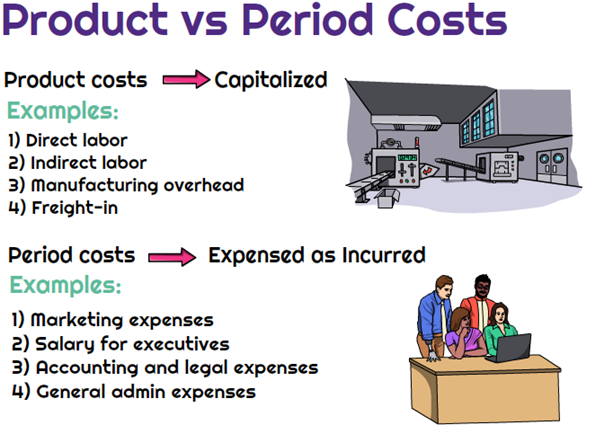

## Table of Contents

## What are period costs?

Period costs are expenses that a business incurs during a specific time period, but they are not directly tied to making a product. These costs are often related to the general operation of the business, like selling and administrative expenses. For example, salaries of office staff, advertising costs, and rent for office space are all period costs. They are recorded in the period they are incurred and are not included in the inventory cost.

Understanding period costs is important for businesses because it helps them know how much they are spending on activities that are not directly related to production. This information is useful for budgeting and financial planning. By separating period costs from product costs, a business can get a clearer picture of its overall financial health and make better decisions about where to allocate resources.

## What are product costs?

Product costs are the expenses that a business pays to make its products. These costs include things like the materials used to make the product, the labor to put it together, and any other direct costs that go into production. For example, if a company makes shoes, the leather and the workers' wages to sew the shoes are product costs.

These costs are important because they are added to the cost of the inventory. When the product is sold, these costs are taken out of inventory and shown as the cost of goods sold on the income statement. This helps the business figure out how much it costs to make each item and how much profit they make when they sell it. By keeping track of product costs, a company can set the right prices and manage its production better.

## How do period costs and product costs differ?

Period costs and product costs are two different types of expenses that businesses have. Product costs are the costs that go into making a product. This includes things like the materials used, the wages of the workers who make the product, and any other direct costs of production. These costs are added to the inventory value and are only considered expenses when the product is sold. For example, if a company makes chairs, the wood and the labor to build the chairs are product costs.

On the other hand, period costs are expenses that a business has during a certain time period, but they are not related to making the product. These costs are for things like selling the product and running the business. Examples of period costs include office rent, salaries of office staff, and advertising expenses. Unlike product costs, period costs are recorded as expenses in the period they are incurred, no matter if the product is sold or not. This helps businesses understand how much they are spending on activities that are not directly tied to production.

## Can you give examples of period costs?

Period costs are expenses that a business has to pay during a certain time, but they are not about making the product. These costs are for things that help the business run and sell its products. For example, if a company pays for an advertisement on TV to tell people about their new shoes, that's a period cost. Another example is the salary of the people who work in the office, like the accountant or the person who answers the phone. These costs are important because they help the business operate smoothly.

Another kind of period cost is the rent for the office space. If a company has an office where people work on computers and make phone calls, the money they pay for that space is a period cost. Also, if the company buys supplies like paper and pens for the office, those are period costs too. These costs are different from product costs because they are not added to the cost of the product. Instead, they are recorded as expenses right away, in the period they happen.

## Can you give examples of product costs?

Product costs are the money a business spends to make its products. For example, if a company makes bicycles, the metal used to build the frame is a product cost. The wages paid to the workers who put the bicycles together are also product costs. Another example is the cost of the paint used to make the bicycles look nice. These costs are important because they are added to the value of the inventory.

When the bicycles are sold, these product costs are taken out of inventory and shown as the cost of goods sold on the income statement. This helps the business know how much it costs to make each bicycle and how much profit they make when they sell it. By keeping track of product costs, a company can set the right prices and manage its production better.

## Why is it important to distinguish between period costs and product costs?

It's important to tell the difference between period costs and product costs because it helps businesses understand their spending better. Product costs are the money spent on making the product, like materials and labor. These costs are added to the inventory and only become expenses when the product is sold. This helps a business figure out how much it costs to make each item and set the right price to make a profit. If a business doesn't keep track of product costs, they might not know if they are making or losing money on each product they sell.

Period costs, on the other hand, are the expenses that come from running the business, like office rent, salaries for office staff, and advertising. These costs are recorded as expenses right away, in the period they happen, and they are not added to the cost of the product. Knowing period costs helps a business see how much they are spending on things that don't directly make the product. This information is useful for budgeting and planning because it shows the business where they might need to cut costs or where they can spend more to grow. By separating period costs from product costs, a business can get a clearer picture of its financial health and make better decisions.

## How are period costs treated in financial statements?

Period costs are shown on a business's income statement as expenses in the period they happen. This means if a company pays for office rent or advertising in January, those costs will be listed as expenses on the income statement for January. This is different from product costs, which are added to inventory and only become expenses when the product is sold. By recording period costs right away, a business can see how much it is spending on things that are not directly related to making the product.

Understanding how period costs are treated helps a business manage its money better. For example, if a company sees that its period costs are too high, it might look for ways to spend less on things like office supplies or advertising. This can help the business save money and use it for other important things, like growing the business or making more products. By keeping period costs separate from product costs, a business can get a clearer picture of its financial health and make better decisions about where to spend its money.

## How are product costs treated in financial statements?

Product costs are the money a business spends to make its products, like the materials and labor. These costs are added to the inventory value on the balance sheet. This means if a company makes chairs, the wood and the wages of the workers who build the chairs are part of the inventory cost. When the chairs are sold, the product costs move from the inventory on the balance sheet to the cost of goods sold on the income statement. This helps the business know how much it costs to make each chair and how much profit they make when they sell it.

By treating product costs this way, a business can keep track of how much money is tied up in making products. This is important because it helps the business set the right prices to cover the costs and make a profit. If a company doesn't keep track of product costs well, they might not know if they are making or losing money on each product they sell. Understanding product costs helps a business manage its production better and make smarter financial decisions.

## What impact do period costs have on a company's profitability?

Period costs can affect a company's profitability because they are the expenses a business pays that are not directly related to making the product. These costs include things like office rent, salaries for office staff, and advertising. If these costs are too high, they can eat into the company's profits. For example, if a company spends a lot of money on advertising but doesn't see an increase in sales, that could lower their profits. By keeping period costs low, a business can keep more of its money as profit.

On the other hand, some period costs can help a company make more money in the long run. For example, spending money on good advertising can bring in more customers and increase sales. Also, paying for a nice office space might help attract better employees, which can make the business run better. So, it's important for a company to balance its period costs. They need to spend enough to help the business grow, but not so much that it hurts their profits.

## What impact do product costs have on a company's profitability?

Product costs are the money a company spends to make its products, like the materials and the wages of the workers. These costs are really important for a company's profitability because they directly affect how much it costs to make each item. If the product costs are too high, the company might have to charge more for their products. But if customers don't want to pay that much, the company might not sell enough to make a profit. So, keeping product costs low can help a company make more money.

On the other hand, if a company can make their products for less money, they can either charge less and sell more, or keep the price the same and make more profit on each item. This is why companies always try to find ways to lower their product costs, like using cheaper materials or finding ways to make things faster. By managing product costs well, a company can make sure they are making enough money to stay in business and grow.

## How do period costs and product costs affect inventory valuation?

Product costs are the money a company spends to make its products, like the materials and the wages of the workers. These costs are added to the value of the inventory. So, if a company makes chairs, the wood and the labor to build the chairs are part of the inventory cost. When the chairs are sold, the product costs move from the inventory on the balance sheet to the cost of goods sold on the income statement. This means that product costs directly affect how much the inventory is worth on the company's [books](/wiki/algo-trading-books).

Period costs, on the other hand, are the expenses a business has that are not related to making the product, like office rent and advertising. These costs are not added to the inventory value. Instead, they are recorded as expenses right away, in the period they happen. So, period costs do not affect the inventory valuation at all. They are separate from the costs of making the product and are shown on the income statement as expenses in the period they are incurred.

## What strategies can a business use to manage period costs and product costs effectively?

A business can manage period costs by keeping a close eye on expenses like office rent, salaries for office staff, and advertising. One way to do this is by setting a budget for these costs and sticking to it. If the business sees that they are spending too much on advertising, they might try different, cheaper ways to reach customers, like using social media instead of TV ads. Another way to manage period costs is by looking for ways to save money, like moving to a smaller office or finding cheaper suppliers for office supplies. By keeping period costs low, a business can save more money and use it to grow or make more products.

Product costs are the money spent on making the product, like the materials and the wages of the workers. To manage these costs, a business can look for ways to make their products cheaper. This might mean finding cheaper materials or figuring out how to make things faster. For example, if a company makes chairs, they could try using a different type of wood that costs less. They could also train their workers to build chairs more quickly, which would lower the labor costs. By keeping product costs low, a business can either charge less for their products to sell more, or keep the price the same and make more profit on each item they sell.

Both period costs and product costs are important for a business to keep an eye on. By managing these costs well, a business can make sure they are spending their money in the best way possible. This helps them stay profitable and grow over time.

## What is Understanding Product Costs?

Product costs, also known as inventoriable costs, directly relate to the production or acquisition of goods and are crucial for manufacturers. These costs determine the cost per unit of product, forming the foundation for pricing and profitability analysis. Key elements of product costs include direct labor, raw materials, manufacturing supplies, and other overheads associated with operating the production facility.

### Components of Product Costs

1. **Direct Labor**: This encompasses the wages and benefits paid to employees directly involved in the manufacturing process. For example, assembly line workers in a car manufacturing plant contribute to direct labor costs.

2. **Raw Materials**: These are the basic materials utilized in the production of goods. In a furniture manufacturing company, wood is considered a raw material that directly impacts product costs.

3. **Manufacturing Supplies**: These include lesser-used materials that facilitate production but aren't part of the final product. This might include industrial lubricants or cleaning agents employed in machinery maintenance.

4. **Overhead Costs**: These are indirect costs related to production such as depreciation on factory equipment, utilities in the production area, and factory maintenance expenses.

### Accounting for Product Costs

Product costs are initially recorded as inventory on a company’s balance sheet. This inventory is capitalized—meaning it is considered an asset—until the product is sold. Upon sale, these costs move from inventory and are recorded as the cost of goods sold (COGS) on the income statement. The formula can be summarized as:

$$
\text{COGS} = \text{Beginning Inventory} + \text{Purchases} - \text{Ending Inventory}
$$

Effective management of product costs ensures precise pricing strategies and improved inventory control, which can enhance profit margins. By keeping product costs in check, a business ensures compliance with standard financial reporting norms, which is crucial for meeting regulatory requirements and sustaining or improving business valuation. Additionally, accurately predicting and managing these costs allows for more strategic financial planning and operational decisions, ultimately impacting a company's overall financial health and market competitiveness.

## What are Period Costs and How Do We Dive Into Them?

Period costs, distinct from product costs, are expenses recorded on the income statement during the period in which they are incurred, rather than being directly linked to the production process. These costs are crucial for maintaining operational efficiency and encompass a range of business expenses. Common examples include selling, general, and administrative expenses (SG&A), marketing expenses, office rent, and depreciation on office equipment. Unlike product costs, which are capitalized as inventory until the product is sold, period costs are expensed in the period they occur.

The management of period costs is vital for businesses aiming to maintain financial health. Careful budgeting is required to prevent these costs from placing unnecessary strain on financial resources. This entails strategic planning and regular evaluation of expenses to ensure alignment with business objectives and efficient allocation. The ability to predict and manage period costs helps businesses to avoid unexpected financial burdens and enables them to allocate their resources more efficiently.

Understanding period costs aids in making informed budgetary decisions. For instance, during a financial review, a company might analyze its office rent expense using the formula for straight-line depreciation:

$$
\text{Depreciation Expense} = \frac{\text{Cost of Asset} - \text{Salvage Value}}{\text{Useful Life}}
$$

This formula provides a clear view of how office equipment costs depreciate over time, allowing the business to allocate resources systematically and budget for future replacements or upgrades.

While period costs do not directly influence product pricing, they significantly affect overall business operations and financial health. A comprehensive grasp of these costs thus not only supports operational efficiency but also enhances the capacity for long-term strategic growth and sustainability. Understanding both the magnitude and timing of these costs enables more precise financial planning, which is vital for coping with the dynamic market conditions in which most businesses operate.

## References & Further Reading

[1]: Bergstra, J., Bardenet, R., Bengio, Y., & Kégl, B. (2011). ["Algorithms for Hyper-Parameter Optimization."](https://papers.nips.cc/paper/4443-algorithms-for-hyper-parameter-optimization) Advances in Neural Information Processing Systems 24.

[2]: ["Advances in Financial Machine Learning"](https://www.amazon.com/Advances-Financial-Machine-Learning-Marcos/dp/1119482089) by Marcos Lopez de Prado

[3]: ["Evidence-Based Technical Analysis: Applying the Scientific Method and Statistical Inference to Trading Signals"](https://onlinelibrary.wiley.com/doi/book/10.1002/9781118268315) by David Aronson

[4]: ["Machine Learning for Algorithmic Trading"](https://github.com/stefan-jansen/machine-learning-for-trading) by Stefan Jansen

[5]: ["Quantitative Trading: How to Build Your Own Algorithmic Trading Business"](https://www.amazon.com/Quantitative-Trading-Build-Algorithmic-Business/dp/1119800064) by Ernest P. Chan