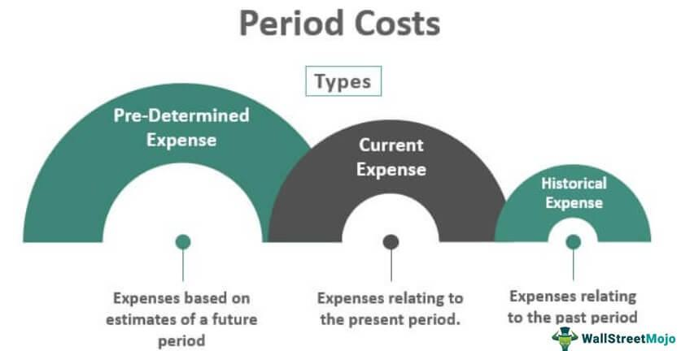

In today's financial landscape, understanding cost structures and trading strategies is paramount for businesses seeking sustainability and profitability. This article aims to elucidate the intricate details of product costs and period costs within the realm of cost accounting, alongside their implications in the rapidly evolving field of algorithmic trading.

Effective management of costs forms the foundation of a business's financial health. Product costs, which encompass direct labor, materials, and overheads tied to the manufacturing of goods, are essential for deriving accurate product pricing and managing inventory efficiently. Conversely, period costs are those expenses not directly linked to production but essential for operational efficiency, manifesting as selling, general, and administrative expenses. Proper differentiation between these two categories ensures businesses can maintain accurate financial records and adhere to reporting standards.

Simultaneously, algorithmic trading has revolutionized the execution of transactions in financial markets. By utilizing pre-defined criteria and sophisticated algorithms, traders can execute trades with enhanced efficiency and precision. This automated approach allows for the exploitation of market inefficiencies and optimal pricing, fundamentally changing the way trading strategies are developed and implemented.

The interplay between cost accounting and algorithmic trading is particularly significant. Businesses that master the differentiation between product and period costs gain a comprehensive understanding, which enhances their ability to manage financial records with precision. For traders, leveraging the principles of algorithmic trading can lead to optimized strategies and potentially superior financial results.

This introduction serves as a gateway to understanding the distinct aspects of cost accounting and algorithmic trading, offering readers a comprehensive guide to these crucial components of modern financial management. Whether you are a finance professional, a trader, or a business owner, mastering these concepts can significantly impact your financial decision-making, serving as a catalyst for strategic growth and a competitive edge in the ever-evolving financial environment.

## Table of Contents

## Understanding Product Costs

Product costs, also known as inventoriable costs, directly relate to the production or acquisition of goods and are crucial for manufacturers. These costs determine the cost per unit of product, forming the foundation for pricing and profitability analysis. Key elements of product costs include direct labor, raw materials, manufacturing supplies, and other overheads associated with operating the production facility.

### Components of Product Costs

1. **Direct Labor**: This encompasses the wages and benefits paid to employees directly involved in the manufacturing process. For example, assembly line workers in a car manufacturing plant contribute to direct labor costs.

2. **Raw Materials**: These are the basic materials utilized in the production of goods. In a furniture manufacturing company, wood is considered a raw material that directly impacts product costs.

3. **Manufacturing Supplies**: These include lesser-used materials that facilitate production but aren't part of the final product. This might include industrial lubricants or cleaning agents employed in machinery maintenance.

4. **Overhead Costs**: These are indirect costs related to production such as depreciation on factory equipment, utilities in the production area, and factory maintenance expenses.

### Accounting for Product Costs

Product costs are initially recorded as inventory on a company’s balance sheet. This inventory is capitalized—meaning it is considered an asset—until the product is sold. Upon sale, these costs move from inventory and are recorded as the cost of goods sold (COGS) on the income statement. The formula can be summarized as:

$$
\text{COGS} = \text{Beginning Inventory} + \text{Purchases} - \text{Ending Inventory}
$$

Effective management of product costs ensures precise pricing strategies and improved inventory control, which can enhance profit margins. By keeping product costs in check, a business ensures compliance with standard financial reporting norms, which is crucial for meeting regulatory requirements and sustaining or improving business valuation. Additionally, accurately predicting and managing these costs allows for more strategic financial planning and operational decisions, ultimately impacting a company's overall financial health and market competitiveness.

## Diving Into Period Costs

Period costs, distinct from product costs, are expenses recorded on the income statement during the period in which they are incurred, rather than being directly linked to the production process. These costs are crucial for maintaining operational efficiency and encompass a range of business expenses. Common examples include selling, general, and administrative expenses (SG&A), marketing expenses, office rent, and depreciation on office equipment. Unlike product costs, which are capitalized as inventory until the product is sold, period costs are expensed in the period they occur.

The management of period costs is vital for businesses aiming to maintain financial health. Careful budgeting is required to prevent these costs from placing unnecessary strain on financial resources. This entails strategic planning and regular evaluation of expenses to ensure alignment with business objectives and efficient allocation. The ability to predict and manage period costs helps businesses to avoid unexpected financial burdens and enables them to allocate their resources more efficiently.

Understanding period costs aids in making informed budgetary decisions. For instance, during a financial review, a company might analyze its office rent expense using the formula for straight-line depreciation:

$$
\text{Depreciation Expense} = \frac{\text{Cost of Asset} - \text{Salvage Value}}{\text{Useful Life}}
$$

This formula provides a clear view of how office equipment costs depreciate over time, allowing the business to allocate resources systematically and budget for future replacements or upgrades.

While period costs do not directly influence product pricing, they significantly affect overall business operations and financial health. A comprehensive grasp of these costs thus not only supports operational efficiency but also enhances the capacity for long-term strategic growth and sustainability. Understanding both the magnitude and timing of these costs enables more precise financial planning, which is vital for coping with the dynamic market conditions in which most businesses operate.

## Cost Accounting in Business Strategy

Cost accounting is a critical component of strategic management, offering businesses the tools to identify cost-saving opportunities and enhance operational efficiency. At its core, cost accounting revolves around the systematic categorization and recording of both product and period costs. By accurately organizing these costs, companies can streamline their operations and more effectively control their expenses.

One of the primary benefits of cost accounting is its ability to support strategic decision-making. Accurate cost records guide companies in setting appropriate pricing strategies, conducting profit analyses, and forecasting financial performance. With precise cost information, businesses can establish competitive pricing while ensuring profitability.

Moreover, in today's fiercely competitive business environment, leveraging insights from cost accounting is essential for optimizing supply chains and boosting productivity. Effective cost management enables businesses to identify inefficiencies and implement improvements across various operational facets. This, in turn, leads to not only cost reduction but also enhanced overall performance.

Cost control and analysis are central to resource allocation and profitability. Emphasizing these aspects can drive more efficient use of resources, ultimately leading to increased earnings. By maintaining a detailed understanding of costs and their impact on operations, businesses can make informed strategic moves that bolster their market position.

Integrating cost accounting into a company's strategic framework equips managers with the knowledge needed to make sound financial decisions. This integration ensures that resources are allocated wisely and that operations are aligned with broader business goals. As a result, organizations can achieve sustainable growth and maintain a competitive advantage in the marketplace.

## Algorithmic Trading: A Modern Approach

Algorithmic trading, or algo trading, refers to the use of computer algorithms to automate the trading of financial instruments based on predefined criteria. These algorithms enable the execution of trades with precision and speed, surpassing human capabilities in terms of efficiency and timeliness. Traders leverage these algorithms to identify and exploit market inefficiencies, achieving optimal prices with minimal human intervention.

A key feature of [algorithmic trading](/wiki/algorithmic-trading) is its reliance on sophisticated data analysis and [machine learning](/wiki/machine-learning) techniques. Algorithms analyze vast datasets to forecast price movements and detect emerging market trends. By processing information at high speeds, algo trading platforms can make split-second decisions, capitalizing on short-lived trading opportunities that might be missed by humans. For instance, techniques such as linear regression, time-series analysis, and [reinforcement learning](/wiki/reinforcement-learning) are often employed to develop predictive models that guide trading decisions.

Despite the many advantages of algorithmic trading, it necessitates robust risk management frameworks to handle market [volatility](/wiki/volatility-trading-strategies) and mitigate potential financial losses. The rapid execution of trades can amplify both profits and losses, requiring traders to implement comprehensive risk protocols. These may include stop-loss orders, dynamic hedging strategies, and the continuous monitoring of trading positions to limit exposure to adverse market movements.

As financial markets evolve, staying updated with technological advancements in algorithmic trading is crucial for maintaining a competitive edge. Innovations such as high-frequency trading, quantum computing, and [artificial intelligence](/wiki/ai-artificial-intelligence) further redefine the landscape, allowing traders to enhance their strategies and execution efficiencies. Moreover, regulatory developments play a significant role in shaping the algo trading environment, impacting how algorithms are designed and operated.

In conclusion, algorithmic trading represents a paradigm shift in financial markets, blending technology and finance to deliver superior trading outcomes. Mastering this approach can provide traders with significant advantages, enabling them to execute trades more effectively and capitalize on fleeting market opportunities.

## Integrating Cost Accounting with Algo Trading

Integrating cost accounting with algorithmic trading provides traders with a profound understanding of transaction costs and profitability implications. This integration facilitates a detailed evaluation of both product costs and period costs, allowing traders to transcend beyond standard trading commissions and spreads to assess the total financial impact of their trading strategies.

Product costs in a trading context may encompass specific software development costs for trading algorithms or costs tied to acquiring real-time market data, which are essential for executing trades. Period costs, on the other hand, may encompass broader operational expenses such as infrastructure maintenance or ongoing subscription fees for trading platforms. By categorizing these expenses accurately, traders can gain insights into the fixed and variable costs associated with their trading operations, enabling comprehensive financial analysis.

The integration of cost accounting into algorithmic trading systems aids significantly in developing cost-effective trading strategies. For instance, knowing the detailed breakdown of costs allows traders to optimize their algorithms for maximum returns by minimizing unnecessary expenditure. A profound understanding of the cost structure can lead to refining algorithms to trade only under conditions where the expected return exceeds the associated costs, thereby enhancing overall trading efficiency.

Furthermore, integrating these domains fosters informed decision-making by promoting a holistic financial performance perspective. The utilization of cost accounting principles provides traders with quantitative metrics to evaluate their trading strategies' efficiency and profitability. This analytical approach supports traders in adjusting strategies promptly and effectively, mitigating potential losses linked to unforeseen cost variations.

Leveraging insights from both cost accounting and algorithmic trading encourages greater financial clarity and success. Businesses and traders that successfully synthesize these methodologies are better positioned to drive financial growth and optimize resource allocation strategically. By understanding and planning for both explicit and implicit costs, traders can enhance their operational strategies, leading to sustained profitability and competitive advantage.

## Conclusion

A strong grasp of cost accounting principles and algorithmic trading strategies is crucial for navigating the financial complexities of today’s business environment. Understanding product and period costs allows businesses to manage their finances efficiently and make strategic operational decisions. Product costs, tied directly to production, inform pricing and inventory strategies, while period costs, recognized as expenses, require effective budgetary control to maintain operational efficiency.

Algorithmic trading offers a sophisticated method to leverage market opportunities and optimize trade executions. By automating trading processes using algorithms, traders can efficiently react to market conditions, minimizing human error and exploiting market inefficiencies. Such strategic automation relies heavily on data analysis, making it essential for traders to be well-versed in modern data science techniques.

Merging cost accounting with algo trading provides businesses with a comprehensive financial viewpoint. This integration enables an assessment beyond mere trading commissions, encompassing all transaction costs for maximum profitability. By synthesizing insights from both cost accounting and algo trading, businesses can enhance financial clarity and performance, driving growth and profitability.

As the financial landscape evolves, staying informed on these subjects is vital for sustained success and maintaining a competitive advantage. Embracing these disciplines equips businesses and traders alike with the knowledge required to excel in an increasingly complex marketplace.

## References & Further Reading

[1]: Bergstra, J., Bardenet, R., Bengio, Y., & Kégl, B. (2011). ["Algorithms for Hyper-Parameter Optimization."](https://papers.nips.cc/paper/4443-algorithms-for-hyper-parameter-optimization) Advances in Neural Information Processing Systems 24.

[2]: ["Advances in Financial Machine Learning"](https://www.amazon.com/Advances-Financial-Machine-Learning-Marcos/dp/1119482089) by Marcos Lopez de Prado

[3]: ["Evidence-Based Technical Analysis: Applying the Scientific Method and Statistical Inference to Trading Signals"](https://onlinelibrary.wiley.com/doi/book/10.1002/9781118268315) by David Aronson

[4]: ["Machine Learning for Algorithmic Trading"](https://github.com/stefan-jansen/machine-learning-for-trading) by Stefan Jansen

[5]: ["Quantitative Trading: How to Build Your Own Algorithmic Trading Business"](https://www.amazon.com/Quantitative-Trading-Build-Algorithmic-Business/dp/1119800064) by Ernest P. Chan