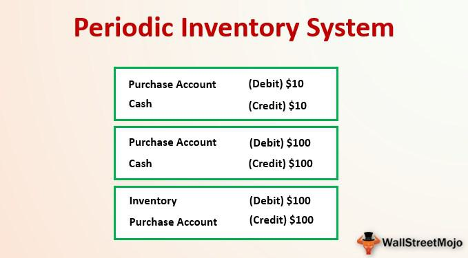

Inventory management is a fundamental component for businesses engaged in the handling of tangible goods, regardless of their size. Effective management of inventory is vital not only for operational efficiency but also for positive financial outcomes. Two primary systems are utilized for inventory management: periodic and perpetual. Each system has distinct characteristics and applications, which makes understanding them essential for businesses aiming to optimize their inventory processes.

Periodic inventory management involves conducting inventory counts at predetermined intervals, such as annually or quarterly, providing a snapshot of stock levels at a specific point in time. This method is noted for its simplicity and cost-effectiveness, making it especially advantageous for small businesses with limited inventory volumes. However, due to the infrequency of stocktaking, there may be delays in data availability and a greater margin for errors or discrepancies.

In contrast, perpetual inventory systems continuously update inventory data by utilizing technological solutions like point-of-sale systems and inventory management software. This approach ensures real-time tracking of inventory, facilitating accurate and prompt decision-making. While the initial investment in perpetual systems can be substantial, their ability to reduce long-term inefficiencies and improve precision makes them a popular choice for larger enterprises with extensive inventories.

The choice between these inventory systems is not solely dependent on the size of a business but also on how it integrates with contemporary practices such as algorithmic trading. Algorithmic trading relies heavily on automation and the use of algorithms to execute trading decisions. The alignment between perpetual inventory systems' real-time data capabilities and the requirements of algorithmic trading can enhance market trend predictions and strategic operations.

Understanding how inventory management intersects with modern trading algorithms can provide businesses with a competitive edge, promoting streamlined operations and informed strategic decisions. As such, selecting the appropriate inventory management strategy is crucial, not only for operational coherence but also for leveraging advancements in technology and trading methodologies.

## Table of Contents

## What is Periodic Inventory Management?

Periodic inventory management is a system wherein inventory levels are assessed at specific time intervals, typically quarterly or annually. This approach is prevalent among small businesses due to its simplicity and cost reduction benefits. By scheduling inventory counts periodically, companies avoid the need for sophisticated technology and continuous monitoring, making it an attractive option for operations with limited inventory turnover.

In periodic inventory systems, the cost of goods sold (COGS) is calculated at the end of each period. This is achieved by taking a physical count of the inventory to determine the ending inventory balance. The formula for calculating COGS in this system is:

$$
\text{COGS} = \text{Beginning Inventory} + \text{Purchases} - \text{Ending Inventory}
$$

While this method reduces continuous monitoring efforts, it can result in delays in data accuracy. The inherent lag between inventory counts can lead to discrepancies, affecting financial statements and operational decisions. The periodic system is also labor-intensive as it requires manual counting and verification of physical inventory, a process that can be time-consuming and disruptive.

The simplicity of the periodic inventory management system can be beneficial for businesses with low inventory volumes. However, the infrequent nature of monitoring introduces a higher margin of error, making it challenging to detect and rectify discrepancies promptly. This can affect the accuracy of inventory records and financial outcomes, posing a risk for businesses where inventory is a significant asset.

In summary, while periodic inventory management provides a straightforward and cost-effective method for small businesses, it requires careful consideration of its potential drawbacks, including delayed data accuracy and the risk of inventory discrepancies. As businesses grow and inventory complexities increase, transitioning to more dynamic systems may become necessary to maintain operational efficiency.

## Understanding Perpetual Inventory Management

Perpetual inventory management systems represent a significant advancement in inventory tracking, leveraging technology to maintain real-time updates of inventory levels. These systems are intricately woven into the operational fabric of larger enterprises, where the scale of inventory and sales volumes demands seamless and continuous tracking. By utilizing point-of-sale (POS) systems and specialized software, perpetual inventory systems record each transaction instantaneously, ensuring that inventory counts are perpetually up-to-date.

The real-time nature of perpetual inventory management confers several advantages, particularly in terms of data precision and timeliness. Accurate and current data empowers businesses to make informed decisions on inventory control, pricing strategies, and supply chain management, thus enhancing operational efficiency and responsiveness to market demands. The precision offered by these systems is crucial in preventing stockouts and overstock situations, which can significantly impact business performance.

Implementing a perpetual inventory system involves higher initial outlays due to the need for sophisticated technology, including robust POS systems and inventory management software. However, these costs are often offset by the long-term efficiencies gained. Automating inventory tracking reduces the need for manual counts and minimizes human error, thereby curtailing labor costs and the potential for discrepancies. Over time, the efficiencies achieved through precise inventory management can lead to substantial reductions in carrying costs and contribute to improved profitability.

Moreover, the integration capabilities of perpetual systems facilitate comprehensive data analysis, linking inventory management seamlessly with other business functions such as finance and sales. This integration is pivotal for businesses seeking to harness data analytics for strategic decision-making. As digital transformation continues to reshape business landscapes, the adoption of perpetual inventory systems is poised to deliver strategic benefits and a competitive edge through enhanced data accuracy and operational agility.

## Key Differences Between Periodic and Perpetual Systems

Perpetual inventory systems and periodic inventory systems are fundamentally different approaches to managing a company's stock and are distinguished by several critical factors in their operations. A perpetual inventory system continually updates inventory records for sales and purchases through advanced technology, such as point-of-sale systems and inventory management software. This real-time updating process provides businesses with immediate and accurate data on inventory levels, thereby significantly minimizing the potential for human error. In contrast, periodic inventory systems update inventory records only after conducting physical counts at specified intervals, such as quarterly or annually. This manual approach can introduce delays and inaccuracies into inventory tracking, leading to potential discrepancies and a lack of timely data.

The reliance on technology in perpetual inventory systems not only reduces the likelihood of errors but also enhances business efficiency by integrating seamlessly with other operational systems. This integration allows for a comprehensive view of inventory alongside other business functions, facilitating informed decision-making processes. For instance, managers can make prompt decisions about restocking and pricing based on real-time data, optimizing operational efficiency and financial performance.

In periodic systems, the necessity of manual counts can be disruptive to daily operations due to the resource-intensive nature of these activities. Businesses must pause certain operations to conduct inventory checks, which can be labor-intensive and time-consuming. This system might be sufficient for small-scale operations with limited inventory, but it proves inadequate for larger businesses demanding accuracy and efficiency.

Moreover, the lag in data updates with periodic systems restricts timely decision-making, impacting a business's ability to respond swiftly to market changes. In contrast, the perpetual systems' constant data stream allows businesses to react to fluctuations and trends almost instantaneously, providing a strategic advantage in dynamic markets. This capability is crucial for businesses aiming to optimize inventory levels, reduce carrying costs, and enhance customer satisfaction through efficient stock management.

## Inventory Management and Algorithmic Trading

Algorithmic trading, characterized by its reliance on complex algorithms and automation, shares a fundamental similarity with perpetual inventory systems: both operate on real-time data updates. This synchronicity allows for seamless integration between inventory management and trading strategies, enhancing the ability of businesses to predict and respond to market dynamics effectively.

Efficient inventory management is a vital component for algorithms tasked with forecasting market trends. By continuously monitoring inventory levels, these algorithms can identify patterns in product demand and supply, allowing businesses to adapt their strategies accordingly. For instance, real-time inventory data can signal when to adjust restocking efforts, refine pricing strategies, or forecast future sales volumes with greater accuracy.

In [algorithmic trading](/wiki/algorithmic-trading), precise data is paramount; delayed or inaccurate information can lead to suboptimal decisions. The perpetual system's ability to provide continuous updates helps ensure that trading algorithms receive the most current inventory data, enhancing their accuracy and reliability. This integration creates a feedback loop where trading outcomes can influence inventory management decisions and vice versa, optimizing overall business performance.

The future of inventory management is likely to see even tighter coupling with algorithmic trading as technological advancements continue to unfold. Innovations such as [artificial intelligence](/wiki/ai-artificial-intelligence) and [machine learning](/wiki/machine-learning) can further enhance the predictive capabilities of these algorithms, leading to more sophisticated and proactive inventory strategies. As such, businesses adopting perpetual inventory systems and integrating them with cutting-edge trading algorithms may gain a competitive edge, enabling them to respond swiftly and accurately to market shifts. 

By embracing the synergy between perpetual inventory systems and algorithmic trading, businesses can not only streamline their operations but also unlock new levels of strategic insight, ultimately leading to more informed decision-making and improved financial outcomes.

## Conclusion

Choosing between periodic and perpetual inventory systems is a critical decision that hinges on a business's size and operational complexity. For modern enterprises prioritizing precision and efficiency, perpetual systems present numerous advantages. They provide real-time inventory tracking, which is integral for maintaining accurate stock levels and making informed business decisions. This capability becomes increasingly crucial as businesses scale, allowing them to manage larger inventories without the lag associated with periodic systems.

On the other hand, periodic systems, characterized by their simplicity and lower initial costs, remain suitable for small-scale operations. These systems are less technologically demanding and can adequately serve businesses with limited inventory volumes or resources. However, as digital transformation continues to reshape industries, there is a notable shift towards perpetual systems. The ability to integrate seamlessly with various business functions and provide comprehensive, up-to-date data highlights their relevance in an increasingly digital landscape.

Moreover, the synergy between inventory management and algorithmic trading amplifies the importance of real-time data. As algorithms increasingly drive market decisions, the integration of perpetual systems can enhance trading accuracy by supplying timely and precise inventory information. This alignment facilitates more accurate market predictions, strategic restocking, and optimized pricing strategies.

For businesses striving to maintain a competitive edge, embracing a perpetual inventory system offers a strategic advantage. The transition toward digital and automated operations underscores the potential of perpetual systems to streamline processes and enhance decision-making capabilities. As businesses continue to evolve and expand in complexity, adopting such systems may prove pivotal in achieving sustained success and adaptability in a dynamic market environment.

## References & Further Reading

[1]: ["Inventory Management and Production Planning and Scheduling"](https://www.researchgate.net/publication/239386432_Inventory_Management_and_Production_Planning_and_Scheduling_Third_Edition) by Edward A. Silver, David F. Pyke, and Rein Peterson

[2]: ["Advances in Financial Machine Learning"](https://www.amazon.com/Advances-Financial-Machine-Learning-Marcos/dp/1119482089) by Marcos Lopez de Prado

[3]: ["Logistics and Supply Chain Management"](https://keydifferences.com/difference-between-logistics-and-supply-chain-management.html) by Martin Christopher

[4]: ["Supply Chain Management: Strategy, Planning, and Operation"](https://www.pearson.com/en-us/subject-catalog/p/supply-chain-management-strategy-planning-and-operation/P200000005863/9780137502844) by Sunil Chopra and Peter Meindl

[5]: ["Quantitative Trading: How to Build Your Own Algorithmic Trading Business"](https://www.amazon.com/Quantitative-Trading-Build-Algorithmic-Business/dp/1119800064) by Ernest P. Chan