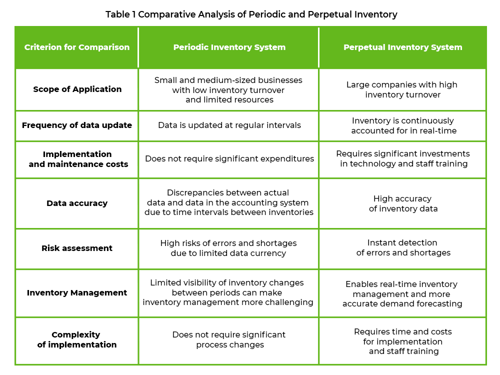

## Table of Contents

## What is a perpetual inventory system?

A perpetual inventory system is a way for businesses to keep track of their inventory in real time. This system updates the inventory records every time a sale is made or new stock is received. It uses special software and tools like barcode scanners to make sure the inventory numbers are always correct. This helps businesses know exactly how much stock they have at any moment, which is very useful for making quick decisions about ordering more products or managing sales.

Using a perpetual inventory system has many benefits. It helps prevent running out of stock because the system alerts the business when it's time to reorder. It also makes it easier to find mistakes or theft because any difference between the recorded inventory and the actual inventory can be spotted quickly. While this system can be more expensive to set up and maintain than other methods, many businesses find it worth the cost because it helps them run more smoothly and efficiently.

## What is a periodic inventory system?

A periodic inventory system is a way for businesses to check their inventory at certain times, not all the time. They count their stock at the end of a period, like every month or every year. This means they don't update their inventory records every time something is sold or bought. Instead, they do it all at once during the inventory count.

This system is simpler and cheaper to use than a perpetual inventory system because it doesn't need special software or tools. But, it can be harder to know exactly how much stock you have at any moment. This can make it tricky to decide when to order more products or to spot if something is missing or stolen right away. Businesses that don't sell a lot of different items or don't need to know their inventory numbers all the time might find a periodic inventory system works well for them.

## How does a perpetual inventory system track inventory?

A perpetual inventory system keeps track of inventory all the time. It does this by updating the inventory records every time a sale is made or new stock comes in. This system uses special software and tools like barcode scanners to make sure the numbers are always right. When a product is sold, the system takes it away from the total inventory right away. When new stock arrives, it adds it to the total right away too.

This way, the business always knows exactly how much stock they have. It helps them make quick decisions about when to order more products. If something is sold or received, the system changes the inventory numbers instantly. This makes it easy to see if there are any mistakes or if something is missing because the numbers are always up to date.

## How does a periodic inventory system track inventory?

A periodic inventory system checks inventory at certain times, not all the time. Businesses using this system count their stock at the end of a period, like every month or every year. They don't update their inventory records every time something is sold or bought. Instead, they wait until the end of the period to do a big count of everything they have.

This system is simpler and cheaper because it doesn't need special software or tools. But, it can be harder to know exactly how much stock you have at any moment. This can make it tricky to decide when to order more products or to spot if something is missing or stolen right away. Businesses that don't need to know their inventory numbers all the time might find a periodic inventory system works well for them.

## What are the main differences between perpetual and periodic inventory systems?

A perpetual inventory system keeps track of inventory all the time. It updates the inventory records every time a sale is made or new stock comes in. This system uses special software and tools like barcode scanners to make sure the numbers are always correct. This means a business knows exactly how much stock they have at any moment, which helps them make quick decisions about ordering more products. It also helps them spot mistakes or theft quickly because any difference between the recorded inventory and the actual inventory can be seen right away.

A periodic inventory system, on the other hand, checks inventory at certain times, not all the time. Businesses using this system count their stock at the end of a period, like every month or every year. They don't update their inventory records every time something is sold or bought. Instead, they wait until the end of the period to do a big count of everything they have. This system is simpler and cheaper because it doesn't need special software or tools. But, it can be harder to know exactly how much stock you have at any moment, which can make it tricky to decide when to order more products or to spot if something is missing or stolen right away.

The main differences between these two systems are how often they update inventory and the tools they use. A perpetual system updates in real time and uses technology, while a periodic system updates at set intervals and doesn't need technology. This makes the perpetual system more expensive but more accurate and useful for businesses that need to know their inventory numbers all the time. The periodic system is cheaper and simpler but less accurate and useful for businesses that don't need to know their inventory numbers all the time.

## What are the advantages of using a perpetual inventory system?

A perpetual inventory system helps businesses keep track of their stock all the time. It updates the inventory records every time something is sold or new stock arrives. This means a business always knows exactly how much stock they have, which helps them make quick decisions about when to order more products. It also helps them spot mistakes or theft quickly because any difference between the recorded inventory and the actual inventory can be seen right away.

This system uses special software and tools like barcode scanners to make sure the numbers are always correct. This can be more expensive to set up and maintain than other methods, but many businesses find it worth the cost. It helps prevent running out of stock because the system alerts the business when it's time to reorder. This makes the business run more smoothly and efficiently, which can save time and money in the long run.

## What are the disadvantages of using a perpetual inventory system?

A perpetual inventory system can be costly to set up and maintain. It needs special software and tools like barcode scanners, which can be expensive. This means small businesses or those with tight budgets might find it hard to use this system. Also, if the system has a problem or if there's a mistake in how it's used, the inventory numbers might not be right. This can lead to wrong decisions about ordering more products or thinking there's more stock than there really is.

Another issue is that everyone who uses the system needs to be trained on how to use it properly. If they don't know how to use it well, they might make mistakes that mess up the inventory numbers. This can take time and money to fix. Also, because the system updates all the time, it might need more work to keep it running smoothly. This can be a hassle for businesses that don't have a lot of time or people to manage it.

## What are the advantages of using a periodic inventory system?

A periodic inventory system is easier and cheaper to use than a perpetual inventory system. It doesn't need special software or tools like barcode scanners. This means small businesses or those with tight budgets can use it without spending a lot of money. It's also simpler to understand and use because you just count your stock at the end of a period, like every month or every year. This makes it easier for everyone in the business to help with the inventory count.

Even though a periodic system doesn't update all the time, it can still work well for some businesses. If a business doesn't sell a lot of different items or doesn't need to know their inventory numbers all the time, this system can be a good choice. It helps them keep track of their stock without needing to update it every time something is sold or bought. This can save time and effort, especially for businesses that don't have a lot of staff to manage the inventory.

## What are the disadvantages of using a periodic inventory system?

A periodic inventory system can make it hard for a business to know exactly how much stock they have all the time. They only count their stock at the end of a period, like every month or every year. This means they don't update their inventory records every time something is sold or bought. So, it can be tricky to decide when to order more products because they don't know their exact stock numbers until the next count.

Another problem is that it can be harder to spot if something is missing or stolen right away. If the inventory numbers are only checked at certain times, it might take a while to notice if something is wrong. This can lead to bigger problems or losses for the business. While a periodic system is cheaper and simpler, it might not be the best choice for businesses that need to know their inventory numbers all the time or sell a lot of different items.

## In what types of businesses is a perpetual inventory system most suitable?

A perpetual inventory system is most suitable for businesses that need to know their stock numbers all the time. These are usually big stores or businesses that sell a lot of different items. For example, supermarkets, electronics stores, and clothing stores often use this system. It helps them keep track of what they have and make quick decisions about ordering more products. This way, they can make sure they always have enough stock to meet customer needs.

This system is also good for businesses that want to spot mistakes or theft quickly. Because the inventory numbers are updated every time something is sold or bought, it's easier to see if something is wrong. Online stores and businesses that sell high-value items also find perpetual inventory systems useful. They can keep their stock numbers correct and make sure they're always ready for customers.

## In what types of businesses is a periodic inventory system most suitable?

A periodic inventory system is best for small businesses or those that don't need to know their stock numbers all the time. For example, a small local shop that sells a few types of items might use this system. They can count their stock at the end of each month or year and don't need to update it every time something is sold or bought. This way, they can keep track of their inventory without spending a lot of money on special tools or software.

This system is also good for businesses that don't sell a lot of different items. A bakery that makes a few types of bread and pastries might use a periodic inventory system. They can count their stock at set times and make sure they have enough ingredients and products. It's simpler and cheaper, which can be a big help for businesses that don't have a lot of money to spend on inventory management.

## How do technological advancements influence the choice between perpetual and periodic inventory systems?

Technological advancements have made perpetual inventory systems easier and cheaper to use. Before, these systems needed expensive software and tools like barcode scanners. Now, with better technology, businesses can use apps on their phones or tablets to keep track of their stock. This means even small businesses can use perpetual systems without spending a lot of money. Also, new technology makes it easier to connect with other systems, like those used for ordering products or managing sales. This helps businesses run more smoothly and make better decisions about their stock.

Even with these improvements, some businesses still choose periodic inventory systems. This is often because they don't need to know their stock numbers all the time. They can use simple tools like spreadsheets to count their stock at the end of a period. While technology has made perpetual systems more accessible, it hasn't changed the fact that periodic systems are still simpler and cheaper. So, businesses that don't sell a lot of different items or don't need real-time updates might still find periodic systems work well for them.

## What is Periodic Inventory Management?

Periodic inventory management is a system wherein inventory levels are assessed at specific time intervals, typically quarterly or annually. This approach is prevalent among small businesses due to its simplicity and cost reduction benefits. By scheduling inventory counts periodically, companies avoid the need for sophisticated technology and continuous monitoring, making it an attractive option for operations with limited inventory turnover.

In periodic inventory systems, the cost of goods sold (COGS) is calculated at the end of each period. This is achieved by taking a physical count of the inventory to determine the ending inventory balance. The formula for calculating COGS in this system is:

$$
\text{COGS} = \text{Beginning Inventory} + \text{Purchases} - \text{Ending Inventory}
$$

While this method reduces continuous monitoring efforts, it can result in delays in data accuracy. The inherent lag between inventory counts can lead to discrepancies, affecting financial statements and operational decisions. The periodic system is also labor-intensive as it requires manual counting and verification of physical inventory, a process that can be time-consuming and disruptive.

The simplicity of the periodic inventory management system can be beneficial for businesses with low inventory volumes. However, the infrequent nature of monitoring introduces a higher margin of error, making it challenging to detect and rectify discrepancies promptly. This can affect the accuracy of inventory records and financial outcomes, posing a risk for businesses where inventory is a significant asset.

In summary, while periodic inventory management provides a straightforward and cost-effective method for small businesses, it requires careful consideration of its potential drawbacks, including delayed data accuracy and the risk of inventory discrepancies. As businesses grow and inventory complexities increase, transitioning to more dynamic systems may become necessary to maintain operational efficiency.

## References & Further Reading

[1]: ["Inventory Management and Production Planning and Scheduling"](https://www.researchgate.net/publication/239386432_Inventory_Management_and_Production_Planning_and_Scheduling_Third_Edition) by Edward A. Silver, David F. Pyke, and Rein Peterson

[2]: ["Advances in Financial Machine Learning"](https://www.amazon.com/Advances-Financial-Machine-Learning-Marcos/dp/1119482089) by Marcos Lopez de Prado

[3]: ["Logistics and Supply Chain Management"](https://keydifferences.com/difference-between-logistics-and-supply-chain-management.html) by Martin Christopher

[4]: ["Supply Chain Management: Strategy, Planning, and Operation"](https://www.pearson.com/en-us/subject-catalog/p/supply-chain-management-strategy-planning-and-operation/P200000005863/9780137502844) by Sunil Chopra and Peter Meindl

[5]: ["Quantitative Trading: How to Build Your Own Algorithmic Trading Business"](https://www.amazon.com/Quantitative-Trading-Build-Algorithmic-Business/dp/1119800064) by Ernest P. Chan