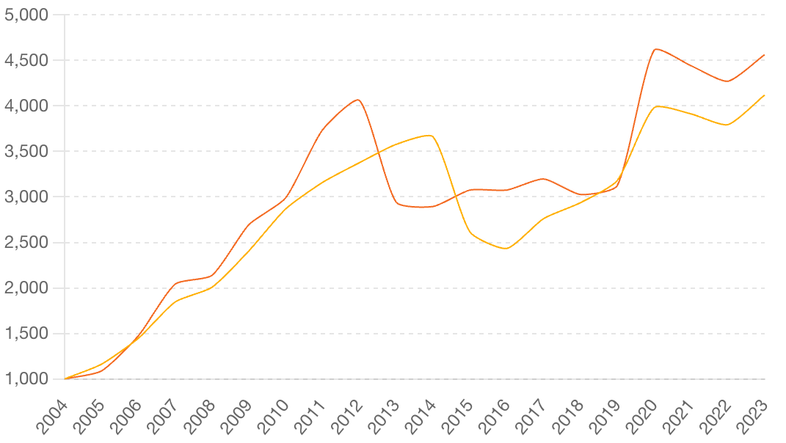

## Table of Contents

## What is physical gold and how is it different from gold ETFs?

Physical gold refers to gold in its tangible form, like gold bars, coins, or jewelry. When you buy physical gold, you own the actual metal. You can hold it, store it, and even sell it whenever you want. Physical gold has been valued for thousands of years and is often seen as a safe investment during uncertain economic times.

Gold ETFs, or Exchange Traded Funds, are different because they are not actual gold. Instead, they are financial products that track the price of gold. When you invest in a gold ETF, you buy shares in a fund that holds gold or gold-related assets. This means you don't own the physical gold itself, but you benefit from changes in the gold price. Gold ETFs are easier to buy and sell because they trade on stock exchanges, just like stocks.

## What are the initial costs associated with investing in physical gold versus gold ETFs?

When you invest in physical gold, you need to pay for the gold itself, which is the biggest cost. But there are other costs too. You might have to pay a premium over the gold's market price, which is what dealers charge to make a profit. Also, you'll need a safe place to keep your gold, like a home safe or a bank's safe deposit box, which can cost money. If you want to sell your gold later, you might have to pay for shipping and insurance, and dealers might buy it back at a lower price than what you paid.

Investing in gold ETFs is usually cheaper to start with. You just need to buy shares of the ETF, and you can do this through a brokerage account. The main cost here is the price of the shares you buy. There might be a small fee from the broker for buying and selling the shares, called a commission. Also, the ETF itself might have an expense ratio, which is a yearly fee based on how much you have invested. But these costs are usually much lower than the extra costs you pay for physical gold.

## How do storage and insurance costs compare between physical gold and gold ETFs?

Storing physical gold can cost you money. You might need a safe at home or a safe deposit box at a bank. A safe at home can cost a few hundred dollars to buy, and a safe deposit box can cost you around $20 to $200 a year, depending on the size and location. Also, you might want to get insurance for your gold to protect it if something bad happens, like a theft or a fire. Insurance can cost about 1% to 2% of the value of your gold every year.

Gold ETFs are much easier and cheaper to store. When you invest in a gold ETF, you don't have to worry about keeping the gold safe because the ETF company does that for you. You just need to keep track of your shares in your brokerage account, and there are no extra storage costs for you. Also, since you don't own the physical gold, you don't need to buy insurance for it. The only costs you might have are the small fees from the ETF itself, but those are usually much less than the costs of storing and insuring physical gold.

## What are the liquidity differences between physical gold and gold ETFs?

Physical gold can be harder to sell quickly. When you want to sell your gold, you have to find a buyer, which might take some time. You might need to go to a dealer or use a service that buys gold. Sometimes, dealers might not give you as much money as you think your gold is worth. This means it can take a while to turn your physical gold into cash, and you might not get the full value right away.

Gold ETFs are much easier and faster to sell. Since they trade on stock exchanges, you can sell your shares anytime the market is open. It's just like selling a stock. You can usually get your money very quickly, often within a few days. Plus, the price you get is usually close to the current market price of gold, so you don't lose much value when you sell.

## How do the price movements of physical gold compare to those of gold ETFs?

Physical gold and gold ETFs generally move in the same direction because they both depend on the price of gold. If the price of gold goes up, both physical gold and gold ETFs will usually go up too. If the price of gold goes down, both will usually go down. This is because gold ETFs are designed to track the price of gold as closely as possible.

However, there can be small differences. Physical gold might have a bit of a delay in price changes because it takes time for dealers to adjust their prices. Also, the cost to buy and sell physical gold can affect the price you actually pay or get. Gold ETFs can sometimes be more responsive to price changes because they trade on stock exchanges and can react quickly to market news. But overall, both physical gold and gold ETFs follow the same general trend of the gold market.

## What are the tax implications of investing in physical gold versus gold ETFs?

When you invest in physical gold, you have to think about taxes when you sell it. If you sell your gold for more money than you paid for it, you have to pay a tax on the profit. This is called a capital gains tax. How much tax you pay depends on how long you owned the gold. If you owned it for a year or less, you pay a short-term capital gains tax, which is the same as your regular income tax rate. If you owned it for more than a year, you pay a long-term capital gains tax, which is usually lower. Also, some states might charge you sales tax when you buy physical gold.

With gold ETFs, the tax rules are a bit different. When you sell your ETF shares for a profit, you also have to pay capital gains tax. The rules for short-term and long-term gains are the same as with physical gold. But, gold ETFs can also give you dividends, which are small payments from the ETF. You have to pay taxes on these dividends too, usually at your regular income tax rate. The good thing is, you don't have to worry about sales tax when you buy gold ETFs because they are financial products, not physical items.

## How can beginners start investing in physical gold or gold ETFs?

If you want to start investing in physical gold, first decide what type of gold you want to buy, like coins, bars, or jewelry. You can buy gold from a local dealer, a bank, or online. Make sure to check the dealer's reputation and the price they charge, which might be more than the market price of gold. Once you buy the gold, you'll need a safe place to store it, like a home safe or a bank's safe deposit box. Also, think about getting insurance to protect your gold. When you're ready to sell, you can go back to a dealer or use a service that buys gold, but remember it might take some time to find a buyer and you might not get as much money as you paid.

If you want to start investing in gold ETFs, you'll need to open a brokerage account first. You can do this online with a company that offers investment services. Once your account is set up, you can search for gold ETFs by their names or ticker symbols. Choose the one you want to invest in and buy shares just like you would buy a stock. The price you pay will be close to the current market price of gold. When you want to sell, you can do it quickly through your brokerage account. Just remember, you might have to pay small fees when you buy or sell, and there might be a yearly fee from the ETF itself.

## What are the risks associated with each type of investment?

Investing in physical gold has some risks. One big risk is that it can be stolen or lost. You have to keep it safe, which can cost money for a safe or a safe deposit box. Another risk is that the price of gold can go down. If you need to sell your gold quickly, you might not get as much money as you paid for it. Also, when you sell physical gold, dealers might not give you the full market price, which means you could lose some money. 

Investing in gold ETFs has different risks. One risk is that the price of the ETF might not match the price of gold exactly. This can happen because of fees or other costs that the ETF has. Another risk is that the company that runs the ETF could have problems, which might affect the value of your investment. Also, if you need to sell your ETF shares quickly, the price you get might be a bit lower than the current market price of gold because of trading fees.

## How do the purity and authenticity issues vary between physical gold and gold ETFs?

When you buy physical gold, you need to be careful about its purity and authenticity. Purity means how much of the item is real gold. You can check this by looking at the gold's stamp or getting it tested. But sometimes, people sell fake gold that looks real but isn't. This can be a big problem because if you buy fake gold, it won't be worth much money. You need to buy from trusted sellers and maybe even get a professional to check the gold before you buy it.

With gold ETFs, you don't have to worry about purity or authenticity as much. The companies that run the ETFs take care of that for you. They make sure the gold they hold is real and pure. When you buy shares in a gold ETF, you're trusting the company to do this right. But if the company makes a mistake or if there's a problem with their gold, it could affect the value of your investment. So, it's still important to choose a reputable ETF provider.

## What are the long-term performance trends for physical gold versus gold ETFs?

Over the long term, physical gold and gold ETFs tend to have similar performance because both are tied to the price of gold. If the price of gold goes up over many years, the value of your physical gold and your gold ETFs will also go up. For example, if you bought gold in the early 2000s and held onto it until now, you would see that its value has increased a lot. Gold ETFs, which started becoming popular around the same time, would have followed a similar trend because they track the price of gold.

However, there can be small differences in long-term performance due to costs and fees. Physical gold might lose some value over time because of storage and insurance costs. When you sell it, you might also get less money than the market price because dealers charge a fee. Gold ETFs, on the other hand, have lower costs because you don't have to pay for storage or insurance. But they do have small fees, like expense ratios, which can add up over many years. So, while both physical gold and gold ETFs follow the price of gold, the small costs can make a difference in how much money you make or lose in the long run.

## How do global economic factors influence the investment choice between physical gold and gold ETFs?

Global economic factors can really affect whether you should invest in physical gold or gold ETFs. When the world's economy is shaky, like during a big financial crisis, people often want to buy gold because it's seen as a safe place to keep their money. Physical gold can feel more secure because you can hold it in your hands. But it can be hard to buy and sell quickly, and you have to worry about keeping it safe. On the other hand, gold ETFs are easier to buy and sell because they trade on stock exchanges. They can be a good choice if you want to get into gold fast and don't want to deal with storing it.

But the choice also depends on other things going on around the world. For example, if there are big changes in the value of different countries' money, or if there are problems with getting gold from one place to another, it might be harder to buy physical gold. In those cases, gold ETFs might be a better choice because they are not affected by these problems as much. Also, if the costs of buying and storing physical gold go up because of these global factors, gold ETFs might end up being cheaper and easier to manage over time.

## What advanced strategies can expert investors use to maximize returns from physical gold and gold ETFs?

Expert investors can use advanced strategies to make more money from physical gold and gold ETFs. One way is to use something called "arbitrage." This means they buy gold in one place where it's cheaper and sell it in another place where it's more expensive. For example, if gold is cheaper in one country because of a weak currency, they can buy it there and sell it in a country where the currency is strong. This can work with physical gold and also with gold ETFs that trade in different markets. Another strategy is to use "options" and "futures" contracts. These are agreements to buy or sell gold at a certain price in the future. Investors can use these to make money if they think the price of gold will go up or down. This can be riskier but can also lead to bigger profits if they guess right.

Another advanced strategy is to use "hedging." This means they buy gold or gold ETFs to protect other investments they have. For example, if they think the stock market might go down, they can buy gold because it often goes up when stocks go down. This can help them lose less money overall. Expert investors might also use "leverage," which means borrowing money to buy more gold or gold ETFs. This can make their profits bigger if the price of gold goes up, but it can also make their losses bigger if the price goes down. So, they need to be careful and know what they're doing. These strategies can help expert investors make the most out of their gold investments, but they come with more risk and need a lot of knowledge and experience.

## References & Further Reading

[1]: Baur, D. G., & Lucey, B. M. (2010). ["Is Gold a Hedge or a Safe Haven? An Analysis of Stocks, Bonds and Gold."](https://onlinelibrary.wiley.com/doi/10.1111/j.1540-6288.2010.00244.x) Financial Review, 45(2), 217-229.

[2]: World Gold Council. ["Gold Investment: Gold ETFs."](https://www.gold.org/goldhub/data/gold-etfs-holdings-and-flows)

[3]: ["Gold and Gold Mining Stocks as a Hedge Against Inflation: An Overview and Some Empirical Evidence."](https://www.forbes.com/advisor/investing/gold-inflation-hedge/) The Journal of Risk Finance (2007).

[4]: Hull, J. C. (2017). ["Options, Futures, and Other Derivatives"](https://www.semanticscholar.org/paper/Options%2C-Futures%2C-and-Other-Derivatives-Hull/89bdee500c8623864fc9eb7a471546aa713acc44).

[5]: Donohue, C., & Yip, C. (2003). ["Optimizing the Trading Algorithms."](https://www.researchgate.net/publication/237927444_Optimal_Portfolio_Rebalancing_with_Transaction_Costs) Risk, 16(8), 1-4.

[6]: ["The Gold ETF Revolution"](https://www.nerdwallet.com/article/investing/best-gold-etfs) by Adam Bold and Frank Baranes – CFA Institute Financial Analysts Journal, 62(4), 66-75.

[7]: ["Modern Portfolio Theory and Investment Analysis"](https://www.wiley.com/en-us/Modern+Portfolio+Theory+and+Investment+Analysis%2C+9th+Edition-p-9781118469941) by Edwin J. Elton, Martin J. Gruber, Stephen J. Brown, and William N. Goetzmann.