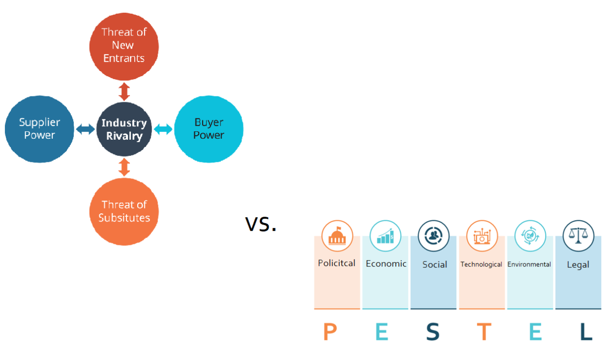

Understanding business environments and their impact on strategic decisions is crucial for companies to remain competitive and profitable. In an era where markets are increasingly complex and volatile, identifying robust strategic frameworks is essential for navigating these challenges effectively. Two renowned business strategy frameworks—Porter's Five Forces and PESTLE analysis—serve as vital tools for strategists, offering methodologies to scrutinize both competitive forces and broader macro-environmental factors.

Porter's Five Forces framework, developed by Michael E. Porter, provides a lens through which the competitive environment and industry structure can be analyzed. By evaluating the intensity of competition, the threat posed by new entrants, the power held by suppliers and buyers, and the threat of substitute products, businesses can devise strategies that position them advantageously within their industries. This model helps companies assess their strengths and weaknesses relative to the context in which they operate.



On the other hand, PESTLE analysis enables organizations to evaluate macro-environmental factors that can affect long-term success. By examining Political, Economic, Sociocultural, Technological, Legal, and Environmental domains, businesses can anticipate changes in the external environment, allowing them to modify their strategies proactively. This approach ensures that companies remain agile in the face of regulatory shifts, economic fluctuations, technological advancements, and evolving sociocultural trends.

This article explores the complex nature of these frameworks and highlights their significance in contemporary business practices, particularly concerning algorithmic trading. Algorithmic trading, characterized by rapid decision-making and adaptability, benefits greatly from understanding both competitive pressures and environmental factors. By integrating insights from Porter's Five Forces and the PESTLE framework, businesses can better anticipate and react to market dynamics, enhancing their competitive edge and profitability.

Through a comprehensive examination of the individual elements of Porter's Five Forces and PESTLE analysis, this article will illustrate their applications in fostering competitiveness and adaptability amidst dynamic and uncertain market environments. In doing so, it underscores the indispensable nature of these strategic tools in modern business landscapes.

## Table of Contents

## Porter's Five Forces: A Deep Dive

Porter's Five Forces framework, devised by Michael E. Porter, is a vital tool for comprehending the competitive dynamics within an industry. This strategic model provides a holistic evaluation of the factors affecting an industry's competition and profitability. Analyzing these five forces helps businesses make informed strategic decisions to secure a competitive edge.

1. **Industry Competition**: This force considers the level of rivalry among existing players within the industry. Intense rivalry can decrease profitability as companies may compete on price, innovation, customer service, or marketing. Factors such as industry growth rate, product differentiation, and brand loyalty determine the intensity of rivalry. For instance, in a slow-growing industry, competition tends to be fiercer as companies vie for a stagnant market share.

2. **Threat of New Entrants**: The possibility of new competitors entering the market can influence existing firms' market power and profitability. High entry barriers, such as significant capital requirements, brand equity, regulatory requirements, and economies of scale, can deter new entrants. When entry barriers are low, incumbent firms may need to invest more aggressively in innovation and customer loyalty to maintain their market position.

3. **Supplier Power**: This dimension assesses how much power suppliers can exert over pricing and terms. If few suppliers dominate the market, or if switching costs are high, suppliers can demand higher prices or more favorable terms. Conversely, if suppliers are abundant or products are standardized, their power diminishes. Companies can mitigate supplier power by diversifying their supply base or by integrating vertically.

4. **Buyer Power**: Analyzing buyer power involves determining the influence customers have on pricing and the terms of sale. Powerful buyers can demand lower prices or higher quality. Buyer power is high when purchasers are concentrated or when there are ample alternative suppliers. This force highlights the need for companies to enhance customer loyalty and reduce dependency on few large buyers.

5. **Threat of Substitutes**: Substitutes refer to products outside the competitive set that fulfill similar needs. The presence of viable alternatives can cap the prices firms can charge. Substitutes pose a greater threat when they offer an attractive price-performance trade-off or when switching costs are low. Addressing this force often involves strategic innovations or emphasizing product differentiators to reduce substitution risk.

Understanding these forces enables firms to identify strengths and weaknesses within their competitive environment, thus informing strategic decisions aimed at achieving long-term profitability and success. By acknowledging and analyzing these dynamics, businesses can devise strategic actions to improve resilience against competitive pressures and bolster their market position.

## PESTLE Analysis: Examining Macro-Environmental Factors

PESTLE analysis is a strategic tool used by organizations to understand the macro-environmental factors that impact their operations and long-term strategy. It involves a comprehensive examination of six key domains:

1. **Political**: This domain encompasses government policies, regulatory changes, and the overall political stability of a region or country. Political factors can significantly affect a company's operations, such as tax policies, trade tariffs, and labor laws. For instance, a shift in governmental policy towards stricter environmental regulations can influence operational costs and production methods.

2. **Economic**: Economic conditions include variables like inflation rates, economic growth, exchange rates, and interest rates. These factors can influence consumer purchasing behavior and cost structures for businesses. Organizations must monitor economic indicators to anticipate shifts that could impact demand for their products or services. For example, during recessionary periods, consumer spending typically declines, which could result in decreased sales.

3. **Sociocultural**: This aspect considers cultural trends, demographics, and consumer behaviors. As consumer preferences evolve, companies must adapt to meet new expectations and cultural norms. Factors such as population growth, age distribution, and lifestyle changes play a crucial role in shaping demand. A growing interest in health and wellness, for example, has driven demand for organic and health-conscious products.

4. **Technological**: Technological advancements can disrupt industries and alter competitive landscapes. Organizations must stay abreast of technological innovations and integrate relevant advancements into their processes to maintain efficiency and competitiveness. The rise of digital platforms and automation technologies exemplifies the transformative impact of technology on business operations.

5. **Legal**: The legal domain includes laws and regulations that govern business activities. Compliance with legal standards is essential to avoid litigation and maintain a positive brand reputation. Legal factors might involve employment laws, health and safety standards, and consumer protection regulations. Non-compliance can result in significant financial penalties and reputational damage.

6. **Environmental**: Environmental factors cover ecological and sustainability issues, such as climate change and resource scarcity. Increasing awareness and concern about environmental issues have led to more stringent environmental regulations and a shift towards sustainable business practices. Companies are encouraged to adopt environmentally friendly practices to reduce their ecological footprint and appeal to environmentally conscious consumers.

By understanding these macro-environmental factors, businesses can better anticipate market changes and adapt their strategies accordingly. Applying PESTLE analysis enables organizations to strategically position themselves in dynamic environments, identifying opportunities and mitigating potential threats. The systematic examination of these factors ensures a holistic understanding of the forces shaping an organization's operating environment.

## Integrating Porter's Five Forces and PESTLE Analysis in Trading

In [algorithmic trading](/wiki/algorithmic-trading), where timely decision-making and adaptability are crucial, the integration of Porter's Five Forces and PESTLE analysis provides a thorough understanding of market conditions. This combination allows trading algorithms to optimize responses to changes in competitive dynamics and external macro-environments. 

Firstly, Porter's Five Forces can be used to assess competitive pressures within the market. For example, the presence of new entrants or shifts in bargaining power can be indicators for algorithms to reconsider pricing strategies or investment allocations. With high competition, algorithms might look for opportunities in markets where competitors are less aggressive.

Simultaneously, PESTLE analysis offers insights into macro-environmental factors that affect trading decisions. Political uncertainties, such as changes in trade policies, can influence market [volatility](/wiki/volatility-trading-strategies), directly impacting currency values and stock prices. Algorithms equipped with PESTLE insights can adjust their trading strategies in response to these economic indicators, enhancing their strategic positioning within currency markets.

Economic factors, a core component of PESTLE, such as [interest rate](/wiki/interest-rate-trading-strategies) changes or inflation, provide critical data that algorithmic systems can utilize for predictive modeling. For instance, an increase in interest rates may signal the strengthening of a currency, prompting algorithms to modify positions in [forex](/wiki/forex-system) trading.

Moreover, technological advancements analyzed within the PESTLE framework can lead to the integration of new trading platforms or strategies, thereby providing a competitive edge. As legal and regulatory environments evolve, compliance becomes imperative; algorithms must be configured to adhere to the latest laws to mitigate risks associated with non-compliance.

In practical terms, a Python implementation could involve parsing data related to these factors and integrating them into the decision-making algorithms:

```python
import numpy as np

def adjust_strategy(competitive_forces, economic_indicators):
    strategy = np.zeros(5)

    # Analyze forces and indicators
    for i in range(5):
        strategy[i] = competitive_forces[i] * economic_indicators[i]

    return strategy

competitive_forces = [0.8, 0.6, 0.4, 0.7, 0.3]
economic_indicators = [1.1, 0.9, 1.0, 1.2, 0.8]

optimal_strategy = adjust_strategy(competitive_forces, economic_indicators)
print("Adjusted Strategy Parameters:", optimal_strategy)
```

This code snippet calculates an optimal strategy by weighing competitive forces against economic indicators, showcasing the potential for integrating these analytical frameworks into algorithmic trading systems.

Overall, the synergy of Porter's Five Forces and PESTLE analysis equips algorithmic trading systems with the requisite foresight to navigate complex, rapidly evolving financial landscapes effectively. This multi-dimensional approach enhances the ability to sustain competitive advantages and capitalize on emerging opportunities amidst market fluctuations.

## Case Study: Application in Algorithmic Trading

An algorithmic trading firm evaluating the tech sector leverages both Porter's Five Forces and PESTLE analysis to navigate the intricate landscape of competitive and macro-environmental forces. Utilizing Porter's Five Forces, the firm first examines the threat of new entrants, which in the tech sector can be influenced by factors such as the pace of innovation, barriers to entry, and the expertise required for technological advancements. This understanding allows the firm to anticipate changes in market share and adjust its algorithms to predict and react to market entry threats.

Analyzing supplier power, the firm assesses the influence of tech suppliers, who control critical components and technologies. High supplier power may affect pricing and supply continuity, thereby influencing cost structures and margins within the firm’s trading strategies. By modeling these dynamics, the firm can better predict how changes in supplier negotiations might impact stock prices and trading volumes.

Simultaneously, PESTLE analysis provides insights into macro-environmental factors impacting the tech sector. Technological advancements, a core component of PESTLE, highlight innovation in areas such as [artificial intelligence](/wiki/ai-artificial-intelligence) and blockchain. By anticipating technological shifts, the firm can adapt its trading algorithms to capitalize on emerging opportunities or mitigate risks associated with technological disruption.

Regulatory changes form another critical component of PESTLE analysis, wherein government policies and data protection laws can significantly impact operational strategies and market conditions. For example, the introduction of stricter regulations on data usage might affect major tech companies, influencing their stock performances. By integrating these insights, the firm can enhance its trading models to reflect regulatory impacts, ensuring robust portfolio management.

The integration of these frameworks enables the firm to adapt its trading strategies to a rapidly changing environment. By optimizing portfolio management and risk assessments based on comprehensive market analysis, the firm enhances its ability to maintain a competitive advantage. This strategic adaptation ensures resilience against external pressures, empowering the firm to make informed trading decisions despite the inherent volatility of the tech sector.

## Conclusion

Porter's Five Forces and PESTLE analysis, foundational to strategic management, bring substantial advantages to the fast-paced and intricate world of algorithmic trading. These frameworks facilitate a comprehensive understanding of market environments and competitive dynamics, enabling businesses to anticipate shifts and respond effectively. By systematically analyzing industry structure and macro-environmental factors, companies can enhance their strategic agility and competitiveness.

As markets experience continuous evolution and external factors grow more complex, the use of integrated strategic tools like Porter's Five Forces and PESTLE becomes essential. These frameworks allow for a nuanced analysis of both competitive pressures and broader economic, technological, and sociopolitical influences. This multifaceted approach ensures that organizations are not only reactive but also proactive in maintaining a competitive edge.

The capability to swiftly adapt to changing market conditions is critical in algorithmic trading, where rapid decision-making is paramount. By employing these strategic frameworks, companies can ensure their trading algorithms are attuned to market dynamics, optimizing performance and risk management. Thus, the application of such methodical and analytical tools is vital for achieving sustained success in an ever-evolving financial landscape.

## References & Further Reading

[1]: Porter, M. E. (1979). ["How Competitive Forces Shape Strategy."](https://hbr.org/1979/03/how-competitive-forces-shape-strategy) Harvard Business Review.

[2]: Morrison, J., & Wensley, R. (1991). ["Boxing up or Boxed In? A Short History of the Boston Consulting Group Share/Growth Matrix."](https://www.tandfonline.com/doi/abs/10.1080/0267257X.1991.9964145) Journal of Marketing Management.

[3]: Williams, C. & Seaman, A. (2016). ["PESTLE Analysis: The Complete Guide."](https://pubmed.ncbi.nlm.nih.gov/27200490/) Professional Academy.

[4]: Porter, M. E. (1980). ["Competitive Strategy: Techniques for Analyzing Industries and Competitors."](https://papers.ssrn.com/sol3/papers.cfm?abstract_id=1496175) Free Press.

[5]: Arvidsson, N. & Grönlund, J. (2017). ["Competing on Innovation."](https://www.researchgate.net/publication/306254446_Digital_Innovation_Management_Reinventing_Innovation_Management_Research_in_a_Digital_World) Springer.

[6]: Oxford Analytica, (2007). ["PESTLE Analysis to Monitor Change in the Macro-Environment."](https://consulterce.com/pestle-analysis/) Oxford Analytica.

[7]: Grant, R. M. (2021). ["Contemporary Strategy Analysis."](https://books.google.com/books/about/Contemporary_Strategy_Analysis.html?id=TadJEAAAQBAJ) John Wiley & Sons.

[8]: Pring, M. J. (2014). ["Technical Analysis Explained: The Successful Investor's Guide to Spotting Investment Trends and Turning Points."](https://www.amazon.com/Technical-Analysis-Explained-Fifth-Successful/dp/0071825177) McGraw-Hill Education.

[9]: Turner, S. (2020). ["Algorithmic Trading and DMA: An Introduction to Direct Access Trading Strategies."](https://www.amazon.com/Algorithmic-Trading-DMA-introduction-strategies/dp/0956399207) 4Myeloma Press.