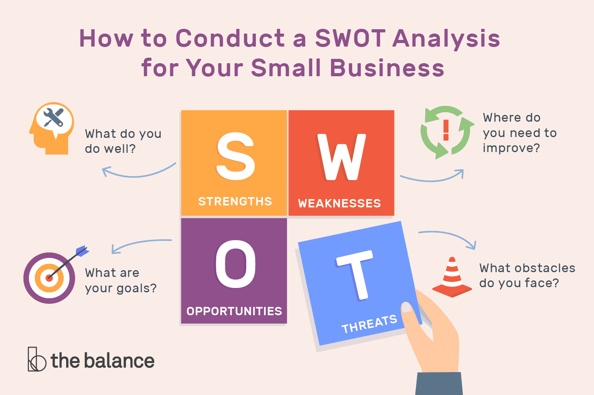

## Table of Contents

## What is Porter's Five Forces model?

Porter's Five Forces model is a tool used to understand the competitiveness of a business environment. It was created by Michael E. Porter to help companies see how different factors can affect their success. The model looks at five key areas: how easy it is for new competitors to enter the market, the power that suppliers have, the power that customers have, the threat of substitute products, and how much competition there is among existing companies.

The first three forces focus on the market structure. If it's easy for new companies to start up, this can make the market more competitive. Suppliers have power if there are only a few of them or if they provide something unique. Customers have power if they can easily switch to another product or if they buy in large amounts. The last two forces are about the products and the competition. If there are many similar products, this can threaten a company's position. And if there are many companies fighting for the same customers, this can also increase competition.

By using Porter's Five Forces, businesses can figure out where they stand and what challenges they might face. This helps them make better plans and decisions to stay competitive. It's a useful way to look at the big picture of an industry and understand the different pressures that can affect a company's performance.

## What is SWOT Analysis?

SWOT Analysis is a way for businesses to look at their strengths, weaknesses, opportunities, and threats. It helps them understand what they are good at, where they need to improve, what good things might happen in the future, and what problems they might face. By doing a SWOT Analysis, a company can make better plans and decisions.

Strengths and weaknesses are things inside the company. Strengths are what the company does well, like having a good product or a strong brand. Weaknesses are things the company needs to work on, like not having enough money or not being good at marketing. Opportunities and threats come from outside the company. Opportunities are good things that might happen, like a new market opening up or a new technology that the company can use. Threats are problems that might happen, like a new competitor or a change in the law that could hurt the business.

By looking at all these things together, a company can see the big picture. They can use their strengths to take advantage of opportunities and fix their weaknesses to avoid threats. This helps them make smart choices about what to do next to be successful.

## How do Porter's Five Forces and SWOT Analysis differ in their focus?

Porter's Five Forces and SWOT Analysis are both tools that help businesses understand their environment, but they focus on different things. Porter's Five Forces looks at how competitive the market is. It helps a company see how easy it is for new competitors to enter the market, how much power suppliers and customers have, the threat of substitute products, and how much competition there is among existing companies. This model is all about understanding the outside forces that can affect a company's success.

SWOT Analysis, on the other hand, looks at both the inside and outside factors that can affect a company. It focuses on the company's strengths and weaknesses, which are things inside the company that it can control. It also looks at opportunities and threats, which are things outside the company that it can't control but needs to be ready for. SWOT Analysis helps a company figure out how to use its strengths to take advantage of opportunities and how to fix its weaknesses to avoid threats.

In simple terms, Porter's Five Forces is all about understanding the competition in the market, while SWOT Analysis is about understanding the company itself and its place in the world. Both tools are useful, but they give different kinds of information that can help a company make better decisions.

## What are the key components of Porter's Five Forces?

Porter's Five Forces is a way to look at how tough it is for a business to do well in its market. The first force is how easy it is for new companies to start up in the same market. If it's easy, then more companies might come in and make it harder for everyone to make money. The second force is how much power suppliers have. If there are only a few suppliers or if they have something special that you need, they can charge more or make it hard for you to do business. The third force is how much power customers have. If customers can easily switch to another product or if they buy a lot, they can ask for lower prices or better service.

The fourth force is the threat of substitute products. This means other products that can do the same job as yours. If there are a lot of these, then customers might choose them instead of your product, which can hurt your business. The last force is the competition among existing companies. If there are many companies fighting for the same customers, they might lower their prices or try to be better in other ways, making it harder for everyone to make a profit. By looking at these five forces, a business can see what challenges it might face and plan better to stay successful.

## What are the elements of a SWOT Analysis?

SWOT Analysis helps businesses understand their situation by looking at four things: strengths, weaknesses, opportunities, and threats. Strengths are what the business is good at, like having a popular product or a strong team. Weaknesses are the things the business needs to work on, like not having enough money or not being good at selling. These are things inside the business that it can control.

Opportunities are good things that might happen outside the business, like a new market opening up or a new technology that the business can use. Threats are problems that might happen outside the business, like a new competitor coming in or a change in the law that could hurt the business. These are things the business can't control but needs to be ready for.

By looking at all these things together, a business can see the big picture. They can use their strengths to take advantage of opportunities and fix their weaknesses to avoid threats. This helps them make smart choices about what to do next to be successful.

## In what types of business situations is Porter's Five Forces most useful?

Porter's Five Forces is most useful when a business wants to understand how hard it will be to make money in a certain market. It's a good tool for a company that is thinking about going into a new market or starting a new product line. By using this model, the company can see if there are a lot of competitors already there, if it's easy for new competitors to come in, and if suppliers or customers have a lot of power. This helps the company decide if it's worth going into that market or if it should look for a different one.

It's also helpful when a company is trying to figure out why it's not doing as well as it could be. If profits are going down, the company can use Porter's Five Forces to see if the problem is because of new competitors, strong suppliers, powerful customers, substitute products, or too much competition. This can help the company make a plan to deal with these problems and do better in the future.

## When should a SWOT Analysis be used in strategic planning?

A SWOT Analysis should be used in strategic planning when a business wants to get a clear picture of where it stands and what it needs to do next. It's helpful at the start of making a plan because it lets the business see its strengths, like having a good product or a strong team, and its weaknesses, like not having enough money or not being good at selling. By understanding these, the business can figure out how to use its strengths to do better and fix its weaknesses to avoid problems.

SWOT Analysis is also useful when the business is thinking about new opportunities, like a new market opening up or a new technology that could help it grow. It helps the business see if it's ready to take advantage of these opportunities. At the same time, it makes the business aware of threats, like new competitors or changes in the law that could hurt it. By knowing about these threats, the business can make plans to stay safe and keep doing well.

## How can Porter's Five Forces be applied to assess industry attractiveness?

Porter's Five Forces can help a business figure out how good an industry is to be in by looking at different parts of the market. It checks how easy it is for new companies to start up in the industry. If it's easy, more companies might come in and make it harder for everyone to make money. It also looks at how much power suppliers and customers have. If suppliers can charge more or make it hard for you to do business, or if customers can easily switch to another product, this can make the industry less attractive. The model also considers the threat of substitute products. If there are a lot of other products that can do the same job, it might be harder for a business to do well.

Another thing Porter's Five Forces looks at is how much competition there is among existing companies. If there are many companies fighting for the same customers, they might lower their prices or try to be better in other ways, which can make it tough to make a profit. By understanding all these forces, a business can see if an industry is a good place to be. If the forces show that it's hard to make money because of strong competition, powerful suppliers or customers, or a lot of substitute products, the industry might not be very attractive. But if the forces show that it's easier to make money, then the industry could be a good choice for the business.

## How does SWOT Analysis help in identifying strategic opportunities and threats?

SWOT Analysis helps a business find good chances to grow by looking at opportunities. These are things outside the business that could help it do better, like a new market opening up or a new technology that the business can use. By knowing about these opportunities, the business can make plans to take advantage of them. For example, if there's a new technology that can make the business's products better, it can decide to use that technology to improve its products and get more customers.

At the same time, SWOT Analysis helps the business see problems that might come up, which are called threats. These are things outside the business that could hurt it, like a new competitor coming in or a change in the law that could make things harder. By understanding these threats, the business can make plans to protect itself. For instance, if a new competitor is coming into the market, the business can think about ways to keep its customers, like offering better service or lowering prices. By knowing about both opportunities and threats, the business can make smart choices to stay successful.

## Can Porter's Five Forces and SWOT Analysis be used together? If so, how?

Yes, Porter's Five Forces and SWOT Analysis can be used together to help a business understand its situation better. Porter's Five Forces looks at how competitive the market is, like how easy it is for new companies to start up, how much power suppliers and customers have, the threat of other products that can do the same job, and how much competition there is among existing companies. This helps the business see if the market is a good place to be. SWOT Analysis, on the other hand, looks at the business's own strengths and weaknesses, as well as good things and problems that might happen outside the business. By using both tools, the business can get a full picture of what's going on inside and outside.

When a business uses both tools together, it can make better plans. For example, if Porter's Five Forces shows that there's a lot of competition in the market, the business can look at its SWOT Analysis to see if it has any strengths that can help it stand out, like a strong brand or a unique product. If the SWOT Analysis shows a weakness, like not being good at marketing, the business can work on fixing that to do better against the competition. Also, if SWOT Analysis shows an opportunity, like a new technology, the business can use Porter's Five Forces to see if that technology can help it deal with the competitive forces in the market. By combining the two tools, the business can make smarter choices and be more successful.

## What are the limitations of using Porter's Five Forces in today's dynamic markets?

Porter's Five Forces can be hard to use in today's fast-changing markets because it doesn't always keep up with new trends and technologies. For example, the model doesn't look at how quickly things like the internet or social media can change the market. These things can make it easier for new companies to start up or change how much power customers have. Also, the model can be too simple for some industries, like tech or healthcare, where things are always changing and it's hard to predict what will happen next.

Another problem is that Porter's Five Forces focuses a lot on competition and doesn't always think about working together with other companies. In today's world, businesses often work together to make new products or enter new markets. The model also doesn't look at things like how a company's culture or how fast it can change can affect its success. So, while Porter's Five Forces can help a business understand the market, it might not give the whole picture in today's fast-moving and connected world.

## How can advanced analytical tools enhance the effectiveness of SWOT Analysis?

Advanced analytical tools can make SWOT Analysis better by helping businesses look at more data and find patterns that they might miss otherwise. For example, tools like data analytics software can take a lot of information from inside and outside the company and turn it into useful insights. This can help the business see its strengths and weaknesses more clearly. If the business has a lot of customer feedback, the tools can sort through it to find out what customers really like or don't like about the products or services. This helps the business know what to keep doing well and what to improve on.

These tools can also help the business spot opportunities and threats more easily. By using things like predictive analytics, the business can look at trends and guess what might happen in the future. This can show new markets that the business could go into or new technologies that could help it grow. At the same time, the tools can warn the business about problems that might come up, like a new competitor or changes in the law. By using advanced analytical tools, the business can make its SWOT Analysis more accurate and helpful, leading to better plans and decisions.

## References & Further Reading

[1]: Porter, M. E. (1979). ["How Competitive Forces Shape Strategy."](http://ereserve.library.utah.edu/Annual/IS/4410/Blair/porter1.pdf) Harvard Business Review.

[2]: Kotler, P., & Armstrong, G. (2017). ["Principles of Marketing."](https://www.pearson.com/nl/en_NL/higher-education/subject-catalogue/marketing/Principles-of-Marketing-Kotler-Armstrong.html) Pearson Education.

[3]: Lopez de Prado, M. (2018). ["Advances in Financial Machine Learning."](https://www.amazon.com/Advances-Financial-Machine-Learning-Marcos/dp/1119482089) Wiley.

[4]: Jansen, S. (2020). ["Machine Learning for Algorithmic Trading - Second Edition."](https://www.amazon.com/Machine-Learning-Algorithmic-Trading-alternative/dp/1839217715) Packt Publishing.

[5]: Chan, E. P. (2009). ["Quantitative Trading: How to Build Your Own Algorithmic Trading Business."](https://github.com/ftvision/quant_trading_echan_book) Wiley.

[6]: Porter, M. E. (1985). ["Competitive Advantage: Creating and Sustaining Superior Performance."](https://www.hbs.edu/faculty/Pages/item.aspx?num=193) Free Press. 

[7]: Ferrell, O., & Hartline, M. (2014). ["Marketing Strategy, Text and Cases."](https://books.google.com/books/about/Marketing_Strategy.html?id=SewfEAAAQBAJ) Cengage Learning. 

[8]: Aronson, D. (2006). ["Evidence-Based Technical Analysis: Applying the Scientific Method and Statistical Inference to Trading Signals."](https://www.amazon.com/Evidence-Based-Technical-Analysis-Scientific-Statistical/dp/0470008741) Wiley.