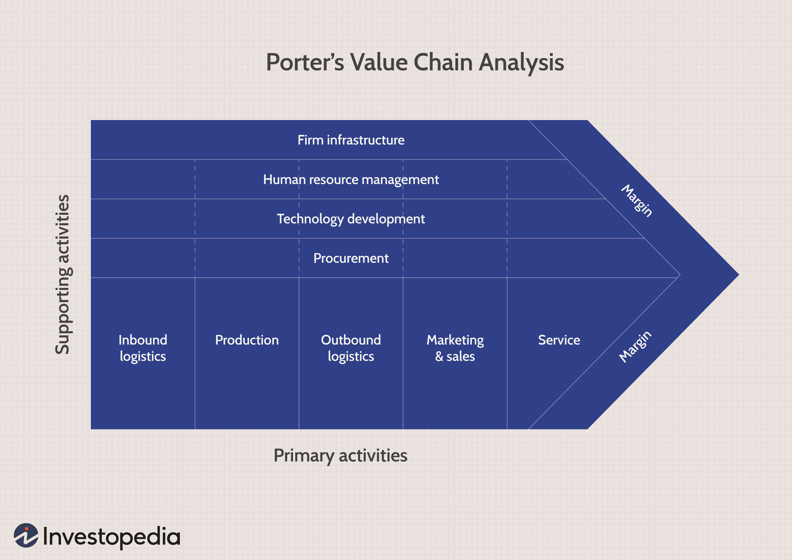

Strategic management encompasses various methodologies and tools employed by organizations to enhance decision-making processes and bolster their operational frameworks. At the forefront of these methodologies are Porter's Five Forces and SWOT (Strengths, Weaknesses, Opportunities, Threats) analysis, both of which provide critical insights into market dynamics and internal capabilities. Porter's Five Forces model specifically evaluates the competitive forces at play within an industry, which include the threat of new entrants, the bargaining power of suppliers and buyers, the threat of substitute products or services, and the intensity of industry rivalry. This model aids in discerning where power and competition lie within a market structure, guiding businesses in strategy formulation aimed at achieving sustainable profitability.

In conjunction with this, SWOT analysis offers a structured approach to identifying an organization's internal strengths and weaknesses, alongside external opportunities and threats. This analytical tool assists businesses in leveraging their core capabilities, addressing vulnerabilities, exploiting growth prospects, and mitigating potential risks, leading to informed strategic decision-making.



In the financial sector, algorithmic trading (algo trading) represents a significant application of strategic management frameworks. Algo trading employs computer programs that execute trading decisions quickly and with reduced human intervention, based on predefined criteria. The advent of algorithmic trading has transformed financial markets by increasing the precision and speed of trades, minimizing errors, and exploiting temporary market inefficiencies.

This article elucidates the synergy between Porter's Five Forces, SWOT analysis, and algorithmic trading in enhancing strategic management frameworks. By integrating these tools, organizations can gain a profound understanding of competitive dynamics while optimizing their market positioning. As a result, such comprehensive strategic approaches allow businesses to navigate competitive environments with greater agility and improved market positioning.

## Table of Contents

## Exploring Porter's Five Forces in Strategic Management

Porter's Five Forces is a strategic management model used to analyze the key competitive forces that shape every industry. Developed by Michael E. Porter in 1979, this model is vital for organizations seeking to understand the dynamics of their industry structure and identify where power resides, ultimately aiding in strategy formulation and planning for sustained profitability.

The **threat of new entrants** determines the potential for new competitors to enter the market, which can affect market share and profitability for existing companies. Entry barriers such as capital requirements, brand loyalty, and regulatory restrictions influence how easily new entrants can come into the industry.

The **bargaining power of suppliers** evaluates how much power suppliers have to drive up prices. Industries composed of few suppliers hold more power, potentially affecting the cost and quality of inputs for businesses. Firms should assess supplier options and develop strategies to negotiate better terms.

The **bargaining power of buyers** reflects how much influence customers have on pricing and terms. When buyers have more choices and low switching costs, their power increases, enabling them to demand higher quality or lower prices, which can squeeze the profitability of companies.

The **threat of substitute products or services** considers the likelihood of customers switching to alternatives that fulfill the same needs. The presence of substitutes can limit the price that companies can charge, as customers may opt for different solutions if the price exceeds a certain threshold. Companies need to differentiate their products and innovate continuously to mitigate this threat.

**Industry rivalry**, the final force, assesses the extent of competition among existing firms. A high level of rivalry typically leads to price wars, advertising battles, and new product launches, reducing profitability. Factors influencing rivalry include the number of competitors, rate of industry growth, and product differentiation.

Understanding these five forces helps businesses tailor their strategies to exploit favorable factors and mitigate the adverse effects of competitive pressures. By analyzing these forces, companies can strategically position themselves within the industry to enhance long-term profitability and competitive advantage.

## Leveraging SWOT Analysis for Enhanced Decision Making

SWOT analysis stands for strengths, weaknesses, opportunities, and threats, offering a comprehensive framework for assessing both internal and external factors that impact an organization. By systematically evaluating these components, organizations can align their strategic objectives with their inherent capabilities and environmental conditions.

The framework begins with an assessment of internal factors, namely strengths and weaknesses. Strengths are characteristics that provide an advantage over competitors, while weaknesses are areas where the organization may lag. For instance, having a strong brand, a loyal customer base, or proprietary technology would be considered strengths. Conversely, limited resources, outdated processes, or an inexperienced workforce might represent weaknesses.

Externally, the analysis examines opportunities and threats. Opportunities are favorable conditions in the business environment that organizations could exploit to achieve greater success. Examples include emerging markets, technological advancements, and sociocultural shifts. Threats, on the other hand, are external challenges that could hinder an organization's performance, such as increased competition, regulatory changes, or economic downturns.

The SWOT matrix facilitates the synthesis of these factors into actionable strategies. For example, an organization could leverage its strengths to pursue new opportunities, mitigate weaknesses to capitalize on those opportunities, use strengths to counter potential threats, or develop contingency plans to manage or avoid threats.

Let's consider a practical example: A tech company, recognizing its strong research and development team (a strength) and observing a growing demand for smart home devices (an opportunity), could focus its efforts on innovating new products in this domain. Alternatively, a retail chain facing aggressive competition (a threat) might address its logistical inefficiencies (a weakness) to reduce costs and improve customer service.

Successful strategic initiatives often emerge from a well-conducted SWOT analysis. Apple Inc., for example, has consistently identified its design and innovation capabilities as strengths and capitalized on the burgeoning opportunity in smart technology. This alignment has enabled Apple to maintain a competitive edge in the tech industry.

In summary, SWOT analysis not only aids in identifying and evaluating critical attributes of an organization but also in formulating strategies that match internal capabilities with external opportunities and threats. By systematically using the SWOT framework, organizations can make informed strategic decisions that enhance their competitiveness and achieve sustainable growth.

## The Role of Algorithmic Trading in Modern Financial Markets

Algorithmic trading represents a transformative approach within financial markets, leveraging computational power to execute trades based on predetermined criteria. This methodology enhances both the speed and efficiency of executing trades, which is essential in the fast-paced environment of modern finance.

Algorithmic trading systems use algorithms to parse market data, identify profitable opportunities, and initiate trades autonomously. These systems operate under pre-coded instructions, which may include rules regarding timing, price, quantity, or any other mathematical model. For instance, a simple [algorithmic trading](/wiki/algorithmic-trading) strategy can be implemented to buy a stock when its 50-day moving average exceeds its 200-day moving average, often interpreted as a bullish signal.

```python
# Example of a simple moving average crossover strategy in Python
def moving_average(data, window_size):
    return data.rolling(window=window_size).mean()

def trading_signal(data):
    short_window = 50
    long_window = 200

    signals = pd.DataFrame(index=data.index)
    signals['price'] = data
    signals['short_mavg'] = moving_average(data, short_window)
    signals['long_mavg'] = moving_average(data, long_window)
    signals['signal'] = 0
    signals.loc[signals['short_mavg'] > signals['long_mavg'], 'signal'] = 1
    signals['positions'] = signals['signal'].diff()

    return signals
```

The strategic significance of algorithmic trading lies in its ability to minimize human errors and make unbiased decisions based on quantitative analytics. By reducing human intervention, these systems can operate continuously, exploiting even minor market anomalies to achieve a competitive edge. Algorithmic trading strategies include statistical [arbitrage](/wiki/arbitrage), index fund rebalancing, [market making](/wiki/market-making), and [trend following](/wiki/trend-following) strategies, each catering to different market conditions and objectives.

Algorithmic trading positions firms for competitive advantage through increased [liquidity](/wiki/liquidity-risk-premium), reduced transaction costs, and enhanced ability to respond swiftly to market changes. This speed and precision are critical as they allow firms to capitalize on transient opportunities that are often invisible or unattainable through manual trading methods.

Numerous firms have leveraged algorithmic trading to achieve superior financial outcomes. For example, Renaissance Technologies, a [hedge fund](/wiki/hedge-fund-trading-strategies) known for its Medallion Fund, has successfully implemented sophisticated algorithms to consistently outperform markets. With an army of scientists and advanced computational resources, Renaissance exploits patterns in historical price data that remain unexplained by existing economic theories. Similarly, other financial institutions like Citadel and Two Sigma Investments utilize high-frequency trading strategies to manage vast portfolios effectively and efficiently.

Algorithmic trading continues to shape the landscape of financial markets by setting new benchmarks for operational efficiency and profitability. This section reveals not only the technical aspects of algorithmic trading but also highlights its strategic role in modern financial ecosystems. Through optimizing decision-making processes and leveraging vast datasets, algorithmic trading remains integral to staying competitive in financial markets.

## Integrating Porter's Five Forces and SWOT Analysis with Algo Trading

Integrating Porter's Five Forces and SWOT analysis with algorithmic trading presents a significant opportunity for enhancing strategic management in dynamic markets. Porter's Five Forces provides a detailed examination of industry competitiveness by analyzing factors such as the threat of new entrants, bargaining power of suppliers, bargaining power of buyers, the threat of substitute products or services, and industry rivalry. In tandem, SWOT analysis offers a framework to assess an organization's internal strengths and weaknesses, alongside external opportunities and threats. When these strategic management tools are combined with algorithmic trading, they enable organizations to derive actionable insights and respond agilely to market dynamics.

Algorithmic trading relies on pre-defined criteria encoded in computer programs to execute trading decisions, offering benefits such as speed, precision, and the ability to operate continuously without human intervention. By integrating the insights from Porter's Five Forces and SWOT analysis into algorithmic trading models, businesses can enhance their understanding of market trends and competitive pressures. For instance, real-time data analysis facilitated by algorithmic trading can provide up-to-date information on market entrants and consumer preferences, thereby influencing strategic responses based on Porter's framework.

The integration process involves aligning the strategic insights gained from Porter's and SWOT frameworks with the algorithmic trading strategies. This necessitates the development of algorithms that can incorporate strategic variables from these models. For instance, an algorithm might adjust trading volumes or strategies based on SWOT-determined weaknesses or threats identified through marketplace analysis. This blending of qualitative strategic analysis with [quantitative trading](/wiki/quantitative-trading) mechanisms creates a sophisticated approach to risk management and resource allocation.

To align these strategic management theories with algorithmic techniques, organizations must adopt best practices. This includes ensuring data accuracy and quality, as algorithmic decisions hinge on reliable information. Additionally, businesses should continually refine their algorithms to reflect changing market conditions and strategic objectives. Employing [machine learning](/wiki/machine-learning) techniques can enhance this adaptive capability. For example, a Python-based machine learning model could be used to predict market trends and adjust trading strategies accordingly. Here is a simplified example of such a model:

```python
from sklearn.ensemble import RandomForestRegressor
from sklearn.model_selection import train_test_split
import numpy as np
import pandas as pd

# Load market data
data = pd.read_csv('market_data.csv')

# Feature selection based on strategic factors
features = data[['new_entry_risk', 'supplier_power', 'buyer_power', 'substitute_threat', 'industry_rivalry', 
                 'internal_strengths', 'internal_weaknesses', 'external_opportunities', 'external_threats']]
target = data['market_trend']

# Split dataset into training and testing
X_train, X_test, y_train, y_test = train_test_split(features, target, test_size=0.2, random_state=42)

# Fit the model
model = RandomForestRegressor(n_estimators=100, random_state=42)
model.fit(X_train, y_train)

# Predicting market trends
predictions = model.predict(X_test)

# Evaluate the model (for demonstration purposes, use something more sophisticated in production)
accuracy = model.score(X_test, y_test)
print(f'Model accuracy: {accuracy:.2f}')
```

Such an integration empowers businesses to not only predict and act upon market trends but also continuously refine strategies for competitive advantage. The strategic synthesis of these methodologies enables companies to efficiently allocate resources, mitigate risks, and, ultimately, achieve enhanced performance in their respective industries.

## Challenges and Considerations in Implementation

Combining traditional strategic models with advanced technologies presents numerous challenges that organizations must thoughtfully address to ensure successful implementation. A fundamental consideration is data accuracy, which underpins effective decision-making. Reliable data is pivotal for both Porter's Five Forces and SWOT analysis, as inaccuracies can lead to misguided strategies and suboptimal outcomes. Inaccurate data can skew the outputs of algorithmic trading models, resulting in financial losses and reduced competitive advantage. Therefore, organizations must invest in robust data management practices, which include the validation, cleaning, and real-time updating of datasets to maintain accuracy and relevance.

Technology costs represent another significant challenge in the integration process. The adoption of sophisticated technologies such as algorithmic trading systems incurs substantial initial and ongoing expenses, including hardware acquisition, software licensing, and system maintenance. These costs necessitate a comprehensive cost-benefit analysis to justify investments and prioritize technological upgrades that align with the organization’s strategic goals. Furthermore, organizations should explore scalable and modular solutions that allow for gradual implementation, thereby minimizing financial strain and facilitating smoother transitions.

The effective deployment of these strategies also hinges on the expertise available within an organization. Advanced technologies require skilled professionals who can design, implement, and manage complex algorithms and data systems. Consequently, organizations must focus on enhancing internal capabilities through targeted recruitment, training initiatives, and continuous professional development programs. By fostering a workforce adept in both strategic management and technical domains, organizations can better navigate the complexities of integrating traditional methods with technological advancements.

Managing the balance between strategic foresight and automated responses is crucial to achieving a harmonious blend of human insight and machine efficiency. While automation can streamline operations and provide quick reactions to market changes, it is vital to maintain a level of human oversight to provide context and strategic direction. Decision-makers must ensure that automated systems are aligned with broader organizational objectives and can be overridden when necessary to account for unprecedented situations or nuanced interpretations of market conditions.

To address these challenges, organizations should align internal competencies with technological capabilities through strategic planning and process optimization. This alignment may involve revisiting and fine-tuning internal processes, redefining roles to better integrate technology, and institutionalizing a culture that encourages adaptability and continuous learning.

A strategic approach to integrating traditional models and modern technologies necessitates vigilance, flexibility, and foresight. By acknowledging and addressing the inherent challenges, organizations can mitigate risks and harness the full potential of advanced strategic tools.

## Conclusion

Strategic management is essential for navigating today's complex and competitive business environments. It provides the frameworks and tools necessary for businesses to adapt to shifting market dynamics and position themselves for success. Integrating Porter's Five Forces, SWOT analysis, and algorithmic trading into a unified strategic framework offers significant advantages for organizations seeking to optimize their strategic decision-making and performance.

Porter's Five Forces model allows businesses to assess the competitive pressures within their industry by analyzing factors such as the threat of new entrants, the bargaining power of suppliers and buyers, the threat of substitute products or services, and the intensity of industry rivalry. Understanding these forces enables businesses to identify areas of strategic importance and develop plans to achieve long-term profitability.

SWOT analysis complements this by helping organizations evaluate their strengths, weaknesses, opportunities, and threats. By identifying internal capabilities and external challenges, businesses can develop strategies to leverage their strengths, address weaknesses, capitalize on opportunities, and mitigate threats. This structured approach facilitates informed decision-making and strategic planning.

Algorithmic trading introduces a technological dimension to strategic management, particularly in financial markets. Employing algorithms for trading allows organizations to execute trades with speed and precision, reducing human error and capitalizing on market opportunities. This enhances a firm's competitive advantage by allowing for more efficient resource allocation and risk management.

By combining these traditional and technological approaches, businesses can achieve a more comprehensive strategic management framework. The integration of Porter's Five Forces, SWOT analysis, and algorithmic trading facilitates real-time market insights and adaptive strategies, enabling organizations to respond swiftly to market changes and maintain a competitive edge.

Looking ahead, the future of strategic management will likely see an increased blending of traditional analytical models with advanced technological tools. This evolution will drive businesses towards more sophisticated frameworks that further refine decision-making processes and adapt to the ever-evolving market landscape. As organizations continue to explore these integrations, they will be better equipped to enhance their strategic agility and performance in a rapidly changing environment.

## References & Further Reading

[1]: Porter, M. E. (1979). ["How Competitive Forces Shape Strategy."](http://ereserve.library.utah.edu/Annual/IS/4410/Blair/porter1.pdf) Harvard Business Review.

[2]: Kotler, P., & Armstrong, G. (2017). ["Principles of Marketing."](https://www.pearson.com/nl/en_NL/higher-education/subject-catalogue/marketing/Principles-of-Marketing-Kotler-Armstrong.html) Pearson Education.

[3]: Lopez de Prado, M. (2018). ["Advances in Financial Machine Learning."](https://www.amazon.com/Advances-Financial-Machine-Learning-Marcos/dp/1119482089) Wiley.

[4]: Jansen, S. (2020). ["Machine Learning for Algorithmic Trading - Second Edition."](https://www.amazon.com/Machine-Learning-Algorithmic-Trading-alternative/dp/1839217715) Packt Publishing.

[5]: Chan, E. P. (2009). ["Quantitative Trading: How to Build Your Own Algorithmic Trading Business."](https://github.com/ftvision/quant_trading_echan_book) Wiley.

[6]: Porter, M. E. (1985). ["Competitive Advantage: Creating and Sustaining Superior Performance."](https://www.hbs.edu/faculty/Pages/item.aspx?num=193) Free Press. 

[7]: Ferrell, O., & Hartline, M. (2014). ["Marketing Strategy, Text and Cases."](https://books.google.com/books/about/Marketing_Strategy.html?id=SewfEAAAQBAJ) Cengage Learning. 

[8]: Aronson, D. (2006). ["Evidence-Based Technical Analysis: Applying the Scientific Method and Statistical Inference to Trading Signals."](https://www.amazon.com/Evidence-Based-Technical-Analysis-Scientific-Statistical/dp/0470008741) Wiley.