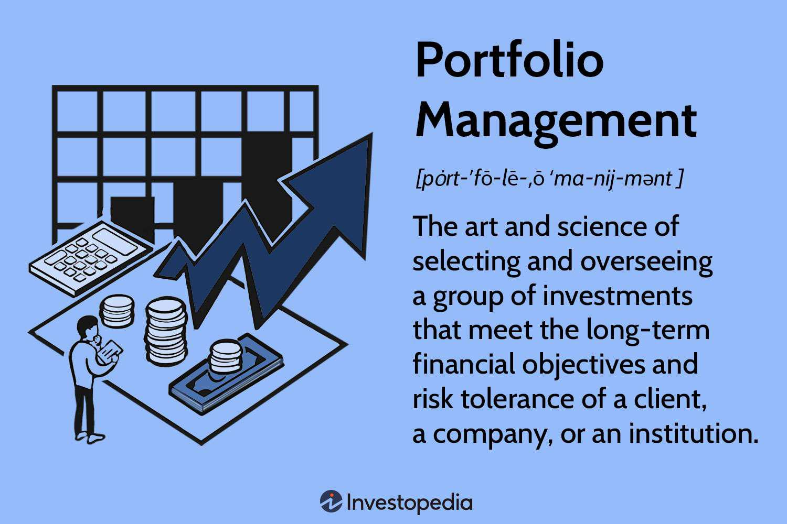

In the rapidly evolving landscape of financial technology, 2024 marks a pivotal year with significant advancements in portfolio management and algorithmic trading. The introduction of sophisticated software tools is offering investors unprecedented control and insight into their financial assets. This progress is not just enhancing efficiency but is reshaping how both novice investors and seasoned professionals approach market participation.

Contemporary software solutions are pushing the boundaries of what is possible in portfolio management and algorithmic trading. These platforms are equipped with functionalities that suit a broad spectrum of user needs, from tracking diverse asset classes to executing complex trading strategies. For portfolio management, the latest tools provide comprehensive asset tracking and financial analysis, ensuring that users can monitor their investments effectively. On the algorithmic trading front, advanced platforms automate trading strategies, maximizing efficiency and minimizing the need for human intervention.



This article aims to serve as a guide through the myriad of tools available in 2024, assisting investors in making informed decisions regarding their portfolio management and trading strategies. With cutting-edge software tools, managing one's financial journey becomes more streamlined and strategic. Explore how these technological advancements can fundamentally enhance your approach to investing, equipping you with the knowledge and tools needed to navigate today's complex financial markets.

## Table of Contents

## The Role of Software in Portfolio Management

Portfolio management software functions as an essential tool for investors, acting as a centralized hub to manage and analyze a wide variety of financial assets, from traditional investments like stocks and bonds to more exotic instruments. These software solutions enable users to gain a comprehensive understanding of their financial standing, offering critical insights into investment performance and financial health.

A crucial feature of these tools is net worth tracking, which provides users with a real-time valuation of their total assets and liabilities. This feature helps investors monitor their overall financial trajectory and make informed decisions regarding asset management. Additionally, asset allocation views are integral to these platforms, offering detailed breakdowns of where investments lie across various asset classes. This analysis aids in ensuring a balanced investment strategy that aligns with the user's risk tolerance and financial goals.

Investment analysis capabilities are another significant aspect of portfolio management software. These include tools for evaluating the performance of individual investments and portfolios, enabling users to identify trends, measure performance against benchmarks, and make data-driven decisions to maximize returns. Some platforms incorporate advanced analytics, such as scenario analysis and risk assessment, to provide deeper insights.

Several platforms extend their functionality beyond asset tracking by integrating budgeting and spending analysis tools. This integration offers users a holistic view of their finances by combining investment performance with day-to-day financial management. It enables users to connect their investment strategy with broader financial planning goals such as saving for retirement or making large purchases.

The pricing of portfolio management software varies widely. Some platforms offer free versions with limited features, suitable for small portfolios or beginner investors. In contrast, more advanced versions come at a premium, boasting sophisticated features suitable for complex portfolios. Selecting the right software requires a careful consideration of one's investment needs and future growth potential.

Notable software platforms such as Quicken Premier, Sharesight, and Empower Personal Dashboard stand out for their comprehensive toolsets and customizable reports. Quicken Premier provides robust support for a range of asset classes, while Sharesight is particularly beneficial for global investors with its multi-currency valuation and portfolio comparison features. Empower Personal Dashboard offers extensive free tools catering to personal finance management, providing a clear overview of net worth, budgeting, and retirement planning.

By facilitating efficient portfolio management, these tools enable investors to set and achieve financial goals, ranging from diversifying their investment portfolio to planning for retirement. They enhance decision-making processes by delivering timely and relevant financial insights, empowering investors to take control of their financial futures.

## Algorithmic Trading: Revolutionizing the Market

Algorithmic trading involves using sophisticated algorithms to automate the process of buying and selling financial instruments based on predefined criteria. This method has gained prominence due to its ability to execute trades with speed and precision, thereby reducing the need for direct human intervention. Key instructions in [algorithmic trading](/wiki/algorithmic-trading) include parameters such as timing, price, and [volume](/wiki/volume-trading-strategy), allowing for a highly efficient trading process.

Leading algorithmic trading software platforms in 2024 encompass a wide range of functionalities. These platforms offer solutions from basic automation tasks to complex trading strategies that leverage [machine learning](/wiki/machine-learning) and [artificial intelligence](/wiki/ai-artificial-intelligence) (AI). The incorporation of AI allows platforms to learn from data and adapt to changing market conditions, enhancing the decision-making process and offering a competitive edge in the fast-paced trading environment.

Algorithmic trading differentiates itself from traditional trading through its ability to process large datasets rapidly. This capability facilitates more informed and data-driven decisions, ultimately optimizing trading outcomes. For instance, high-frequency trading systems can analyze numerous market indicators in milliseconds, enabling traders to capitalize on fleeting market opportunities that would be impossible to exploit through manual trading.

Several prominent algorithms are utilized in algorithmic trading, each catering to specific trading styles and risk preferences. Mean reversion, [momentum](/wiki/momentum) trading, and [arbitrage](/wiki/arbitrage) are among the most popular strategies. Mean reversion capitalizes on the assumption that asset prices will revert to their mean over time. Momentum trading exploits the trend of price movements based on the hypothesis that upward or downward trends will continue for some time. Arbitrage takes advantage of price discrepancies between different markets or securities.

Algorithmic trading platforms such as TradeStation, [Interactive Brokers](/wiki/interactive-brokers-api), and TrendSpider provide a suite of advanced tools and resources. TradeStation is praised for its user-friendly EasyLanguage programming, which makes it accessible to users without extensive coding knowledge. Interactive Brokers offers a versatile API for customization and high-speed order execution, appealing to experienced traders who favor personalized trading solutions. TrendSpider excels with its robust charting features and automation capabilities, including integration with Federal Reserve Economic Data, providing traders with a comprehensive view of market dynamics.

Overall, these algorithmic trading platforms offer essential features and services that cater to both novice and experienced traders. They empower users to develop and implement sophisticated trading strategies, thereby enhancing efficiency and potentially improving financial outcomes in the ever-evolving marketplace.

## Top Portfolio Management Software Tools of 2024

Quicken Premier offers a comprehensive financial management platform, making it accessible and beneficial for both novice and seasoned investors. This software supports a broad array of asset classes, from stocks and bonds to more complex investment options. Its powerful analytical tools allow users to perform detailed financial analyses, giving insight into asset allocation, investment performance, and growth trends. These capabilities enable users to make informed decisions that align with their financial objectives.

Sharesight caters particularly to global investors by providing features like multi-currency valuation and portfolio comparison tools. This aspect is essential for those managing assets across different countries and currencies. However, it's worth noting that Sharesight often requires manual data uploads for optimal performance, which might be a consideration for those prioritizing full automation in their portfolio management process.

Empower Personal Dashboard stands out by offering a suite of free tools aimed at personal finance management. Its capabilities include tracking net worth, budgeting, and providing analyses essential for retirement planning. These features make it a practical choice for individuals looking to gain a comprehensive understanding of their financial landscape without incurring high costs.

Kubera provides a holistic asset tracking system, suitable for investors with varied portfolios that include both traditional and digital assets. This software allows users to manage everything from stocks and bonds to cryptocurrencies and other digital assets, making it ideal for the modern investor looking to consolidate diverse holdings into a unified view.

Each of these portfolio management tools offers distinct strengths and corresponds to varying user preferences and requirements. Selecting the appropriate software depends significantly on individual investment needs, such as desired asset classes, preferred analysis depth, and specific financial goals. Balancing these factors will ensure users can effectively manage their portfolios and make strategic financial decisions in 2024.

## Leading Algorithmic Trading Software Platforms for 2024

TradeStation remains a robust choice for traders in 2024, offering a well-regarded platform particularly noted for its EasyLanguage programming. This feature allows traders to design, test, and automate trades with minimal coding expertise, making TradeStation accessible to a broader range of users. The software provides comprehensive market research tools, advanced charting options, and a reliable execution system that caters to both novice and experienced traders. The user-friendly interface coupled with powerful tools ensures that trade implementation is both efficient and effective.

Interactive Brokers is celebrated for its robust API, which is particularly attractive to tech-savvy traders who demand extensive customization and exacting execution standards. The platform supports a wide variety of asset classes, providing traders with access to global markets and a variety of order types. Interactive Brokers offers high-speed order execution, enabling users to swiftly capitalize on market opportunities. Moreover, its Trader Workstation (TWS) is equipped with advanced analytic tools and trading algorithms, empowering seasoned traders to implement complex strategies.

TrendSpider sets itself apart with its cutting-edge charting and automation features. One of the platform’s unique offerings includes access to Federal Reserve Economic Data, which provides traders with crucial insights for comprehensive market analysis. The platform is designed to enhance technical analysis and automate trading decisions through its proprietary algorithmic features. This enables traders to identify trends, patterns, and signals with greater accuracy, thereby facilitating more informed trading strategies.

Coinrule is tailored towards both novice and seasoned [cryptocurrency](/wiki/cryptocurrency) traders, designed to create a more intuitive trading experience. Known for its straightforward approach, Coinrule provides pre-defined trading strategies that allow new users to navigate the complex world of cryptocurrency markets with ease. Additionally, it supports a wide variety of exchanges, enabling seamless integration and execution across the crypto landscape. The platform empowers users to automate their trades without extensive blockchain knowledge, bridging the gap between traditional trading techniques and the modern crypto sphere.

These algorithmic trading platforms present diverse functionalities and unique pricing structures, making it essential for traders to choose based on their technical expertise and market preferences. Each platform offers specific tools and features that cater to varied trading strategies, ensuring that users can select a solution that aligns with their individual goals and capabilities.

## Choosing the Right Software for Your Needs

Selecting the optimal investment software requires a careful assessment of your financial objectives, the intricacy of your portfolio, and your trading expertise. These factors guide the selection process, ensuring the chosen platform aligns with your unique investment needs and goals.

For individuals emphasizing comprehensive financial management, platforms that seamlessly integrate portfolio management with spending analysis are advantageous. Such platforms provide a holistic view of finances, enabling users to manage investments while keeping track of their budget and expenses. This comprehensive integration facilitates informed decision-making by delivering insights into personal financial health alongside investment performance.

Active traders, particularly those engaged in high-frequency or algorithmic trading, have different considerations. The priority for these users is software that offers rapid data access, swift execution speeds, and robust customization options. High-frequency trading demands infrastructure that can support quick decision-making and trade implementations, while algorithmic trading benefits from software capable of substantial data analysis and adaptable strategy execution. These features ensure traders can maximize performance and adapt to market changes efficiently.

Exploring software trials or demos is a strategic approach to understanding user interfaces and features better. This hands-on evaluation allows potential users to assess whether the software meets their operational requirements and integrates smoothly with pre-existing financial tools. It also provides an opportunity to evaluate the user experience, which can be as critical as the features provided.

Balancing features against cost is imperative. Optimal software should not only provide a suite of features that facilitate strategic investment decisions but also offer considerable potential return on investment. The cost-benefit analysis can help determine if the software's insights and functionalities justify the expenditure, particularly from a strategic perspective.

In summary, choosing the right investment software involves a nuanced approach that considers financial management needs, trading style, and the intricate balance of features and cost. By tailoring software selection to these criteria, investors position themselves to optimize their financial strategies and achieve their investment objectives.

## Conclusion: The Future of Investment Software

In 2024, the landscape of portfolio management and algorithmic trading software is evolving rapidly, setting new benchmarks for financial transparency and control. These cutting-edge tools are designed to empower users by offering robust data analysis capabilities, fostering informed decision-making, and optimizing the execution of investment strategies.

The convergence of sophisticated algorithms and big data analytics enables these software solutions to process and analyze large volumes of data with unprecedented speed and accuracy. This functionality allows investors to navigate complex financial markets with greater precision and confidence. As technology continues to advance, the synergy between human intuition and machine intelligence in trading is expected to grow, creating unmatched opportunities for financial growth.

For example, advanced algorithms can identify trading patterns and predict market trends more reliably than traditional methods. This capability is particularly impactful in high-frequency trading, where milliseconds can significantly affect profitability. By harnessing machine learning and artificial intelligence, these tools can refine trading strategies and enhance decision-making processes.

Furthermore, the integration of machine learning models can automate and optimize trading strategies. Python, a popular programming language in financial technology, provides libraries such as Pandas and NumPy for data analysis, and TensorFlow or PyTorch for developing machine learning models. A simple implementation to predict stock prices might look like this:

```python
import numpy as np
import pandas as pd
from sklearn.model_selection import train_test_split
from sklearn.ensemble import RandomForestRegressor

# Load your dataset
data = pd.read_csv('historical_stock_prices.csv')

# Preprocess the data
X = data.drop('Price', axis=1)  # Features
y = data['Price']  # Target variable

# Split the data into training and testing sets
X_train, X_test, y_train, y_test = train_test_split(X, y, test_size=0.2, random_state=42)

# Initialize and train the model
model = RandomForestRegressor(n_estimators=100, random_state=42)
model.fit(X_train, y_train)

# Predict and evaluate
predictions = model.predict(X_test)
accuracy = model.score(X_test, y_test)
print(f'Model accuracy: {accuracy:.2f}')
```

Investors who integrate these technological advancements into their portfolios are more likely to achieve their financial goals. The automation and optimization offered by modern software enable seamless financial management, freeing more time for strategic planning rather than manual data handling.

As the line between human and machine intelligence continues to blur, staying informed about the latest developments in investment software is crucial. Embracing these technological innovations will not only enhance investor capabilities but also maximize potential returns in increasingly sophisticated markets.

## References & Further Reading

[1]: Bergstra, J., Bardenet, R., Bengio, Y., & Kégl, B. (2011). ["Algorithms for Hyper-Parameter Optimization."](https://papers.nips.cc/paper/4443-algorithms-for-hyper-parameter-optimization) Advances in Neural Information Processing Systems 24.

[2]: ["Advances in Financial Machine Learning"](https://www.amazon.com/Advances-Financial-Machine-Learning-Marcos/dp/1119482089) by Marcos Lopez de Prado

[3]: ["Evidence-Based Technical Analysis: Applying the Scientific Method and Statistical Inference to Trading Signals"](https://www.amazon.com/Evidence-Based-Technical-Analysis-Scientific-Statistical/dp/0470008741) by David Aronson

[4]: ["Machine Learning for Algorithmic Trading"](https://github.com/PacktPublishing/Machine-Learning-for-Algorithmic-Trading-Second-Edition) by Stefan Jansen

[5]: ["Quantitative Trading: How to Build Your Own Algorithmic Trading Business"](https://books.google.com/books/about/Quantitative_Trading.html?id=j70yEAAAQBAJ) by Ernest P. Chan