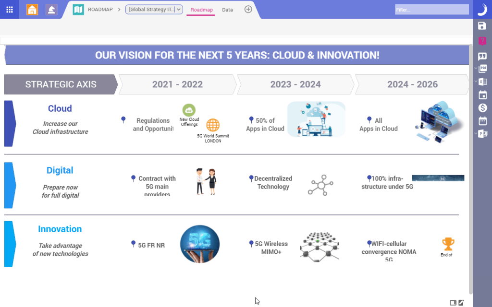

## Table of Contents

## What is portfolio management software?

Portfolio management software is a tool that helps people and businesses keep track of their investments. It can manage stocks, bonds, mutual funds, and other types of assets. This software makes it easier to see how well your investments are doing and helps you make smart decisions about buying or selling them. It often comes with features like tracking performance, analyzing risk, and creating reports, which can save a lot of time and effort.

Using portfolio management software can be very helpful for both new and experienced investors. It gives you a clear picture of your entire investment portfolio in one place. This makes it easier to understand how different investments are performing and how they fit together. The software can also help you set goals and plan for the future, making sure your investments match your financial needs and risk levels. Overall, it's a useful tool for anyone looking to manage their money wisely.

## What are the basic features to look for in portfolio management software?

When looking for portfolio management software, it's important to find one that lets you easily see all your investments in one place. This means the software should be able to show you stocks, bonds, mutual funds, and other types of assets together. It should also allow you to update your investments quickly and see how they're doing over time. Being able to track performance is key, so look for software that gives you clear charts and graphs to understand your gains and losses.

Another basic feature to consider is the ability to analyze risk. Good portfolio management software will help you see how risky your investments are and suggest ways to balance your portfolio. This can be really helpful in making sure your investments match your comfort level with risk. Also, the software should be able to create detailed reports. These reports can help you keep track of your progress and make smart decisions about buying or selling investments. Overall, the best software will be easy to use and give you the tools you need to manage your money well.

## How does portfolio management software help beginners in managing their investments?

Portfolio management software helps beginners by making it easier to keep track of all their investments in one place. Instead of having to check different accounts or websites, beginners can see all their stocks, bonds, and other assets together. This makes it simpler to understand how each investment is doing and how they all work together. The software often has easy-to-read charts and graphs that show gains and losses over time, which can help beginners see their progress and learn about their investments.

Another way portfolio management software helps beginners is by providing tools to analyze risk. It can show how risky each investment is and suggest ways to balance the portfolio to match the beginner's comfort level with risk. This can be really helpful because it takes some of the guesswork out of investing. The software also often comes with features that let beginners set goals and plan for the future, making it easier to stay on track with their financial plans. Overall, portfolio management software can be a big help for beginners by making investing less confusing and more manageable.

## What are the top 5 portfolio management software options for 2024?

In 2024, some of the top portfolio management software options for beginners and experienced investors include Personal Capital, Quicken, Morningstar, SigFig, and Betterment. Personal Capital is great because it offers a free version with basic tools to track your investments and plan for retirement. It also has a paid version with more advanced features like tax optimization and financial advisors. Quicken is another good choice, especially for people who want to manage their overall finances as well as their investments. It has features for budgeting, bill paying, and tracking investments all in one place.

Morningstar is well-known for its detailed research and analysis tools, which can be really helpful for investors who want to dive deep into their investments. It offers a lot of data and reports that can help you make smart decisions. SigFig is a good option for those who want a simple and easy-to-use platform. It's free to use and can manage up to 20 accounts, which is great for people with multiple investments. Lastly, Betterment is a robo-advisor that not only manages your portfolio but also automatically rebalances it to keep your investments aligned with your goals. It's user-friendly and can be a good choice for beginners who want a hands-off approach to investing.

## How do the pricing models of different portfolio management software compare?

The pricing models of different portfolio management software can vary a lot. Personal Capital has a free version that lets you track your investments and plan for retirement. If you want more advanced features like tax optimization and access to financial advisors, you'll need to pay for the premium version, which costs around $100 to $200 a year depending on your account size. Quicken offers a subscription model where you pay a yearly fee, usually around $50 to $100, to use its full range of features, including investment tracking, budgeting, and bill paying. Morningstar also uses a subscription model, with different tiers of service. The basic version might cost around $200 a year, while more advanced versions with detailed research and analysis can cost up to $300 or more.

SigFig is another option with a different approach. It's free to use for managing up to 20 accounts, which is great for people who want a simple, no-cost solution. If you want more advanced features or higher account limits, you can pay for their premium service, which costs around $10 a month. Betterment, a robo-advisor, charges a management fee based on your account balance. For accounts under $20,000, the fee is 0.25% annually, and it drops to 0.15% for accounts over $2 million. This fee covers all the services Betterment provides, including automatic portfolio rebalancing and tax strategies. Each of these options has its own pricing structure, so it's important to think about what features you need and how much you're willing to pay.

## What advanced features distinguish premium portfolio management software from basic versions?

Premium portfolio management software often includes advanced features that go beyond what basic versions offer. One key feature is tax optimization, which helps you manage your investments in a way that minimizes the taxes you have to pay. This can be really helpful for people with a lot of investments or those who are trying to save money on taxes. Another advanced feature is access to financial advisors. With premium software, you can talk to experts who can give you personalized advice on your investments. This can be a big help if you're not sure what to do with your money.

In addition to tax optimization and financial advisors, premium software usually offers more detailed analysis and reporting tools. These tools can show you in-depth data about how your investments are doing, helping you make smarter decisions. For example, you might get reports that break down your portfolio's performance in different ways, like by sector or asset class. Some premium software also includes automatic rebalancing, which means it will adjust your investments to keep them in line with your goals without you having to do anything. Overall, these advanced features can make managing your money easier and more effective, but they often come at a higher cost.

## How do different software options handle integration with other financial tools and platforms?

Different portfolio management software options handle integration with other financial tools and platforms in various ways. Personal Capital, for example, can connect with many banks, brokerages, and other financial institutions to pull in all your financial data into one place. This makes it easy to see everything together. Quicken also offers good integration, letting you link accounts from different banks and investment firms so you can manage your budget, bills, and investments all at once. Morningstar focuses more on investment analysis, but it still connects with some brokerages to give you a complete view of your portfolio.

SigFig and Betterment have different approaches to integration. SigFig can connect to many financial accounts and even works with some popular budgeting apps, making it easy to keep track of your money in different places. Betterment, being a robo-advisor, integrates mainly with the investment accounts it manages. It can connect with some external accounts for a full financial picture, but its main focus is on managing the investments within its own platform. Overall, the level of integration can vary a lot, so it's important to pick the software that fits best with the other tools you use.

## What are the security measures implemented by leading portfolio management software in 2024?

Leading portfolio management software in 2024 takes security very seriously. They use strong encryption to protect your data when it's moving between your device and their servers. This means your information is turned into a code that's hard for anyone else to read. They also use two-[factor](/wiki/factor-investing) authentication, which adds an extra step to log in. You need to enter a code sent to your phone or another device, making it much harder for someone else to get into your account. Plus, they follow strict rules to make sure they keep your data safe and private.

These software companies also keep a close eye on their systems to spot and stop any strange activity. They use special tools to watch for signs of hacking or other problems. If they see something wrong, they can act fast to fix it. They also do regular checks to make sure their security is working well. And if something does go wrong, they have plans in place to quickly get things back to normal. All these steps help make sure your investments and personal information stay safe.

## How do user interfaces and user experiences vary across different portfolio management software?

Different portfolio management software can have very different user interfaces and experiences. Some, like Personal Capital, have a clean and easy-to-use design that makes it simple to see all your investments at once. It uses clear charts and graphs to show how your money is doing, which can be really helpful for beginners. Quicken has a more detailed interface with lots of options for managing not just your investments but your whole financial life. It might take a bit more time to learn, but once you get the hang of it, you can do a lot with it.

On the other hand, Morningstar's interface is focused more on giving you deep insights into your investments. It has a lot of data and reports, which can be great if you like to dive into the details. But it might feel a bit overwhelming if you're just starting out. SigFig and Betterment aim for simplicity. SigFig's interface is very straightforward and easy to navigate, perfect for people who want to keep things simple. Betterment's design is also user-friendly, with a focus on automatic management, so you don't have to do much yourself. Each software has its own style, so it's important to pick one that matches how you like to manage your money.

## What kind of customer support and educational resources are available with various software options?

Different portfolio management software offers various types of customer support and educational resources. Personal Capital provides a mix of online help articles and direct access to financial advisors for premium users. They also have a learning center with guides and videos to help you understand investing better. Quicken offers customer support through phone, email, and live chat, which can be really helpful if you run into problems. They also have a lot of tutorials and articles on their website to teach you about managing your money and investments.

Morningstar is known for its detailed research and analysis, and they offer a lot of educational content too. You can find articles, videos, and courses that cover all sorts of investing topics. Their customer support is mainly through email and phone, which can be good if you need help understanding their reports. SigFig and Betterment focus on making things easy for users. SigFig has a help center with articles and FAQs, and you can reach their support team through email. Betterment also has a help center and offers phone and email support. They both provide educational resources like blogs and guides to help you learn about investing and managing your money.

## How do the performance tracking and reporting capabilities differ among the top portfolio management software?

The performance tracking and reporting capabilities of top portfolio management software can be quite different. Personal Capital offers a user-friendly way to see how your investments are doing with clear charts and graphs. It shows you your overall performance and breaks it down by asset type, which is helpful for understanding where your money is going. Quicken goes a step further by letting you create detailed custom reports. You can look at your investments in many different ways, like by time period or by specific investments. This can be really useful if you want to dive deeper into your money management.

Morningstar is known for its in-depth analysis, and its performance tracking reflects that. It gives you a lot of data and detailed reports that can show you how each investment is performing against benchmarks. This can be great if you like to get into the nitty-gritty of your investments. On the other hand, SigFig and Betterment focus on simplicity. SigFig provides straightforward performance tracking with easy-to-read summaries, while Betterment automatically generates reports that show your portfolio's performance and how it's being managed. Both are good if you want a simple way to keep an eye on your investments without getting overwhelmed by details.

## What are the expert opinions and user reviews on the leading portfolio management software for 2024?

In 2024, experts and users generally agree that Personal Capital is a top choice for its easy-to-use design and helpful tools. Many people like how it shows all their investments in one place with clear charts and graphs. Experts say the free version is great for beginners, but the paid version with tax optimization and financial advisors is even better for those who need more advanced features. Users often mention that Personal Capital's customer support is very helpful, and the educational resources are good for learning about investing. However, some users wish the free version had more features.

Quicken and Morningstar also get good reviews, but for different reasons. Quicken is praised for its detailed tracking and reporting, which experts say is perfect for people who want to manage their whole financial life. Users like how it connects to many banks and investment accounts, making it easy to see everything together. On the downside, some find the interface a bit hard to learn at first. Morningstar is loved by those who want deep analysis and research. Experts point out that it's great for investors who like to dig into data, but beginners might find it overwhelming. Users appreciate the detailed reports but sometimes wish the customer support was faster. 

SigFig and Betterment are popular for their simple and automatic approaches. Experts say SigFig is great for people who want a no-cost solution with easy tracking. Users enjoy its straightforward design and the ability to connect multiple accounts. However, some wish it had more advanced features. Betterment's robo-advisor service gets high marks from experts for its ease of use and automatic management. Users like how it takes the work out of investing, but some feel the fees can add up over time. Overall, each software has its strengths and weaknesses, so the best choice depends on what you need and how you like to manage your money.

## References & Further Reading

[1]: Bergstra, J., Bardenet, R., Bengio, Y., & Kégl, B. (2011). ["Algorithms for Hyper-Parameter Optimization."](https://papers.nips.cc/paper/4443-algorithms-for-hyper-parameter-optimization) Advances in Neural Information Processing Systems 24.

[2]: ["Advances in Financial Machine Learning"](https://www.amazon.com/Advances-Financial-Machine-Learning-Marcos/dp/1119482089) by Marcos Lopez de Prado

[3]: ["Evidence-Based Technical Analysis: Applying the Scientific Method and Statistical Inference to Trading Signals"](https://www.amazon.com/Evidence-Based-Technical-Analysis-Scientific-Statistical/dp/0470008741) by David Aronson

[4]: ["Machine Learning for Algorithmic Trading"](https://github.com/PacktPublishing/Machine-Learning-for-Algorithmic-Trading-Second-Edition) by Stefan Jansen

[5]: ["Quantitative Trading: How to Build Your Own Algorithmic Trading Business"](https://books.google.com/books/about/Quantitative_Trading.html?id=j70yEAAAQBAJ) by Ernest P. Chan