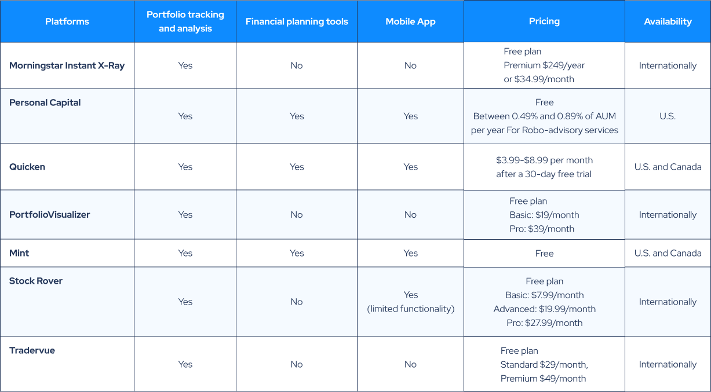

## Table of Contents

## What are portfolio tracking and management applications?

Portfolio tracking and management applications are tools that help people keep an eye on their investments. These apps let you see all your stocks, bonds, mutual funds, and other investments in one place. They show you how much your investments are worth, how they are doing over time, and how they compare to the market. You can also see how much money you are making or losing from your investments.

These apps also help you manage your investments better. You can set goals for your investments, like saving for retirement or buying a house. The apps can give you advice on what to buy or sell based on your goals and how much risk you want to take. Some apps even let you buy and sell investments right from the app, making it easy to make changes to your portfolio.

Overall, portfolio tracking and management applications make it easier for people to understand and control their investments. They take away a lot of the hard work of keeping track of everything and help you make smarter choices about your money.

## What are the key features to look for in a portfolio tracking app?

When looking for a good portfolio tracking app, you should first focus on how easy it is to use. The app should have a simple design that lets you see all your investments at a glance. It should be easy to add new investments and update your portfolio. A good app will also let you connect to your bank and investment accounts so that everything updates automatically. This saves you time and makes sure your information is always up to date.

Another important feature is the ability to get detailed reports and analysis. The app should show you how your investments are doing over time, including graphs and charts that make it easy to understand. It should also let you compare your investments to different market benchmarks so you can see if you are doing better or worse than the market. Some apps even give you advice on what to buy or sell based on your goals and how much risk you are willing to take.

Lastly, consider the app's security and support features. It's important that the app keeps your information safe with strong security measures like encryption and two-[factor](/wiki/factor-investing) authentication. You should also be able to reach customer support easily if you have any questions or problems. A good app will have a help center with lots of information and quick ways to get in touch with support staff.

## How do different portfolio management apps handle data import and export?

Different portfolio management apps handle data import and export in various ways. Some apps let you connect your bank and investment accounts directly. This means the app can pull in all your investment data automatically. This is really handy because you don't have to enter everything by hand. Other apps might need you to enter your investment data manually. This can be more work, but it gives you more control over what information goes into the app. Some apps also let you import data from a file, like a CSV or Excel spreadsheet, which can be useful if you already have your data organized.

When it comes to exporting data, apps also have different methods. Many apps let you export your portfolio data as a file, like a CSV or PDF. This is useful if you want to keep a record of your investments or share it with someone else. Some apps might also let you export data directly to other software, like tax preparation programs. This can make it easier to handle your taxes. Not all apps offer the same level of export options, so it's important to check what each app can do before you choose one.

Overall, the way an app handles data import and export can make a big difference in how easy it is to use. If you have a lot of different investments, you might want an app that can connect to your accounts automatically. If you prefer to keep things simple, an app that lets you enter data manually might be better. And if you need to share or analyze your data, look for an app with good export options.

## What are the differences in user interface and experience among popular portfolio tracking apps?

Different popular portfolio tracking apps have unique user interfaces and experiences. Some apps, like Robinhood, have a very simple and clean design. They use bright colors and big buttons, making it easy for beginners to understand and use the app. The focus is on making buying and selling investments as easy as possible. Other apps, like Personal Capital, have a more detailed and complex interface. They offer lots of charts, graphs, and analysis tools that can help experienced investors make better decisions. These apps might take more time to learn, but they give you a lot more information about your investments.

Another difference is how each app helps you manage your portfolio. For example, apps like Mint focus on giving you a big picture of your finances, not just your investments. They show you your spending, savings, and investments all in one place. This can be great if you want to see how your investments fit into your overall financial plan. On the other hand, apps like Morningstar focus more on detailed investment analysis. They provide in-depth reports and ratings that can help you pick the best investments for your goals. Each app has its own way of helping you manage your money, so it's important to choose one that matches what you need.

In general, the user experience can also depend on how easy it is to use the app on different devices. Some apps, like Betterment, work well on both your phone and computer, making it easy to check your investments no matter where you are. Other apps might work better on one type of device, so you might find it harder to use them on your phone if you're used to the computer version. It's a good idea to try out a few different apps to see which one feels the most comfortable and easy to use for you.

## How do these applications support different types of investments (stocks, bonds, crypto, etc.)?

Portfolio tracking apps support different types of investments in various ways. Many apps let you track stocks and bonds easily. They connect to your brokerage accounts to show you how your stocks and bonds are doing. Some apps also support tracking mutual funds and exchange-traded funds (ETFs). You can see all your investments in one place, which makes it easy to understand how your money is working for you. Apps like Robinhood and E*TRADE are good examples of this. They let you buy, sell, and track stocks and other traditional investments with just a few taps on your phone.

When it comes to cryptocurrencies like Bitcoin and Ethereum, not all apps support them. Some apps, like Coinbase, are made just for tracking and trading crypto. They show you how much your crypto is worth and let you buy and sell it easily. Other apps, like Personal Capital, are starting to add crypto support but might not be as detailed. If you have a mix of traditional investments and crypto, you might need to use more than one app to keep track of everything. This can be a bit more work, but it lets you see your whole portfolio.

Overall, the best app for you depends on what types of investments you have. If you mostly invest in stocks and bonds, a general portfolio tracking app will probably work well. But if you also have crypto, you might need a specialized app or a combination of apps to get a full picture of your investments. It's important to choose an app that supports all the types of investments you own so you can manage your money effectively.

## What are the pricing models of various portfolio management apps?

Portfolio management apps have different ways of charging for their services. Some apps are free to use, like Robinhood. They make money by getting a small fee from each trade you make. Other apps, like E*TRADE, might charge you a fee every time you buy or sell an investment. These fees can be a few dollars per trade, which can add up if you trade a lot. Some apps also offer different levels of service, where you pay more for extra features like detailed reports or advice from financial experts.

Other apps use a subscription model. For example, Personal Capital has a free version that lets you track your investments, but if you want more advanced features like financial planning tools, you have to pay a monthly or yearly fee. Betterment is another app that charges a yearly fee based on how much money you have invested with them. The more money you invest, the lower the percentage fee you pay. This can be a good deal if you have a lot of money to invest, but it might be more expensive if you're just starting out.

Overall, the pricing model that's best for you depends on how often you trade, what features you need, and how much money you're investing. Free apps might seem like a good choice, but they might not have all the features you need. Paid apps can offer more tools and better support, but you have to make sure the cost is worth it for you. It's a good idea to compare different apps and see which one fits your needs and budget the best.

## How do these apps integrate with other financial tools and services?

Portfolio management apps often connect with other financial tools and services to make managing your money easier. Many apps let you link your bank accounts, credit cards, and investment accounts all in one place. This means you can see everything in one app, like how much money you have, what you're spending, and how your investments are doing. Some apps, like Mint, are really good at this. They show you a full picture of your finances, including your investments, bills, and budget. This can help you make better decisions about your money because you can see how everything fits together.

Other apps focus more on working with specific financial services. For example, apps like Betterment and Wealthfront can connect with tax software to make filing your taxes easier. They give you reports that you can use to fill out your tax forms, which can save you time and help you get your taxes right. Some apps also let you connect with financial advisors or robo-advisors. These services can give you advice on what to do with your money based on what you want and how much risk you're okay with. This can be really helpful if you're not sure what to do with your investments.

## What kind of security measures do these applications employ to protect user data?

Portfolio management apps use different ways to keep your information safe. They often use encryption to protect your data. Encryption means turning your information into a code that only the app can read. This makes it hard for anyone else to see your data if they try to steal it. Many apps also use two-factor authentication. This means you need to enter a special code, usually sent to your phone, to log in. This adds an extra layer of security because even if someone knows your password, they can't get into your account without the code.

Some apps also have other security features. They might monitor your account for strange activity, like if someone tries to log in from a new place or at a weird time. If they see something odd, they might lock your account and send you an alert. Many apps also follow strict rules about how they handle your data. They have to keep your information private and only use it in ways you agree to. This helps make sure your personal and financial information stays safe.

## How do different apps handle tax-related information and reporting?

Portfolio management apps help with taxes by giving you reports that show how much money you made or lost from your investments. These reports can be really helpful when you need to fill out your tax forms. Some apps, like Betterment and Wealthfront, make it easy to connect to tax software. They give you all the information you need in a way that you can just copy into your tax program. This can save you a lot of time and help make sure you don't miss anything important on your taxes.

Other apps might not connect directly to tax software, but they still give you the information you need. Apps like E*TRADE and Robinhood let you download reports that show your investment gains and losses. You can then use these reports to fill out your tax forms by hand. It might take a bit more work, but you still get all the information you need to do your taxes right. It's important to check what each app offers so you can pick one that fits your needs.

## What advanced analytics and reporting features do these apps offer?

Portfolio management apps offer advanced analytics and reporting features that help you understand your investments better. Many apps give you detailed graphs and charts that show how your investments are doing over time. You can see how much your stocks, bonds, and other investments have grown or shrunk. Some apps also let you compare your portfolio to different market benchmarks, like the S&P 500. This helps you see if your investments are doing better or worse than the market. Apps like Morningstar and Personal Capital are good at this, giving you lots of data to help you make smart choices about your money.

These apps also provide reports that can help with planning and decision-making. For example, they might show you how your investments are spread out across different types of assets, like stocks, bonds, and real estate. This can help you make sure your portfolio is balanced the way you want it to be. Some apps even use algorithms to give you personalized advice on what to buy or sell based on your goals and how much risk you're willing to take. This can be really helpful if you're trying to save for something big, like retirement or buying a house. Overall, these advanced features make it easier to manage your investments and reach your financial goals.

## How do these applications support multi-currency and international portfolios?

Portfolio management apps help people who have investments in different countries and currencies. Many apps let you track your investments no matter where they are. They show you how much your investments are worth in different currencies, which can be really helpful if you have money in places like the US, Europe, or Asia. Some apps, like Personal Capital, let you see your portfolio in your home currency, so you can easily understand how much your international investments are worth to you.

These apps also help you manage the risks that come with investing in different countries. They can show you how changes in currency values might affect your investments. For example, if the US dollar gets stronger, your investments in Europe might be worth less in dollars. Apps like E*TRADE and [Interactive Brokers](/wiki/interactive-brokers-api) are good at this, giving you tools to see how currency changes could impact your portfolio. This helps you make better decisions about where to put your money around the world.

## What are the community and expert reviews saying about the reliability and performance of these apps?

People who use portfolio tracking apps often talk about how reliable and fast they are. Many users say that apps like Robinhood and E*TRADE work well most of the time. They like that these apps update quickly and show the right information about their investments. But sometimes, users say the apps can be slow or have problems when a lot of people are using them at once, like when the stock market is really busy. Overall, most people think these apps are pretty reliable, but they can have some issues during busy times.

Experts also have opinions about these apps. They say that apps like Personal Capital and Betterment are good because they have strong security and give a lot of detailed information about investments. Experts like that these apps help people make smart choices about their money. But they also point out that some apps might not be as good for people with a lot of different kinds of investments, like stocks, bonds, and crypto. In general, experts think these apps are useful tools, but you should pick the one that fits what you need best.

## References & Further Reading

[1]: Bergstra, J., Bardenet, R., Bengio, Y., & Kégl, B. (2011). ["Algorithms for Hyper-Parameter Optimization."](https://papers.nips.cc/paper/4443-algorithms-for-hyper-parameter-optimization) Advances in Neural Information Processing Systems 24.

[2]: ["Advances in Financial Machine Learning"](https://www.amazon.com/Advances-Financial-Machine-Learning-Marcos/dp/1119482089) by Marcos Lopez de Prado

[3]: ["Evidence-Based Technical Analysis: Applying the Scientific Method and Statistical Inference to Trading Signals"](https://www.amazon.com/Evidence-Based-Technical-Analysis-Scientific-Statistical/dp/0470008741) by David Aronson

[4]: ["Machine Learning for Algorithmic Trading"](https://github.com/stefan-jansen/machine-learning-for-trading) by Stefan Jansen

[5]: ["Quantitative Trading: How to Build Your Own Algorithmic Trading Business"](https://www.amazon.com/Quantitative-Trading-Build-Algorithmic-Business/dp/1119800064) by Ernest P. Chan