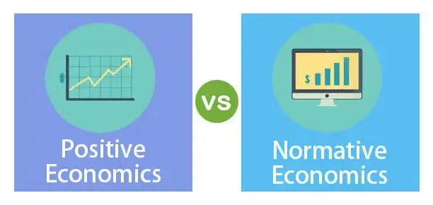

## Table of Contents

## What is economics?

Economics is a social science that studies how people use resources to meet their needs and wants. It looks at how individuals, businesses, governments, and other groups make choices about using limited resources. These resources can be things like money, time, and natural materials. Economists try to understand how these choices affect the production, distribution, and consumption of goods and services.

One important concept in economics is supply and demand. This idea explains how the price and quantity of goods and services are determined in a market. When many people want a product and there is not much of it available, the price tends to go up. On the other hand, if there is a lot of a product and not many people want it, the price tends to go down. Economists use this and other concepts to analyze and predict economic trends and to help make decisions about economic policy.

## What is positive economics?

Positive economics is a way of studying economics that focuses on facts and how things actually work. It tries to describe and explain what is happening in the economy without saying if it's good or bad. For example, positive economics might look at how a change in taxes affects people's spending. It uses data and evidence to make statements that can be tested and proven true or false.

This type of economics is different from normative economics, which is more about opinions and what should be done. Positive economics stays neutral and just tries to understand the world as it is. By sticking to facts, positive economics helps economists make predictions and understand cause and effect in the economy. For instance, if positive economics finds that raising the minimum wage leads to higher unemployment, it's presenting a fact, not a judgment on whether raising the minimum wage is a good or bad idea.

## What is normative economics?

Normative economics is about opinions and what people think should happen in the economy. It's different from positive economics, which just looks at facts. Normative economics asks questions like, "Should the government raise taxes?" or "Is it fair to have a minimum wage?" It's about what people believe is right or wrong, good or bad.

When economists use normative economics, they often talk about values and goals. They might say things like, "We should help poor people by giving them more money," or "It's important to protect the environment, even if it costs jobs." These statements can't be proven true or false with data. Instead, they start discussions and debates about what kind of economy we want to have.

## How do positive and normative economics differ?

Positive economics and normative economics are two different ways of looking at the economy. Positive economics is all about facts and how things really work. It tries to describe what is happening in the economy without saying if it's good or bad. For example, it might study how a tax change affects how much people spend. Positive economics uses data and evidence to make statements that can be tested and proven true or false. It's like a scientist trying to understand how the world works.

On the other hand, normative economics is about opinions and what people think should happen. It asks questions like, "Should the government raise taxes?" or "Is it fair to have a minimum wage?" Normative economics is about what people believe is right or wrong, good or bad. These statements can't be proven true or false with data. Instead, they start discussions and debates about what kind of economy we want to have. So, while positive economics focuses on what is, normative economics focuses on what ought to be.

## Can you provide examples of positive economic statements?

A positive economic statement is like saying, "When the price of gas goes up, people drive less." This is something we can check with data. If we look at how much gas costs and how much people drive, we can see if it's true. It's not about if it's good or bad, just about what happens.

Another example is, "If the government gives people more money, they will spend more." Economists can study this by looking at what happens when the government does this. They can see if people really do spend more money. Again, it's just about what happens, not if it's a good idea or not.

## Can you provide examples of normative economic statements?

A normative economic statement is like saying, "The government should give more money to poor people." This is about what someone thinks is right or fair. It's not something we can check with data. It's more about what people believe should happen.

Another example is, "It's wrong to have a big difference between what rich and poor people earn." This statement is about what someone thinks is good or bad. It starts a conversation about what kind of economy we want to have. It's not about facts, but about values and opinions.

## Why is it important to distinguish between positive and normative economics?

It's important to tell the difference between positive and normative economics because they help us understand the economy in different ways. Positive economics looks at facts and how things really work. It helps us make predictions and understand what happens when something changes in the economy. For example, if we know that raising taxes makes people spend less, we can use that information to plan better. Positive economics is like a map that shows us where we are and where we might go if we take certain steps.

Normative economics, on the other hand, is about what people think should happen. It's about values and opinions, like whether it's fair to have a big difference between what rich and poor people earn. Knowing the difference helps us have better discussions about the economy. When we talk about what should happen, we can remember that these are opinions, not facts. This way, we can have clear conversations about what kind of economy we want, without mixing up what is happening with what we think should happen.

## How do economists use positive economics in their analysis?

Economists use positive economics to study how things work in the economy. They look at facts and data to understand what is happening. For example, they might study how a change in interest rates affects how much people spend on houses. By looking at real numbers and evidence, economists can make statements that can be checked and tested. This helps them predict what might happen if something in the economy changes. It's like using a weather report to know if it will rain tomorrow.

Positive economics helps economists figure out cause and effect in the economy. If they see that raising the minimum wage leads to higher unemployment, they can use that information to advise governments or businesses. This type of economics stays neutral and doesn't say if something is good or bad. It just tries to understand the world as it is. By sticking to facts, economists can make better decisions based on what they know is true.

## How do policymakers use normative economics in decision-making?

Policymakers use normative economics when they make decisions about what they think should happen in the economy. They look at what they believe is fair or right, not just what the facts are. For example, a policymaker might think it's important to help poor people, so they might decide to raise taxes on the rich to give more money to those who need it. This kind of decision is based on values and opinions, not just on what the data shows.

Normative economics helps policymakers talk about what kind of economy they want to have. They might argue about whether it's good to have a big difference between what rich and poor people earn. These discussions can lead to new laws or policies that try to make the economy more like what people think it should be. By using normative economics, policymakers can make choices that reflect what they believe is best for society, even if those choices can't be proven right or wrong with data.

## What are the challenges in separating positive and normative economics in real-world applications?

In real-world applications, it can be hard to keep positive and normative economics separate because people's beliefs and values often mix with facts. When economists or policymakers talk about the economy, they might start with facts, like how a tax change affects spending. But then they might quickly move to saying what they think should be done, like whether the tax change is fair. This can make it tricky to tell the difference between what is really happening and what someone thinks should happen.

Another challenge is that people can have strong opinions about what the economy should be like, and these opinions can color how they see the facts. For example, if someone believes that helping poor people is really important, they might look at data in a way that supports their belief. This can lead to arguments where people use the same facts to say different things about what should be done. So, even though positive economics tries to stick to facts, in the real world, it's hard to keep those facts completely separate from what people think is right or wrong.

## How have historical economic theories influenced the development of positive and normative economics?

Historical economic theories have played a big role in shaping both positive and normative economics. Early economists like Adam Smith focused on understanding how economies work, which is a lot like positive economics. Smith's ideas about the "invisible hand" and how markets work helped economists study facts and make predictions. Later, economists like John Maynard Keynes looked at how government actions can affect the economy. This also added to positive economics by giving more facts about what happens when governments do things like change taxes or spending.

Normative economics has also been influenced by historical theories. For example, Karl Marx's ideas about how wealth should be shared more equally among people are very normative. Marx thought that the economy should be set up in a certain way, which is about what should be done, not just what is happening. Over time, economists have used these ideas to talk about what kind of economy they think is best. Both positive and normative economics have grown from these early theories, showing how facts and values have always been important in understanding and shaping the economy.

## What are the current debates among economists regarding the roles of positive and normative economics?

One big debate among economists today is about how much positive economics can really tell us about the economy. Some economists think that positive economics is very good at helping us understand how things work and make predictions. They believe that if we stick to facts and data, we can make better decisions. But others argue that positive economics can't tell the whole story. They say that the economy is too complicated and that facts alone can't explain everything. These economists think that we need to mix in normative ideas to get a full picture of what's happening and what should be done.

Another debate is about how much normative economics should influence policy. Some economists believe that normative economics is very important because it helps us talk about what kind of economy we want to have. They think that values and opinions should play a big role in deciding what policies to make. But other economists worry that too much focus on normative economics can lead to bad decisions. They argue that if we base policies too much on what we think should happen, we might ignore important facts. These economists want to make sure that positive economics stays at the center of policy-making, so decisions are based on what is really happening in the economy.

## References & Further Reading

[1]: Friedman, M. (1953). ["Essays in Positive Economics"](https://en.wikipedia.org/wiki/Essays_in_Positive_Economics). University of Chicago Press.

[2]: Hausman, D. M. (2008). ["The Philosophy of Economics: An Anthology"](https://www.cambridge.org/core/books/philosophy-of-economics/36F55C3A2AED6BD3BCDCD9CE8A9FC1FC). Cambridge University Press.

[3]: Beggs, J. (2017). ["Positive vs. Normative Economics."](https://www.thoughtco.com/positive-versus-normative-analysis-1147005) Investopedia.

[4]: Lopez de Prado, M. (2018). ["Advances in Financial Machine Learning"](https://www.amazon.com/Advances-Financial-Machine-Learning-Marcos/dp/1119482089). Wiley.

[5]: Chan, E. P. (2009). ["Quantitative Trading: How to Build Your Own Algorithmic Trading Business"](https://github.com/ftvision/quant_trading_echan_book). Wiley.

[6]: Jansen, S. (2020). ["Machine Learning for Algorithmic Trading"](https://github.com/stefan-jansen/machine-learning-for-trading). Packt Publishing.

[7]: Aronson, D. (2007). ["Evidence-Based Technical Analysis: Applying the Scientific Method and Statistical Inference to Trading Signals"](https://www.amazon.com/Evidence-Based-Technical-Analysis-Scientific-Statistical/dp/0470008741). Wiley.