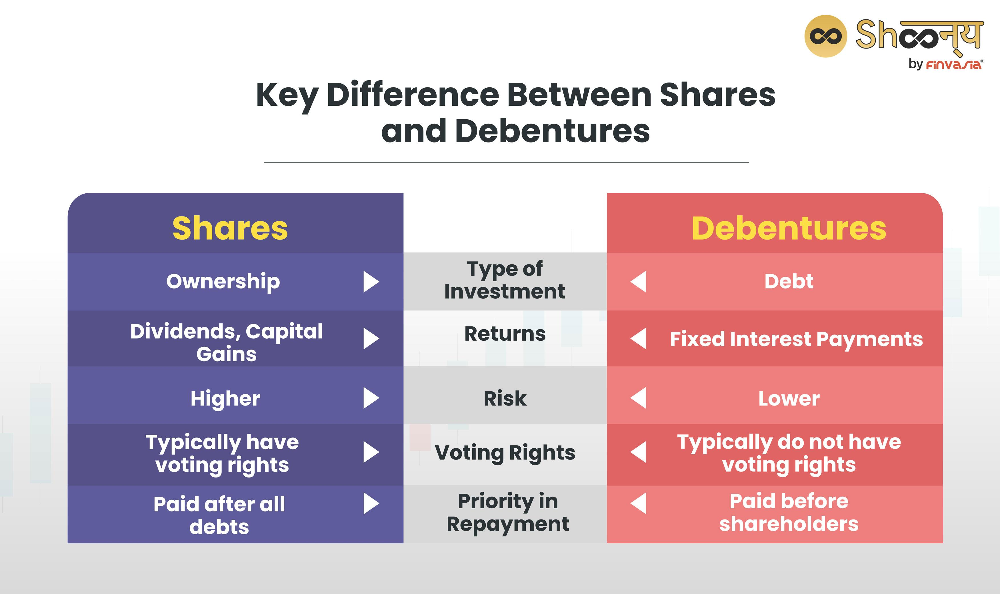

In the rapidly evolving world of finance, understanding various financial instruments becomes crucial for investors aiming to optimize their portfolios. These instruments provide diverse avenues for income generation, risk management, and capital appreciation, allowing investors to tailor their strategies according to individual financial goals and market conditions. Preference shares, debentures, and algorithmic trading each play unique roles in the financial markets, offering distinct characteristics that appeal to different investor profiles.

Preference shares, also referred to as preferred shares, are a class of equity security that entitles the shareholder to a fixed dividend before any dividends are distributed to common shareholders. They often serve as a hybrid between equity and debt, providing a steadier income stream than common shares while limiting the potential for capital gains. The appeal of preference shares lies in their preferential treatment during dividend distribution and asset liquidation, making them an attractive option for income-focused investors.



Debentures, on the other hand, are unsecured debt instruments issued by corporations or governments. They offer a fixed rate of interest and represent a promise to repay the principal upon maturity. Unlike secured bonds, debentures rely solely on the issuer's creditworthiness, making them a slightly higher risk but often accompanied by comparatively higher yields than secured debt instruments. Debentures provide a useful tool for investors seeking stable income with lower risks of capital loss compared to equity instruments.

Algorithmic trading represents a contemporary approach leveraging technology to execute trading orders at high speeds and large volumes. This method uses complex algorithms to identify opportunities and make trades based on pre-set criteria, offering advantages in price accuracy and reduced transaction costs. Algorithmic trading enables investors to react swiftly to market conditions, optimizing trade executions with minimal human intervention. It integrates seamlessly into diversified investment strategies, utilizing technology to enhance portfolio performance.

This article explores these financial instruments, highlighting their characteristics, benefits, and potential uses in investment strategies. By gaining a thorough understanding of preference shares, debentures, and algorithmic trading, investors can better navigate the complexities of modern financial markets and make informed decisions to achieve sustainable growth in their investment portfolios.

## Table of Contents

## Understanding Preference Shares

Preference shares, also known as preferred shares, are a class of equity security that provides shareholders with specific privileges not typically available with common shares. One of the primary benefits of preference shares is their preferential treatment in dividend distributions. Holders of preference shares receive dividend payments before common stockholders, ensuring a more predictable income stream. This makes preference shares particularly attractive to investors who prioritize stable returns.

Despite their advantages, preference shares usually do not confer voting rights. This means that preference shareholders generally do not have a say in corporate governance matters, such as electing the board of directors or approving significant company changes. This trade-off is often considered acceptable by investors seeking the financial benefits provided by these securities without the need for participation in management decisions.

The fixed dividend feature of preference shares is another key characteristic distinguishing them from common shares. Preference shares typically have a predetermined dividend rate set at issuance, which can be beneficial for investors relying on consistent income, especially in uncertain economic climates.

There are several types of preference shares, each catering to different investor needs:

1. **Cumulative Preference Shares**: These shares entitle investors to receive omitted or unpaid dividends in future periods before any dividends can be paid to common shareholders. This feature ensures that investors are compensated for any dividend distributions that have been skipped.

2. **Non-Cumulative Preference Shares**: Unlike cumulative shares, non-cumulative preference shares do not accumulate unpaid dividends. If a company opts not to pay dividends in a given year, these dividends are permanently forfeited by the shareholder.

3. **Participating Preference Shares**: Holders of these shares have the potential to receive additional dividends beyond the fixed dividend amount, usually dependent on the company achieving specific profit levels or other financial metrics. Furthermore, in the event of liquidation, participating preference shareholders may receive a share of the company's residual value, after repaying the capital contributions of both preference and common shareholders.

4. **Convertible Preference Shares**: Convertible preference shares provide the option to convert them into a specified number of common shares, usually after a predetermined date. This option is attractive to investors who anticipate long-term growth in the company's stock price, as they stand to benefit from the upside potential associated with common shares.

By understanding these variations and their respective features, investors can select the type of preference shares that align best with their individual financial objectives and risk profiles. Preference shares can serve as a valuable component of a diversified investment portfolio, offering a combination of income stability and potential for capital appreciation, depending on the type of share chosen.

## Exploring Debentures

Debentures are a distinct category of debt instruments issued primarily by corporations and governments, characterized by their unsecured nature. Unlike secured bonds, which are backed by specific assets, debentures rely solely on the general creditworthiness and reputation of the issuer to assure investors of repayment. This dependence on credit standing underscores their unique risk profile in the spectrum of debt securities.

The primary financial appeal of debentures lies in their promise to provide a fixed rate of interest to investors, which is typically paid out periodically over the life of the instrument. This interest payment continues until the debenture reaches its maturity date, at which point the issuer is obligated to return the principal amount back to the debenture holder. This characteristic makes them similar to traditional bonds, with the critical distinction being the absence of collateral backing.

In terms of risk comparison, debentures are generally perceived as less risky than preference shares. The key reason for this perception is their higher claim priority in liquidation events. In cases where a company or issuing body undergoes liquidation, debenture holders are entitled to be paid before equity holders, including both common and preferred shareholders. This priority in the capital structure hierarchy offers debenture holders a greater degree of security, despite the lack of secured assets.

However, this reduced risk is often mirrored by relatively lower yields compared to more risky investments like preference shares. The trade-off between risk and return is a fundamental principle in investing, and debentures exemplify this relationship by offering more stable, albeit modest, returns. Their appeal is particularly strong among risk-averse investors who prioritize capital preservation over high yield potential.

To summarize the essential aspects of debentures, investors must consider the issuer's creditworthiness, the fixed income stream provided, and the hierarchical advantage in claims during liquidation. Understanding these factors can assist investors in assessing whether debentures align with their financial goals and risk tolerance.

## The Role of Algorithmic Trading

Algorithmic trading employs advanced algorithms and automated systems to execute trades with high speed and precision, significantly transforming how trading operations are conducted. The core principle of [algorithmic trading](/wiki/algorithmic-trading) involves using predetermined criteria—such as timing, price, or quantity—to initiate trading orders, facilitating execution at speeds that are unachievable by human traders.

One of the primary advantages of algorithmic trading is its ability to provide price accuracy. Algorithms are designed to analyze market data continuously, identifying the optimal times to buy or sell. This continuous analysis reduces the likelihood of human error and ensures that trading decisions are based on real-time data, enhancing the accuracy of executed trades.

The use of algorithms also contributes to a substantial reduction in transaction costs. By automating the trading process, algorithms minimize the need for manual intervention, thereby decreasing the associated labor costs. Additionally, their ability to execute trades rapidly helps in taking advantage of fleeting market opportunities, further optimizing trading expenses.

Reacting swiftly to market conditions is another significant advantage of algorithmic trading. Algorithms can quickly adapt to changes in the market environment, processing vast amounts of data to make informed decisions without the delay of manual processing. This speed is crucial in volatile markets, where the ability to rapidly respond to fluctuations can protect an investor's portfolio from potential losses.

Integrating algorithmic trading strategies within a diversified investment portfolio is a contemporary approach many investors adopt. This integration leverages technology to enhance performance by balancing traditional investment strategies with automated trading systems. For instance, high-frequency trading ([HFT](/wiki/high-frequency-trading-strategies)) strategies, a subset of algorithmic trading, are designed to exploit minuscule price differences across markets. Although HFT is not suitable for all investors due to its complexity, its inclusion in a diversified portfolio can present an opportunity to capitalize on short-term market inefficiencies.

To implement algorithmic trading within an investment strategy, investors and asset managers might use programming languages such as Python to develop and back-test trading algorithms. Below is a simple Python code snippet leveraging libraries such as NumPy and Pandas to generate trading signals based on a simple moving average (SMA) strategy:

```python
import pandas as pd
import numpy as np

# Assume df is a DataFrame containing historical price data with a 'Close' column
def calculate_sma_strategy(df, short_window=40, long_window=100):
    df['Short_SMA'] = df['Close'].rolling(window=short_window, min_periods=1).mean()
    df['Long_SMA'] = df['Close'].rolling(window=long_window, min_periods=1).mean()

    # Create signals
    df['Signal'] = 0
    df['Signal'][short_window:] = np.where(
        df['Short_SMA'][short_window:] > df['Long_SMA'][short_window:], 1, 0
    )

    # Generate trade signals
    df['Position'] = df['Signal'].diff()

    return df

# Example usage
# df = pd.read_csv('historical_data.csv')
# df_with_signals = calculate_sma_strategy(df)
```

This code outlines a basic strategy structure, identifying buy and sell signals for a given stock based on the crossing of short-term and long-term moving averages. While this is a rudimentary example, it illustrates how algorithmic trading can potentially be employed to develop sophisticated strategies.

Overall, algorithmic trading's integration into investment portfolios enables investors to deploy precise and adaptable trading strategies, aligning with contemporary technological advancements and market needs. This integration can enhance portfolio performance, offering a tactical edge in navigating the complexities of modern financial markets.

## Preference Shares vs. Debentures: Making the Choice

The choice between preference shares and debentures is pivotal for investors, shaped largely by individual risk tolerance, income preferences, and prevailing market conditions. Each financial instrument offers unique benefits and potential drawbacks, making it essential for investors to align these with their financial goals.

Preference shares, or preferred shares, are typically attractive to investors who prioritize a steady income stream but are willing to accept some level of risk for potential capital appreciation. These shares provide preferential treatment in dividend distribution, often at a fixed rate, which can be beneficial during times of stable or rising interest rates. However, one trade-off is the often-limited voting rights, which can restrict an investor’s influence over company decisions. Moreover, in the event of liquidation, preference shareholders are subordinate to debenture holders, which adds an additional layer of risk.

On the other hand, debentures are more appealing to risk-averse investors who prioritize capital security over high returns. These debt instruments are typically unsecured yet imply a greater claim on assets than preference shares in liquidation events. Debenture holders receive fixed interest payments and are generally viewed as less risky investments, especially when issued by corporations or governments with strong credit ratings. The steady income from interest payments is often lower than potential yields from preference shares but offers greater predictability and safety, especially in volatile market conditions.

For an investor, understanding the relative risks and returns associated with these instruments is crucial. Risk-tolerant investors seeking potential growth alongside regular income might find preference shares more suitable. Conversely, those focused on preserving capital and securing stable returns may prefer debentures. By considering these aspects, investors can make more informed choices, allowing them to customize their portfolios in accordance with specific income needs, risk levels, and market perspectives.

Ultimately, the decision does not have to be binary; a well-diversified portfolio might include both preference shares and debentures, balancing risk and return to optimize performance over time. This approach can provide both security and an opportunity for income, catering to a broad spectrum of financial objectives and market scenarios.

## Special Considerations in Financial Instrument Selection

When choosing between preference shares, debentures, and algorithmic trading, investors should carefully consider several key factors that can impact their investment outcomes. Market dynamics play a crucial role in shaping the potential for returns and risks associated with each financial instrument. For instance, changes in economic conditions or shifts in industry trends can affect the performance of preference shares and debentures, influencing dividends and interest payments.

Interest rates are another critical aspect to evaluate. Fluctuations in interest rates can directly impact the desirability of fixed-income instruments like debentures. Generally, when interest rates rise, the prices of existing fixed-income securities fall, as newer issues may offer higher yields. Conversely, lower interest rates can boost the attractiveness of both preference shares and debentures due to their relatively stable income streams.

Tax implications further influence the selection of financial instruments. Different types of income, such as dividends from preference shares or interest from debentures, are often taxed at different rates, affecting the net returns of an investment strategy. It is crucial for investors to understand the tax treatment of each option to optimize after-tax returns.

Liquidity is an essential consideration, particularly for those who may need to access cash quickly. Preference shares and debentures can differ significantly in terms of [liquidity](/wiki/liquidity-risk-premium), often depending on the issuer and market conditions. Less liquid investments might pose a challenge if an investor needs to sell quickly.

Credit risk is another important variable that needs careful assessment. It refers to the possibility of an issuer defaulting on its financial obligations. Investors often rely on credit ratings to gauge this risk when evaluating debentures, as these securities are unsecured and depend on the issuer's creditworthiness.

Lastly, potential returns and an investor's personal financial objectives should guide the decision-making process. For example, investors seeking stable income might favor preference shares due to their fixed dividends, while those prioritizing capital preservation might choose debentures for their relatively secure interest payments. Algorithmic trading offers a different set of considerations, utilizing technology to capitalize on market inefficiencies and aiming for higher performance through rapid execution and advanced strategies.

Aligning these considerations with one's investment strategy involves a thorough evaluation of personal financial goals, risk tolerance, and market conditions. By making informed decisions based on these factors, investors can effectively tailor their portfolios to meet their specific needs and objectives, ensuring sustainable financial growth.

## Conclusion

Financial instruments such as preference shares, debentures, and algorithmic trading are critical components of contemporary investment strategies. Each instrument offers distinct characteristics and benefits that can be strategically leveraged to enhance portfolio performance. Preference shares provide investors with preferential dividend payments and reduced risk in asset liquidation relative to common stock, although they usually lack voting rights. Debentures, as unsecured debt instruments, offer predictable returns through fixed interest payments, appealing to those prioritizing capital security. Meanwhile, algorithmic trading employs sophisticated computational strategies to execute trades with precision and efficiency, capitalizing on market opportunities at unmatched speeds.

Understanding these instruments' unique attributes and how they function within broader financial ecosystems enables investors to make informed choices, aligning investments with their financial goals and risk tolerance. For instance, an investor prioritizing security and steady income might lean toward debentures, while someone seeking higher dividends might consider preference shares. Alternatively, embracing algorithmic trading could appeal to those aiming for dynamic portfolio management and exploiting fleeting market movements.

In an ever-evolving financial landscape, continual learning and adaptation are paramount. Market conditions, interest rates, and technological advancements continually influence the performance and suitability of different financial instruments. Investors must remain vigilant, incorporating new knowledge and insights to refine their investment choices. This approach ensures sustainability and growth, fostering robust portfolios capable of weathering fluctuations in financial markets. By staying informed and flexible, investors can harness the full potential of these financial instruments, fostering long-term success and portfolio resilience.

## References & Further Reading

[1]: ["Algorithmic Trading and DMA: An Introduction to Direct Access Trading Strategies"](https://www.amazon.com/Algorithmic-Trading-DMA-introduction-strategies/dp/0956399207) by Barry Johnson

[2]: ["The Handbook of Fixed Income Securities"](https://www.amazon.com/Handbook-Fixed-Income-Securities-Ninth/dp/1260473899) by Frank J. Fabozzi

[3]: ["Preferred Stock Investing"](https://www.kiplinger.com/investing/602804/preferred-stock-should-i-buy-it) by Doug K. Le Du

[4]: ["Corporate Bonds: Structures and Analysis"](https://www.amazon.com/Corporate-Bonds-Structure-Richard-Wilson/dp/1883249074) by Richard C. Wilson

[5]: Treleaven, P., Galas, M., & Lalchand, V. (2013). ["Algorithmic Trading: Beyond Efficient Markets"](https://www.researchgate.net/publication/262239006_Algorithmic_Trading_Review), Nature Reviews Physics. 

[6]: ["High-Frequency Trading: A Practical Guide to Algorithmic Strategies and Trading Systems"](https://www.amazon.com/High-Frequency-Trading-Practical-Algorithmic-Strategies/dp/1118343506) by Irene Aldridge

[7]: ["Fixed Income Securities: Tools for Today's Markets"](https://www.amazon.com/Fixed-Income-Securities-Markets-Finance/dp/1119835550) by Bruce Tuckman and Angel Serrat