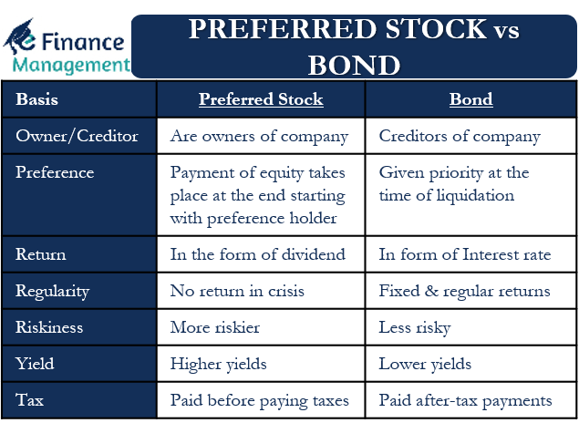

## Table of Contents

## What are preferred stocks?

Preferred stocks are a type of stock that companies issue to raise money. They are different from common stocks because they usually don't give you voting rights at shareholder meetings. Instead, preferred stocks offer a fixed dividend, which means you get a regular payment from the company. This makes them a bit like bonds, but they are still stocks and can go up or down in value.

One big advantage of preferred stocks is that they get paid their dividends before common stockholders. If a company is struggling and can't pay all its dividends, preferred stockholders get their money first. This makes preferred stocks less risky than common stocks, but they also usually don't grow in value as much. Because of this, they can be a good choice for people who want a steady income from their investments without too much risk.

## What are bonds?

Bonds are like IOUs that companies or governments issue to borrow money from investors. When you buy a bond, you are lending money to the issuer. In return, they promise to pay you back the amount you lent them, called the principal, on a specific date, known as the maturity date. They also pay you interest regularly, usually every six months, until the bond matures. This interest is called the coupon.

Bonds are considered safer investments than stocks because they provide a steady income through the interest payments and return your principal at the end. However, they can still lose value if the issuer runs into financial trouble or if interest rates rise. Different types of bonds exist, like government bonds, which are seen as very safe, and corporate bonds, which can be riskier but offer higher interest rates. Choosing bonds can be a good way to balance risk in your investment portfolio.

## How do preferred stocks differ from common stocks?

Preferred stocks and common stocks are both ways for companies to raise money, but they have some big differences. Preferred stocks usually don't give you the right to vote at shareholder meetings, while common stocks do. This means if you own preferred stocks, you won't have a say in how the company is run, but if you own common stocks, you can vote on important decisions.

Another big difference is how they pay dividends. Preferred stocks pay a fixed dividend, which means you get a regular payment that stays the same. This can be good if you want a steady income. Common stocks, on the other hand, might pay dividends, but the amount can change or stop altogether, depending on how well the company is doing. Also, if a company is in trouble and can't pay all its dividends, preferred stockholders get paid before common stockholders, making preferred stocks a bit safer but with less chance for big growth in value.

## What are the key differences between preferred stocks and bonds?

Preferred stocks and bonds are both ways to invest your money, but they work differently. Preferred stocks are a type of stock that companies issue. When you buy preferred stocks, you become a part-owner of the company, but you don't get to vote on company decisions like common stock owners do. Instead, you get a fixed dividend, which is like a regular payment from the company. If the company gets into financial trouble, preferred stockholders get paid their dividends before common stockholders, but they still have to wait behind bondholders.

Bonds, on the other hand, are like loans you give to a company or government. When you buy a bond, you're lending money to the issuer, and they promise to pay you back the full amount, called the principal, on a set date. They also pay you interest, called the coupon, usually every six months until the bond matures. Bonds are seen as safer than stocks because you get regular interest payments and your money back at the end, but they can still lose value if the issuer runs into trouble or if interest rates go up.

## What are the typical yields offered by preferred stocks and bonds?

Preferred stocks usually offer higher yields than bonds. The yield on preferred stocks can be around 5% to 7%, but this can change based on the company and the economy. They are seen as riskier than bonds, so they need to offer more to attract investors. If a company is doing well, its preferred stocks might give you a good, steady income. But if the company runs into trouble, the value of the preferred stocks could drop, and you might not get your dividends.

Bonds, on the other hand, often have lower yields. Government bonds might give you around 2% to 3%, while corporate bonds could offer 3% to 5%, depending on how safe the company is. Bonds are seen as safer because you get your money back at the end, plus regular interest payments. But if interest rates go up, the value of your bonds might go down. So, while bonds are less risky, they also usually don't give you as much income as preferred stocks.

## How does the risk profile of preferred stocks compare to bonds?

Preferred stocks are riskier than bonds. When you buy preferred stocks, you own a part of the company, but you don't have a say in how it's run. You get a fixed dividend, which is like getting paid regularly. But if the company runs into trouble, the value of your preferred stocks can go down, and you might not get your dividends. Preferred stocks are paid before common stocks if a company can't pay all its dividends, but they still get paid after bondholders. This makes them riskier than bonds but safer than common stocks.

Bonds are seen as safer investments. When you buy a bond, you're lending money to a company or government. They promise to pay you back the full amount you lent them on a set date, and they also pay you interest regularly. If the company or government gets into financial trouble, bondholders get paid before anyone else, including preferred stockholders. But bonds can still lose value if interest rates go up or if the issuer has serious financial problems. So while bonds are less risky, they also usually offer lower returns than preferred stocks.

## What are the tax implications of investing in preferred stocks versus bonds?

When you invest in preferred stocks, the dividends you get are usually taxed as regular income. This means they could be taxed at a higher rate than other types of investment income, depending on your tax bracket. But sometimes, if the company pays what's called a "qualified dividend," it might be taxed at a lower rate, like capital gains. So it's a good idea to check if the preferred stock you're looking at offers qualified dividends to see how it might affect your taxes.

Bonds, on the other hand, can have different tax rules depending on the type of bond. If you buy corporate bonds, the interest you get is taxed as regular income, just like preferred stock dividends. But if you buy government bonds, like those from the U.S. Treasury, the interest is only taxed at the federal level and not by your state or local government. This can be a big advantage if you live in a place with high state taxes. So, when choosing between preferred stocks and bonds, think about how the taxes might affect your overall return.

## How does the liquidity of preferred stocks compare to that of bonds?

Preferred stocks are usually less liquid than bonds. This means it can be harder to sell your preferred stocks quickly if you need to. Not as many people trade preferred stocks every day, so there might not be a lot of buyers when you want to sell. This can make it take longer to sell your preferred stocks and might mean you get less money for them than you hoped.

Bonds, especially government bonds, tend to be more liquid. There are usually more buyers and sellers in the bond market, so you can often sell your bonds faster and closer to the price you want. This is especially true for bonds from the U.S. Treasury or big companies. But some corporate bonds might be less liquid if they are from smaller companies or if they are not traded as often. So, if you need to get your money back quickly, bonds might be a better choice than preferred stocks.

## What role do preferred stocks and bonds play in a diversified investment portfolio?

Preferred stocks and bonds both help make your investment portfolio more balanced. Preferred stocks give you a steady income because they pay a fixed dividend. This can be good if you want money coming in regularly without the ups and downs of common stocks. But they are riskier than bonds because if the company has money problems, you might not get your dividends. So, adding preferred stocks to your portfolio can give you more income and a bit more risk, helping to spread out where your money is.

Bonds are usually safer than preferred stocks. When you buy bonds, you're lending money to a company or government, and they pay you back with interest. This makes bonds good for keeping your money safe while still getting some income. Adding bonds to your portfolio can lower the overall risk because they don't go up and down in value as much as stocks. By having both preferred stocks and bonds, you can balance the risk and reward in your investments, making your portfolio more stable and ready for different economic situations.

## How do the voting rights of preferred stocks compare to those of bonds?

Preferred stocks and bonds both don't give you the right to vote at shareholder meetings. When you buy preferred stocks, you're a part-owner of the company, but you don't get to vote on how the company is run. This is different from common stocks, where owners can vote on important decisions. So, even though you own a piece of the company with preferred stocks, you don't have a say in its management.

Bonds are like loans you give to a company or government. When you buy a bond, you're not an owner at all, you're just a lender. Because you're not an owner, you don't get any voting rights. You just get your interest payments and your money back at the end. So, both preferred stocks and bonds keep you out of the company's decision-making process, but for different reasons.

## What are the callable features of preferred stocks and how do they compare to bond callable features?

Preferred stocks often come with a callable feature, which means the company can buy them back from you before they reach their maturity date. This usually happens if interest rates go down, and the company wants to issue new preferred stocks at a lower rate to save money. If your preferred stocks get called, you get your money back, but you might have to find a new place to invest it, which could be hard if rates are lower.

Bonds can also be callable, and it works in a similar way. The issuer of the bond, like a company or government, can decide to pay you back early if it's good for them, usually when interest rates drop. When a bond is called, you get your principal back, but you lose out on future interest payments. The big difference is that bonds often have a set call date, while preferred stocks might be callable at any time after a certain period. So, both can be called, but the timing and impact can be a bit different.

## How do changes in interest rates affect the prices of preferred stocks and bonds differently?

When interest rates go up, the prices of both preferred stocks and bonds usually go down. This happens because new bonds and preferred stocks that are issued will have higher interest rates, making the older ones with lower rates less attractive. So, if you want to sell your existing bonds or preferred stocks, you might have to lower the price to make them more appealing to buyers. But, the effect can be a bit different for preferred stocks and bonds.

For bonds, the price drop can be more noticeable because their value is more tied to interest rates. Bonds have a fixed interest payment, called the coupon, so when rates go up, the value of that fixed payment goes down compared to new bonds. Preferred stocks also have a fixed dividend, but they are a bit like stocks too, so their prices can be influenced by how well the company is doing, not just interest rates. So, while both go down when rates rise, bonds might feel the impact more strongly because they are more sensitive to [interest rate](/wiki/interest-rate-trading-strategies) changes.

## References & Further Reading

[1]: Bodie, Z., Kane, A., & Marcus, A. J. (2013). ["Investments"](https://books.google.com/books/about/EBOOK_Investments_Global_edition.html?id=BMsvEAAAQBAJ) (10th ed.). McGraw-Hill Education.

[2]: Fabozzi, F. J. (2012). ["Bond Markets, Analysis, and Strategies"](https://books.google.com/books/about/Bond_Markets_Analysis_and_Strategies_ten.html?id=bQpNEAAAQBAJ) (8th ed.). Pearson.

[3]: BlackRock. ["Understanding Preferred Securities"](https://www.blackrock.com/us/individual/literature/product-brief/preferred-stocks-diversify-your-income-sources-pff-brochure.pdf).

[4]: Lopez de Prado, M. (2018). ["Advances in Financial Machine Learning"](https://www.amazon.com/Advances-Financial-Machine-Learning-Marcos/dp/1119482089). Wiley.

[5]: Chan, E. (2009). ["Quantitative Trading: How to Build Your Own Algorithmic Trading Business"](https://github.com/ftvision/quant_trading_echan_book). John Wiley & Sons.

[6]: Kissell, R. (editor) (2013). ["The Science of Algorithmic Trading and Portfolio Management"](https://www.sciencedirect.com/book/9780124016897/the-science-of-algorithmic-trading-and-portfolio-management). Academic Press.