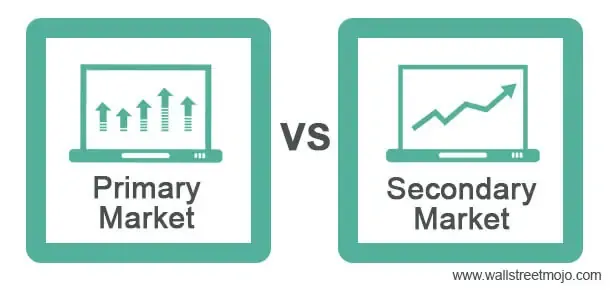

The world of financial markets is vast and complex, encompassing various platforms, instruments, and participants. Central to these markets are the primary and secondary markets, which serve as foundational pillars in the progression of financial exchanges and economic growth. The primary market is where new securities are issued directly by companies to investors, providing issuers with the necessary capital for expansion and development. In contrast, the secondary market facilitates the trading of existing securities among investors, contributing to market liquidity and efficient price discovery.

Understanding these key components is crucial for anyone involved in finance, as they provide the framework within which capital flows and investment opportunities arise. The interplay between these markets ensures the efficient functioning of financial systems, impacting everything from corporate financing to individual investment strategies.



Moreover, with the advent of technology, algorithmic trading has emerged as a significant force in financial markets. This form of trading employs complex algorithms and computer programs to execute trades based on pre-set criteria, enhancing trading efficiency and reducing the influence of human emotions. Algorithmic trading not only optimizes the execution speeds of trades but also allows market participants to manage large orders and minimize trading costs through automated strategies.

In this article, we explore the nuances of primary and secondary markets, examining their unique roles and interdependencies. Additionally, we consider the impact of algorithmic trading in modern finance, highlighting its benefits and potential challenges. By gaining insights into these elements, individuals and institutions can better navigate the intricacies of financial markets and optimize their investment decisions.

## Table of Contents

## Understanding the Primary Market

The primary market, a cornerstone of the financial markets, is where new securities are born. In this market, companies can issue new stocks and bonds to the public in their quest for raising capital. This process is crucial for businesses aiming to finance expansion projects, repay debts, or improve operational efficiency.

One of the most prominent activities in the primary market is the Initial Public Offering (IPO). During an IPO, a company offers its shares to the public for the first time, transitioning from a privately-held entity to a publicly-traded company. This event not only marks a significant milestone for the company but also provides a unique opportunity for investors to acquire ownership stakes directly from the issuer. 

When participating in the primary market, investors typically engage with investment banks or other financial institutions that act as underwriters. These underwriters play an essential role by purchasing the initial offering and then selling shares to the public, which helps to set the initial price and manage the process's complexities.

The capital raised in the primary market provides issuers with the vital funding needed to pursue growth strategies, research and development, and other corporate objectives. This direct infusion of capital is distinct from the mechanisms of the secondary market, where previously-issued securities are bought and sold among investors. The primary market's role is thus instrumental in fortifying a company's financial foundation and facilitating broader economic development.

Understanding this market's dynamics and its operations is crucial for investors and companies alike, as it sets the stage for the subsequent interaction of securities in the secondary market.

## The Role of the Secondary Market

The secondary market is a critical component of the financial markets, where securities that have been initially sold in the primary market are subsequently traded among investors. This market comprises several stock exchanges, the most notable being the New York Stock Exchange (NYSE) and the NASDAQ. The primary function of the secondary market is to provide [liquidity](/wiki/liquidity-risk-premium), ensuring that securities can be easily bought and sold by investors. This liquidity facilitates a dynamic trading environment and is vital for the mechanism of price discovery, where the market determines the value of a security through supply and demand dynamics.

Trading in the secondary market occurs when investors engage in buying and selling securities. Unlike the primary market, where transactions involve the issuer and result in new capital being raised, trades in the secondary market are investor-to-investor, meaning no new capital is raised for the issuer. Instead, investors trade existing securities, thereby contributing to market liquidity. This liquidity is crucial as it allows investors to quickly convert their securities into cash and vice versa, reducing the risk associated with long holding periods.

Stock exchanges play a central role in the secondary market by providing a platform for these trades. They offer a regulated environment where transactions are conducted in a transparent and orderly manner. The presence of multiple buyers and sellers leads to competitive pricing, which aids in the accurate valuation of securities. Furthermore, exchanges impose rules and regulations to protect investors and ensure fair trading practices.

The dynamics of the secondary market are governed by various factors, including investor sentiment, macroeconomic indicators, corporate performance, and geopolitical events. These elements collectively influence the supply and demand for securities, thereby impacting their prices. In this market, price discovery occurs as investors assimilate information and adjust their valuations and expectations accordingly.

Overall, the secondary market is instrumental in fostering an efficient capital market system by enabling liquidity, facilitating an active trading environment, and aiding in the price discovery process. These functions collectively enhance investor confidence, which is essential for the healthy functioning of the financial markets.

## Key Differences Between Primary and Secondary Markets

The primary market and the secondary market serve fundamental but distinct functions within financial markets. The primary market is the arena where securities are first issued. In this market, companies and governments create financial instruments that are sold directly to investors. This initial sale involves transactions that are crucial for providing the issuer with capital necessary for expansion, research and development, or debt repayment. A hallmark feature of the primary market is the Initial Public Offering (IPO), wherein a company sells its shares to public investors for the first time. Another aspect of the primary market is the issuance of bonds, which are utilized to raise debt capital.

In contrast, the secondary market is where pre-existing securities are bought and sold among investors. Unlike the primary market, transactions here do not involve the issuing entity. Instead, investors trade securities with one another, facilitating liquidity and enabling price discovery. Major stock exchanges, such as the New York Stock Exchange (NYSE) and the NASDAQ, epitomize the secondary market. The intrinsic value of the secondary market lies in its capacity to provide a platform for securities to be traded post-issuance, thus offering both liquidity for sellers and access for buyers who may have missed the initial issuance.

Key structural differences distinguish the primary from the secondary markets. In the primary market, underwriters play a critical role. These are financial intermediaries, often investment banks, that assess the value of the securities, determine the price, and in some cases, purchase the entire issue to resell it to the public. Their role is crucial in ensuring that the securities reach their intended audience effectively and at a fair market price.

The secondary market, on the other hand, is characterized by brokers and exchanges rather than underwriters. Brokers act as [agents](/wiki/agents) for buyers and sellers, ensuring the execution of trades in a competitive environment that helps establish the market-clearing price. The structure of exchanges further enhances transparency and efficiency by matching orders and maintaining organized trading systems.

Transactions in these markets also serve different financial purposes. In the primary market, capital raised directly benefits issuers, enabling companies to invest in growth opportunities. Conversely, the secondary market focuses on providing liquidity, allowing investors to enter and [exit](/wiki/exit-strategy) positions easily. This liquidity is pivotal for maintaining active investment markets and ensuring that securities remain attractive to a broad pool of investors.

Thus, understanding the primary and secondary markets and their interactions is essential for comprehending the full scope of financial market operations. They collectively ensure that capital flows efficiently between those who have it and those who need it, underpinning the broader economy.

 to Algorithmic Trading

Algorithmic trading, often referred to as algo-trading, leverages sophisticated computer programs to execute trading decisions based on a set of defined criteria. This method has revolutionized trading by increasing operational efficiency and minimizing human emotion's impact on decision-making processes. The essence of [algorithmic trading](/wiki/algorithmic-trading) lies in its ability to quickly analyze vast amounts of data and execute trades at speeds and frequencies beyond human capability.

In algorithmic trading, a series of instructions, or algorithms, are programmed to spot potential trading opportunities. These algorithms can handle multiple parameters simultaneously, such as timing, price, and quantity, thus capturing trading opportunities with precision. For instance, when a specific stock hits a desired price level, the algorithm will automatically execute the buy or sell order without requiring human intervention, ensuring that trades are implemented at the best possible price. This level of automation reduces latency and the likelihood of significant price changes during the execution of orders.

There are several strategies commonly employed in algorithmic trading. Trend-following strategies, one of the simplest and most popular, rely on following market [momentum](/wiki/momentum). This approach involves analyzing historical price data to identify trends and make buy or sell decisions based on that trend's sustainability. Trend-following does not require sophisticated predictive models but rather utilizes moving averages and channel breakouts to determine potential price movements.

Arbitrage strategies aim to capitalize on price discrepancies in different markets or instruments. With high-frequency trading systems, algorithms can exploit differences in asset prices across various exchanges or even within the same exchange by detecting and executing trades instantly. Arbitrage ensures market efficiency by equalizing prices across markets or instruments.

Another common algorithmic approach is trading on market inefficiencies. This strategy seeks to exploit inefficiencies or patterns in the market that algorithms can identify, such as mean reversion or statistical [arbitrage](/wiki/arbitrage). By analyzing historical and real-time data, algorithms can detect these inefficiencies and trigger trades accordingly, often before these opportunities are apparent to human traders.

Algorithmic trading continues to evolve with advancements in technology, such as [machine learning](/wiki/machine-learning) and [artificial intelligence](/wiki/ai-artificial-intelligence). These innovations enable more complex and adaptable trading strategies that can further enhance trading performance and efficiency.

## Benefits and Potential Pitfalls of Algo Trading

Algorithmic trading, often known as algo trading, offers numerous benefits that have made it a popular choice among traders and financial institutions. One of the primary advantages is the significant increase in execution speed. By leveraging computer algorithms, trades that might take a human trader minutes or even hours to execute can be completed in milliseconds. This rapid execution is crucial in markets where price movements can occur in fractions of a second, allowing traders to capitalize on fleeting opportunities that may arise in volatile market conditions.

Another key benefit of algo trading is the elimination of human biases from trading decisions. Human traders can be influenced by emotions, leading to decisions based on fear or greed. Algo trading systems, conversely, operate based on pre-set criteria and logical rules, ensuring that trades are executed objectively and consistently. This consistency is advantageous in maintaining disciplined trading strategies over time.

Moreover, algo trading is capable of executing strategies across different markets and instruments simultaneously. Algorithms can be programmed to scan various markets and asset classes for opportunities, allowing for diversified trading strategies that can optimize returns and manage risk more effectively.

Despite these advantages, algorithmic trading is not without its drawbacks. A significant risk associated with algo trading is the potential for over-optimization. Traders may design algorithms that perform exceptionally well on historical data, but these may fail in real-world conditions due to unforeseen market dynamics or changes in market structure—a phenomenon known as "curve fitting." This can lead to significant financial losses if the algorithm's assumptions do not hold in real-time trading.

Another pitfall is the potential for algorithm failures, which can occur due to coding errors or unexpected market conditions. For example, if an algorithm does not account for market liquidity, it may attempt to execute a trade that significantly impacts the price, leading to suboptimal execution or even market disruptions. Additionally, system malfunctions, such as software bugs or hardware failures, can exacerbate these risks, emphasizing the need for robust testing and risk management strategies.

In conclusion, while algorithmic trading enhances execution speed, consistency, and market reach, traders must be vigilant about over-optimization and algorithm reliability to mitigate potential financial risks. Understanding both the advantages and potential pitfalls is essential for successful implementation and management of algo trading strategies.

## The Integration of Algo Trading in Financial Markets

Algorithmic trading, often referred to as algo trading, has firmly established itself as a critical component in contemporary financial markets, largely due to its significant contribution to trading [volume](/wiki/volume-trading-strategy). In both primary and secondary markets, algorithmic trading enhances market dynamics by impacting liquidity and price discovery.

In the primary market, although the direct application of algo trading might initially seem limited, its integration is evident during specific phases such as the allocation process and pricing of new issues. Investment banks and financial institutions often employ algorithms to allocate shares during Initial Public Offerings (IPOs), ensuring an optimal distribution based on predetermined criteria that may include investor profiles, market demand, and strategic business relationships.

In secondary markets, algorithmic trading's influence is more pronounced. Traders and institutions utilize algorithms to execute large orders without causing significant market disruptions. Algorithms can break down large orders into smaller ones to minimize the impact on the stock's price – a technique known as "order slicing". This approach not only helps maintain market stability but also aids in achieving better execution prices.

Furthermore, algorithms facilitate high-frequency trading ([HFT](/wiki/high-frequency-trading-strategies)), a form of trading where large volumes of orders are processed at high speeds. This capability contributes to enhanced market liquidity as participants provide continuous buy and sell orders, which helps tighten bid-ask spreads. The increased liquidity ensures that investors can enter and exit positions more efficiently without adverse price movements.

For instance, consider a simple algorithm designed for arbitrage opportunities across different exchanges:

```python
def arbitrage_opportunity(price1, price2, threshold):
    if abs(price1 - price2) > threshold:
        if price1 > price2:
            return "Buy at Exchange 2, Sell at Exchange 1"
        else:
            return "Buy at Exchange 1, Sell at Exchange 2"
    return "No arbitrage opportunity"

price_exchange1 = 100.5
price_exchange2 = 99.7
threshold = 0.5

print(arbitrage_opportunity(price_exchange1, price_exchange2, threshold))
```

Such strategies enhance pricing efficiency by capitalizing on discrepancies between market prices, thus facilitating the process of price discovery. The efficiency brought about by algo trading strategies aids in narrowing the deviation of prices from their fair value, ultimately contributing to a more precise pricing mechanism in financial markets.

Moreover, algorithmic trading systems are pivotal in developing more sophisticated trading strategies. Institutions leverage advanced analytics and machine learning to evolve these algorithms, thereby refining trading strategies that improve market efficiency over time. These systems are capable of processing vast amounts of market data to identify trends, predict price movements, and execute trades with precision far beyond human capability.

In summary, the integration of algo trading in financial markets bolsters liquidity and enhances the accuracy of price discovery. By refining trading strategies and improving execution efficiency, algorithmic trading contributes significantly to the overall efficiency of financial markets.

## Conclusion

The primary and secondary markets serve as fundamental components of the financial ecosystem, each with its unique function and contribution. The primary market is the birthplace of securities, allowing companies to raise capital directly from investors by issuing new stocks and bonds. This capital injection is pivotal for business growth and expansion. Conversely, the secondary market provides a platform for the trading of these securities among investors, fostering liquidity, price discovery, and market dynamism. The interplay between these markets ensures the seamless passage of financial assets and resources.

Algorithmic trading has profoundly transformed trading practices, enhancing both the efficiency and complexity of transactions. By deploying computer algorithms to execute trades at optimal times based on predetermined strategies, algo trading minimizes human error, reduces biases, and captures fleeting market opportunities. While it offers substantial advantages, such as speed and consistency, it also brings challenges, including potential algorithm failures and over-optimization which can cause market disruptions.

A thorough comprehension of primary and secondary markets, along with their interaction with algorithmic trading, is essential for anyone involved in finance. Mastery of these elements enables one to navigate the intricate landscape of financial markets effectively, leveraging their dynamic nature to achieve strategic investment objectives.

## References & Further Reading

[1]: ["Handbook of Financial Markets: Dynamics and Evolution"](https://www.sciencedirect.com/book/9780123742582/handbook-of-financial-markets-dynamics-and-evolution) by Thorsten Hens and Klaus Reiner Schenk-Hoppé

[2]: Madhavan, A. (2000). ["Market Microstructure: A Survey."](https://www.sciencedirect.com/science/article/pii/S1386418100000070) Journal of Financial Markets, 3(3), 205-258.

[3]: Hasbrouck, J. (2007). ["Empirical Market Microstructure: The Institutions, Economics, and Econometrics of Securities Trading."](https://academic.oup.com/book/52241) Oxford University Press.

[4]: ["Algorithmic Trading: Winning Strategies and Their Rationale"](https://play.google.com/store/books/details/Algorithmic_Trading_Winning_Strategies_and_Their_R?id=CIwCTVqEj4oC&hl=en-US) by Ernest P. Chan

[5]: Hendershott, T., Jones, C. M., & Menkveld, A. J. (2011). ["Does Algorithmic Trading Improve Liquidity?"](https://onlinelibrary.wiley.com/doi/full/10.1111/j.1540-6261.2010.01624.x) The Review of Financial Studies, 24(5), 1465-1489.

[6]: Aldridge, I. (2013). ["High-Frequency Trading: A Practical Guide to Algorithmic Strategies and Trading Systems"](https://onlinelibrary.wiley.com/doi/pdf/10.1002/9781119203803.fmatter) by Wiley.