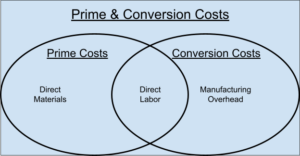

## Table of Contents

## What are prime costs?

Prime costs are the direct costs of making a product. This includes the cost of materials that go into the product and the labor needed to make it. For example, if you are making a wooden table, the wood and the wages of the carpenter are part of the prime costs.

These costs are important for businesses because they help figure out the total cost of production. By knowing the prime costs, a company can set the right price for their product to make sure they cover these costs and make a profit. It's a key part of managing a business and keeping track of expenses.

## What are conversion costs?

Conversion costs are the costs a business spends to turn raw materials into finished products. This includes the cost of labor to make the product and any other costs like the electricity used by machines. These costs are important because they help a business understand how much it costs to change materials into something they can sell.

For example, if a company makes bicycles, the conversion costs would include the wages of the workers who assemble the bikes and the cost of running the factory. By knowing these costs, a business can figure out the total cost of making each bicycle and set a price that covers these costs and makes a profit.

## How do prime costs and conversion costs differ?

Prime costs and conversion costs are two different ways to look at the costs of making a product. Prime costs are the direct costs of making something. This means the cost of the materials that go into the product and the labor needed to make it. For example, if you're making a cake, the flour, eggs, and the baker's time are part of the prime costs.

Conversion costs, on the other hand, focus on the costs of turning raw materials into a finished product. This includes the labor to make the product and other costs like electricity for machines. Using the cake example again, conversion costs would include the baker's time and the cost of running the oven. 

So, the main difference is that prime costs include both materials and labor, while conversion costs include labor and other production costs but not the materials themselves. Both are important for a business to understand how much it costs to make their products and to set the right prices.

## What components make up prime costs?

Prime costs are the costs that you can easily see and connect to making a product. They have two main parts: the cost of the materials you use and the cost of the labor to make the product. For example, if you are making a pizza, the dough, sauce, and cheese are the material costs, and the time the chef spends making the pizza is the labor cost.

These two parts together help a business figure out how much it costs to make each item they sell. By knowing the prime costs, a company can set prices that cover these costs and still make a profit. It's important for businesses to keep track of these costs to manage their money well and stay successful.

## What components make up conversion costs?

Conversion costs are the costs a business pays to change raw materials into finished products. These costs include two main parts: the labor to make the product and other costs like running machines or using electricity. For example, if a company makes shoes, the conversion costs would include the wages of the workers who sew the shoes and the cost of the electricity used by the sewing machines.

Knowing the conversion costs helps a business figure out the total cost of making each product. By understanding these costs, a company can set prices that cover all the expenses and still make a profit. It's important for businesses to keep track of conversion costs to manage their money well and stay successful.

## Can you give examples of prime costs in a manufacturing setting?

In a manufacturing setting, prime costs include the direct costs of making a product. For example, if a company makes bicycles, the prime costs would include the cost of the metal used to make the frames and the wages of the workers who assemble the bicycles. These are the costs you can easily see and connect to the product.

Another example is a furniture maker. The prime costs for making a wooden table would be the cost of the wood and the wages of the carpenter who builds the table. By knowing these prime costs, the company can figure out how much it costs to make each table and set a price that covers these costs and makes a profit.

## Can you give examples of conversion costs in a manufacturing setting?

In a manufacturing setting, conversion costs are the costs to turn raw materials into finished products. For example, if a company makes cars, the conversion costs would include the wages of the workers who assemble the cars and the cost of electricity to run the assembly line machines. These costs help the company understand how much it spends to make each car, not counting the cost of the raw materials like steel and glass.

Another example is a bakery that makes bread. The conversion costs would include the wages of the bakers who mix the dough and bake the bread, and the cost of running the ovens. By knowing these costs, the bakery can figure out how much it costs to make each loaf of bread, which helps them set prices that cover all their expenses and make a profit.

## How do businesses use prime costs in their financial analysis?

Businesses use prime costs to understand the basic costs of making their products. Prime costs include the cost of materials and the labor needed to make something. By knowing these costs, a company can figure out how much it costs to make each item they sell. This helps them set prices that cover these costs and still make a profit. For example, if a company makes toys, they would look at the cost of the plastic and the wages of the workers who make the toys to find out their prime costs.

Prime costs are also important for financial planning and budgeting. Companies use these costs to see if they can make their products cheaper. They might find ways to buy materials at a lower price or make the work more efficient. This helps them save money and be more competitive. By keeping track of prime costs, a business can make better decisions about how to spend their money and grow their business.

## How do businesses use conversion costs in their financial analysis?

Businesses use conversion costs to understand how much it costs to turn raw materials into finished products. Conversion costs include the labor to make the product and other costs like running machines or using electricity. For example, if a company makes clothes, the conversion costs would include the wages of the workers who sew the clothes and the cost of running the sewing machines. By knowing these costs, a business can figure out the total cost of making each item they sell.

Understanding conversion costs helps businesses set prices that cover all their expenses and make a profit. It also helps them plan their budget and find ways to save money. For example, a company might look for ways to make their machines use less electricity or find ways to make the work faster. By keeping track of conversion costs, a business can make better decisions about how to spend their money and grow their business.

## What impact do prime costs have on product pricing?

Prime costs are important for setting the price of a product. They include the cost of the materials used to make the product and the labor needed to put it together. For example, if a company makes toys, the plastic and the time the workers spend making the toys are the prime costs. By knowing these costs, a business can make sure the price they set for each toy covers what it cost to make it. If the price is too low, the company might lose money. If it's too high, customers might not buy the toys.

Setting the right price helps a business make a profit. If a company knows its prime costs, it can add a little extra to the price to make money. For example, if it costs $5 in materials and labor to make a toy, the company might sell it for $7 to cover the costs and make a $2 profit. By keeping track of prime costs, a business can change prices when costs go up or down. This helps them stay competitive and keep making money.

## What impact do conversion costs have on product pricing?

Conversion costs are important for setting the price of a product. They include the cost of labor to make the product and other costs like running machines or using electricity. For example, if a company makes shoes, the conversion costs would be the wages of the workers who sew the shoes and the cost of the electricity for the sewing machines. By knowing these costs, a business can figure out how much it costs to make each pair of shoes. This helps them set a price that covers these costs and still makes a profit. If the price is too low, the company might lose money, and if it's too high, customers might not buy the shoes.

Understanding conversion costs also helps a business plan and save money. If they know how much it costs to make each product, they can look for ways to make it cheaper. For example, they might find a way to use less electricity or make the work faster. By keeping track of conversion costs, a business can change prices when costs go up or down. This helps them stay competitive and keep making money.

## How can a company optimize both prime costs and conversion costs to improve profitability?

A company can optimize prime costs by finding cheaper materials and making the work more efficient. For example, they might buy materials in bulk to get a better price or find a new supplier that offers lower costs. They can also train their workers to make the product faster or use machines to help with the work. By doing these things, the company can lower the cost of materials and labor, which are the prime costs. This means they can make more money on each product they sell because their costs are lower.

To optimize conversion costs, a company can look for ways to save on labor and other production costs. They might use machines that use less electricity or find ways to make the work faster. For example, they could change the way the factory is set up to make it easier for workers to move around and do their jobs. By saving on these costs, the company can lower the total cost of making each product. This helps them set a price that covers all their costs and still makes a good profit.

By working on both prime costs and conversion costs, a company can make their products cheaper to make. This means they can either lower the price to sell more products or keep the price the same and make more profit on each sale. Either way, optimizing these costs helps the company be more successful and grow their business.

## What is Understanding Prime Costs?

Prime costs are defined as the direct expenses incurred during the production of goods or services, primarily encompassing direct materials and direct labor costs. These costs are critical as they are directly attributable to the creation of a product, allowing businesses to assess the immediate input costs necessary for production. Understanding prime costs is essential for determining the contribution margin, which is a key indicator of a company's ability to cover its fixed costs and achieve profitability.

Direct materials are the raw inputs that become an integral part of the final product. For instance, in the manufacturing of a piece of furniture, the wood, nails, and fabric are considered direct materials. These materials are indispensable and quantifiable within the production process, making them significant when computing prime costs.

Direct labor refers to the wages of employees who are directly involved in creating the product. This includes the costs associated with the time and effort of workers on the production line who transform raw materials into finished goods. For example, the wages of carpenters working to build a chair fall under direct labor costs. These costs are easily assignable to specific units of production, providing clear insights into the labor resources consumed during manufacturing.

To calculate prime costs, one can use the following formula:

$$
\text{Prime Costs} = \text{Direct Materials} + \text{Direct Labor}
$$

This formula highlights the simplicity and direct nature of prime costs, focusing solely on the immediate resources used in production. By analyzing prime costs, businesses can gain a better understanding of their production expense structure, enabling more effective pricing strategies and financial planning.

## What is the cost comparison between Prime and Conversion Costs?

Prime costs and conversion costs are both essential metrics in evaluating production efficiency, yet they serve distinct functions. When analyzing prime costs, the focus is on direct input costs that include direct materials and direct labor. These costs are explicitly associated with the creation of goods, making them pivotal for determining pricing strategies. The formula for calculating prime costs is straightforward:

$$
\text{Prime Costs} = \text{Direct Materials} + \text{Direct Labor}
$$

By concentrating on direct input expenses, businesses can more accurately assess the cost incurred in manufacturing each unit, thereby facilitating more informed pricing decisions. For example, understanding prime costs enables manufacturers to set competitive prices that cover costs while yielding a profit margin.

Conversely, conversion costs account for both direct labor and manufacturing overheads required to transform raw materials into finished products. Unlike prime costs, which are tied to specific units, conversion costs encompass broader operational expenses that support the manufacturing process. These can include costs such as factory utilities, equipment depreciation, and maintenance. The formula for conversion costs is expressed as:

$$
\text{Conversion Costs} = \text{Direct Labor} + \text{Manufacturing Overheads}
$$

Conversion costs are instrumental in identifying areas of inefficiency and waste within the production process. By focusing on overheads, businesses can pinpoint operations that require streamlining or optimization, potentially leading to significant cost savings.

In summary, while prime costs are integral for establishing pricing strategies by evaluating direct input costs, conversion costs are crucial for operational efficiency through scrutinizing manufacturing overheads. Understanding the nuances between these two types of costs enables firms to optimize both product pricing and production processes, ultimately enhancing overall profitability.

## References & Further Reading

[1]: ["Cost Accounting: A Managerial Emphasis"](https://archive.org/details/20240317_20240317_0811) by Charles T. Horngren, Srikant M. Datar, and Madhav V. Rajan

[2]: ["Management and Cost Accounting"](https://www.forbes.com/advisor/business/what-is-cost-accounting/) by Colin Drury

[3]: ["Advances in Financial Machine Learning"](https://www.amazon.com/Advances-Financial-Machine-Learning-Marcos/dp/1119482089) by Marcos Lopez de Prado

[4]: ["Algorithmic Trading: Winning Strategies and Their Rationale"](https://books.google.com/books/about/Algorithmic_Trading.html?id=WAlFDwAAQBAJ) by Ernest P. Chan

[5]: ["Machine Learning for Algorithmic Trading"](https://github.com/PacktPublishing/Machine-Learning-for-Algorithmic-Trading-Second-Edition) by Stefan Jansen