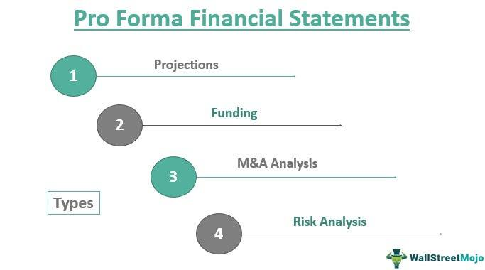

In the world of finance, understanding the nuances between different financial statements is crucial for making informed decisions. Financial statements are the backbone of reporting, serving as a key source of information to investors, regulators, and other stakeholders. Among these, Generally Accepted Accounting Principles (GAAP) statements and pro forma statements stand out due to their distinct methodologies and purposes. This article explores the differences between pro forma statements and GAAP statements, with a focus on their implications in financial reporting.

GAAP statements are founded on strict accounting rules that ensure consistency in reporting financial performance. They provide a historical record of a company's financial health, enabling stakeholders to gauge performance accurately. In contrast, pro forma statements introduce flexibility, allowing companies to adjust figures to present a potentially more accurate depiction of financial status by excluding non-recurring or extraordinary items. This flexibility, however, comes with increased scrutiny due to the potential for manipulation.



We will also explore how algorithmic trading can leverage these financial statements for better decision-making. Algorithmic trading, driven by complex mathematical models and statistical analyses, depends heavily on accurate and comprehensive data inputs from financial statements. By integrating information from both GAAP and pro forma statements, traders can gain insights into a company's real-time financial health and predicted future performance.

In today's fast-paced financial markets, differentiating between the two types of statements can provide an edge to investors and companies alike. Investors who can adeptly navigate these financial reports are better positioned to assess a company's genuine worth, while companies that master the art of transparent and strategic reporting can enhance their credibility and market standing.

Let's explore the intricacies of financial reporting and the strategic role of algorithmic trading, to understand how these financial tools can be utilized to achieve informed and strategic decision-making in a competitive financial environment.

## Table of Contents

## Understanding GAAP Statements

Generally Accepted Accounting Principles (GAAP) are a foundational element in the financial reporting framework within the United States. These principles are established with the primary objective of ensuring consistency and comparability across financial statements, thereby facilitating a standardized approach to financial reporting. Adherence to GAAP is not merely a recommendation but a requirement for publicly traded companies in the United States, as it is mandated by the Securities and Exchange Commission (SEC).

GAAP encompasses a broad array of accounting standards, conventions, and rules that govern the preparation of financial statements. The primary focus of GAAP statements is historical financial data, capturing a snapshot of a company’s financial condition at a specific point in time. The historical nature of these statements is intended to provide accountants, investors, and other stakeholders with a clear and accurate depiction of the company's financial health and performance.

One of the key characteristics of GAAP is its emphasis on accuracy and adherence to universally applicable standards. This emphasis is reflected in the structured format that GAAP mandates for financial statements, which typically include the balance sheet, income statement, statement of cash flows, and statement of shareholders' equity. Each of these components serves a distinct purpose in conveying the financial story of the company and must adhere to GAAP standards, covering aspects such as revenue recognition, expense matching, and disclosure requirements.

The rigor of GAAP can also be seen in its detailed rules and frameworks. For instance, one such rule is the Revenue Recognition Principle, which dictates that revenue should be recognized only when it is earned and realizable, aligning with specific criteria that ensure revenues and expenses are matched in the period they are incurred. Such rules are crucial for preparing financial statements that truly reflect the economic reality of a company’s operations.

In terms of applicability, while GAAP is a statutory requirement for public companies, many private companies in the U.S. also choose to follow these standards. The rationale behind this voluntary compliance often relates to the pursuit of uniformity and transparency, which can enhance the credibility of the company’s financial statements in the eyes of investors, lenders, and other external parties.

Understanding and application of GAAP are not static; they evolve in response to changes in business practices and economic conditions. The Financial Accounting Standards Board (FASB) is the body responsible for issuing and updating GAAP standards. This involves a continuous process of review and revision to accommodate new financial products and complex transactions that accompany modern business environments.

In summary, GAAP statements serve as a crucial tool for communicating the financial status of a company. Their focus on historical data, strict adherence to rules, and requirement for transparency make them invaluable for investors and other stakeholders who rely on these reports for making informed financial decisions.

## Exploring Pro Forma Statements

Pro forma statements offer a flexible approach to financial reporting by adjusting GAAP figures to offer what some perceive as a 'truer' financial picture. These adjustments allow companies to exclude certain non-recurring costs, such as restructuring charges or litigation expenses, which may distort results in a particular period. By eliminating these expenditures, pro forma statements aim to reflect the company's ongoing financial performance more accurately.

These statements are particularly useful in situations requiring financial projections or analysis of hypothetical scenarios. For instance, during mergers and acquisitions, companies often use pro forma statements to simulate the impact of the acquisition on future financial performance. They provide a view of how the combined companies might perform by adjusting the financial figures to include potential synergies and exclude one-time costs related to the transaction.

Despite their potential benefits, the adaptability of pro forma statements also introduces the risk of manipulation. Companies might unjustifiably exclude charges that would ordinarily affect profitability, presenting an overly optimistic view of financial health. This possibility highlights the need for cautious interpretation of pro forma statements. Investors and analysts must critically evaluate the adjustments made and consider whether they truly represent non-recurring items.

The strategic use of pro forma statements requires a delicate balance between transparency and discretion. Companies must ensure that adjustments are justified and clearly communicated to stakeholders. This not only fosters trust but also aligns the reported financial performance with the company's operational reality. Consequently, while pro forma statements can offer valuable insights, they must be used responsibly to avoid misleading stakeholders and ensuring ethical financial reporting.

## Algorithmic Trading and Financial Statements

Algorithmic trading, a facet of modern finance, utilizes advanced data analysis to execute trades based on predefined criteria. This form of trading hinges on the availability and accuracy of financial data, with GAAP and pro forma financial statements playing pivotal roles.

GAAP statements, with their standardized and audited financial data, offer algorithmic traders a reliable baseline for evaluating a company's financial health. By focusing on historical data and strictly adhering to accounting standards, these statements provide algorithms with a consistent and accurate portrayal of a company's past performance. This information is crucial for assessing a company's value and generating trading signals based on historical financial metrics and trends.

Pro forma statements, on the other hand, allow for a more flexible approach to financial analysis by reflecting potential future scenarios. These statements often contain adjustments that exclude non-recurring charges, presenting a modified view of a company's financial standing. For [algorithmic trading](/wiki/algorithmic-trading), pro forma statements can be invaluable for predictive models, as they offer insights into potential future performance. The forward-looking aspect of pro forma statements is particularly advantageous in developing algorithms that rely on predictive analytics and [machine learning](/wiki/machine-learning) models. For instance, incorporating these statements into a machine learning pipeline can enhance the model's ability to identify trading opportunities or risks that might not be apparent from GAAP data alone.

Understanding the specific adjustments made in pro forma statements is crucial for algorithms to assess the underlying health of a company accurately. To this end, algorithmic trading systems must be equipped to parse these statements carefully, distinguishing between adjustments that genuinely reflect operational improvements and those that could obscure financial realities. This involves incorporating mechanisms to detect and adjust for potential biases in pro forma data.

Here is a simple example of how pro forma adjustments might be implemented in a Python-based algorithmic trading model:

```python
import pandas as pd

# Sample GAAP and Pro Forma data
gaap_data = {'Revenue': 1000000, 'Non_Recurring_Charge': 50000, 'Net_Income': 150000}
pro_forma_data = {'Revenue': 1000000, 'Net_Income': 200000}  # Excluding non-recurring charge

# Creating DataFrames
gaap_df = pd.DataFrame([gaap_data])
pro_forma_df = pd.DataFrame([pro_forma_data])

# Computing adjustments
adjusted_net_income = pro_forma_df['Net_Income'][0] - gaap_df['Net_Income'][0]

# Simple condition check for potential discrepancies
if adjusted_net_income > 0:
    print("Pro Forma Adjustments Detected:", adjusted_net_income)
else:
    print("No Significant Pro Forma Adjustments")

# Output: Pro Forma Adjustments Detected: 50000
```

This simple illustration underscores the importance of monitoring and understanding adjustments made in pro forma statements. While the flexibility of pro forma data can offer strategic insights, the risks associated with its potential for manipulation necessitate robust algorithmic strategies to ensure reliability and transparency in trading decisions. Ultimately, a comprehensive approach that combines the objectivity of GAAP and the forward-looking nature of pro forma statements can enhance decision-making and performance in algorithmic trading.

## Special Considerations

Pro forma statements, though useful, present certain challenges and risks that necessitate careful consideration. One significant concern is their potential for manipulation. Companies might exclude recurring charges or operational costs, such as maintenance expenses or regular operational inefficiencies, in an attempt to portray a more favorable financial position than actually exists. This selective exclusion can distort a company's financial health, leading to misinterpretation by investors and stakeholders.

Discrepancies between GAAP and pro forma statements are common, and these require careful scrutiny. GAAP provides a consistent, historical view of financial data with a strict adherence to established accounting standards. In contrast, pro forma statements offer flexibility and sometimes, this leads to an exaggerated portrayal of future performance by excluding unfavorable items. Such differences may cause confusion and misinterpretation, especially when investors are not fully aware of the adjustments made in pro forma statements. This potential mismatch underscores the need for investors to conduct a detailed analysis when evaluating both types of financial reports.

Regulatory bodies, like the Securities and Exchange Commission (SEC), recognize the risks posed by potentially misleading pro forma reporting. The SEC requires companies to reconcile pro forma statements to their GAAP counterparts, promoting transparency and preventing misleading practices. Despite these regulations, investors must remain vigilant and critically assess the adjustments made in pro forma disclosures to safeguard their interests.

For companies, consistency in reporting and adherence to ethical standards are crucial in preserving their credibility with stakeholders. Transparent and honest reporting practices not only enhance the company's reputation but also instill investor confidence. Striking the right balance in reporting practices is essential; companies should transparently explain the rationale behind adjustments made in pro forma statements to ensure clarity and integrity.

In conclusion, understanding the inherent differences and potential pitfalls of both GAAP and pro forma statements is crucial. A nuanced approach enhances strategic decision-making, allowing investors and companies to make informed decisions grounded in a comprehensive view of financial data. This understanding is essential in navigating the complex landscape of financial reporting and maintaining market integrity.

## Conclusion

Pro forma and GAAP statements each have unique advantages and limitations in financial reporting. GAAP statements, with their focus on consistency and adherence to standardized rules, offer a reliable and comprehensive view of a company's financial status. This objectivity is particularly valuable for algorithmic traders, as it provides a stable basis for constructing trading models and strategies that rely on historical financial data.

In contrast, pro forma statements cater to financial flexibility by allowing adjustments that can illustrate a more nuanced picture of a company's future potential. This flexibility can be beneficial for algorithmic trading models that depend on forecasts and scenario analyses, providing insights that can enhance predictive accuracy. However, it is imperative for companies to approach pro forma adjustments with caution, ensuring that any exclusions or modifications are justified and transparent. This careful approach helps maintain investor trust and market integrity.

Transparent reporting practices are crucial in empowering investors and maintaining market credibility. Investors must be equipped with clear and honest financial information to make informed decisions. Hence, companies need to navigate the use of pro forma statements with integrity, providing clarity and reasoning for any adjustments made. This responsibility is pivotal in sustaining stakeholder confidence and ensuring ethical financial communication.

Ultimately, mastering the use of both GAAP and pro forma statements enables investors and companies to excel in complex financial landscapes. By understanding their respective strengths and limitations, stakeholders can employ these tools effectively, optimizing decision-making and reinforcing financial stability in dynamic market environments.

## References & Further Reading

[1]: ["Standards & Guidance: FASB Accounting Standards Codification®"](https://asc.fasb.org/) - Financial Accounting Standards Board (FASB)

[2]: ["SEC Guidelines on Non-GAAP Financial Measures"](https://www.sec.gov/corpfin/non-gaap-financial-measures.htm) - U.S. Securities and Exchange Commission (SEC)

[3]: ["The Ultimate Algorithmic Trading System Toolbox + Website: Using Today's Technology To Help You Become A Better Trader"](https://www.wiley.com/en-us/The+Ultimate+Algorithmic+Trading+System+Toolbox+%2B+Website%3A+Using+Today%27s+Technology+To+Help+You+Become+A+Better+Trader-p-9781119096573) by George Pruitt

[4]: ["Algorithmic Trading and DMA: An introduction to direct access trading strategies"](https://archive.org/details/algorithmictradi0000john) by Barry Johnson
