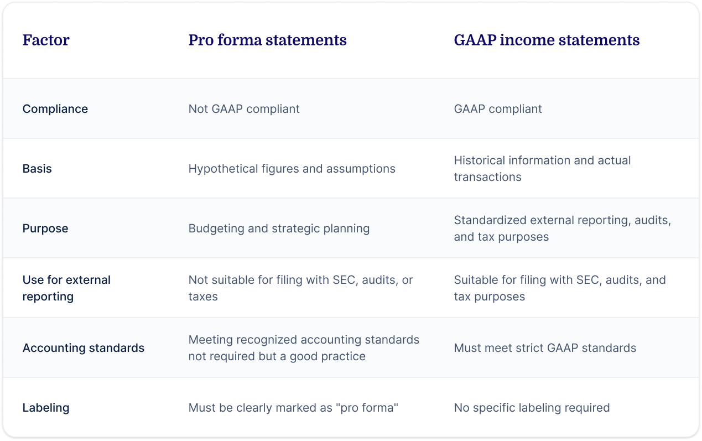

## Table of Contents

## What are pro forma financial statements?

Pro forma financial statements are special financial reports that businesses use to show what their financial situation might look like in the future or under different conditions. They are not based on actual past performance, but instead, they are projections or estimates. Companies often use pro forma statements when they are planning big changes, like a merger or acquisition, or when they want to see how a new project might affect their finances.

These statements can include a pro forma income statement, balance sheet, and cash flow statement. They help business owners and investors understand the potential financial outcomes of their decisions before they actually happen. For example, if a company is thinking about expanding to a new location, a pro forma statement could show how this expansion might increase costs and revenues. This way, the company can make more informed decisions and plan better for the future.

## What are GAAP financial statements?

GAAP financial statements are reports that companies make following a set of rules called Generally Accepted Accounting Principles (GAAP). These rules help make sure that the financial statements are clear and easy to understand for everyone who looks at them. GAAP is like a common language for accounting that helps people compare financial information from different companies.

These statements include things like the income statement, balance sheet, and cash flow statement. They show how much money a company made, what it owns, what it owes, and how cash moves in and out of the business. By following GAAP, companies can give a true picture of their financial health, which is important for investors, lenders, and other people who need to make decisions based on this information.

## How are pro forma financial statements different from GAAP financial statements?

Pro forma financial statements and GAAP financial statements are two different types of financial reports that serve different purposes. Pro forma statements are like future guesses. They show what a company's finances might look like if certain things happen, like a big project or a merger. They are not based on what actually happened in the past, but on what the company thinks might happen in the future. This helps the company plan and see the possible outcomes of their decisions before they make them.

On the other hand, GAAP financial statements follow strict rules called Generally Accepted Accounting Principles. These rules make sure that the financial reports are clear and honest. GAAP statements show what really happened in the past, like how much money the company made, what it owns, and what it owes. They are important for people outside the company, like investors and lenders, who need to trust the financial information to make good decisions.

In short, pro forma statements are about what could happen and help with planning, while GAAP statements are about what did happen and help with understanding the true financial situation of a company. Both types of statements are useful, but they serve different needs and follow different rules.

## What is the purpose of using pro forma financial statements?

Pro forma financial statements help companies see what their finances might look like in the future. They are like a crystal ball for businesses, showing what could happen if they make certain decisions, like starting a new project or buying another company. By using these statements, companies can plan better and understand the possible outcomes of their choices before they actually happen. This way, they can avoid surprises and make smarter decisions.

These statements are also useful for showing investors and lenders what the company's future might look like. When a company wants to borrow money or attract investors, pro forma statements can show how a new plan might increase profits or improve the company's financial health. This helps build trust and confidence in the company's future, making it easier to get the support they need for their plans.

## What are the key components included in GAAP financial statements?

GAAP financial statements include three main parts: the income statement, the balance sheet, and the cash flow statement. The income statement shows how much money a company made and spent over a period of time, like a year or a quarter. It tells you if the company made a profit or a loss by showing the difference between its revenues and expenses. The balance sheet is like a snapshot of what the company owns and owes at a specific time. It lists the company's assets, like cash and equipment, and its liabilities, like loans and bills, and also shows the owner's equity, which is the value of the business to its owners.

The cash flow statement tracks the flow of cash in and out of the company. It shows how the company got its cash, like from selling products or borrowing money, and how it used its cash, like paying for expenses or buying new equipment. This statement helps people see if the company can pay its bills and if it has enough cash to keep running smoothly. All these parts together give a clear picture of the company's financial health, following the strict rules of GAAP to make sure the information is accurate and trustworthy.

## Can pro forma financial statements be used for official reporting?

Pro forma financial statements are not usually used for official reporting. They are more like a planning tool that helps companies see what might happen in the future. Since they are based on guesses and not real numbers, they don't follow the strict rules that official reports need to follow. Official reports, like those sent to the government or used for taxes, need to be accurate and based on what really happened, not what might happen.

However, pro forma statements can be shared with investors or lenders to show them what the company thinks its future might look like. This can help build trust and show that the company is thinking ahead. But it's important to remember that these statements are not official and should not be used in place of the real financial reports that follow GAAP or other official accounting rules.

## How do companies typically adjust financials in pro forma statements?

When companies make pro forma financial statements, they often adjust their numbers to show what might happen in the future or under different conditions. They might add or remove certain costs or revenues to see how things could change. For example, if a company is thinking about starting a new product line, they might add the expected costs of making and selling that product, as well as the expected revenue it could bring in. This helps them see if the new product line would be a good idea or not.

Sometimes, companies also adjust their financials to show what would have happened if a big event had not occurred. For instance, if a company had a one-time big expense like a lawsuit, they might take that expense out of their pro forma statements to see what their finances would look like without it. This way, they can focus on their regular business and see how it might perform without unusual events affecting the numbers. By making these adjustments, companies can plan better and make smarter decisions about their future.

## What are the potential risks of relying on pro forma financial statements?

Relying too much on pro forma financial statements can be risky because they are just guesses about the future. They are not based on what actually happened, so they might not be accurate. If a company makes big decisions based on these guesses and they turn out to be wrong, it could end up losing a lot of money or even going out of business. For example, if a company thinks a new project will make a lot of money but it doesn't, the company could be in trouble.

Another risk is that pro forma statements can sometimes be used to make a company look better than it really is. If a company only shows the good parts and leaves out the bad parts, people like investors might get a false idea of how the company is doing. This can lead to bad decisions, like investing in a company that is not as healthy as it seems. It's important to use pro forma statements carefully and not rely on them too much without looking at the real financial numbers too.

## How does the SEC regulate the use of pro forma financials?

The Securities and Exchange Commission (SEC) keeps an eye on how companies use pro forma financial statements. They want to make sure that these statements don't trick people. The SEC says that companies have to show both the pro forma numbers and the real GAAP numbers when they share financial information. This way, investors can see the full picture and not just the rosy future that pro forma statements might paint.

The SEC also has rules about how companies can present pro forma statements. They have to be clear and honest, and they can't leave out important information that would change how people see the company's finances. If a company doesn't follow these rules, the SEC can step in and take action, like fining the company or making them fix their reports. This helps keep the financial information fair and trustworthy for everyone who looks at it.

## In what scenarios might a company choose to present both pro forma and GAAP financials?

A company might choose to present both pro forma and GAAP financials when they want to show investors and lenders what their future might look like, while also giving a clear picture of their current financial health. For example, if a company is planning a big merger or acquisition, they might use pro forma statements to show how the combined company could perform in the future. At the same time, they would use GAAP financials to show their actual past performance, so everyone can see the real numbers too.

Another scenario where a company might present both types of financials is when they want to explain the impact of a new project or change in their business. Pro forma statements can help show how starting a new product line or expanding to a new market might affect their finances in the future. By also showing GAAP financials, the company makes sure that everyone can see the solid, real-world numbers that follow strict accounting rules. This way, they can build trust and give a full view of their financial situation.

## How do investors and analysts use pro forma vs. GAAP financials in their decision-making?

Investors and analysts use pro forma financial statements to get an idea of what a company's future might look like. They look at these statements to see how a company might perform if they make big changes, like starting a new project or merging with another company. Pro forma statements help them understand the potential outcomes of these decisions before they happen. By seeing these future guesses, investors and analysts can decide if they want to put their money into the company or if they think the company's plans will be successful.

On the other hand, GAAP financial statements give investors and analysts a clear picture of a company's past performance. They use these statements to see how much money the company made, what it owns, and what it owes. GAAP statements follow strict rules, so they are reliable and trustworthy. Investors and analysts use these real numbers to check if the company is healthy and to compare it with other companies. They need both pro forma and GAAP financials to make smart decisions, as one shows what could happen and the other shows what did happen.

## What are the best practices for reconciling pro forma financials with GAAP standards?

When companies make pro forma financial statements, they need to make sure they also show the real GAAP numbers. The best way to do this is to clearly explain how the pro forma numbers are different from the GAAP numbers. They should show both sets of numbers side by side so people can see how the guesses about the future compare to what really happened in the past. This helps everyone understand the changes and adjustments that were made in the pro forma statements.

It's also important for companies to be honest and clear about why they made those adjustments. They should explain the reasons behind the changes, like if they are planning a new project or dealing with a one-time event. By being open about this, companies build trust with investors and analysts. They should also make sure that their pro forma statements follow any rules set by the SEC, like not leaving out important information that could change how people see the company's finances.

## References & Further Reading

[1]: ["Standards & Guidance: FASB Accounting Standards Codification®"](https://asc.fasb.org/) - Financial Accounting Standards Board (FASB)

[2]: ["SEC Guidelines on Non-GAAP Financial Measures"](https://www.sec.gov/corpfin/non-gaap-financial-measures.htm) - U.S. Securities and Exchange Commission (SEC)

[3]: ["The Ultimate Algorithmic Trading System Toolbox + Website: Using Today's Technology To Help You Become A Better Trader"](https://www.wiley.com/en-us/The+Ultimate+Algorithmic+Trading+System+Toolbox+%2B+Website%3A+Using+Today%27s+Technology+To+Help+You+Become+A+Better+Trader-p-9781119096573) by George Pruitt

[4]: ["Algorithmic Trading and DMA: An introduction to direct access trading strategies"](https://archive.org/details/algorithmictradi0000john) by Barry Johnson
