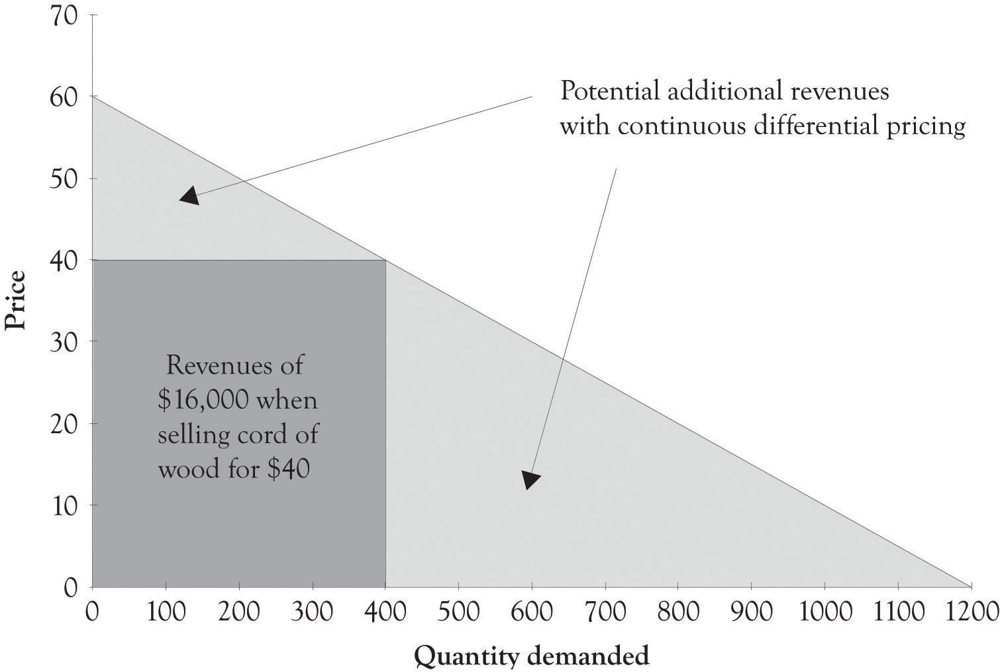

## Table of Contents

## What is product differentiation?

Product differentiation is when a company makes its product different from other products in the market. They do this to make their product seem better or more special. This can be done by changing the way the product looks, how it works, or even how it is advertised. The goal is to make customers want to buy this product instead of others.

For example, a company might add a new feature to a phone that other phones do not have. Or they might use a different color or design that stands out. By doing this, the company hopes that customers will see their product as unique and choose it over similar products from other companies. This can help the company sell more and make more money.

## What is price discrimination?

Price discrimination is when a company charges different prices for the same product or service to different people. They do this to make more money by selling to people who are willing to pay more, while still selling to those who can only pay less. For example, a movie theater might charge less for tickets in the morning than in the evening because more people are willing to pay more in the evening.

To do price discrimination, a company needs to know about their customers and be able to stop them from sharing the product at the lower price with others. This can be hard to do, but when it works, it can help the company make more money. For example, airlines often charge different prices for the same seat on a plane depending on when you buy the ticket or how flexible you are with your travel dates.

## How do product differentiation and price discrimination differ?

Product differentiation and price discrimination are two different ways companies try to make more money. Product differentiation is when a company makes its product different from others in the market. They might change the way the product looks, add new features, or use different advertising to make their product seem special. The goal is to make customers want to buy their product instead of others because it seems better or unique. For example, a car company might add a new safety feature that other cars don't have, hoping customers will choose their car for that reason.

Price discrimination, on the other hand, is when a company charges different prices for the same product or service to different people. The aim is to sell the product to people who are willing to pay more while still selling to those who can only afford less. For example, a theme park might charge more for tickets during peak times and less during off-peak times. To do this, the company needs to know about their customers and be able to stop people from buying at the lower price and sharing with others. This strategy can be tricky to pull off but can lead to higher profits if done correctly.

## What are the basic strategies used in product differentiation?

Product differentiation can be done in many ways. One way is by changing how the product looks. Companies might use different colors, shapes, or packaging to make their product stand out. For example, a cereal company might use a bright and colorful box to catch the eye of customers in the store. Another way is by adding new features or improving how the product works. A phone company might add a better camera or longer battery life to make their phone different from others. This can make customers think their product is better or more useful.

Another strategy is through branding and advertising. Companies can create a strong brand image that makes their product seem special. They might use ads that tell a story or show how their product fits into a certain lifestyle. For example, a sports drink company might advertise their product as the choice of professional athletes, making it seem more appealing to people who want to be like those athletes. By using these strategies, companies hope to make their product seem unique and worth choosing over others.

## What are the common types of price discrimination?

Price discrimination comes in different forms. One common type is first-degree price discrimination, where a company charges each customer the most they are willing to pay. This is hard to do because companies need to know exactly how much each person will pay. For example, a car salesman might start with a high price and then lower it until the customer agrees to buy.

Another type is second-degree price discrimination. Here, companies offer different versions of the same product at different prices. Customers choose the version they want based on how much they are willing to pay. For example, a software company might sell a basic version of their program for a low price and a deluxe version with more features for a higher price. This way, the company can sell to different customers at different price points.

The third type is third-degree price discrimination. This is when companies charge different prices to different groups of people. They might use age, location, or time of purchase to set different prices. For example, a movie theater might charge less for children and seniors than for adults. Or, an airline might charge more for tickets bought closer to the flight date. This helps the company make more money by selling to different groups at different prices.

## How can product differentiation be used to gain a competitive advantage?

Product differentiation can help a company stand out from others in the market, giving it a competitive advantage. By making their product different, companies can attract more customers. For example, a company might add a new feature to their phone that no other phone has. This could make customers think their phone is better and choose it over others. When customers see a product as unique, they might be willing to pay more for it, which can help the company make more money.

Another way product differentiation can provide a competitive edge is through branding and marketing. A strong brand can make a product seem special and worth buying. For example, a clothing company might use ads that show their clothes being worn by popular celebrities. This can make customers want to buy those clothes to feel like they are part of that lifestyle. By creating a unique image for their product, companies can build customer loyalty and keep people coming back, which helps them stay ahead of competitors.

## What are the legal and ethical considerations of price discrimination?

Price discrimination can be tricky when it comes to legal and ethical issues. In many places, there are laws that say companies can't charge different prices to people just because of things like their race, age, or gender. This is to make sure everyone is treated fairly. For example, it's not okay for a store to charge more to older people just because they think they can pay more. If a company does this, they could get in trouble with the law. So, companies need to be careful about how they set their prices to make sure they are not breaking any rules.

Ethically, price discrimination can also be a problem. It can seem unfair if some people have to pay more for the same thing just because of who they are or when they buy it. For example, if a company charges more for medicine to people who really need it, that can feel wrong. Companies should think about how their pricing might affect different groups of people and try to be fair. While price discrimination can help a company make more money, it's important to do it in a way that doesn't harm or upset customers.

## How do firms implement price discrimination in practice?

Firms implement price discrimination by figuring out how much different customers are willing to pay and then setting different prices for the same product. They might use things like age, location, or time of purchase to decide who pays what. For example, a movie theater might charge less for tickets in the morning than at night because more people are willing to pay more in the evening. Airlines do this too, charging more for tickets bought closer to the flight date because people who need to travel urgently are often willing to pay more.

To make price discrimination work, firms need to make sure customers can't easily share the product at the lower price with others. They might use technology or special rules to stop this from happening. For example, a software company might offer a cheaper version of their program that has fewer features, making it less appealing to share. By doing this, firms can sell to different customers at different prices, which can help them make more money.

## What role does consumer behavior play in the success of product differentiation?

Consumer behavior is really important for making product differentiation work. When companies make their products different from others, they hope that customers will see those differences and like them. For example, if a company makes a new kind of snack that tastes different, they want customers to try it and think it's better than other snacks. If customers like the new taste, they might buy it more often. This can help the company sell more and make more money. So, understanding what customers want and how they make choices is key to making product differentiation successful.

Also, how customers feel about a brand can make a big difference. If a company can make their product seem special through ads or by making it look cool, customers might feel good about buying it. For example, if a clothing brand uses ads that show their clothes being worn by popular people, customers might want to buy those clothes to feel like they are part of that group. When customers feel a connection to the brand, they are more likely to keep buying the product. This loyalty can help the company stay ahead of others in the market.

## How can advanced data analytics enhance price discrimination strategies?

Advanced data analytics can help companies do price discrimination better by giving them a lot of information about their customers. Companies can use this information to find out how much different people are willing to pay for the same thing. For example, they might look at things like where people live, how old they are, or when they shop. With this data, companies can set different prices for different groups of people in a smart way. This can help them make more money because they can charge more to people who can pay more and still sell to those who can only pay less.

Also, data analytics can help companies keep an eye on how well their price discrimination is working. They can see if changing prices makes more people buy their products or if it makes customers unhappy. If something isn't working, they can use the data to make changes quickly. This way, companies can keep their prices fair and still make as much money as possible. By using data analytics, companies can do price discrimination in a way that is both effective and careful.

## What are the economic implications of product differentiation and price discrimination on market structures?

Product differentiation and price discrimination can change how markets work. When companies make their products different from others, it can make the market more competitive. This is because customers have more choices and might pick the product they think is best or most special. This can lead to companies trying harder to make their products better or more unique. It can also mean that companies might not have to lower their prices as much because customers are willing to pay more for something they see as different. This can help companies make more money and can lead to a market where there are lots of different products for customers to choose from.

Price discrimination can also affect market structures by making it easier for companies to charge different prices to different people. This can help companies make more money because they can sell to people who are willing to pay more while still selling to those who can only pay less. But it can also make the market less fair if some people have to pay more for the same thing. This can lead to some customers feeling unhappy or choosing not to buy from that company. Overall, price discrimination can help companies make more money, but it needs to be done carefully to make sure it doesn't hurt the market or upset customers.

## How do global market dynamics influence the effectiveness of product differentiation and price discrimination strategies?

Global market dynamics can affect how well product differentiation works. When a company tries to make its product different from others, it needs to think about what people in different countries like. What works in one place might not work in another. For example, a car company might add a feature that people in Europe like, but people in Asia might not care about it. So, the company needs to change its product to fit what people in different places want. Also, if a company has a strong brand in one country, it might not be as strong in another. This means the company needs to spend time and money to make its brand known and liked everywhere. If they can do this well, product differentiation can help them sell more around the world.

Global market dynamics also play a big role in how well price discrimination works. Companies need to know how much people in different countries can pay and what they are willing to pay. For example, a software company might charge less in a country where people don't have as much money. But they need to be careful because if people can easily buy the product in one country and sell it in another, it can mess up their pricing plan. Also, laws about pricing can be different in different places. What is okay in one country might not be okay in another. So, companies need to understand these rules and make sure they are following them. If they can do price discrimination the right way, it can help them make more money around the world.

## References & Further Reading

[1]: Bergstra, J., Bardenet, R., Bengio, Y., & Kégl, B. (2011). ["Algorithms for Hyper-Parameter Optimization."](https://dl.acm.org/doi/10.5555/2986459.2986743) Advances in Neural Information Processing Systems 24.

[2]: ["Advances in Financial Machine Learning"](https://www.amazon.com/Advances-Financial-Machine-Learning-Marcos/dp/1119482089) by Marcos Lopez de Prado

[3]: ["Evidence-Based Technical Analysis: Applying the Scientific Method and Statistical Inference to Trading Signals"](https://www.amazon.com/Evidence-Based-Technical-Analysis-Scientific-Statistical/dp/0470008741) by David Aronson

[4]: ["Machine Learning for Algorithmic Trading"](https://github.com/stefan-jansen/machine-learning-for-trading) by Stefan Jansen

[5]: ["Quantitative Trading: How to Build Your Own Algorithmic Trading Business"](https://www.amazon.com/Quantitative-Trading-Build-Algorithmic-Business/dp/1119800064) by Ernest P. Chan