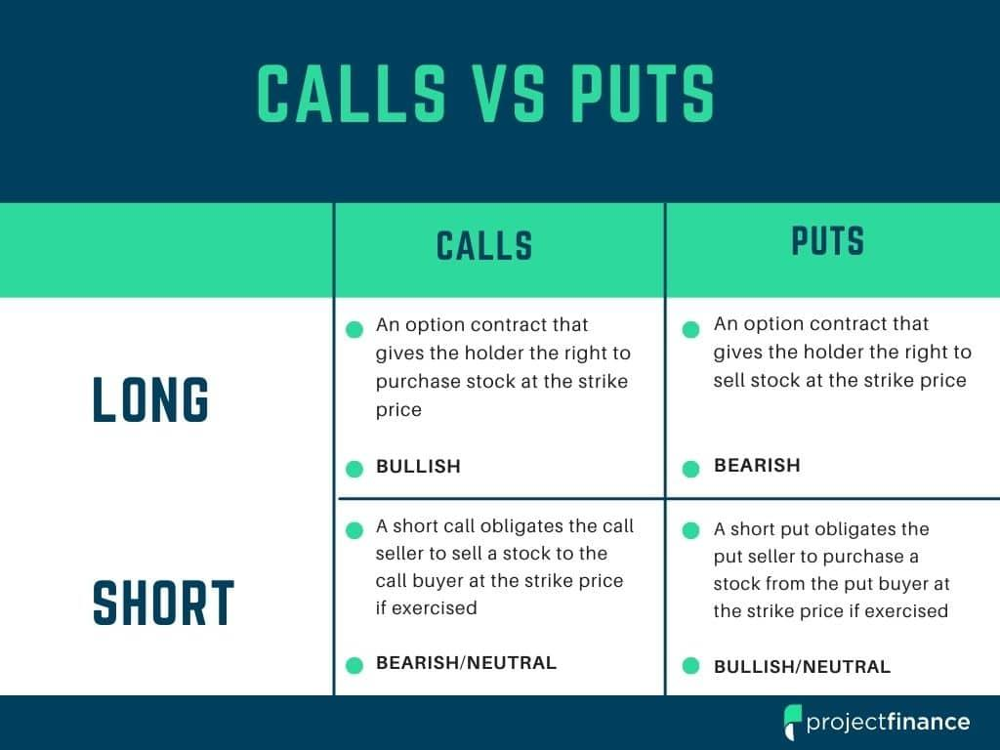

## Table of Contents

## What are put options and how do they work?

A put option is a type of financial contract that gives you the right, but not the obligation, to sell a specific asset, like a stock, at a set price before a certain date. This set price is called the strike price. For example, if you think the price of a stock is going to drop, you can buy a put option. If the stock price does fall below the strike price, you can sell the stock at the higher strike price, making a profit.

When you buy a put option, you pay a fee called a premium. This premium is what you pay to have the option to sell the stock at the strike price. If the stock price stays above the strike price, you don't have to sell it, and you only lose the premium you paid. Put options are often used as a way to protect against losses if you own the stock and think its price might go down. They can also be used to make money if you correctly predict that a stock's price will fall.

## What are call options and how do they work?

A call option is a financial agreement that gives you the right, but not the obligation, to buy a specific asset, like a stock, at a set price before a certain date. This set price is called the strike price. If you think the price of a stock is going to go up, you can buy a call option. If the stock price does rise above the strike price, you can buy the stock at the lower strike price and then sell it at the higher market price, making a profit.

When you buy a call option, you pay a fee called a premium. This premium is the cost of having the option to buy the stock at the strike price. If the stock price stays below the strike price, you don't have to buy it, and you only lose the premium you paid. Call options are often used to make money if you correctly predict that a stock's price will rise. They can also be used to protect against losses if you need to buy the stock in the future and want to lock in a lower price.

## What are the basic differences between put and call options?

Put options and call options are two types of financial contracts that work in opposite ways. A put option gives you the right to sell a stock at a set price, called the strike price, before a certain date. You buy a put option if you think the stock's price will go down. If it does, you can sell the stock at the higher strike price and make a profit. If the stock's price stays the same or goes up, you don't have to sell it, and you only lose the money you paid for the option, which is called the premium.

A call option, on the other hand, gives you the right to buy a stock at the strike price before a certain date. You buy a call option if you think the stock's price will go up. If it does, you can buy the stock at the lower strike price and then sell it at the higher market price, making a profit. If the stock's price stays the same or goes down, you don't have to buy it, and you only lose the premium you paid for the option. So, put options are used to bet on or protect against falling prices, while call options are used to bet on or protect against rising prices.

## Why would an investor sell a put option?

An investor might sell a put option if they think the price of a stock will stay the same or go up. When they sell a put option, they get money right away, which is called the premium. If the stock's price stays above the strike price until the option expires, the investor keeps the premium and doesn't have to do anything else. It's like getting paid for doing nothing.

However, selling a put option also comes with a risk. If the stock's price falls below the strike price, the investor has to buy the stock at the higher strike price, even though it's worth less in the market. This means they could lose money. So, selling a put option is a way to make some money now, but it can be risky if the stock's price goes down a lot.

## Why would an investor sell a call option?

An investor might sell a call option if they think the price of a stock will stay the same or go down. When they sell a call option, they get money right away, which is called the premium. If the stock's price stays below the strike price until the option expires, the investor keeps the premium and doesn't have to do anything else. It's like getting paid for doing nothing.

However, selling a call option also comes with a risk. If the stock's price goes above the strike price, the investor has to sell the stock at the lower strike price, even though it's worth more in the market. This means they could lose money. So, selling a call option is a way to make some money now, but it can be risky if the stock's price goes up a lot.

## What are the risks associated with selling put options?

Selling a put option can be risky. The main risk is that the stock's price might fall below the strike price. If this happens, you have to buy the stock at the higher strike price, even though it's worth less in the market. This means you could lose a lot of money, especially if the stock's price drops a lot. The amount you could lose is potentially very large because it depends on how far the stock's price falls below the strike price.

Another risk is that you might have to come up with a lot of cash quickly. If you have to buy the stock at the strike price, you need to have enough money to do that. If you don't have the cash, you might have to sell other investments or borrow money, which can be stressful and expensive. So, selling put options can be risky because of the potential for big losses and the need for cash if things go wrong.

## What are the risks associated with selling call options?

Selling a call option can be risky. The main risk is that the stock's price might go above the strike price. If this happens, you have to sell the stock at the lower strike price, even though it's worth more in the market. This means you could lose a lot of money, especially if the stock's price goes up a lot. The amount you could lose is potentially very large because it depends on how far the stock's price goes above the strike price.

Another risk is that you might not have the stock to sell. If you don't own the stock and you have to sell it at the strike price, you need to buy it first. This can be expensive and stressful, especially if the stock's price has gone up a lot. So, selling call options can be risky because of the potential for big losses and the need to buy the stock if things go wrong.

## How can an investor manage the risks when selling put options?

An investor can manage the risks of selling put options by being careful about which stocks they choose. They should pick stocks that they think are not going to drop a lot in price. This way, they are less likely to have to buy the stock at a higher price than it's worth. Another way to manage risk is to only sell put options on stocks they would be okay with owning. If the stock's price does drop below the strike price, they can buy it and hold onto it, hoping the price goes back up.

Another way to manage risk is to use a strategy called "covered puts." This means the investor already owns the stock they are selling the put option for. If the stock's price falls below the strike price, they can just sell the stock they already own at the strike price. This can help limit how much money they might lose. Also, setting aside enough cash to buy the stock if they have to can help manage risk. This way, they are prepared if the stock's price does fall and they need to buy it.

## How can an investor manage the risks when selling call options?

An investor can manage the risks of selling call options by choosing stocks they think won't go up a lot in price. If they think the stock's price will stay the same or go down, they are less likely to have to sell the stock at a lower price than it's worth. Another way to manage risk is to only sell call options on stocks they don't mind giving up. If the stock's price does go above the strike price, they can sell the stock they own at the strike price and not lose too much money.

Another strategy is called "covered calls." This means the investor already owns the stock they are selling the call option for. If the stock's price goes above the strike price, they can just sell the stock they already own at the strike price. This can help limit how much money they might lose. Also, setting aside enough money to buy the stock if they need to can help manage risk. This way, they are ready if the stock's price does go up and they need to buy it to sell it at the strike price.

## What are advanced strategies for selling put options?

One advanced strategy for selling put options is called the "cash-secured put." This means the investor sets aside enough cash to buy the stock if the put option gets exercised. This strategy can be good if the investor wants to buy the stock at a lower price but also wants to earn some money from the premium. If the stock's price stays above the strike price, the investor keeps the premium and doesn't have to buy the stock. If the stock's price falls below the strike price, the investor uses the cash they set aside to buy the stock at the strike price, which is lower than the market price.

Another strategy is called the "naked put." This is riskier because the investor doesn't set aside cash to buy the stock if the option gets exercised. Instead, they hope the stock's price stays above the strike price so they can keep the premium. If the stock's price falls a lot, the investor might lose a lot of money because they have to buy the stock at the higher strike price. This strategy is for investors who are willing to take more risk and who think the stock's price won't drop much.

A third strategy is using "put spreads." This involves selling a put option and buying another put option with a lower strike price. This limits the investor's risk because the most they can lose is the difference between the two strike prices, minus the premium they received. If the stock's price falls below the lower strike price, the loss is limited. This strategy can be good for investors who want to earn money from selling put options but also want to control their risk.

## What are advanced strategies for selling call options?

One advanced strategy for selling call options is called a "covered call." This means the investor already owns the stock they are selling the call option for. If the stock's price goes above the strike price, the investor can just sell the stock they already own at the strike price. This can help limit how much money they might lose. The investor earns money from the premium right away, and if the stock's price stays below the strike price, they get to keep both the stock and the premium. This strategy is good for investors who want to make some extra money from their stocks but also want to limit their risk.

Another strategy is called a "naked call." This is riskier because the investor doesn't own the stock they are selling the call option for. They hope the stock's price stays below the strike price so they can keep the premium. But if the stock's price goes up a lot, the investor might lose a lot of money because they have to buy the stock at the higher market price to sell it at the lower strike price. This strategy is for investors who are willing to take more risk and who think the stock's price won't go up much.

A third strategy is using "call spreads." This involves selling a call option and buying another call option with a higher strike price. This limits the investor's risk because the most they can lose is the difference between the two strike prices, minus the premium they received. If the stock's price goes above the higher strike price, the loss is limited. This strategy can be good for investors who want to earn money from selling call options but also want to control their risk.

## How do market conditions affect the decision to sell put or call options?

Market conditions play a big role in deciding whether to sell put or call options. If the market is going up, an investor might think about selling call options. They might think the stock's price won't go up much more, so they can keep the premium from selling the call option. But if the market keeps going up a lot, they could lose money if they have to sell the stock at a lower price than it's worth. On the other hand, if the market is going down, an investor might think about selling put options. They might think the stock's price won't drop much more, so they can keep the premium from selling the put option. But if the market keeps going down a lot, they could lose money if they have to buy the stock at a higher price than it's worth.

Another thing to think about is how much the market is moving around. If the market is very up and down, it can be riskier to sell options. The more the market moves, the bigger the chance that the stock's price will go above or below the strike price. This means the investor could lose more money. But if the market is calm and not moving much, selling options can be less risky. The investor can keep the premium more easily because the stock's price is less likely to move a lot. So, understanding how the market is doing and how much it's moving can help an investor decide if selling put or call options is a good idea.

## What are the strategies and considerations for selling put options?

Writing put options, also known as selling put options, is a strategic method employed by traders to generate income or acquire stock at a desired price. This involves selling the right, but not the obligation, to another party to sell a specific asset at a predetermined price (strike price) before a set expiration date.

When a trader writes a put option, they receive a premium from the buyer. The primary objective is to keep this premium as profit, which occurs when the underlying asset's price remains above the strike price, rendering the option unexercised. In this scenario, the put seller profits from the premium collected without having to engage in further transactions.

However, writing put options entails potential risks. If the price of the underlying asset falls below the strike price, the option buyer is likely to exercise their right, compelling the seller to purchase the asset at a higher-than-market price. This results in a potential loss for the put seller, calculated as follows:

$$
\text{Loss} = (\text{Strike Price} - \text{Market Price}) \times \text{Number of Contracts} - \text{Premium Received}
$$

To illustrate, consider a trader who writes a put option on stock XYZ with a strike price of $100, receiving a premium of $5 per share. If XYZ's market price falls to $90, the trader will incur a loss of $5 per share ($100 - $90 - $5). Conversely, if the stock remains above $100, the put expires worthless, allowing the trader to keep the $5 premium.

Mitigating risks associated with writing put options can be accomplished through algorithmic trading. An algorithm can automatically assess market conditions, adjusting positions to optimize returns while minimizing losses. For instance, dynamic hedging strategies might be employed, where algorithms continuously recalibrate positions based on real-time data to safeguard against adverse price movements.

Algorithmic trading also enhances efficiency by executing trades faster than humanly possible and allows for more consistent application of strategies, which can be crucial in volatile markets. To showcase a simple algorithmic strategy for selling put options in Python, utilize libraries like NumPy and pandas to simulate market conditions and automation:

```python
import numpy as np
import pandas as pd

# Simulate market data
np.random.seed(42)
market_prices = pd.Series(np.random.normal(100, 10, 100))

strike_price = 100
premium_received = 5

def assess_option(market_price, strike_price, premium):
    if market_price < strike_price:
        return (strike_price - market_price - premium)  # potential loss
    else:
        return premium  # profit

# Calculate profit/loss over simulated market data
profits_losses = market_prices.apply(lambda x: assess_option(x, strike_price, premium_received))

# Summarize potential outcomes
mean_profit_loss = profits_losses.mean()
print(f"Expected Profit/Loss: {mean_profit_loss}")
```

In conclusion, while writing put options provides an income-generating opportunity through premium collection, it carries inherent risks if the underlying asset's value declines. Employing algorithmic trading can effectively manage these risks, optimizing strategy execution and enhancing overall performance for traders engaging in options selling.

## References & Further Reading

[1]: Bergstra, J., Bardenet, R., Bengio, Y., & Kégl, B. (2011). ["Algorithms for Hyper-Parameter Optimization."](https://papers.nips.cc/paper/4443-algorithms-for-hyper-parameter-optimization) Advances in Neural Information Processing Systems 24.

[2]: ["Options, Futures, and Other Derivatives"](https://www.pearson.com/en-us/subject-catalog/p/options-futures-and-other-derivatives/P200000005938/9780136939917) by John C. Hull

[3]: ["Advances in Financial Machine Learning"](https://www.amazon.com/Advances-Financial-Machine-Learning-Marcos/dp/1119482089) by Marcos Lopez de Prado

[4]: ["Machine Learning for Algorithmic Trading"](https://github.com/stefan-jansen/machine-learning-for-trading) by Stefan Jansen

[5]: ["Options Trading: The Hidden Reality"](https://www.amazon.com/Options-Trading-Adjustment-Perception-Deception/dp/0977869172) by Charles M. Cottle