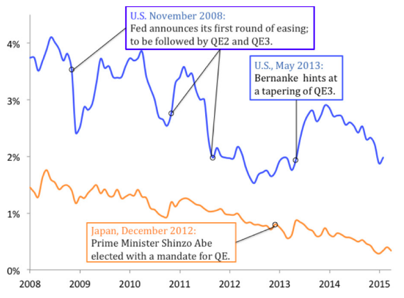

## Table of Contents

## What is Quantitative Easing (QE)?

Quantitative Easing (QE) is a monetary policy tool used by central banks to stimulate the economy when traditional methods like lowering interest rates are not enough. When a central bank implements QE, it buys financial assets, like government bonds, from banks and other financial institutions. This increases the money supply in the economy because the central bank is essentially creating new money to buy these assets.

The goal of QE is to encourage spending and investment. By buying these assets, the central bank puts more money into the hands of banks, which can then lend it out to businesses and individuals. This increased lending can lead to more spending and investment, which can help boost economic growth. However, QE can also have side effects, like inflation if too much money is created, and it can be difficult to stop once it starts.

## What is Currency Manipulation?

Currency manipulation is when a country's government or central bank changes the value of its money on purpose. They do this to make their exports cheaper and imports more expensive. This can help their own businesses sell more stuff to other countries because it costs less for people in other countries to buy their products. But it can also make things from other countries more expensive for people at home.

Sometimes, countries do this by buying or selling their own money in big amounts. For example, if a country wants to make its money worth less, it might sell a lot of its own currency and buy foreign currency. This makes their money less valuable compared to other countries' money. Other times, they might use rules or taxes to control how much their currency is worth. While this can help a country's economy in some ways, it can also cause problems with other countries and lead to unfair trade.

## How does Quantitative Easing work?

Quantitative Easing, or QE, is a way for a country's central bank to help the economy when things aren't going well. When regular methods like lowering interest rates don't work, the central bank starts buying things like government bonds from banks and other big money places. By doing this, the central bank is making new money to buy these things, which means there's more money in the economy. The idea is to get banks to lend more of this new money to people and businesses, so they can spend and invest more.

The goal of QE is to make the economy grow by encouraging people to spend and invest. When banks have more money, they can give out more loans. This can help businesses start new projects or expand, and it can help people buy things they need or want. But QE can also cause problems, like making prices go up if too much money is created. It can be tricky to stop QE once it starts, because changing it can affect the economy in big ways.

## How is Currency Manipulation carried out?

Currency manipulation happens when a country's government or its central bank changes the value of its money on purpose. They do this to make their products cheaper for people in other countries to buy, which can help their own businesses sell more stuff abroad. At the same time, it makes things from other countries more expensive for people at home. This can be done by buying or selling large amounts of their own money. For example, if they want to make their money worth less, they sell a lot of their own currency and buy foreign currency, which makes their money less valuable compared to other countries' money.

Another way to manipulate currency is by using rules or taxes to control how much the currency is worth. By setting specific rules or adding taxes on certain transactions, a country can influence the value of its money. While this can help a country's economy by making their exports more competitive, it can also cause problems with other countries. Other nations might see this as unfair trade, and it can lead to tensions or even trade wars. Overall, currency manipulation is a powerful tool that can have big effects on both the country doing it and the rest of the world.

## What are the main goals of Quantitative Easing?

The main goal of Quantitative Easing (QE) is to help the economy grow when other ways aren't working. When a country's central bank uses QE, it buys things like government bonds from banks. This puts more money into the economy because the central bank is creating new money to buy these things. The hope is that banks will then lend this new money to people and businesses, who can use it to spend and invest more. This can help the economy get better because more spending and investing can lead to more jobs and growth.

Another goal of QE is to keep the economy from getting worse. When times are tough, people and businesses might not want to spend or invest as much. By putting more money into the economy, QE can help stop things from getting even worse. It's like giving the economy a little boost to keep it going. But QE can also cause problems, like making prices go up if too much money is created. So, it's important for the central bank to be careful and keep an eye on what's happening.

## What are the primary objectives of Currency Manipulation?

The main goal of currency manipulation is to make a country's products cheaper for people in other countries to buy. When a country makes its money worth less, it can sell its goods at a lower price on the world market. This helps the country's businesses sell more stuff abroad and can make the country's economy stronger. By making their exports cheaper, the country hopes to get more money from other countries, which can help create jobs and grow the economy at home.

Another goal of currency manipulation is to protect the country's own industries. When a country makes its money worth less, it makes things from other countries more expensive for people at home. This can help local businesses because people might choose to buy things made in their own country instead of buying more expensive imports. However, this can also cause problems with other countries because they might think it's not fair. It can lead to tension and even trade wars, so countries need to be careful when they use currency manipulation.

## What are the potential economic impacts of Quantitative Easing?

Quantitative Easing, or QE, can have a big impact on the economy. When a central bank uses QE, it puts more money into the economy by buying things like government bonds. This can help the economy grow because banks can lend more money to people and businesses. When people and businesses have more money, they can spend and invest more, which can lead to more jobs and make the economy better. But QE can also cause problems, like making prices go up if too much money is created. This is called inflation, and it can make things more expensive for everyone.

Another thing that can happen with QE is that it can change how much people trust the money. If people think the central bank is making too much money, they might start to worry about the value of their money going down. This can make them spend their money quickly instead of saving it, which can lead to even more inflation. Also, QE can make it hard for the central bank to stop the program once it starts. If they stop too fast, it can hurt the economy, but if they keep going too long, it can cause more problems. So, the central bank has to be careful and keep a close eye on what's happening.

## What are the economic consequences of Currency Manipulation?

Currency manipulation can help a country's economy by making its exports cheaper and more attractive to other countries. When a country makes its money worth less, people in other countries can buy its products for less money. This can help the country sell more stuff abroad, which can lead to more jobs and growth at home. It can also protect local businesses by making imports more expensive, which might make people choose to buy things made in their own country instead of buying from other places.

But currency manipulation can also cause problems. Other countries might think it's not fair and get upset. This can lead to tension and even trade wars, where countries put up barriers to stop trading with each other. It can also lead to inflation at home because making the money worth less can make things more expensive. Over time, if a country keeps manipulating its currency, it might lose the trust of other countries and investors, which can hurt its economy in the long run.

## How do Quantitative Easing and Currency Manipulation affect inflation?

Quantitative Easing (QE) can make prices go up, which is called inflation. When a central bank uses QE, it puts more money into the economy by buying things like government bonds. If there's too much money around, people might start spending more, which can make the prices of things go up. But if the central bank is careful and doesn't put too much money into the economy, QE might not cause a big problem with inflation. It's a balancing act, and the central bank has to watch closely to make sure things don't get out of hand.

Currency manipulation can also affect inflation, but in a different way. When a country makes its money worth less, it can make things from other countries more expensive. This can lead to higher prices at home, which is inflation. On the other hand, if a country makes its money worth less to sell more stuff to other countries, it might not see inflation right away. But if it keeps doing this for a long time, it could lead to inflation because the money is worth less and less. So, both QE and currency manipulation can make prices go up, but they do it in different ways and need to be managed carefully.

## Can Quantitative Easing be considered a form of Currency Manipulation?

Quantitative Easing (QE) and currency manipulation are different things, but some people might see QE as a kind of currency manipulation. When a central bank uses QE, it puts more money into the economy by buying things like government bonds. This can make the value of the country's money go down compared to other countries' money, which is kind of like what happens when a country manipulates its currency to make its exports cheaper. So, in a way, QE can have a similar effect on the value of the currency as currency manipulation.

But QE is mainly used to help the economy grow when other ways aren't working, not just to change the value of the currency. The goal of QE is to encourage people to spend and invest more by making more money available for banks to lend. On the other hand, currency manipulation is often used to make a country's exports cheaper and more competitive on the world market. While QE might affect the value of the currency, it's not the main reason for doing it, so it's not exactly the same as currency manipulation.

## What are the international regulatory perspectives on Quantitative Easing versus Currency Manipulation?

International rules look at Quantitative Easing (QE) and currency manipulation differently. QE is seen as a tool that central banks use to help their economy grow when other ways don't work. It's usually accepted as long as the central bank is trying to help its own country and not hurt other countries on purpose. Many countries use QE, and it's seen as a normal part of managing the economy. The main thing is that the central bank should be careful and make sure QE doesn't cause big problems like too much inflation or hurting other countries' economies.

On the other hand, currency manipulation is often seen as not fair by other countries. When a country changes the value of its money on purpose to make its exports cheaper, it can hurt other countries' businesses. This can lead to tension and even trade wars. International groups like the International Monetary Fund (IMF) and the World Trade Organization (WTO) watch out for currency manipulation and try to stop it. They want countries to play fair and not use tricks to make their products cheaper at the expense of others. So, while QE is generally okay, currency manipulation is more likely to cause problems and be against the rules.

## How have historical implementations of Quantitative Easing and Currency Manipulation varied across different countries?

Different countries have used Quantitative Easing (QE) in different ways over time. In the United States, the Federal Reserve started using QE after the 2008 financial crisis to help the economy recover. They bought lots of government bonds and other financial things to put more money into the economy. In Japan, the central bank used QE for a long time to fight against very low prices, or deflation. They wanted to get people spending and investing more. In Europe, the European Central Bank used QE to help countries like Greece and Spain during their financial troubles. Each country used QE to help their economy in their own way, but the main idea was always to put more money into the economy to help it grow.

Currency manipulation has also been used differently by countries. China has been known for using currency manipulation to keep its money, the yuan, from getting too strong. This helped them sell more stuff to other countries because their products were cheaper. In the past, Japan also used currency manipulation to make the yen weaker, which helped their car and electronics companies sell more abroad. Switzerland, on the other hand, sometimes made its money, the Swiss franc, stronger to protect its economy from too much money coming in from other countries. Each country used currency manipulation to help their economy, but it often caused problems with other countries because it was seen as not fair.

## References & Further Reading

[1]: Bernanke, B. S. (2020). ["The New Tools of Monetary Policy."](https://www.jstor.org/stable/26921596) American Economic Review, 110(4), 943-983.

[2]: Gagnon, J., Raskin, M., Remache, J., & Sack, B. (2010). ["Large-Scale Asset Purchases by the Federal Reserve: Did They Work?"](https://www.ijcb.org/journal/ijcb11q1a1.pdf) Federal Reserve Bank of New York Staff Report No. 441.

[3]: Krugman, P. R., & Obstfeld, M. (2006). ["International Economics: Theory and Policy"](https://archive.org/details/internationaleco0008krug) (8th ed.). Addison-Wesley.

[4]: Taylor, J. B. (2017). ["The Role of Policy in the Great Recession and the Weak Recovery."](https://www.jstor.org/stable/pdf/42920911.pdf) American Economic Journal: Macroeconomics, 9(1), 56-69.

[5]: Hendershott, T., Jones, C. M., & Menkveld, A. J. (2011). ["Does Algorithmic Trading Improve Liquidity?"](https://onlinelibrary.wiley.com/doi/full/10.1111/j.1540-6261.2010.01624.x) The Review of Financial Studies, 24(8), 2915-2959.

[6]: Stiglitz, J. E. (2010). ["Freefall: America, Free Markets, and the Sinking of the World Economy."](https://www.jstor.org/stable/24884136) W.W. Norton & Company.

[7]: Bank for International Settlements. (2019). ["Foreign exchange turnover in April 2019."](https://www.bis.org/statistics/rpfx19_fx.htm) 

[8]: Fama, E. F. (1980). ["Efficient Capital Markets: A Review of Theory and Empirical Work."](https://onlinelibrary.wiley.com/doi/abs/10.1111/j.1540-6261.1970.tb00518.x) The Journal of Finance, 25(2), 383-417.