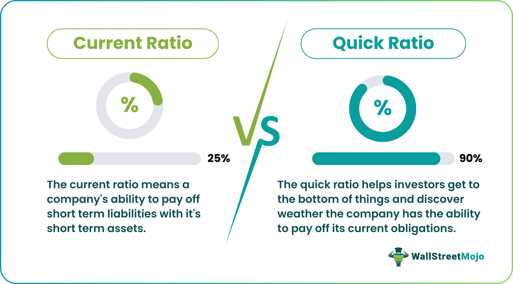

Financial analysis is a critical component of investing and trading, helping investors evaluate the financial health and performance of companies. Among the numerous tools employed in this analysis, the quick ratio and the current ratio stand out as essential metrics for assessing a company's liquidity, or its ability to meet short-term obligations. Understanding a company's liquidity is crucial, as it directly influences decisions regarding investment and risk management.

The quick ratio, also known as the acid-test ratio, measures a company's capacity to cover its short-term liabilities using its most liquid assets, excluding inventory. It is calculated using the formula:



$$
\text{Quick Ratio} = \frac{\text{Cash} + \text{Cash Equivalents} + \text{Current Receivables}}{\text{Current Liabilities}}
$$

A quick ratio greater than 1.0 typically indicates a favorable liquidity position, suggesting that the company can meet its short-term debts without relying on the sale of inventory.

On the other hand, the current ratio provides a broader view by considering all current assets, including inventory, against current liabilities. Its formula is:

$$
\text{Current Ratio} = \frac{\text{Current Assets}}{\text{Current Liabilities}}
$$

A current ratio above 1.0 is generally seen as a positive indicator of a company's financial health and liquidity.

In algorithmic trading, these liquidity ratios offer valuable insights into the financial stability of companies, which can significantly influence trading strategies. A solid quick ratio may identify stable companies less susceptible to short-term financial issues, potentially making them attractive candidates for algorithm-driven investments. Conversely, companies with weaker liquidity might pose higher risks and require different handling in trading algorithms.

This article will examine the quick ratio and current ratio further, highlighting their differences, applications, and significance in [algorithmic trading](/wiki/algorithmic-trading) strategies, helping traders and investors make informed decisions in the fast-paced trading environment.

## Table of Contents

## Understanding the Quick Ratio

The quick ratio, also termed the acid-test ratio, is a crucial financial metric used to assess a company's capacity to cover its short-term liabilities using its most liquid assets, excluding inventory. This ratio provides insight into a company's [liquidity](/wiki/liquidity-risk-premium) and its ability to promptly fulfill financial obligations without resorting to the liquidation of inventory. 

The assets considered in the quick ratio calculation include cash, cash equivalents, and accounts receivable. Cash and cash equivalents are the most liquid assets as they can be instantly utilized to settle debts. Accounts receivable, although not as immediate as cash, are typically expected to be converted into cash within a short period, usually within a year.

The formula for the quick ratio is expressed as:

$$
\text{Quick Ratio} = \frac{\text{Cash} + \text{Cash Equivalents} + \text{Current Receivables}}{\text{Current Liabilities}}
$$

A quick ratio greater than 1.0 suggests a robust liquidity position, indicating that the company possesses more liquid assets than short-term liabilities. This situation implies that the company is well-positioned to meet its impending financial commitments, without depending on the sale of non-liquid assets like inventory.

In financial analysis, the quick ratio is seen as a more stringent measure of liquidity than the current ratio, as it removes inventory from the equation. This exclusion is based on the premise that inventory may not be as swiftly or readily converted into cash in comparison to other current assets. A quick ratio below 1.0 might signal potential liquidity issues, suggesting that a company may struggle to meet its short-term obligations with readily available assets.

Thus, the quick ratio serves as an important tool for investors and analysts, providing an essential perspective on a company's financial health and operational efficiency by focusing on its ability to manage and convert liquid assets effectively.

## Understanding the Current Ratio

The current ratio is a key financial metric used to assess a company's ability to meet its short-term obligations using its short-term assets. This ratio provides insights into a company's financial health and operational efficiency. The formula for calculating the current ratio is straightforward:

$$
\text{Current Ratio} = \frac{\text{Current Assets}}{\text{Current Liabilities}}
$$

This formula includes all current assets, which might consist of cash, marketable securities, accounts receivable, and inventory. The current liabilities include obligations the company is expected to pay within a year, such as accounts payable, short-term debt, and other similar accruals.

A current ratio greater than 1.0 is generally considered a positive indicator, suggesting that the company possesses more short-term assets than short-term liabilities. This implies that the company is well-positioned to cover its short-term debts and operational expenses. However, while a higher ratio signifies strong liquidity, an excessively high ratio may indicate underutilized assets or inefficient capital management. Therefore, it’s crucial for investors and analysts to interpret this ratio in conjunction with industry norms and the specific contexts of the company's operational environment. 

In the context of liquidity assessment, while using the current ratio as a measure, it is also important to account for industry-specific factors. Different industries have varying working capital needs, and what might be considered a healthy ratio in one industry could be interpreted differently in another. Thus, while the current ratio is a vital tool for determining a company's liquidity, it is most effective when used alongside other financial metrics and qualitative insights.

## Key Differences Between Quick and Current Ratios

The quick ratio and the current ratio are both essential tools in financial analysis, primarily assessing a company's liquidity. However, each serves distinct purposes and offers different perspectives on a company's ability to meet short-term obligations.

The quick ratio, often considered more conservative, excludes inventory from its calculation. This ratio only considers the most liquid assets—cash, cash equivalents, and current receivables—because these can be quickly converted into cash to fulfill immediate liabilities. The formula is:

$$
\text{Quick Ratio} = \frac{\text{Cash} + \text{Cash Equivalents} + \text{Current Receivables}}{\text{Current Liabilities}}
$$

By excluding inventory, the quick ratio provides a stringent view of liquidity, focusing solely on resources readily available to cover short-term debts. This makes it particularly useful for industries where inventory cannot be swiftly liquidated without significant discounting or loss.

In contrast, the current ratio offers a broader calculation incorporating all current assets, including inventory. Its formula is:

$$
\text{Current Ratio} = \frac{\text{Current Assets}}{\text{Current Liabilities}}
$$

Including inventory may paint a more favorable picture of liquidity, particularly if the inventory is substantial and not quickly convertible to cash. This approach assumes that businesses can liquidate inventory as needed, which might not always be practical in certain market conditions or industries where inventory turnover is slow or subject to obsolescence.

Both ratios are instrumental in financial analysis, yet they provide insights from different angles. The quick ratio may appeal to investors seeking to understand a company's ability to handle immediate cash flow concerns without relying on inventory sales. On the other hand, the current ratio gives a comprehensive overview, useful for examining overall short-term financial health across varied sectors.

Choosing between these ratios depends on the specific financial context and the industry characteristics of the company under analysis. Understanding the implications and limitations of each can aid more accurate financial diagnosis and strategic planning.

## Application in Algorithmic Trading

Algorithmic trading utilizes data-driven strategies to make rapid investment decisions, often leveraging financial ratios to assess company liquidity and stability. The quick ratio and the current ratio are particularly relevant in this context. These ratios provide insights into a company’s ability to meet short-term obligations, which can influence how trading algorithms select and manage investments.

A strong quick ratio, defined as:

$$
\text{Quick Ratio} = \frac{\text{Cash} + \text{Cash Equivalents} + \text{Current Receivables}}{\text{Current Liabilities}}
$$

indicates a company's capacity to immediately cover its short-term liabilities using the most liquid assets. In algorithmic trading, a company with a high quick ratio is perceived as less susceptible to sudden financial constraints, thereby potentially representing a lower risk investment. Trading algorithms can incorporate this data, choosing to prioritize firms with robust quick ratios in the portfolio selection process, especially when stability is prioritized.

On the other hand, companies displaying a weaker quick ratio might pose a higher risk. This scenario could lead algorithmic models to apply different strategies, such as imposing stricter entry criteria, adjusting investment weights, or increasing the frequency of monitoring for these companies. For instance, a Python script might be employed to filter stocks based on quick ratio criteria, ensuring the algorithm predominantly selects companies with a minimum ratio threshold:

```python
import pandas as pd

def filter_by_quick_ratio(data, threshold=1.0):
    """Filter companies based on the quick ratio threshold."""
    return data[data['Quick Ratio'] >= threshold]

# Sample data
companies_data = pd.DataFrame({
    'Company': ['A', 'B', 'C'],
    'Quick Ratio': [1.2, 0.8, 1.1]
})

filtered_companies = filter_by_quick_ratio(companies_data)
print(filtered_companies)
```

This basic algorithm functionality assesses liquidity health, thus influencing decisions regarding investments. Nevertheless, algorithmic models should not overly rely on these ratios in isolation. It is crucial to integrate a multi-faceted analysis approach, incorporating other financial metrics and market variables to achieve a balanced and informed trading strategy. By understanding and implementing insights gleaned from liquidity ratios like the quick and current ratios, traders enhance their capacity to develop strategies that balance potential returns with associated risks.

## Special Considerations

When analyzing liquidity through the quick ratio, it's important to recognize its limitations. While effective in assessing a company's immediate financial health by focusing on cash, cash equivalents, and receivables, this measure can overlook the broader financial context. Companies with strong inventory management capabilities may have the ability to convert inventory into cash efficiently. Thus, solely relying on the quick ratio could undervalue such companies' liquidity potential. 

On the other hand, the current ratio, which includes inventory as a component of current assets, might not always provide an accurate picture of liquidity, particularly in industries where inventory turnover is low or where stocks may become obsolete over time. These sectors might present a misleading image of financial health if a significant portion of current assets is tied up in slow-moving or aging inventory. 

For instance, in industries like technology or fashion, where products can rapidly lose relevance or value, a high current ratio might not indicate true liquidity strength. Therefore, investors and analysts need to scrutinize the composition of current assets in the calculation of these ratios to ensure a realistic assessment of a company's liquidity. By understanding these nuances, more informed decisions can be made regarding the financial stability and strategic potential of companies under consideration.

## Conclusion

Both quick and current ratios are essential instruments in financial analysis, each providing distinct insights into a company's liquidity. In algorithmic trading, these metrics can play a crucial role in developing strategies by offering an analysis of potential returns and risks based on a company's ability to handle short-term obligations. Liquidity, as assessed through these ratios, can help traders identify stable companies that might be less susceptible to immediate financial difficulties, potentially making them more attractive for certain automated trading strategies.

However, relying solely on quick and current ratios can be limiting. These metrics should be considered as part of a broader strategy that encompasses various financial indicators and assessments. Incorporating these ratios with other analytical tools can provide a more comprehensive understanding of an entity's financial health, aiding in effective decision-making. Thus, while valuable, quick and current ratios should complement, not replace, a more extensive financial analysis.

## References & Further Reading

[1]: ["Financial Ratios: A Guide to Comparative Analysis"](https://corporatefinanceinstitute.com/resources/accounting/financial-ratios/) by Michael Rist

[2]: ["The Intelligent Investor"](https://www.amazon.com/Intelligent-Investor-Definitive-Investing-Essentials/dp/0060555661) by Benjamin Graham

[3]: ["Essential Guide to Financial Ratios"](https://corporatefinanceinstitute.com/resources/accounting/financial-ratios/) by Pamela Peterson Drake & Frank J. Fabozzi

[4]: ["Algorithmic Trading and DMA: An introduction to direct access trading strategies"](https://www.semanticscholar.org/paper/Algorithmic-trading-%26-DMA-%3A-an-introduction-to-Johnson/aa5de1ab883d5e23b6651faa7c1807586d688e4b) by Barry Johnson

[5]: ["The Manual of Ideas: The Proven Framework for Finding the Best Value Investments"](https://www.amazon.com/Manual-Ideas-Framework-Finding-Investments/dp/1118083652) by John Mihaljevic